# //total-blocking-time/samples/pages+cached+noexternal

[→ Parent](../..)


## Raw


```yaml
p90min: 261
p90max: 336.4479999999976
p90range: 75.44799999999759
p90mean: 289.20635714285714
p90median: 289.5
p90stdev: 17.105101485076062
p90skewness: 0.52385388882623
p90eccentricity: 1.0000000000000002
p90discretization: 1.1818181818181819
outlandishness: 1.0676077167166926
confidence: 16.75768518766438
p90confidence: 7.02883010004291

```

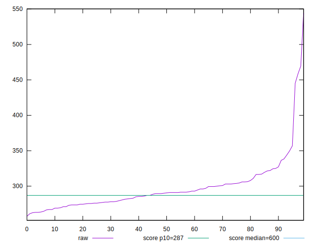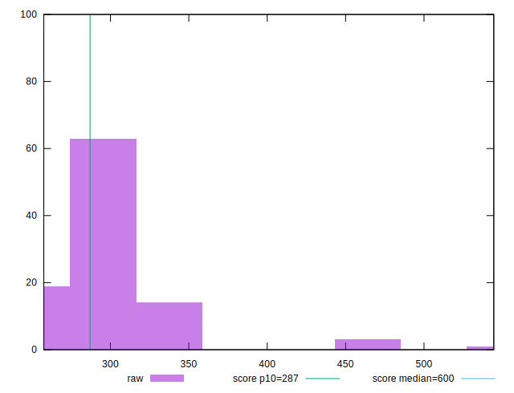
## Score


```yaml
p90min: 0.85
p90max: 0.93
p90range: 0.08000000000000007
p90mean: 0.8981318681318682
p90median: 0.9
p90stdev: 0.0177226550185261
p90skewness: -0.6163570020270146
p90eccentricity: 0.9999999999999986
p90discretization: 10.11111111111111
outlandishness: 0.9711905955662193
confidence: 0.02075338108339686
p90confidence: 0.00728259526291497

```

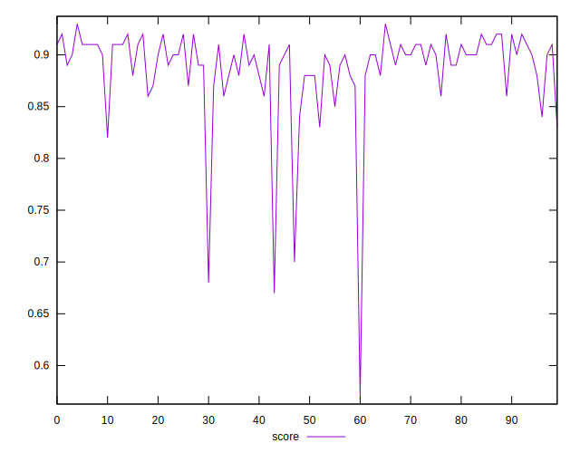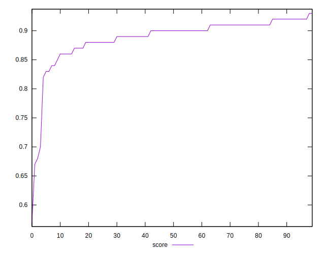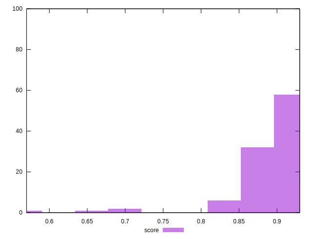
## Raw Estimate

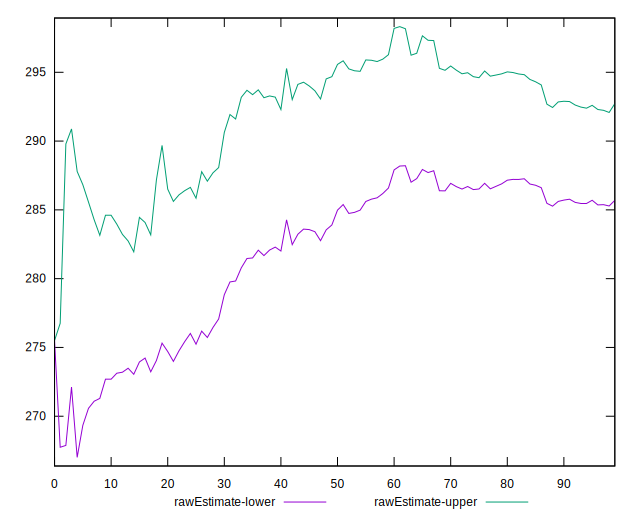
## Score Estimate

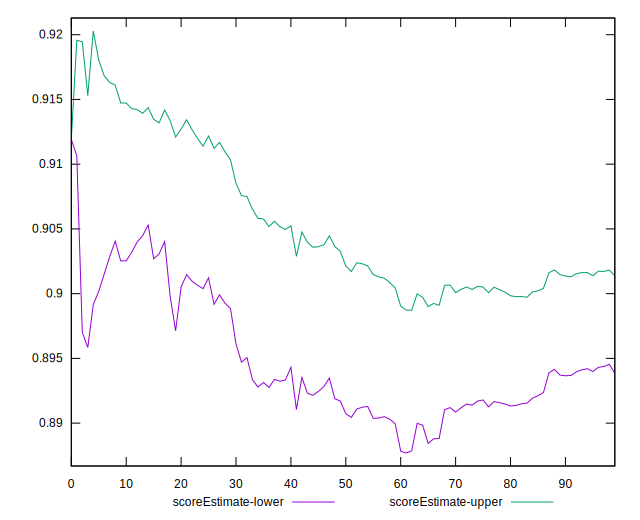
## P Score


```yaml
p90min: 0.8426250181843925
p90max: 0.9259924053879527
p90range: 0.08336738720356018
p90mean: 0.8970073108565426
p90median: 0.8973291639725245
p90stdev: 0.01862329273387083
p90skewness: -0.6666166881025072
p90eccentricity: 0.9999999999999997
p90discretization: 1.1818181818181819
outlandishness: 0.9730185747866605
confidence: 0.02096715399035043
p90confidence: 0.0076526854075640305

```

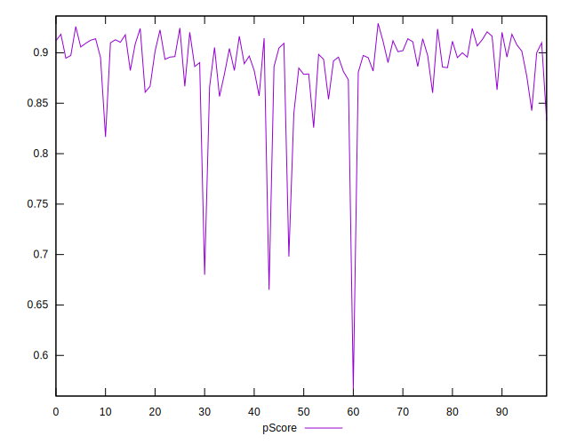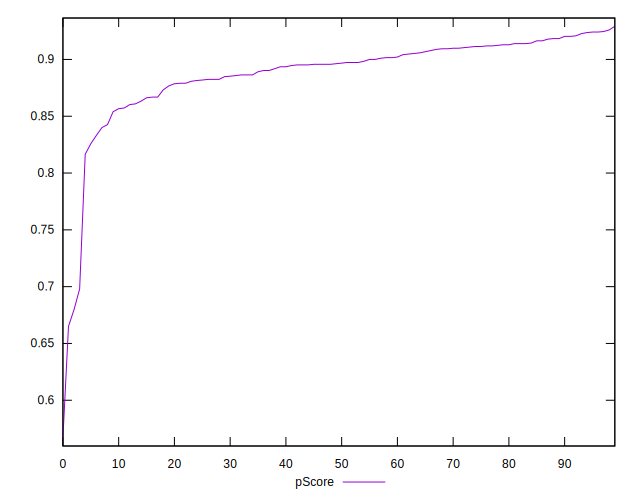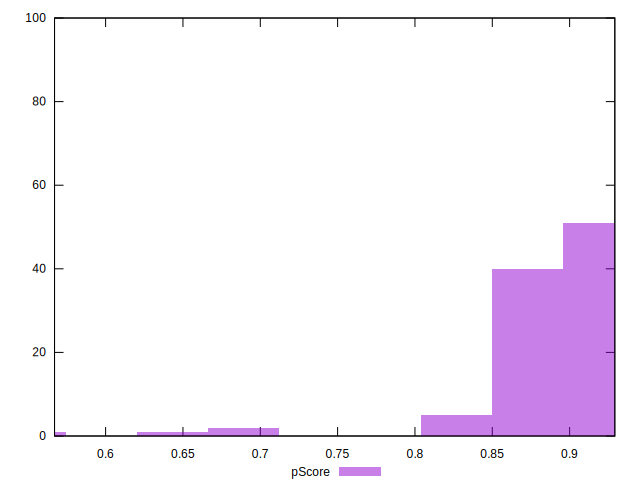
## Score Difference


```yaml
p90min: 0
p90max: 0
p90range: 0
p90mean: 0
p90median: 0
p90stdev: 0
p90skewness: .nan
p90eccentricity: .nan
p90discretization: 91
outlandishness: .inf
confidence: 9.484951648085952e-18
p90confidence: 0

```

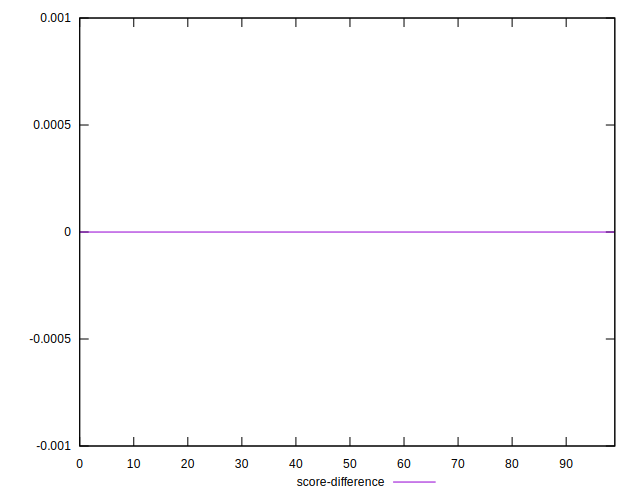
## P Score Difference


```yaml
p90min: -0.004745441291451824
p90max: 0.004213865293830055
p90range: 0.008959306585281879
p90mean: -0.0003456050391746376
p90median: -0.00009951729716906055
p90stdev: 0.002741378426864878
p90skewness: 0.029145203510096036
p90eccentricity: 1.0000000000000007
p90discretization: 1.1518987341772151
outlandishness: 0.6410210016642748
confidence: 0.001169321304423415
p90confidence: 0.00112648751129409

```

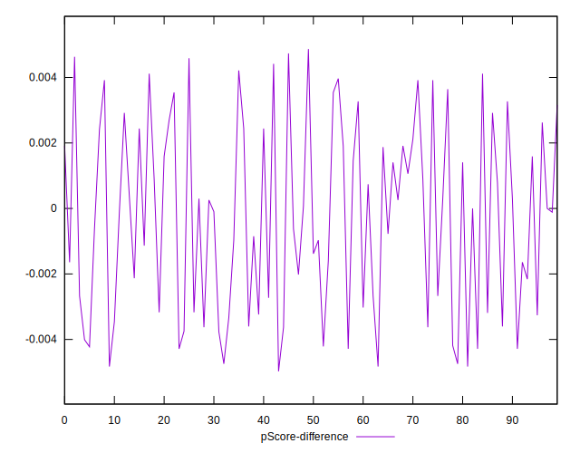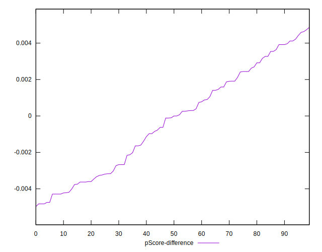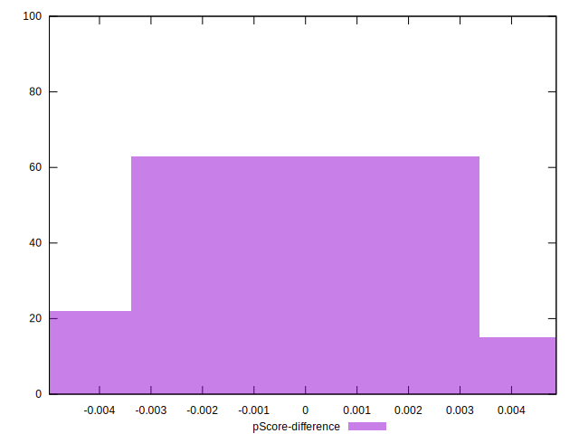