# //total-blocking-time/samples/pages+cached

[→ Parent](../..)


## Raw


```yaml
p90min: 254.5
p90max: 449.5
p90range: 195
p90mean: 304.0147472527474
p90median: 299.5
p90stdev: 34.515866667675425
p90skewness: 1.7557722323911022
p90eccentricity: 1.0000000000000002
p90discretization: 1.1973684210526316
outlandishness: 1.385531313677835
confidence: 84.489922126902
p90confidence: 14.183263558798217

```

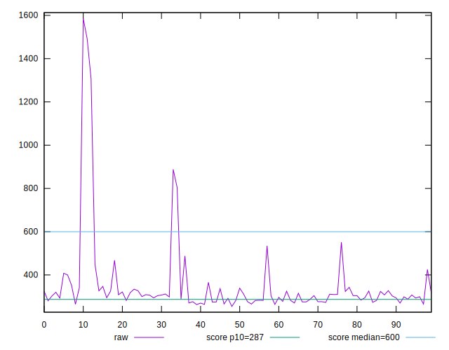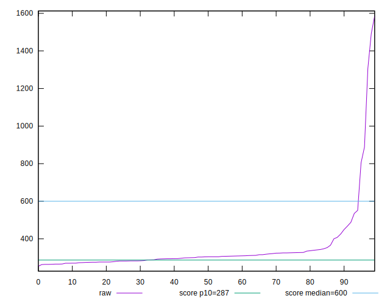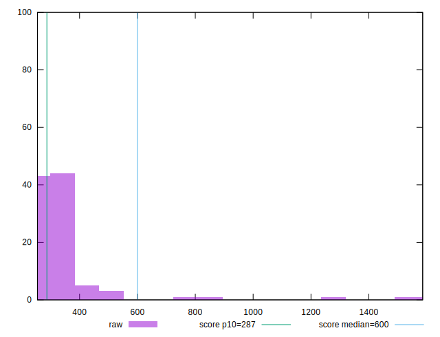
## Score


```yaml
p90min: 0.69
p90max: 0.93
p90range: 0.2400000000000001
p90mean: 0.8790109890109888
p90median: 0.89
p90stdev: 0.041696310350246304
p90skewness: -2.190374573975114
p90eccentricity: 1
p90discretization: 5.352941176470588
outlandishness: 0.8956815733373719
confidence: 0.06720977997907318
p90confidence: 0.017133852231525637

```

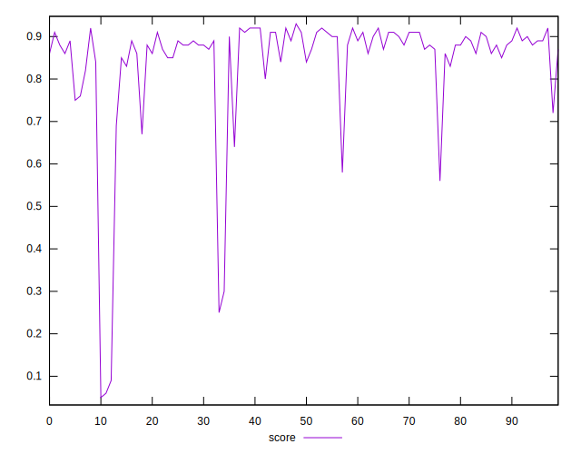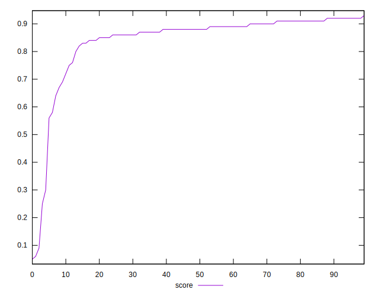
## Raw Estimate

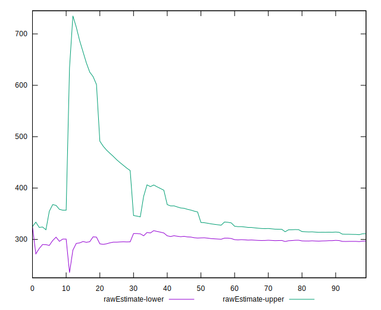
## Score Estimate

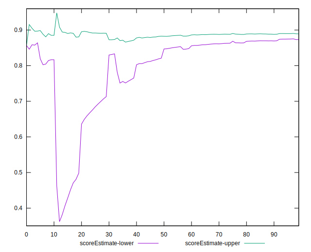
## P Score


```yaml
p90min: 0.6921211863968166
p90max: 0.9319411147707907
p90range: 0.23981992837397403
p90mean: 0.879365788217865
p90median: 0.8863732674460281
p90stdev: 0.04164598342004979
p90skewness: -2.1159083716298017
p90eccentricity: 1.0000000000000002
p90discretization: 1.1973684210526316
outlandishness: 0.8953897628364907
confidence: 0.06740464543172875
p90confidence: 0.017113171884079792

```

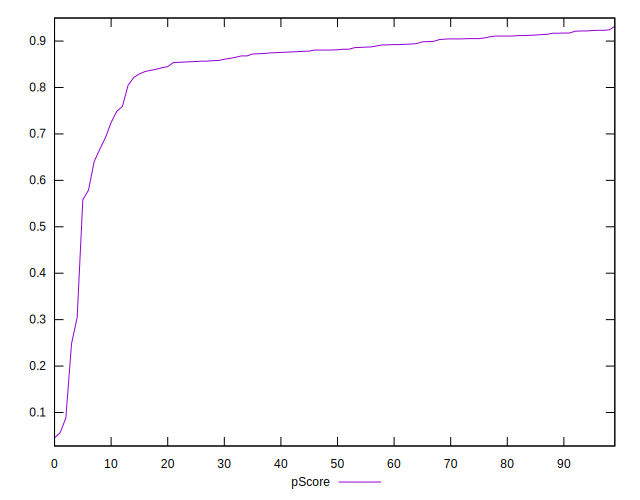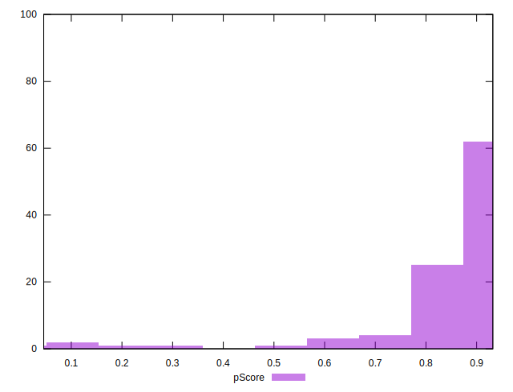
## Score Difference


```yaml
p90min: 0
p90max: 0
p90range: 0
p90mean: 0
p90median: 0
p90stdev: 0
p90skewness: .nan
p90eccentricity: .nan
p90discretization: 91
outlandishness: .inf
confidence: 8.528132291650278e-18
p90confidence: 0

```

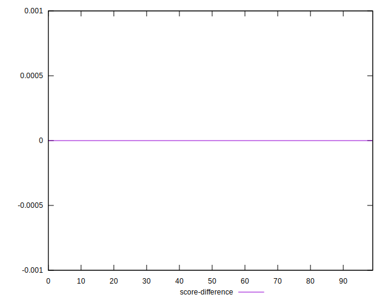
## P Score Difference


```yaml
p90min: -0.004425879745072428
p90max: 0.0048293646676002
p90range: 0.009255244412672628
p90mean: 0.000481922019624884
p90median: 0.0009006821352499639
p90stdev: 0.0027681026111039146
p90skewness: -0.11337419674626124
p90eccentricity: 0.9999999999999999
p90discretization: 1.1666666666666667
outlandishness: 0.1725780396449196
confidence: 0.001192185058209851
p90confidence: 0.0011374690158903835

```

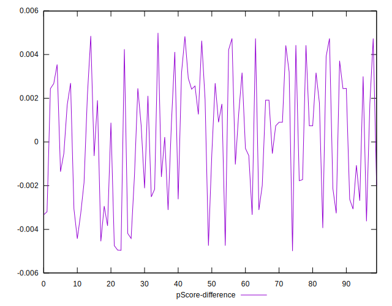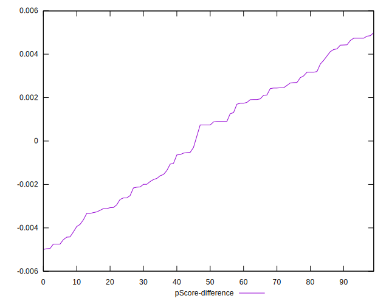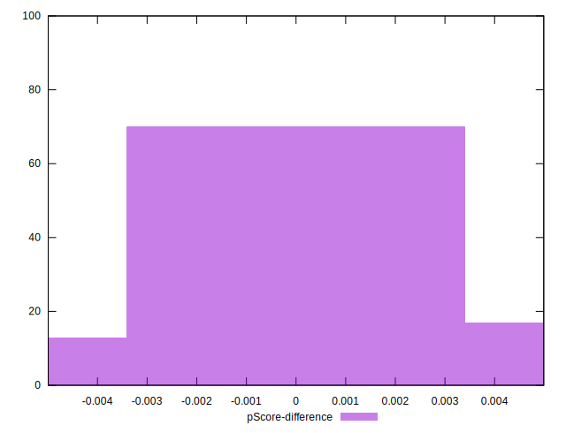