# //total-blocking-time/samples/pages

[→ Parent](../..)


## Raw


```yaml
p90min: 273.5
p90max: 668.4999999999991
p90range: 394.9999999999991
p90mean: 449.8261868131868
p90median: 460.5
p90stdev: 94.77971325938384
p90skewness: -0.257513088251196
p90eccentricity: 1.0000000000000007
p90discretization: 1.0833333333333333
outlandishness: 1.1023334999220857
confidence: 65.13437067550797
p90confidence: 38.94688973416703

```

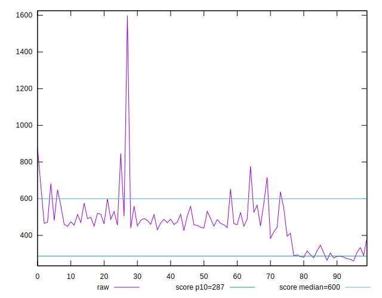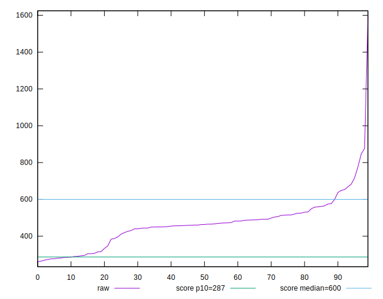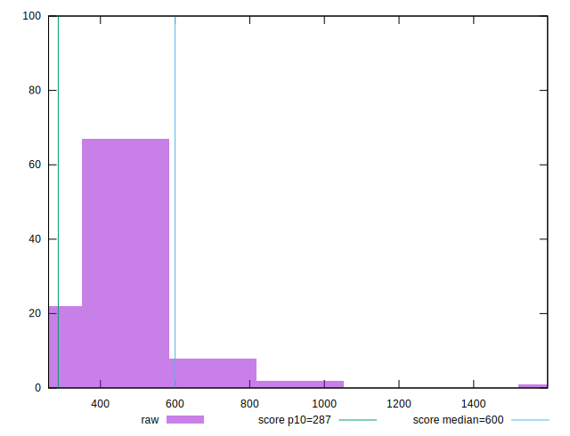
## Score


```yaml
p90min: 0.43
p90max: 0.91
p90range: 0.48000000000000004
p90mean: 0.6914285714285713
p90median: 0.68
p90stdev: 0.12155197349527706
p90skewness: 0.32108582050408946
p90eccentricity: 1.0000000000000004
p90discretization: 2.6
outlandishness: 0.9493764432928078
confidence: 0.06294055630785289
p90confidence: 0.04994814972414208

```

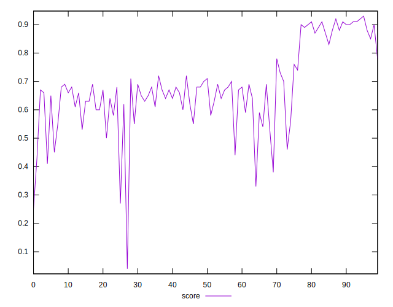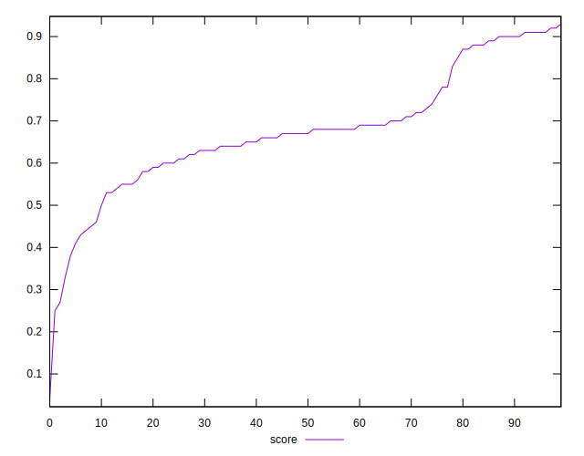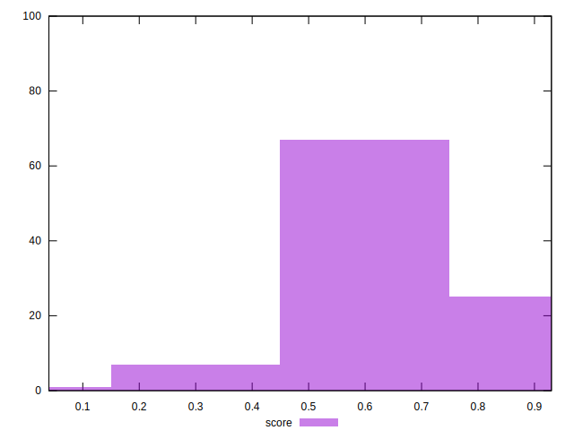
## Raw Estimate

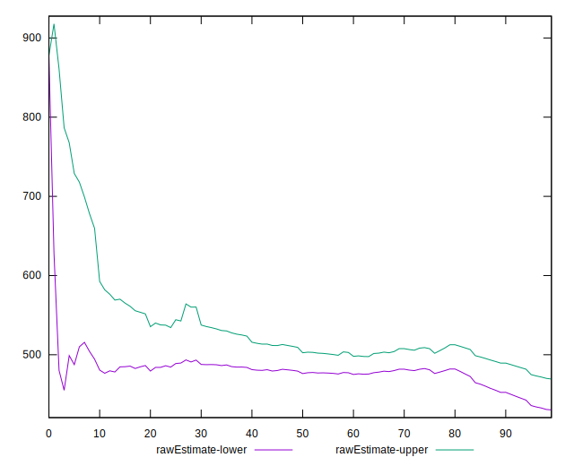
## Score Estimate

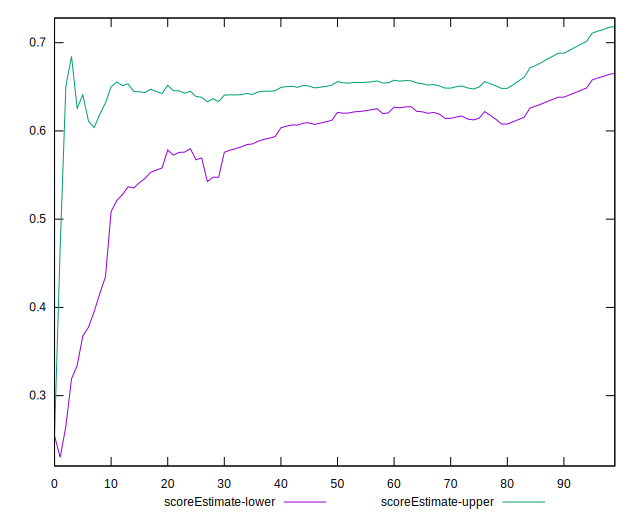
## P Score


```yaml
p90min: 0.44152567715154534
p90max: 0.9178697206675327
p90range: 0.47634404351598736
p90mean: 0.6968516061085575
p90median: 0.6771904037152738
p90stdev: 0.12055753603528929
p90skewness: 0.3681111727975006
p90eccentricity: 1.0000000000000007
p90discretization: 1.0833333333333333
outlandishness: 0.934862146515789
confidence: 0.06279542946980432
p90confidence: 0.0495395153785656

```

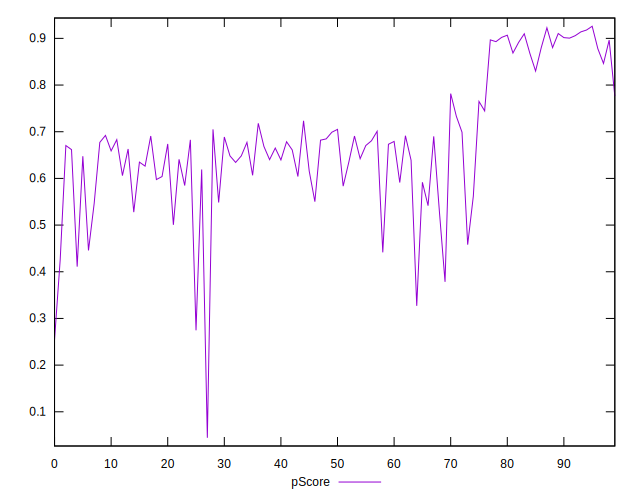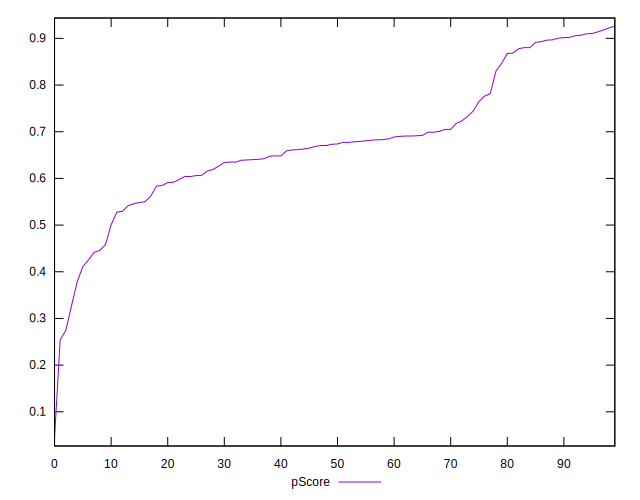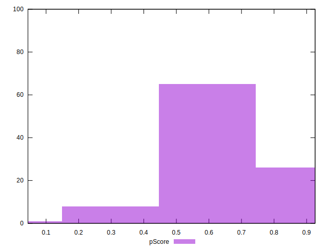
## Score Difference


```yaml
p90min: 0
p90max: 1.1102230246251565e-16
p90range: 1.1102230246251565e-16
p90mean: 1.8300379526788295e-18
p90median: 0
p90stdev: 1.288268154055078e-17
p90skewness: 7.483640216131417
p90eccentricity: 1.0000000000000013
p90discretization: 30.333333333333332
outlandishness: 40.57689999999999
confidence: 1.3162534592701633e-17
p90confidence: 5.29375285265009e-18

```

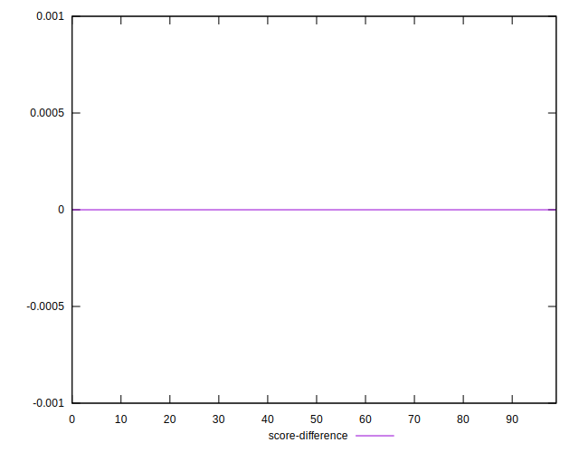
## P Score Difference


```yaml
p90min: -0.004257081092139348
p90max: 0.004574404344129368
p90range: 0.008831485436268716
p90mean: 0.00002976654280558846
p90median: 0.00017953785201973993
p90stdev: 0.0025132664202135294
p90skewness: 0.02206710691527718
p90eccentricity: 1
p90discretization: 1.0705882352941176
outlandishness: 6.140094671190958
confidence: 0.0010975883546815606
p90confidence: 0.0010327517015456885

```

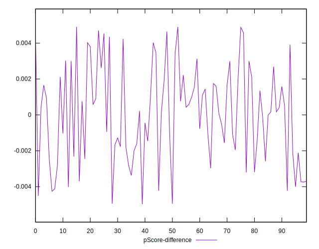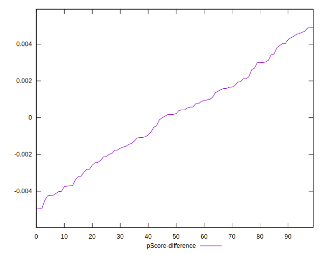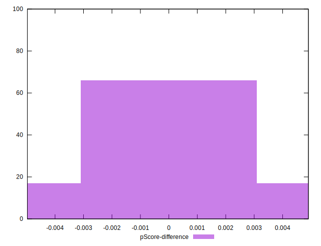