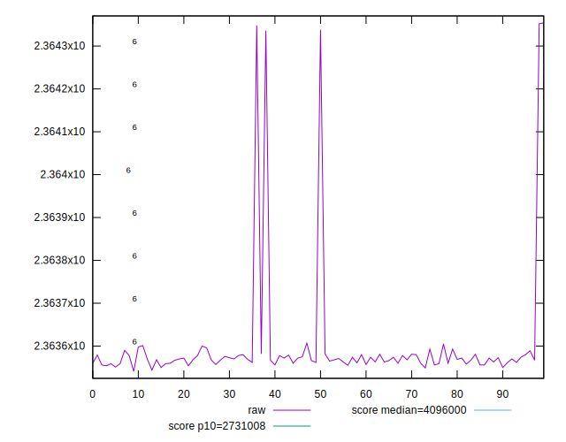
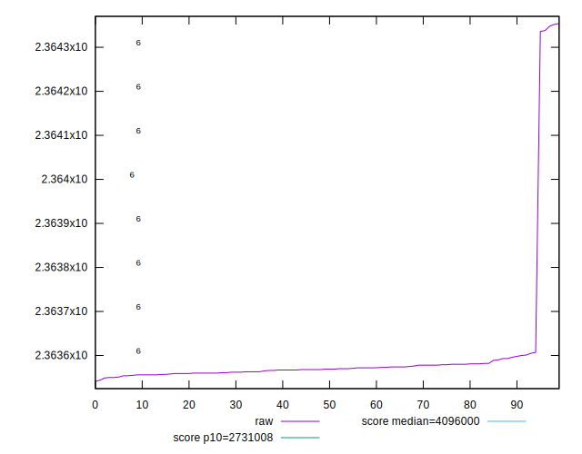
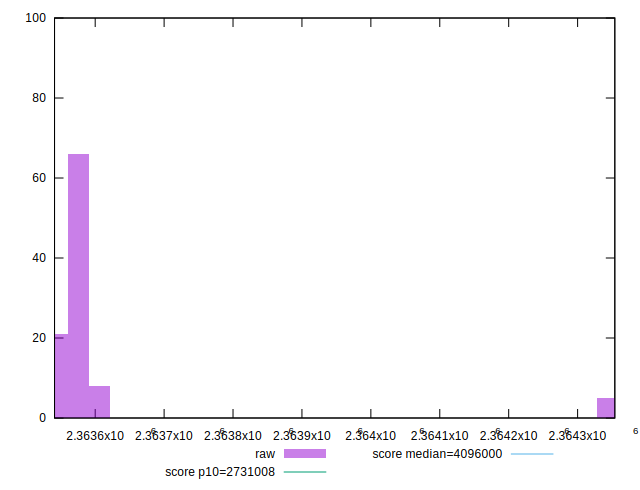
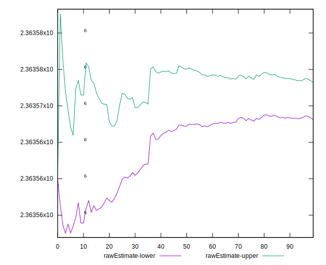
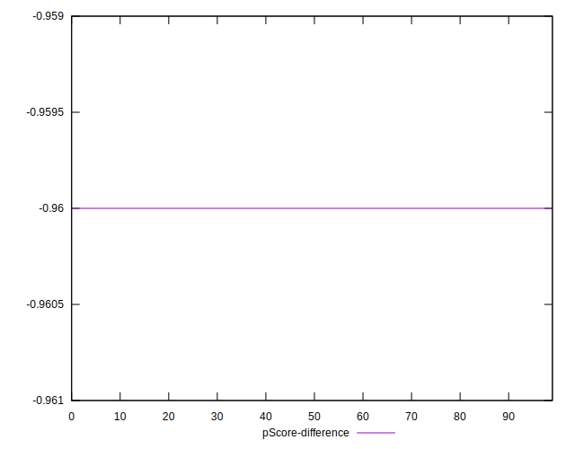

# //total-byte-weight/samples/pages+cached

[→ Parent](../..)


## Raw


```yaml
p90min: 2363550
p90max: 2363607
p90range: 57
p90mean: 2363570.681318681
p90median: 2363569
p90stdev: 12.451116831392744
p90skewness: 0.8763970628078147
p90eccentricity: 1
p90discretization: 2.3947368421052633
outlandishness: 1.0000319507964957
confidence: 66.48628458939493
p90confidence: 5.116414236836135

```


## Score


```yaml
p90min: 0.96
p90max: 0.96
p90range: 0
p90mean: 0.9599999999999989
p90median: 0.96
p90stdev: 1.1102230246251565e-15
p90skewness: 1
p90eccentricity: 1
p90discretization: 91
outlandishness: 0.9999999999999991
confidence: 6.661338147750939e-16
p90confidence: 4.440892098500626e-16

```


## Raw Estimate


## Score Estimate


## P Score


```yaml
p90min: 0
p90max: 0
p90range: 0
p90mean: 0
p90median: 0
p90stdev: 0
p90skewness: .nan
p90eccentricity: .nan
p90discretization: 91
outlandishness: .nan
confidence: 0
p90confidence: 0

```


## Score Difference


```yaml
p90min: -0.96
p90max: -0.96
p90range: 0
p90mean: -0.9599999999999989
p90median: -0.96
p90stdev: 1.1102230246251565e-15
p90skewness: -1
p90eccentricity: 1
p90discretization: 91
outlandishness: 0.9999999999999991
confidence: 6.661338147750939e-16
p90confidence: 4.440892098500626e-16

```


## P Score Difference


```yaml
p90min: -0.96
p90max: -0.96
p90range: 0
p90mean: -0.9599999999999989
p90median: -0.96
p90stdev: 1.1102230246251565e-15
p90skewness: -1
p90eccentricity: 1
p90discretization: 91
outlandishness: 0.9999999999999991
confidence: 6.661338147750939e-16
p90confidence: 4.440892098500626e-16

```

