# //unminified-css/samples/pages+cached+noexternal+nomedia+nocss+nojs

[→ Parent](../..)


## Raw


```yaml
p90min: 0
p90max: 150
p90range: 150
p90mean: 45.494505494505496
p90median: 0
p90stdev: 66.36998752851834
p90skewness: 0.8643411062153546
p90eccentricity: 1.0000000000000018
p90discretization: 15.166666666666666
outlandishness: 1.6704625918924592
confidence: 30.156859596322306
p90confidence: 27.272762250895738

```

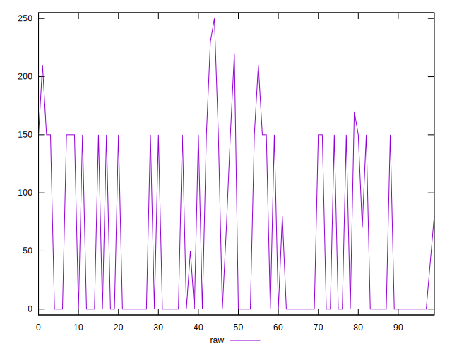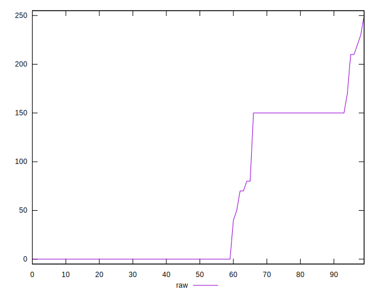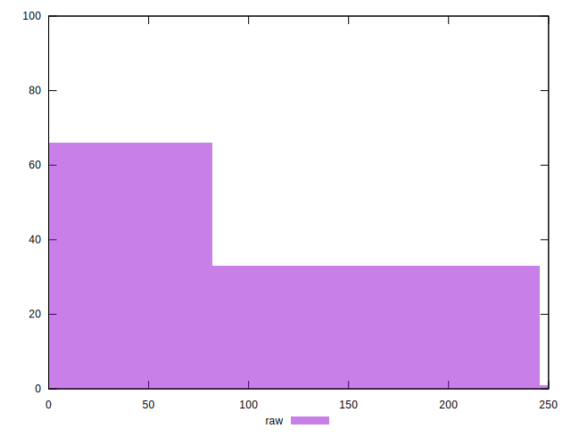
## Score


```yaml
p90min: 0.88
p90max: 1
p90range: 0.12
p90mean: 0.9634065934065934
p90median: 1
p90stdev: 0.05320951291093818
p90skewness: -0.8509423751029529
p90eccentricity: 1.0000000000000013
p90discretization: 15.166666666666666
outlandishness: 0.97748643727452
confidence: 0.024387969763965067
p90confidence: 0.021864858637835827

```

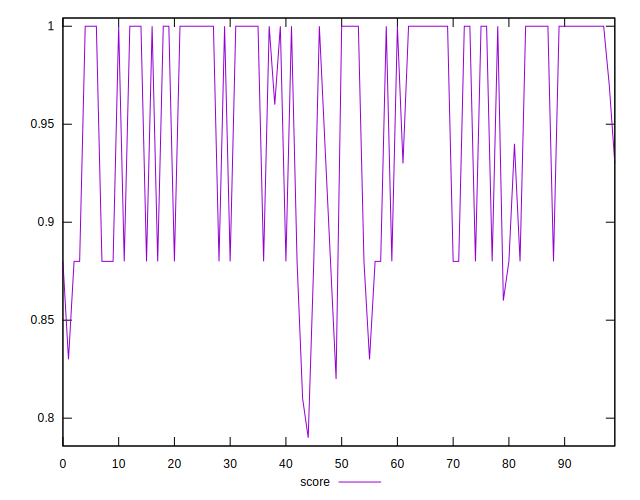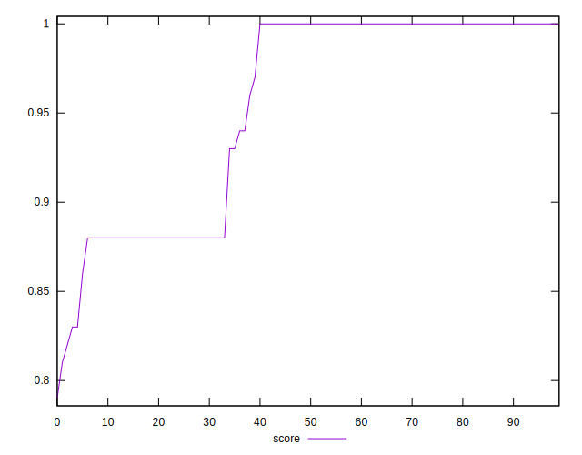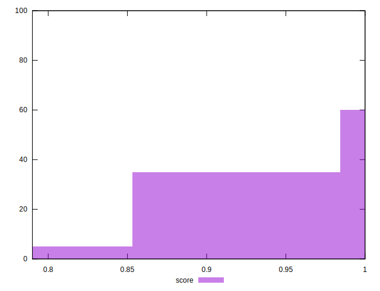
## Raw Estimate

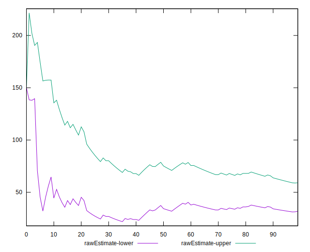
## Score Estimate

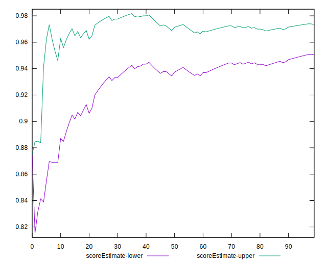
## P Score


```yaml
p90min: 0.875
p90max: 1
p90range: 0.125
p90mean: 0.9620879120879122
p90median: 1
p90stdev: 0.055308322940431955
p90skewness: -0.8643411062153618
p90eccentricity: 0.9999999999999997
p90discretization: 15.166666666666666
outlandishness: 0.9770831361111753
confidence: 0.025130716330268532
p90confidence: 0.022727301875746564

```

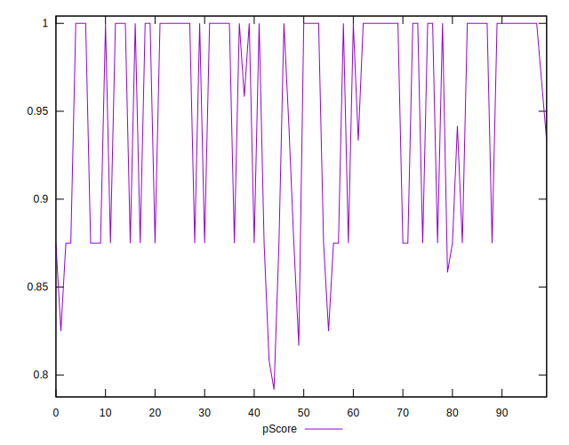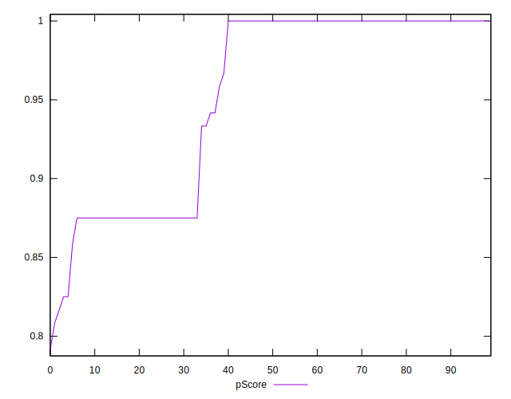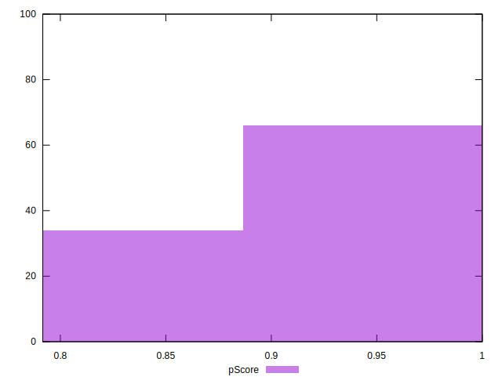
## Score Difference


```yaml
p90min: 0
p90max: 0
p90range: 0
p90mean: 0
p90median: 0
p90stdev: 0
p90skewness: .nan
p90eccentricity: .nan
p90discretization: 91
outlandishness: .inf
confidence: 9.484951648085949e-18
p90confidence: 0

```

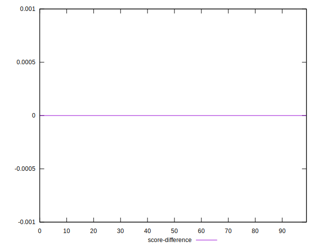
## P Score Difference


```yaml
p90min: -0.0050000000000000044
p90max: 0.0016666666666667052
p90range: 0.00666666666666671
p90mean: -0.0013369963369963362
p90median: 0
p90stdev: 0.0022267627940331055
p90skewness: -0.9173765534901727
p90eccentricity: 1.0000000000000024
p90discretization: 13
outlandishness: 1.2586995683993265
confidence: 0.0009490040458680071
p90confidence: 0.0009150216013632719

```

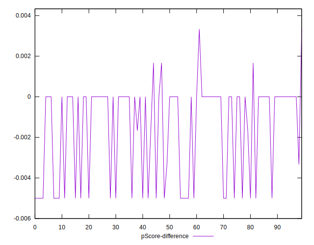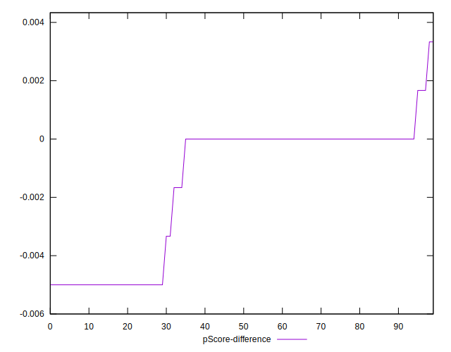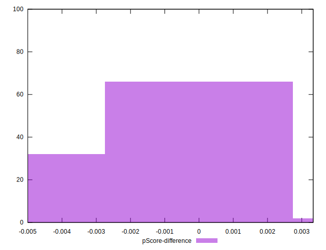