# //unminified-css/samples/pages+cached+noexternal+nomedia+nocss

[→ Parent](../..)


## Raw


```yaml
p90min: 0
p90max: 150
p90range: 150
p90mean: 39.67032967032967
p90median: 0
p90stdev: 61.49154412431363
p90skewness: 1.1048593296090288
p90eccentricity: 1.000000000000002
p90discretization: 9.1
outlandishness: 1.7514066228773564
confidence: 28.361295147879673
p90confidence: 25.268111774501477

```

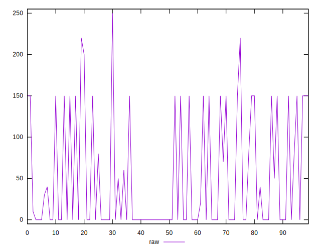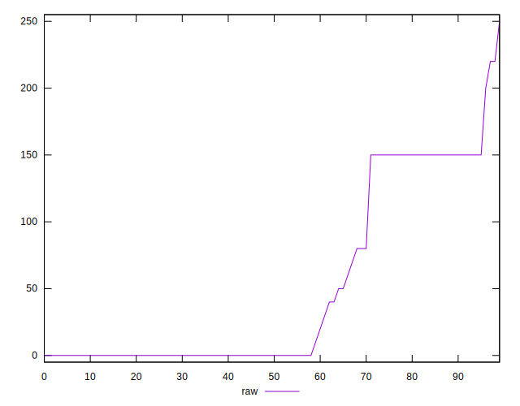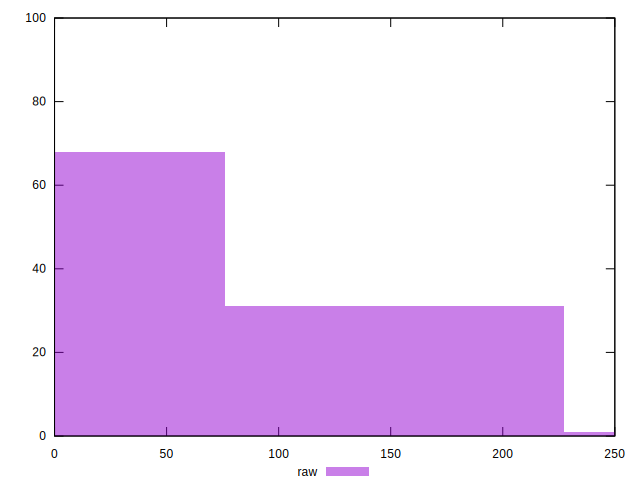
## Score


```yaml
p90min: 0.88
p90max: 1
p90range: 0.12
p90mean: 0.9680219780219778
p90median: 1
p90stdev: 0.04935228331713644
p90skewness: -1.0869770813850412
p90eccentricity: 0.9999999999999997
p90discretization: 10.11111111111111
outlandishness: 0.9783790170132322
confidence: 0.022986793181879017
p90confidence: 0.02027984544774486

```

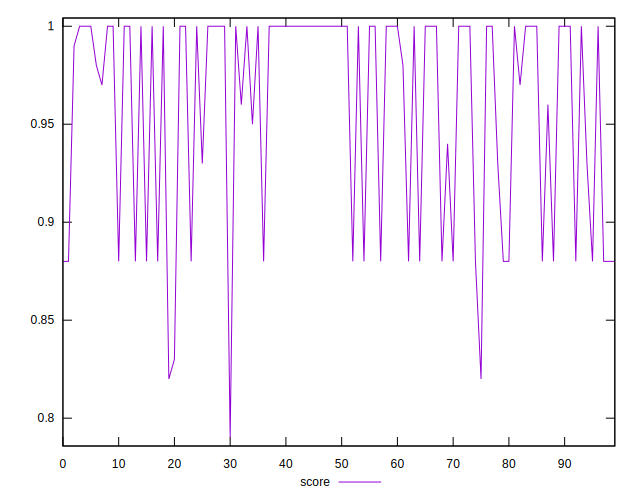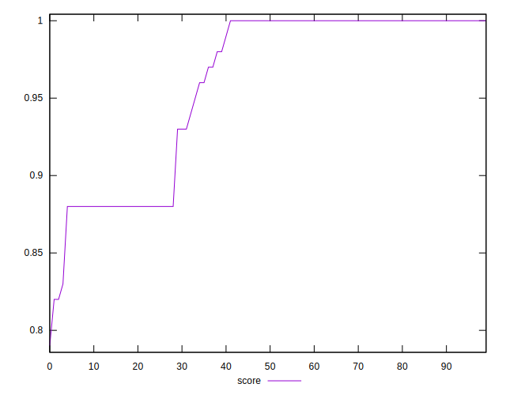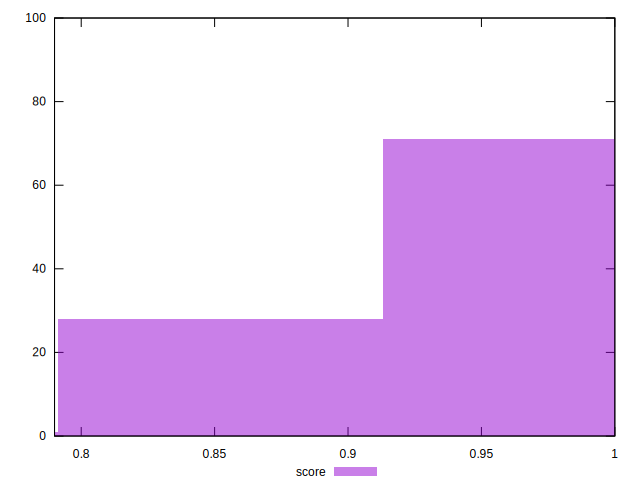
## Raw Estimate

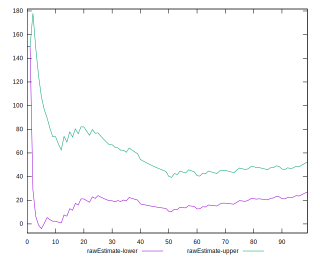
## Score Estimate

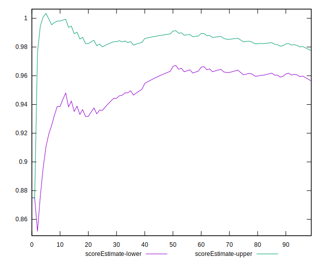
## P Score


```yaml
p90min: 0.875
p90max: 1
p90range: 0.125
p90mean: 0.9669413919413921
p90median: 1
p90stdev: 0.05124295343692811
p90skewness: -1.1048593296090172
p90eccentricity: 0.9999999999999974
p90discretization: 9.1
outlandishness: 0.9780084189040513
confidence: 0.02363441262323307
p90confidence: 0.021056759812084547

```

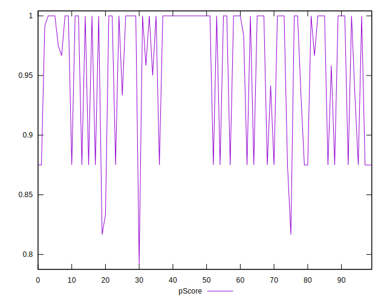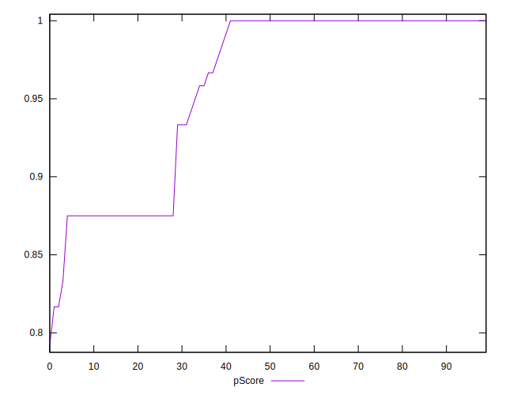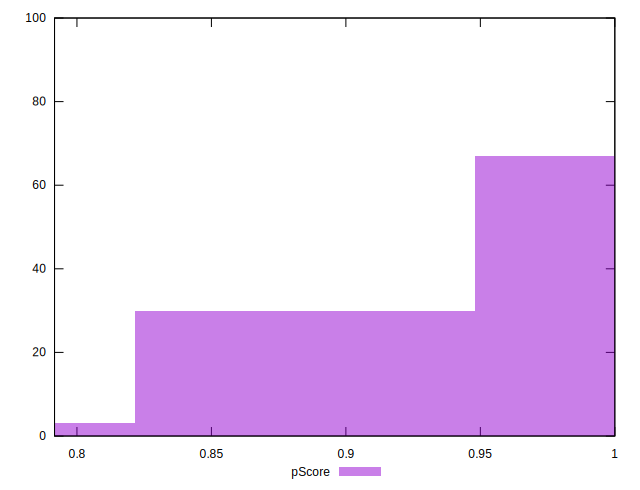
## Score Difference


```yaml
p90min: 0
p90max: 0
p90range: 0
p90mean: 0
p90median: 0
p90stdev: 0
p90skewness: .nan
p90eccentricity: .nan
p90discretization: 91
outlandishness: .inf
confidence: 9.484951648085957e-18
p90confidence: 0

```

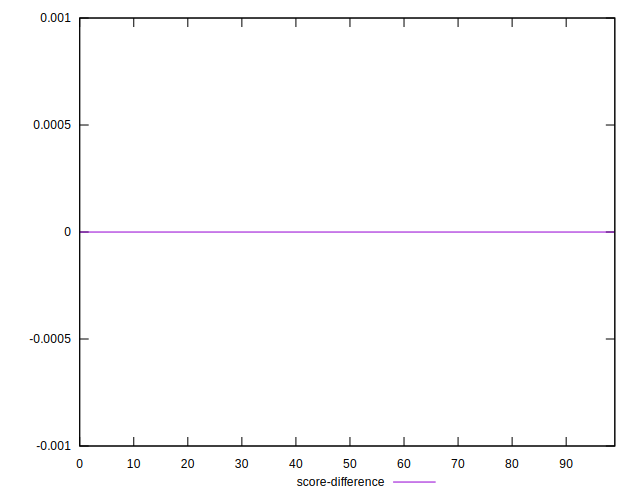
## P Score Difference


```yaml
p90min: -0.0050000000000000044
p90max: 0.0016666666666667052
p90range: 0.00666666666666671
p90mean: -0.001336996336996335
p90median: 0
p90stdev: 0.0022130120830759284
p90skewness: -0.900847876036986
p90eccentricity: 1.0000000000000004
p90discretization: 15.166666666666666
outlandishness: 0.8740969224995335
confidence: 0.0009662752753783975
p90confidence: 0.0009093711577715089

```

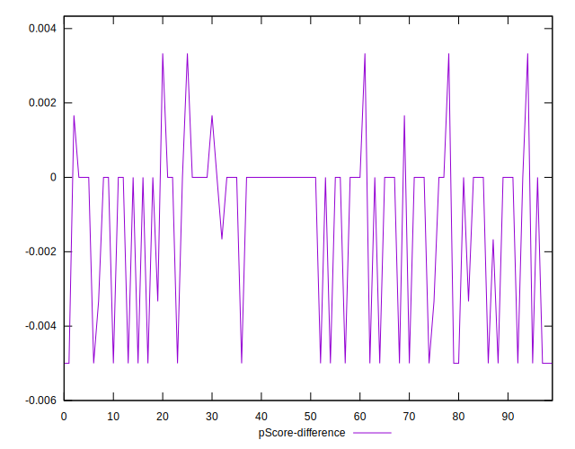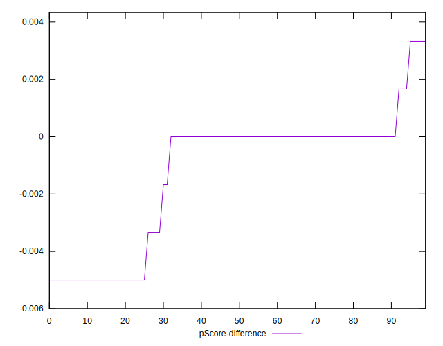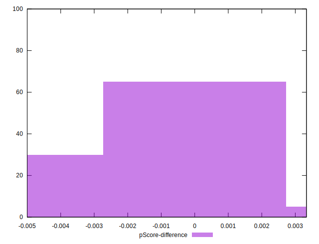