# //unminified-css/samples/pages+cached+noexternal+nomedia

[→ Parent](../..)


## Raw


```yaml
p90min: 0
p90max: 150
p90range: 150
p90mean: 56.26373626373626
p90median: 0
p90stdev: 63.222063745832344
p90skewness: 0.49747109755775926
p90eccentricity: 1.0000000000000016
p90discretization: 9.1
outlandishness: 1.4909268527984623
confidence: 28.96853290868907
p90confidence: 25.979217079258547

```

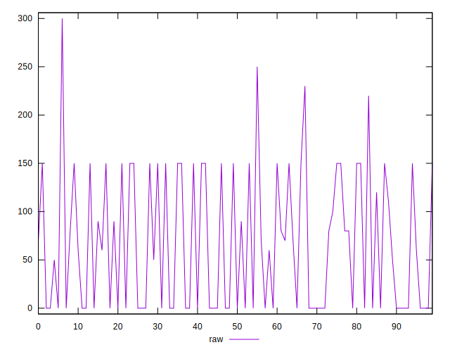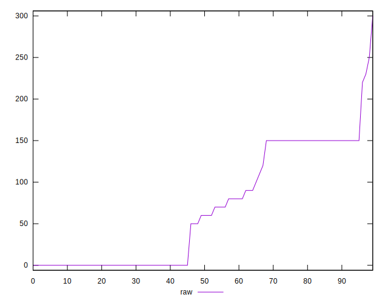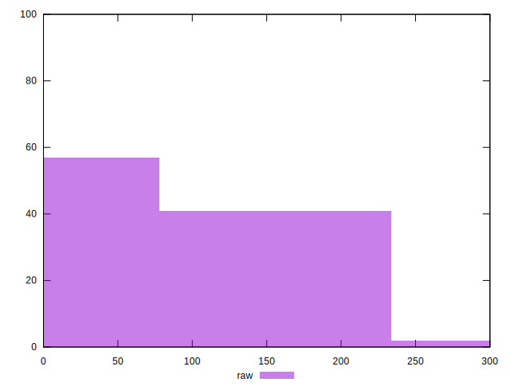
## Score


```yaml
p90min: 0.88
p90max: 1
p90range: 0.12
p90mean: 0.9543956043956043
p90median: 1
p90stdev: 0.050800380530044695
p90skewness: -0.4630779094223222
p90eccentricity: 1.0000000000000009
p90discretization: 10.11111111111111
outlandishness: 0.9787485490988408
confidence: 0.023514209969321076
p90confidence: 0.02087489770667239

```

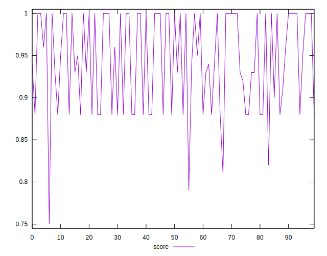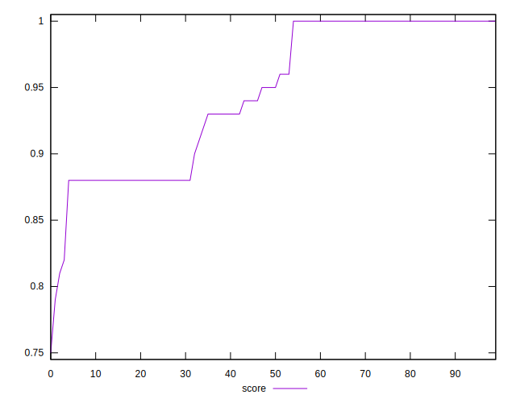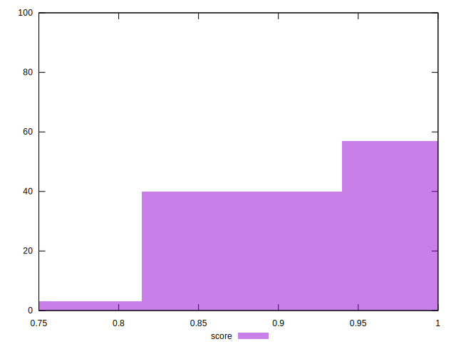
## Raw Estimate

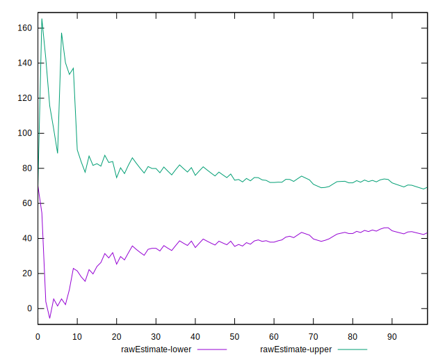
## Score Estimate

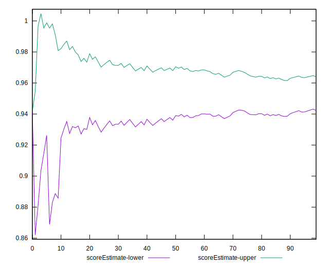
## P Score


```yaml
p90min: 0.875
p90max: 1
p90range: 0.125
p90mean: 0.9531135531135533
p90median: 1
p90stdev: 0.052685053121526944
p90skewness: -0.49747109755776187
p90eccentricity: 0.9999999999999999
p90discretization: 9.1
outlandishness: 0.97837149682002
confidence: 0.024140444090574142
p90confidence: 0.02164934756604886

```

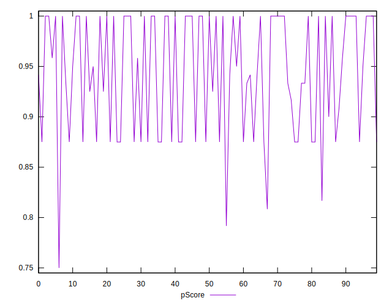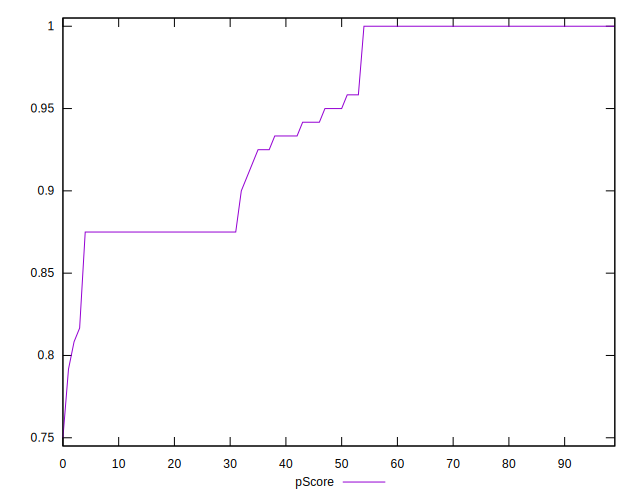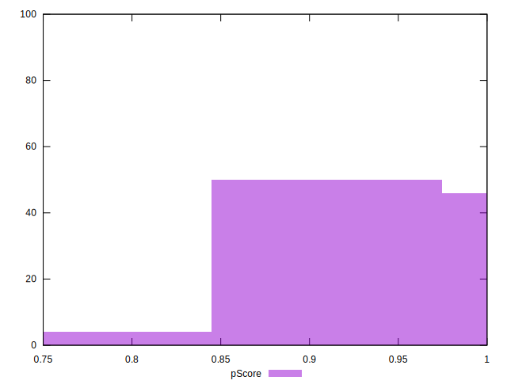
## Score Difference


```yaml
p90min: 0
p90max: 0
p90range: 0
p90mean: 0
p90median: 0
p90stdev: 0
p90skewness: .nan
p90eccentricity: .nan
p90discretization: 91
outlandishness: .inf
confidence: 1.2454613861688424e-17
p90confidence: 0

```

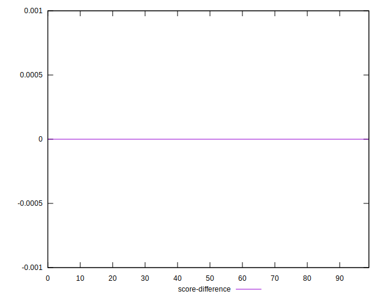
## P Score Difference


```yaml
p90min: -0.0050000000000000044
p90max: 0.0016666666666667052
p90range: 0.00666666666666671
p90mean: -0.0015567765567765562
p90median: 0
p90stdev: 0.0023544595386848157
p90skewness: -0.631257137335763
p90eccentricity: 0.9999999999999981
p90discretization: 11.375
outlandishness: 0.8675278754325281
confidence: 0.0010148795374721404
p90confidence: 0.0009674947610968485

```

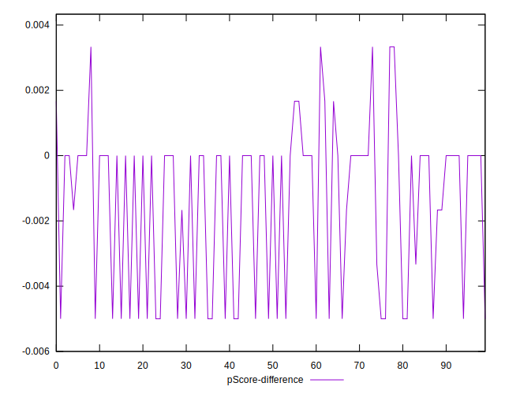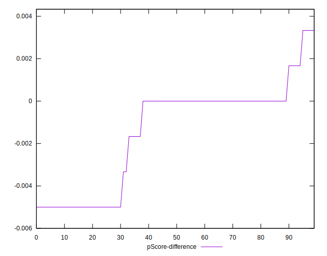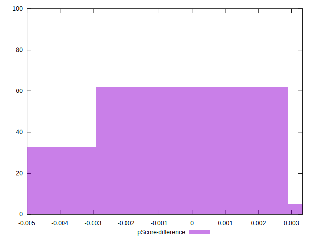