# //unminified-css/samples/pages+cached+noexternal

[→ Parent](../..)


## Raw


```yaml
p90min: 0
p90max: 150
p90range: 150
p90mean: 44.94505494505494
p90median: 0
p90stdev: 64.52486745048357
p90skewness: 0.8729686800292267
p90eccentricity: 1.0000000000000009
p90discretization: 11.375
outlandishness: 1.6310225046478681
confidence: 29.221847044096492
p90confidence: 26.514565314502264

```

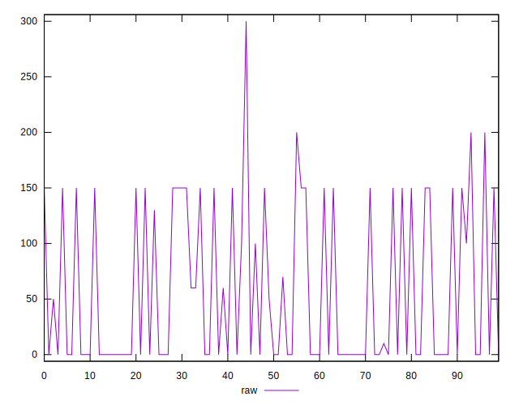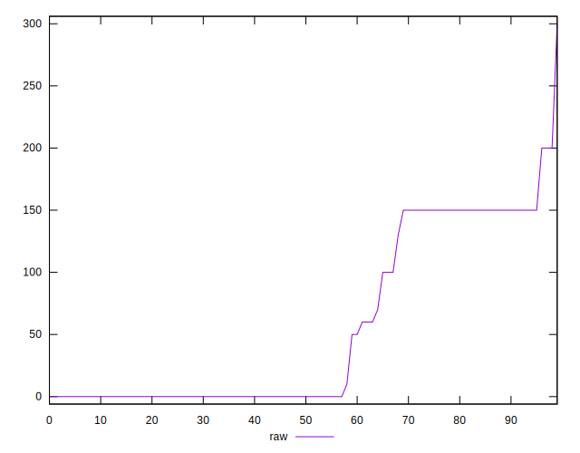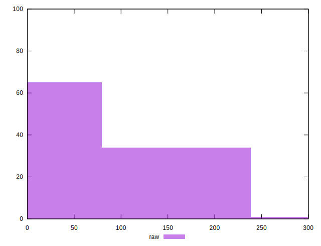
## Score


```yaml
p90min: 0.88
p90max: 1
p90range: 0.12
p90mean: 0.9638461538461536
p90median: 1
p90stdev: 0.051734088295827825
p90skewness: -0.8639986460503049
p90eccentricity: 0.9999999999999993
p90discretization: 11.375
outlandishness: 0.9786467482033543
confidence: 0.023762492126328638
p90confidence: 0.021258576999923395

```

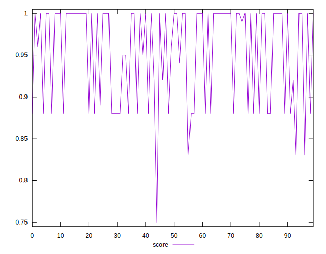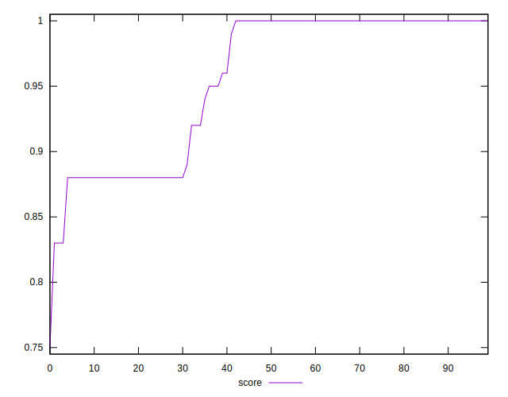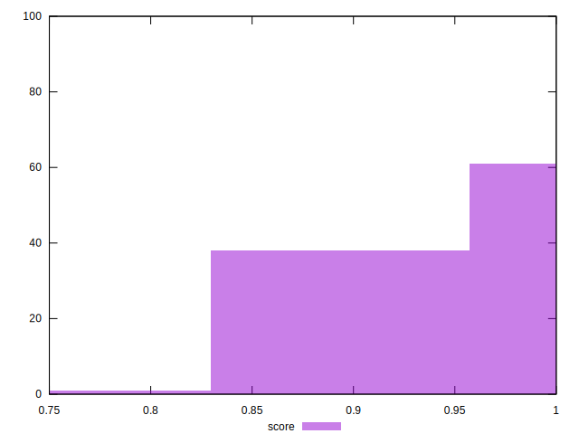
## Raw Estimate


## Score Estimate

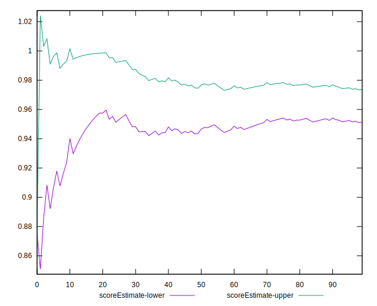
## P Score


```yaml
p90min: 0.875
p90max: 1
p90range: 0.125
p90mean: 0.9625457875457876
p90median: 1
p90stdev: 0.053770722875402986
p90skewness: -0.8729686800292278
p90eccentricity: 1.0000000000000007
p90discretization: 11.375
outlandishness: 0.9785502943584361
confidence: 0.024351539203413708
p90confidence: 0.02209547109541865

```

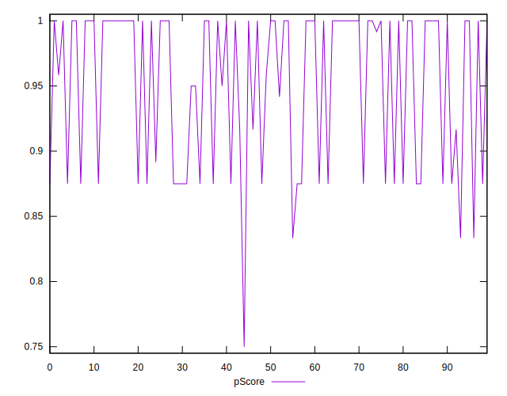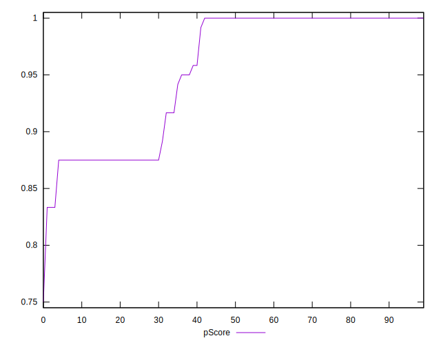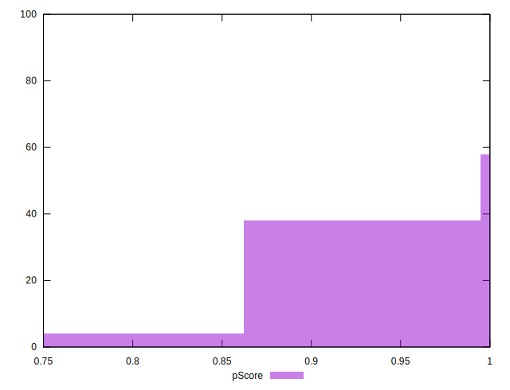
## Score Difference


```yaml
p90min: 0
p90max: 0
p90range: 0
p90mean: 0
p90median: 0
p90stdev: 0
p90skewness: .nan
p90eccentricity: .nan
p90discretization: 91
outlandishness: .inf
confidence: 1.1103983576888547e-17
p90confidence: 0

```

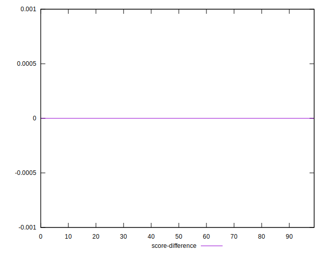
## P Score Difference


```yaml
p90min: -0.0050000000000000044
p90max: 0.0016666666666667052
p90range: 0.00666666666666671
p90mean: -0.0012454212454212474
p90median: 0
p90stdev: 0.0021764839097980246
p90skewness: -1.0073100273816964
p90eccentricity: 1.0000000000000009
p90discretization: 15.166666666666666
outlandishness: 1.1461591695501743
confidence: 0.0009422334192429175
p90confidence: 0.0008943609969689365

```

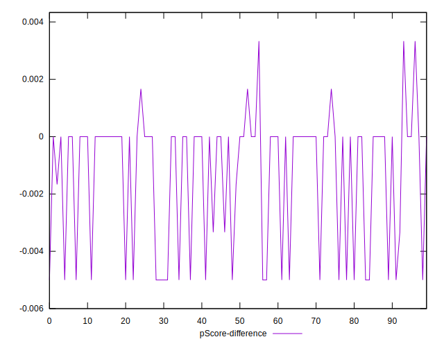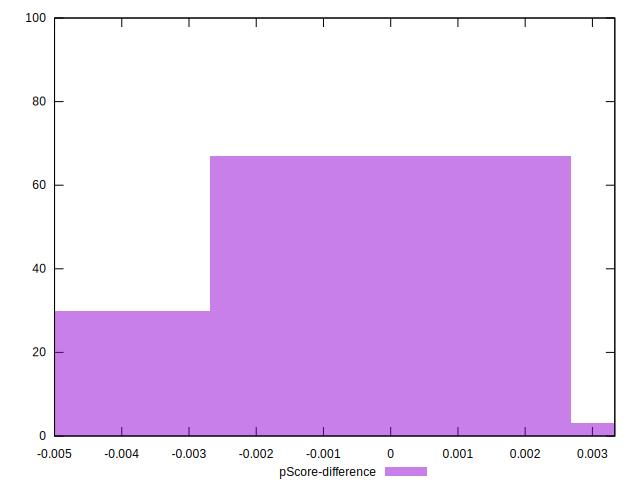