# //unminified-css/samples/pages+cached

[→ Parent](../..)


## Raw


```yaml
p90min: 0
p90max: 150
p90range: 150
p90mean: 57.69230769230769
p90median: 0
p90stdev: 69.37835307136038
p90skewness: 0.4697302663636841
p90eccentricity: 0.9999999999999997
p90discretization: 9.1
outlandishness: 1.5966849600000002
confidence: 32.50608393011808
p90confidence: 28.508960135948286

```

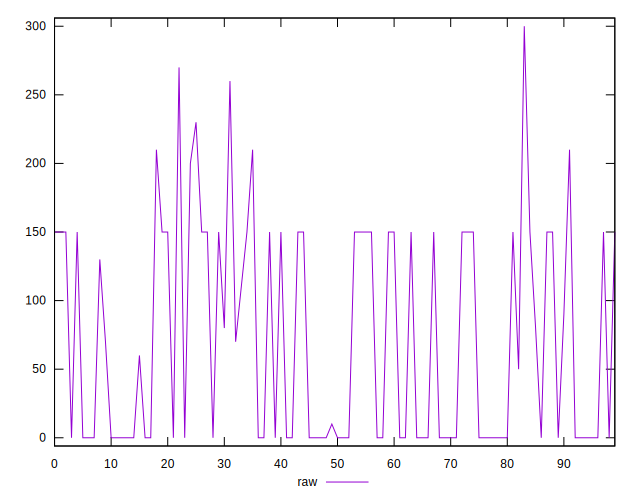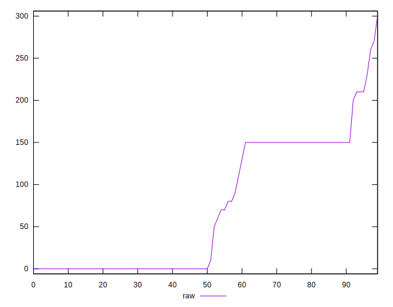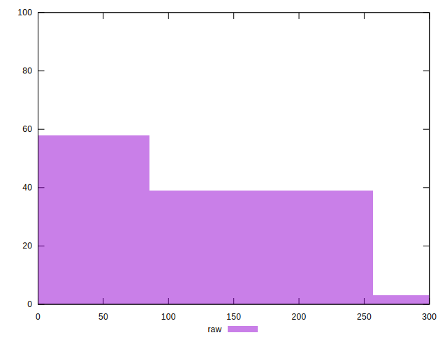
## Score


```yaml
p90min: 0.88
p90max: 1
p90range: 0.12
p90mean: 0.9535164835164837
p90median: 1
p90stdev: 0.05563565988977399
p90skewness: -0.45506975569135993
p90eccentricity: 1.0000000000000002
p90discretization: 10.11111111111111
outlandishness: 0.9737120101587011
confidence: 0.026424472564961388
p90confidence: 0.02286181120937414

```

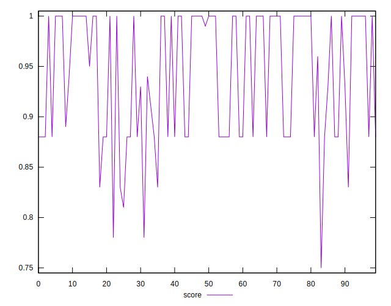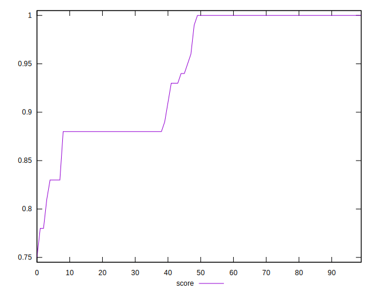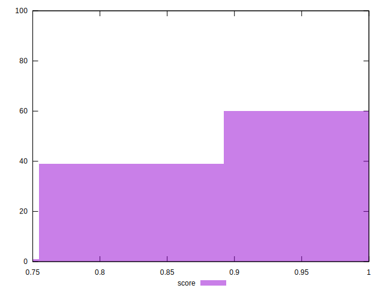
## Raw Estimate

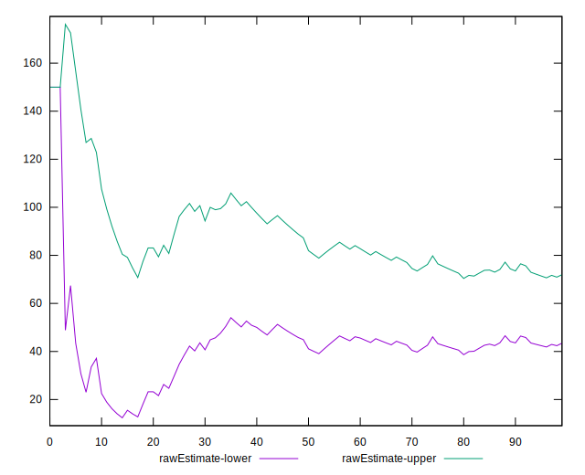
## Score Estimate

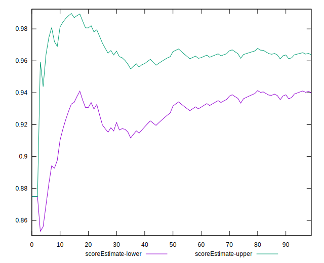
## P Score


```yaml
p90min: 0.875
p90max: 1
p90range: 0.125
p90mean: 0.9519230769230769
p90median: 1
p90stdev: 0.05781529422613363
p90skewness: -0.46973026636368204
p90eccentricity: 0.9999999999999997
p90discretization: 9.1
outlandishness: 0.9735509768390979
confidence: 0.027088403275098427
p90confidence: 0.023757466779956937

```

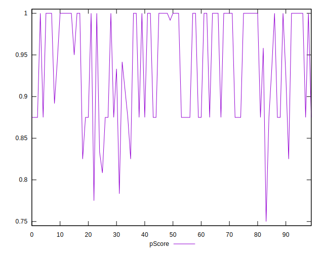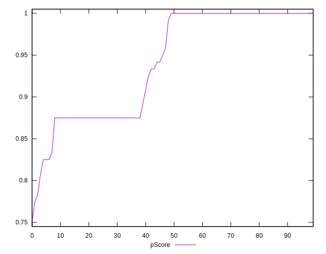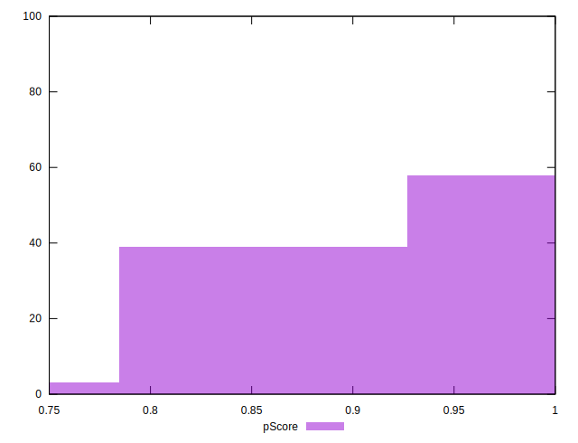
## Score Difference


```yaml
p90min: 0
p90max: 0
p90range: 0
p90mean: 0
p90median: 0
p90stdev: 0
p90skewness: .nan
p90eccentricity: .nan
p90discretization: 91
outlandishness: .inf
confidence: 1.1103983576888545e-17
p90confidence: 0

```

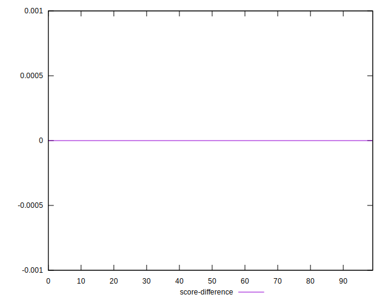
## P Score Difference


```yaml
p90min: -0.0050000000000000044
p90max: 0.0016666666666667052
p90range: 0.00666666666666671
p90mean: -0.001684981684981686
p90median: 0
p90stdev: 0.002427137295546962
p90skewness: -0.5573369764034448
p90eccentricity: 1.0000000000000018
p90discretization: 15.166666666666666
outlandishness: 0.9589092745746709
confidence: 0.0010309029654545195
p90confidence: 0.0009973595125852834

```

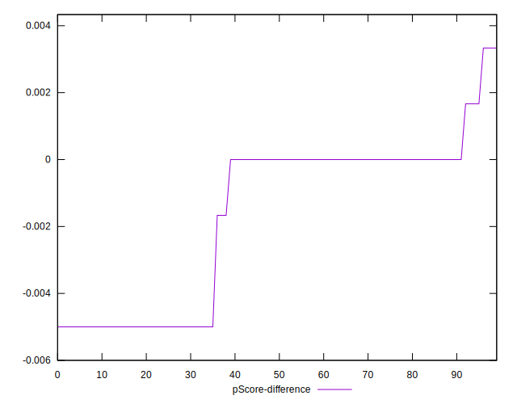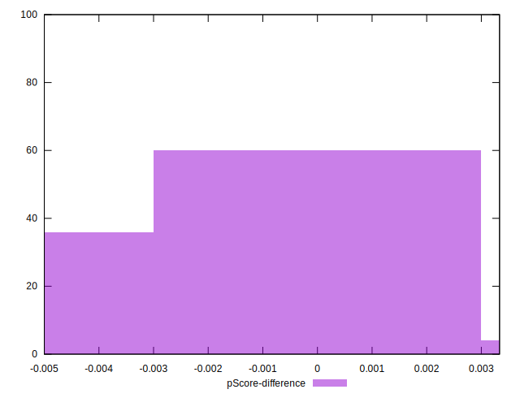