# //unminified-css/samples/pages

[→ Parent](../..)


## Raw


```yaml
p90min: 0
p90max: 300
p90range: 300
p90mean: 116.92307692307692
p90median: 150
p90stdev: 84.93943941747271
p90skewness: 0.05560745657598468
p90eccentricity: 1.0000000000000016
p90discretization: 18.2
outlandishness: 1.483267590027701
confidence: 45.677237139521424
p90confidence: 34.90332337280776

```

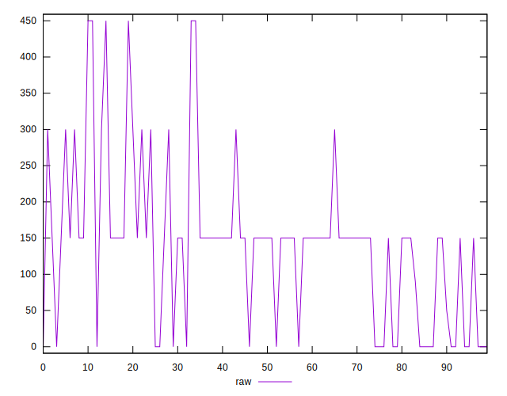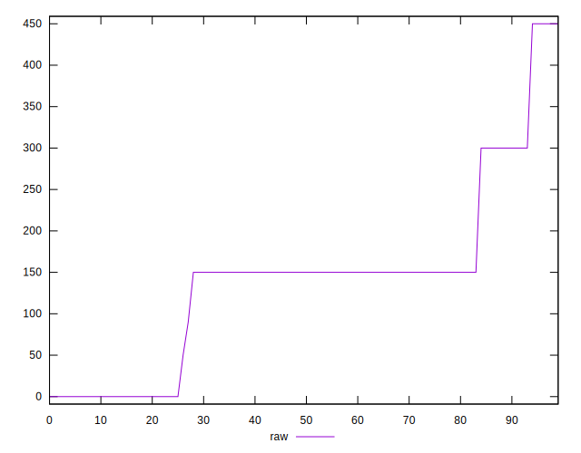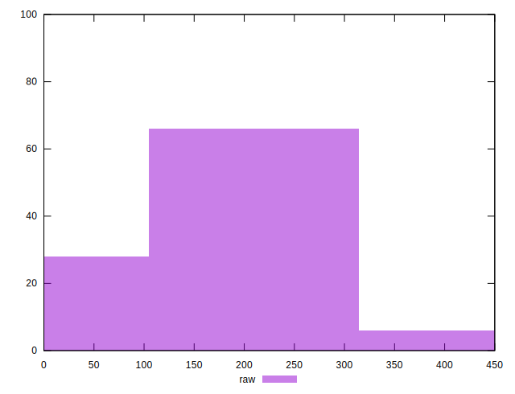
## Score


```yaml
p90min: 0.75
p90max: 1
p90range: 0.25
p90mean: 0.905714285714286
p90median: 0.88
p90stdev: 0.06964814012083882
p90skewness: -0.1761061330736817
p90eccentricity: 0.9999999999999984
p90discretization: 18.2
outlandishness: 0.9588857708306384
confidence: 0.03532590282033676
p90confidence: 0.028619821058675443

```

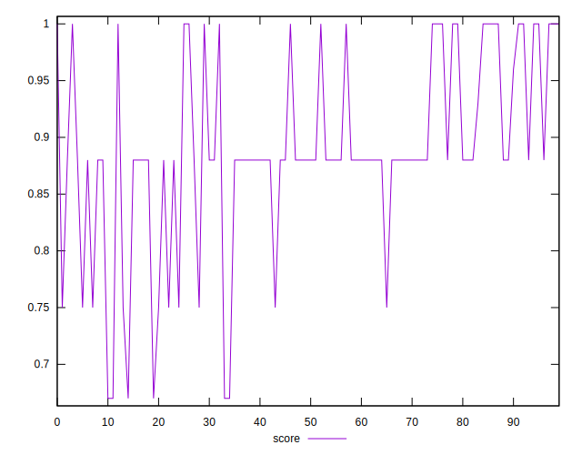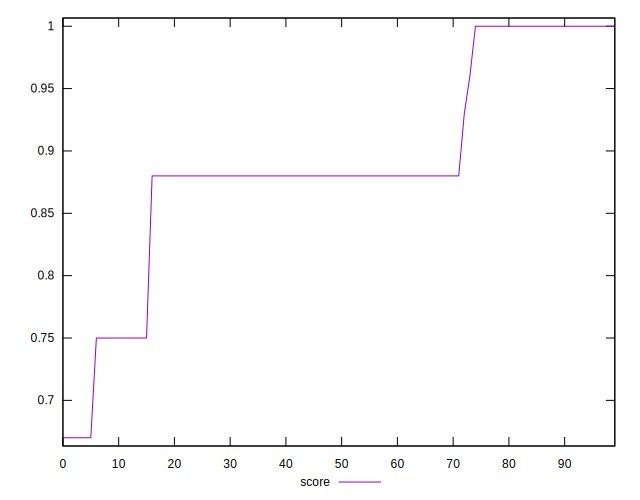
## Raw Estimate

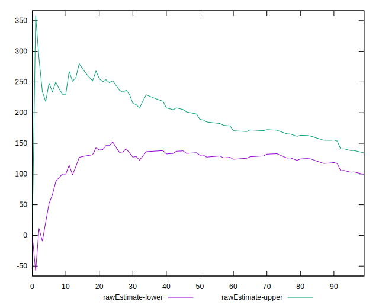
## Score Estimate

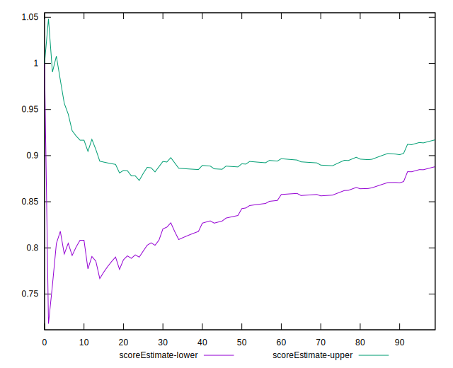
## P Score


```yaml
p90min: 0.75
p90max: 1
p90range: 0.25
p90mean: 0.9025641025641025
p90median: 0.875
p90stdev: 0.07078286618122724
p90skewness: -0.05560745657597969
p90eccentricity: 1.0000000000000018
p90discretization: 18.2
outlandishness: 0.9589249985876163
confidence: 0.03559498213377932
p90confidence: 0.029086102810673253

```

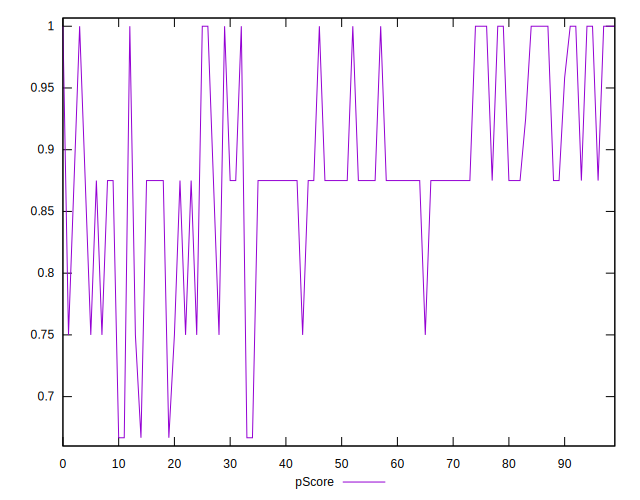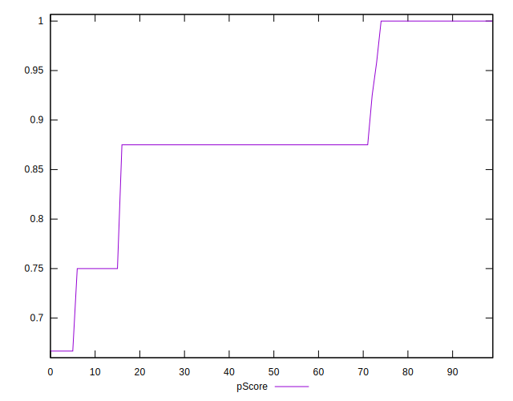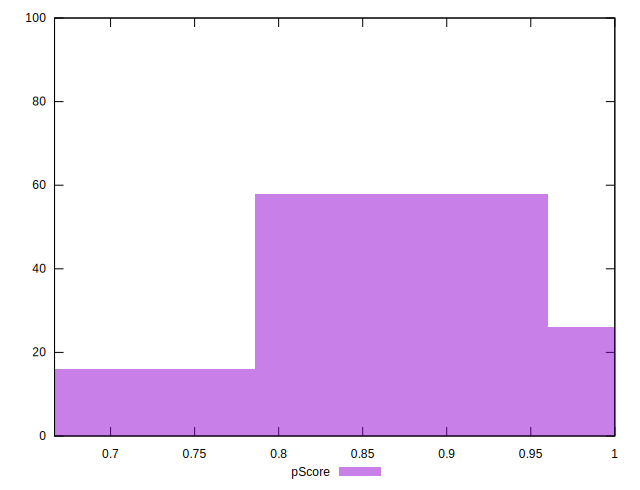
## Score Difference


```yaml
p90min: 0
p90max: 0
p90range: 0
p90mean: 0
p90median: 0
p90stdev: 0
p90skewness: .nan
p90eccentricity: .nan
p90discretization: 91
outlandishness: .nan
confidence: 0
p90confidence: 0

```


## P Score Difference


```yaml
p90min: -0.0050000000000000044
p90max: 0
p90range: 0.0050000000000000044
p90mean: -0.003369963369963377
p90median: -0.0050000000000000044
p90stdev: 0.002250736170138908
p90skewness: 0.7627508831956951
p90eccentricity: 1.0000000000000004
p90discretization: 22.75
outlandishness: 0.8281000000000001
confidence: 0.000922641465936699
p90confidence: 0.0009248727435923389

```

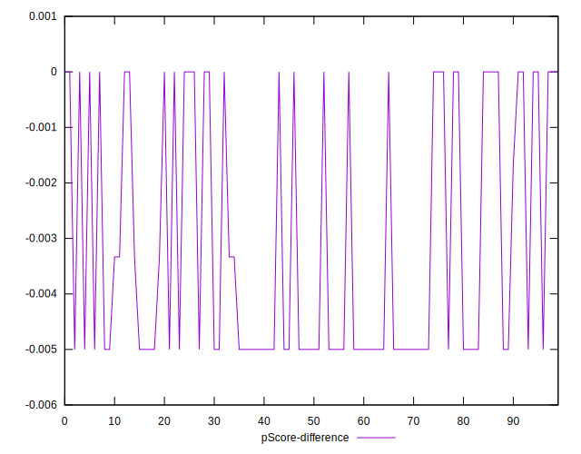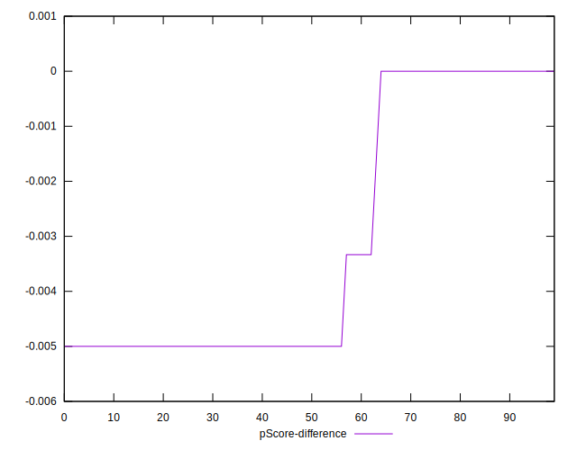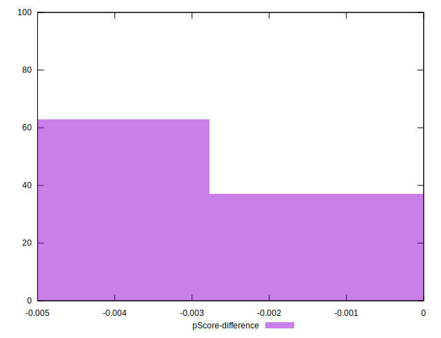