# //unminified-javascript/samples/pages+cached+noexternal+nomedia+nocss+nojs

[→ Parent](../..)


## Raw


```yaml
p90min: 0
p90max: 150
p90range: 150
p90mean: 14.175824175824175
p90median: 0
p90stdev: 40.411779755438246
p90skewness: 2.6793818378495966
p90eccentricity: 1.0000000000000018
p90discretization: 11.375
outlandishness: 4.041969983775014
confidence: 23.717183962566914
p90confidence: 16.606012784499217

```

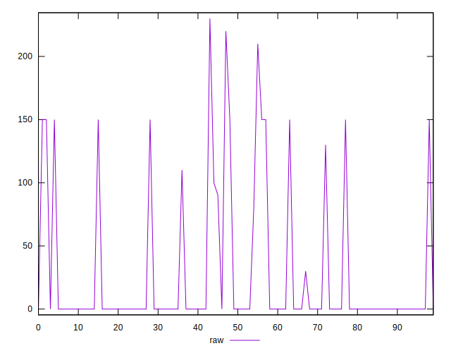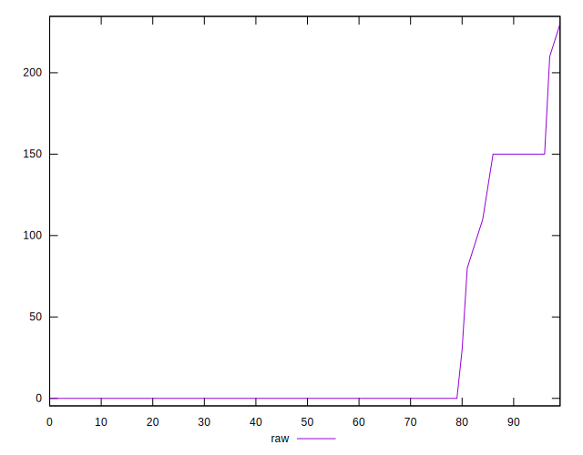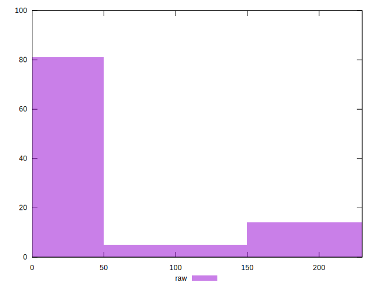
## Score


```yaml
p90min: 0.88
p90max: 1
p90range: 0.12
p90mean: 0.9885714285714285
p90median: 1
p90stdev: 0.03263421748267351
p90skewness: -2.670923363846192
p90eccentricity: 1.0000000000000018
p90discretization: 13
outlandishness: 0.9767266071368912
confidence: 0.019191640673172028
p90confidence: 0.013410056077930443

```

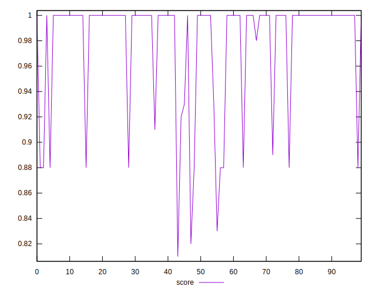
## Raw Estimate

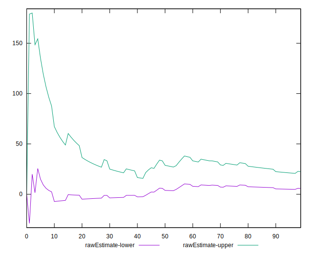
## Score Estimate


## P Score


```yaml
p90min: 0.875
p90max: 1
p90range: 0.125
p90mean: 0.988186813186813
p90median: 1
p90stdev: 0.03367648312953196
p90skewness: -2.67938183784956
p90eccentricity: 0.9999999999999961
p90discretization: 11.375
outlandishness: 0.975986893172105
confidence: 0.019764319968805788
p90confidence: 0.013838343987082613

```

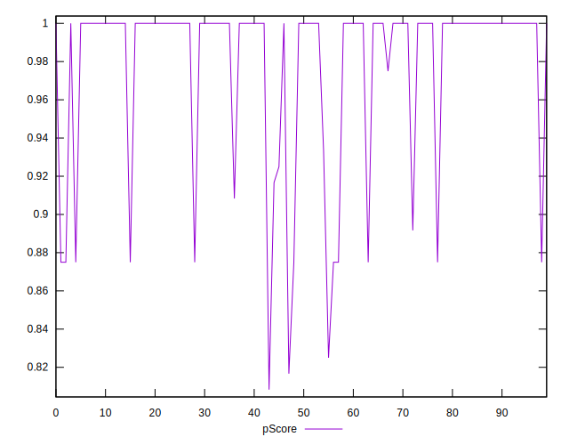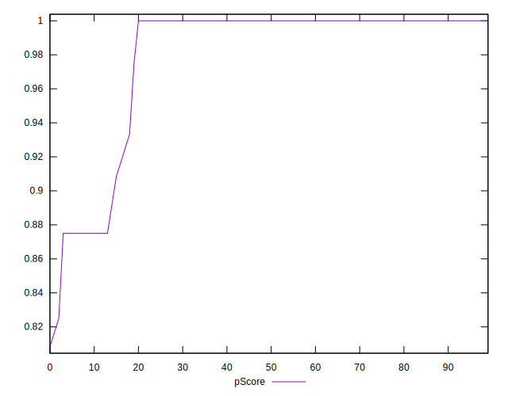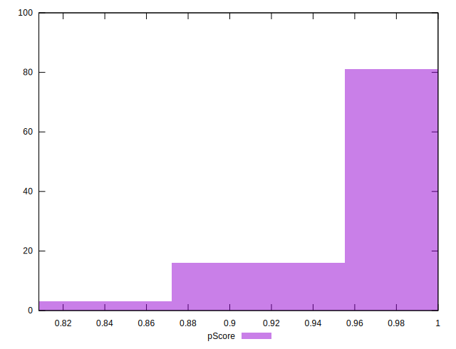
## Score Difference


```yaml
p90min: 0
p90max: 0
p90range: 0
p90mean: 0
p90median: 0
p90stdev: 0
p90skewness: .nan
p90eccentricity: .nan
p90discretization: 91
outlandishness: .inf
confidence: 6.092792000602807e-18
p90confidence: 0

```

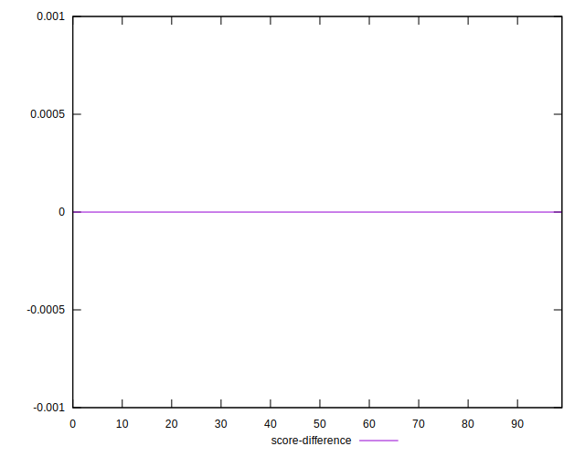
## P Score Difference


```yaml
p90min: -0.0050000000000000044
p90max: 0.0033333333333332993
p90range: 0.008333333333333304
p90mean: -0.0003296703296703324
p90median: 0
p90stdev: 0.0013125621148109088
p90skewness: -2.4703809922207
p90eccentricity: 1.0000000000000033
p90discretization: 13
outlandishness: 5.175624999999953
confidence: 0.0007179106665246007
p90confidence: 0.0005393581621721602

```

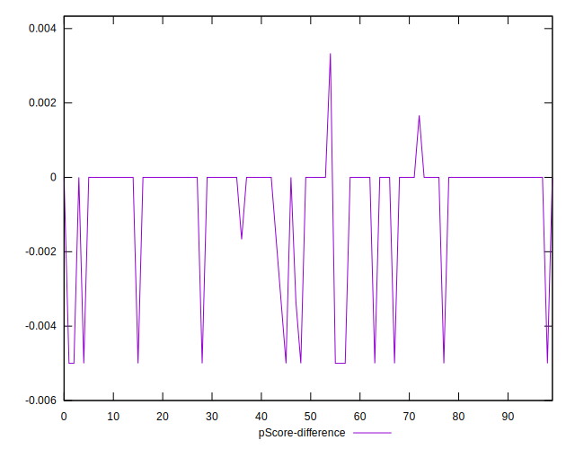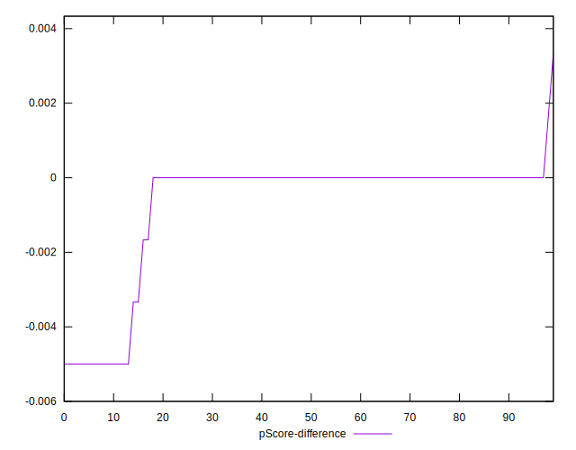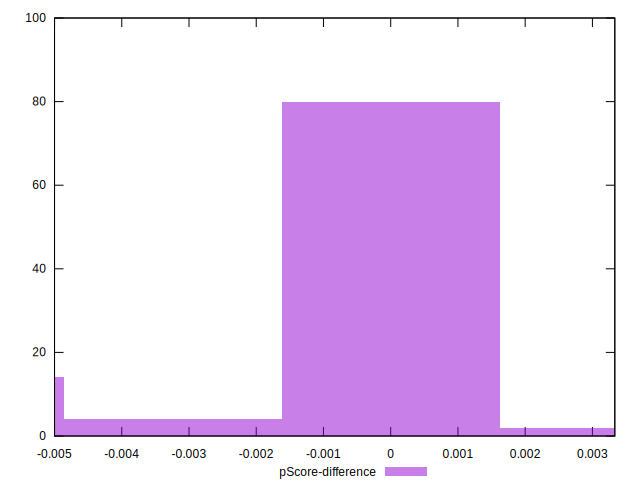