# //unminified-javascript/samples/pages+cached+noexternal+nomedia+nocss

[→ Parent](../..)


## Raw


```yaml
p90min: 0
p90max: 150
p90range: 150
p90mean: 11.538461538461538
p90median: 0
p90stdev: 37.38493193914727
p90skewness: 3.1805123841567555
p90eccentricity: 1.0000000000000004
p90discretization: 18.2
outlandishness: 7.547840444444444
confidence: 30.318330577960644
p90confidence: 15.3622201616985

```

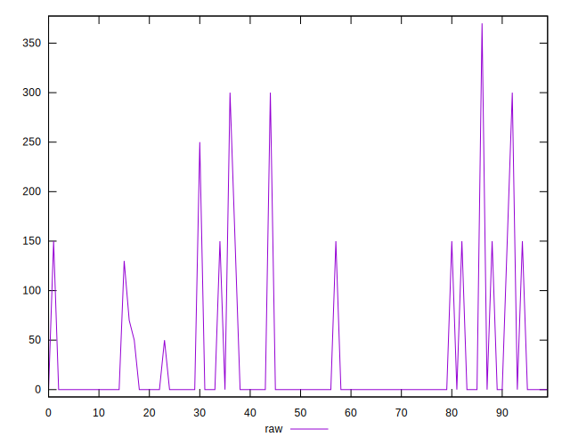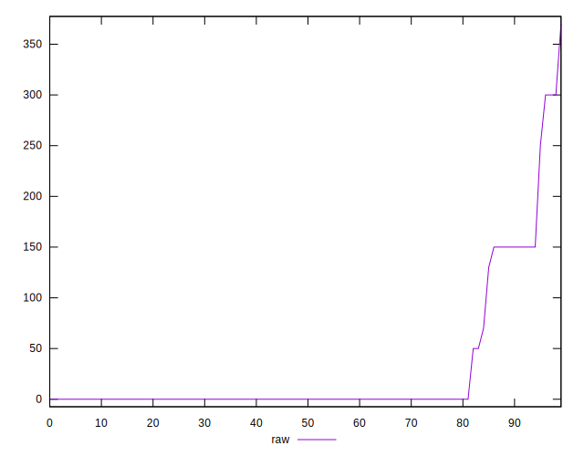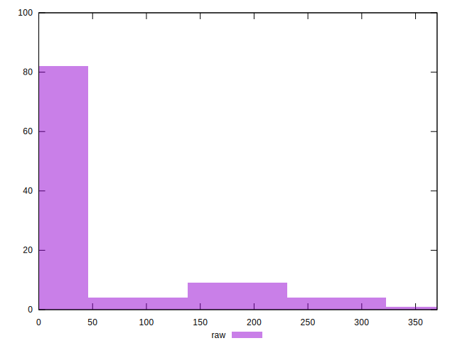
## Score


```yaml
p90min: 0.88
p90max: 1
p90range: 0.12
p90mean: 0.9906593406593404
p90median: 1
p90stdev: 0.030193595048997605
p90skewness: -3.160288269316081
p90eccentricity: 0.9999999999999999
p90discretization: 18.2
outlandishness: 0.9670469799782146
confidence: 0.02471843295701026
p90confidence: 0.012407155250967916

```

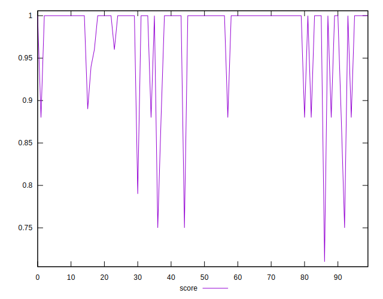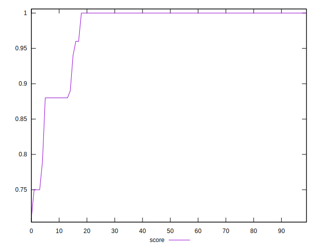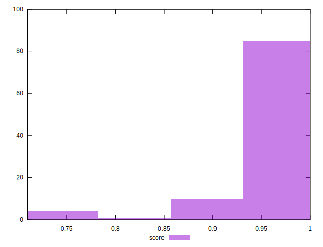
## Raw Estimate

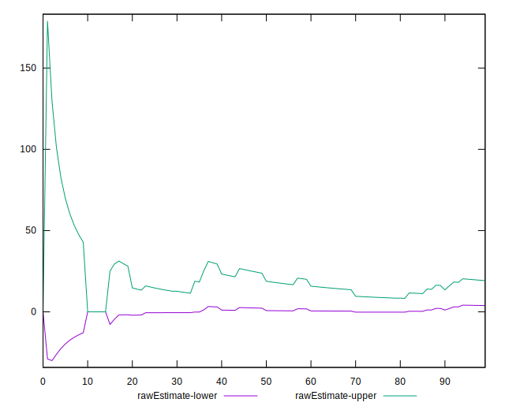
## Score Estimate

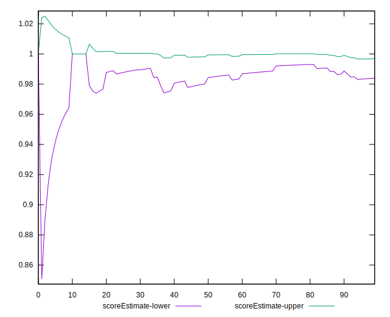
## P Score


```yaml
p90min: 0.875
p90max: 1
p90range: 0.125
p90mean: 0.9903846153846154
p90median: 1
p90stdev: 0.03115410994928941
p90skewness: -3.1805123841567307
p90eccentricity: 1.0000000000000002
p90discretization: 18.2
outlandishness: 0.9667450300594995
confidence: 0.024941192377726962
p90confidence: 0.01280185013474866

```

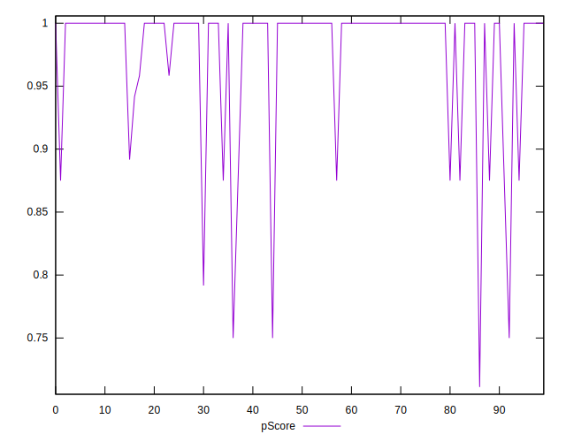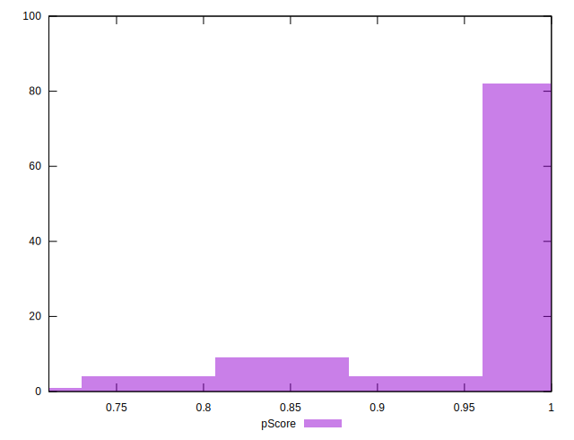
## Score Difference


```yaml
p90min: 0
p90max: 0
p90range: 0
p90mean: 0
p90median: 0
p90stdev: 0
p90skewness: .nan
p90eccentricity: .nan
p90discretization: 91
outlandishness: .inf
confidence: 4.330179641073934e-18
p90confidence: 0

```

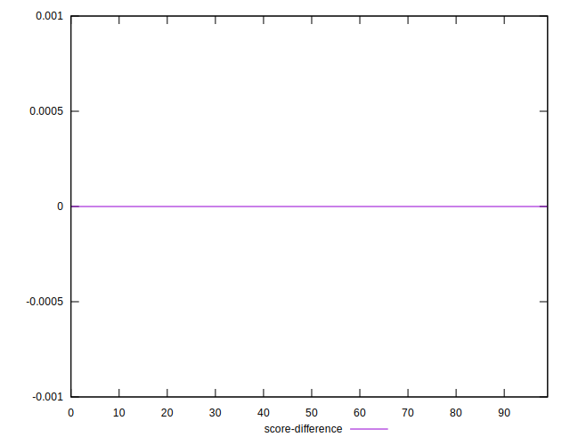
## P Score Difference


```yaml
p90min: -0.0016666666666665941
p90max: 0.0016666666666667052
p90range: 0.0033333333333332993
p90mean: 0.000030525030525031636
p90median: 0
p90stdev: 0.00040652190023409275
p90skewness: 0.7559632041284322
p90eccentricity: 1.0000000000000038
p90discretization: 18.2
outlandishness: 191.32422399998552
confidence: 0.0005844457436631871
p90confidence: 0.00016704802197081687

```

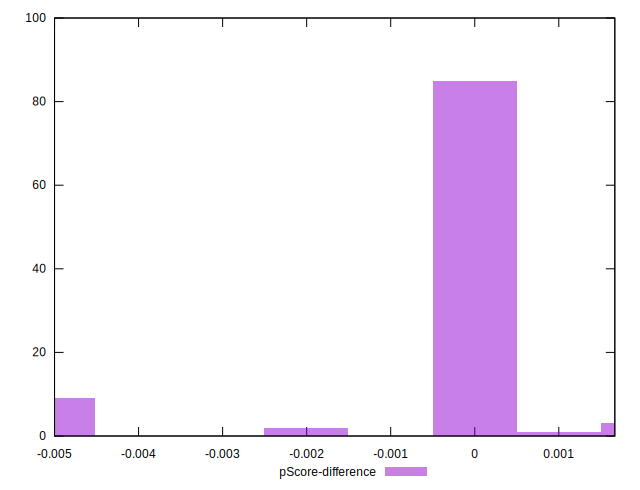