# //unminified-javascript/samples/pages+cached+noexternal+nomedia

[→ Parent](../..)


## Raw


```yaml
p90min: 0
p90max: 150
p90range: 150
p90mean: 10.989010989010989
p90median: 0
p90stdev: 36.76641279769983
p90skewness: 3.2113608363230193
p90eccentricity: 1.0000000000000029
p90discretization: 15.166666666666666
outlandishness: 5.175624999999999
confidence: 22.907275588921912
p90confidence: 15.108058211086771

```

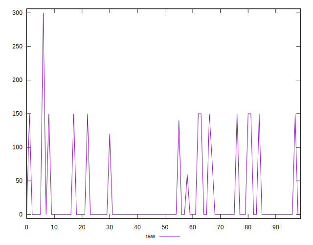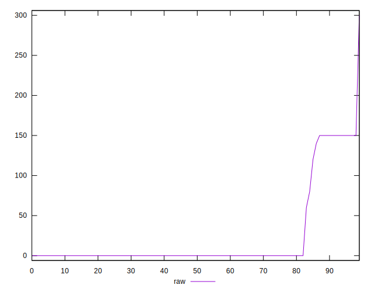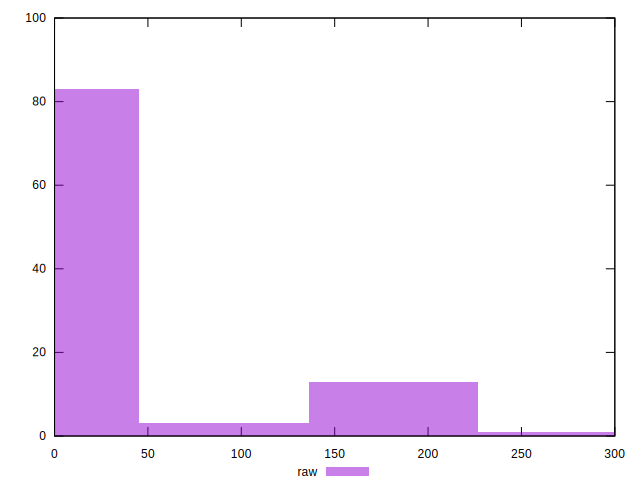
## Score


```yaml
p90min: 0.88
p90max: 1
p90range: 0.12
p90mean: 0.9909890109890107
p90median: 1
p90stdev: 0.03002032077545834
p90skewness: -3.17807856475492
p90eccentricity: 1.0000000000000018
p90discretization: 18.2
outlandishness: 0.977346447698723
confidence: 0.018630630418377425
p90confidence: 0.012335953368273644

```

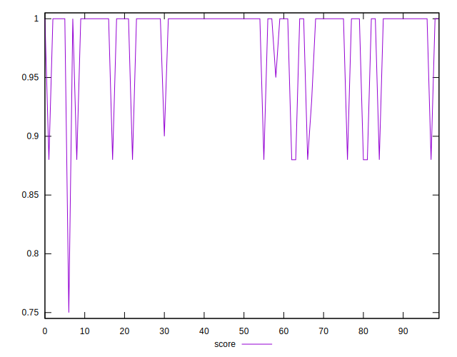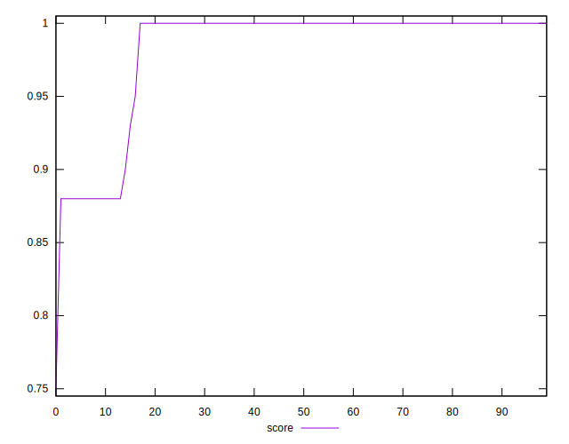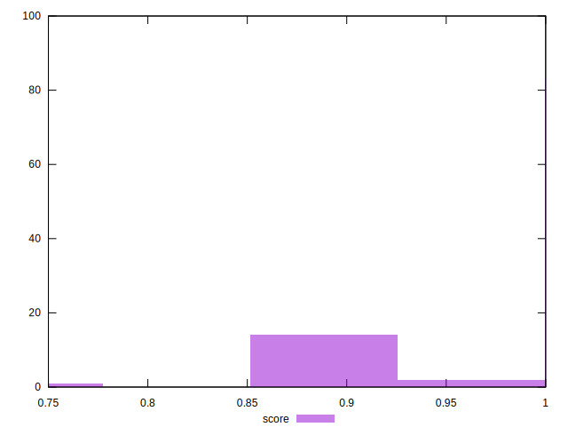
## Raw Estimate

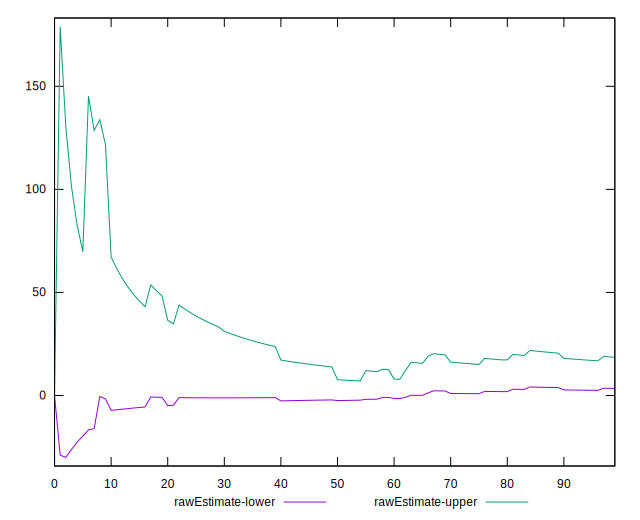
## Score Estimate

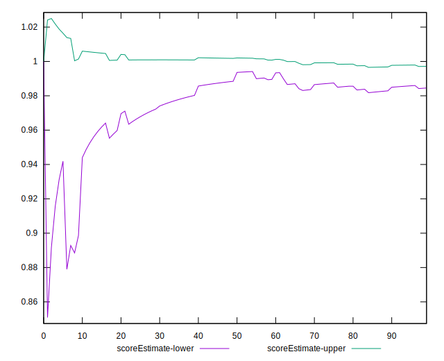
## P Score


```yaml
p90min: 0.875
p90max: 1
p90range: 0.125
p90mean: 0.9908424908424908
p90median: 1
p90stdev: 0.030638677331416522
p90skewness: -3.211360836323043
p90eccentricity: 1.0000000000000029
p90discretization: 15.166666666666666
outlandishness: 0.9765713887303927
confidence: 0.01908939632410167
p90confidence: 0.01259004850923895

```

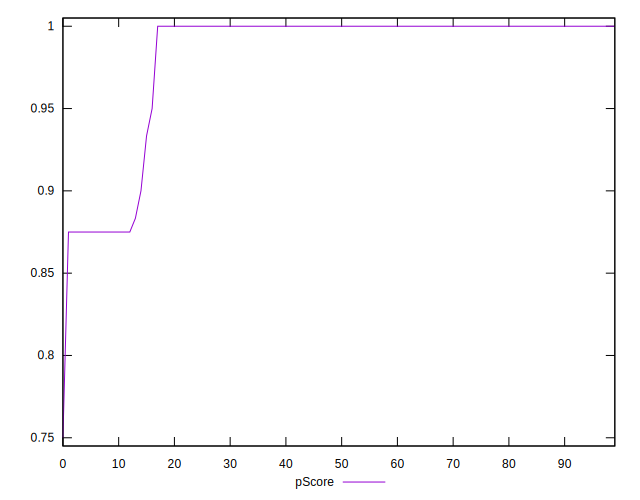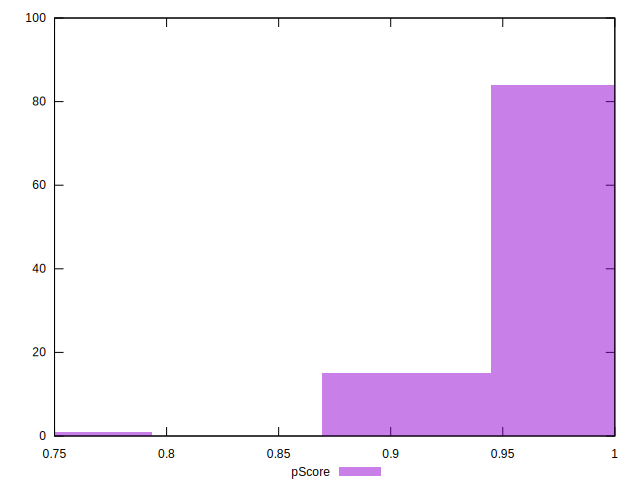
## Score Difference


```yaml
p90min: 0
p90max: 0
p90range: 0
p90mean: 0
p90median: 0
p90stdev: 0
p90skewness: .nan
p90eccentricity: .nan
p90discretization: 91
outlandishness: .inf
confidence: 4.330179641073933e-18
p90confidence: 0

```

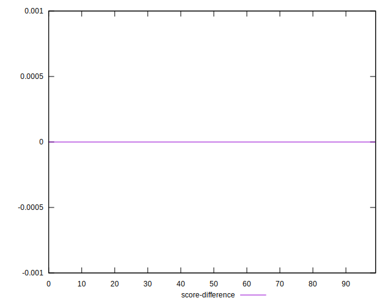
## P Score Difference


```yaml
p90min: -0.0050000000000000044
p90max: 0.0033333333333332993
p90range: 0.008333333333333304
p90mean: -0.00009157509157509247
p90median: 0
p90stdev: 0.0010295581921285837
p90skewness: -2.762617984037354
p90eccentricity: 1.0000000000000002
p90discretization: 30.333333333333332
outlandishness: 33.91897599999949
confidence: 0.0006718735701806884
p90confidence: 0.00042306616051901116

```

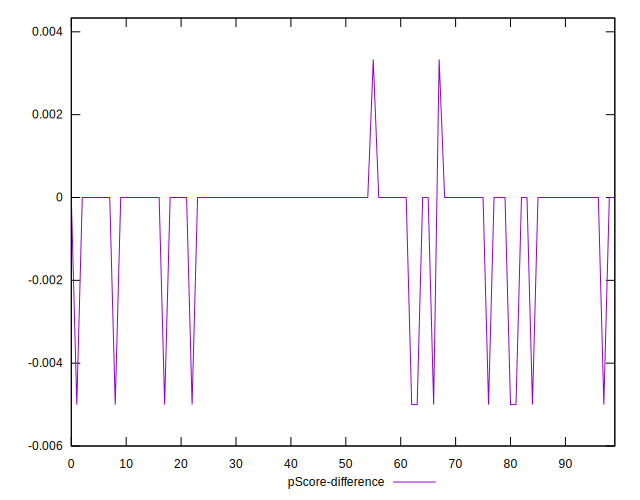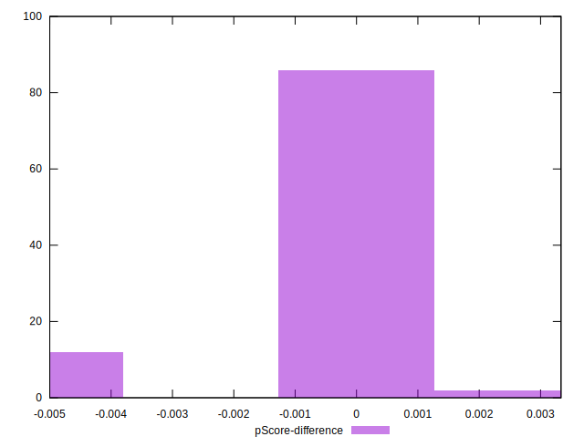