# //unminified-javascript/samples/pages+cached+noexternal

[→ Parent](../..)


## Raw


```yaml
p90min: 0
p90max: 150
p90range: 150
p90mean: 4.615384615384615
p90median: 0
p90stdev: 23.21934075919534
p90skewness: 5.326425905386263
p90eccentricity: 1.0000000000000022
p90discretization: 18.2
outlandishness: 17.305600000000002
confidence: 20.89494430216792
p90confidence: 9.541293945188189

```

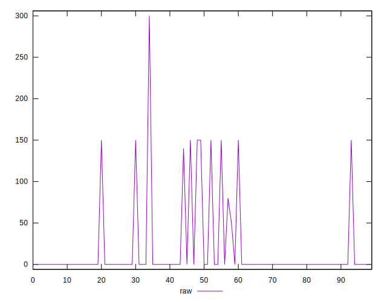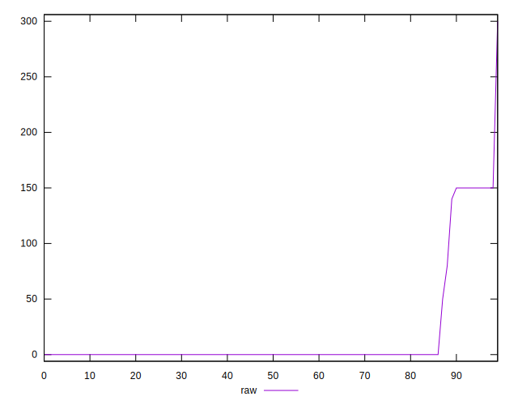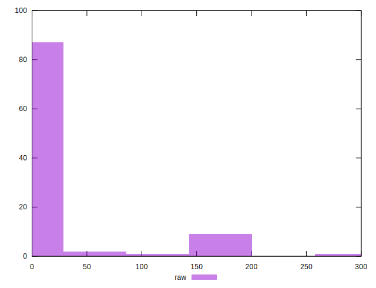
## Score


```yaml
p90min: 0.88
p90max: 1
p90range: 0.12
p90mean: 0.9961538461538462
p90median: 1
p90stdev: 0.01931629334276645
p90skewness: -5.284716825111739
p90eccentricity: 1.0000000000000013
p90discretization: 22.75
outlandishness: 0.9765407661782028
confidence: 0.017026391126101048
p90confidence: 0.007937453290607799

```

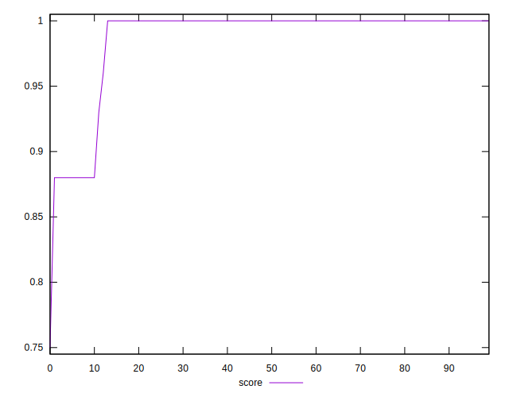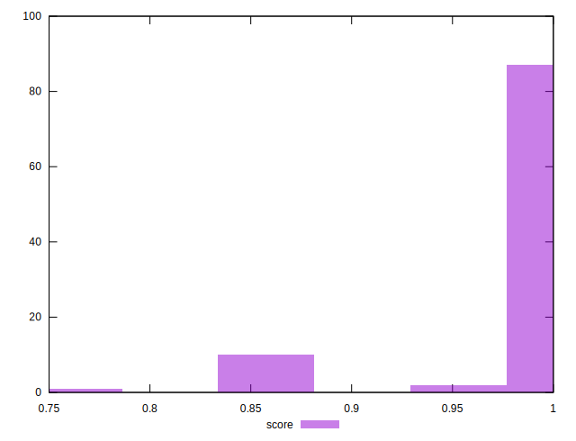
## Raw Estimate

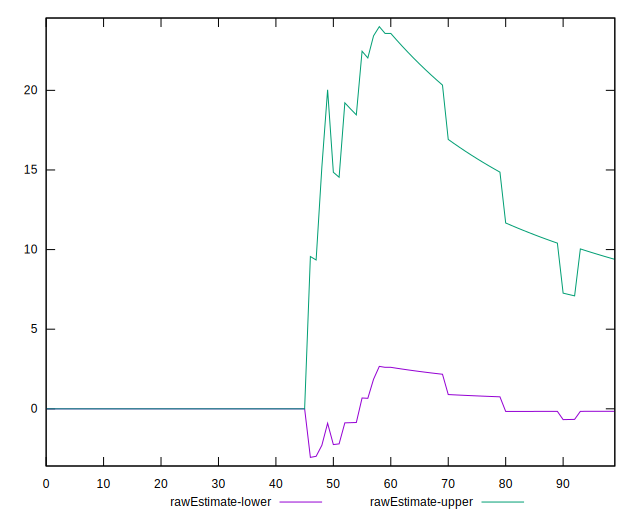
## Score Estimate

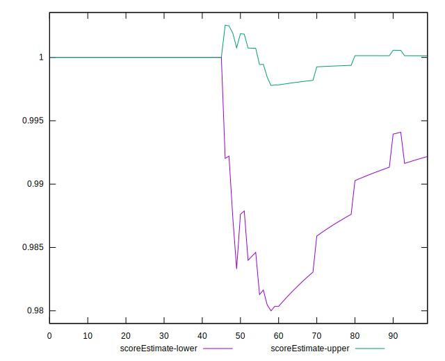
## P Score


```yaml
p90min: 0.875
p90max: 1
p90range: 0.125
p90mean: 0.9961538461538462
p90median: 1
p90stdev: 0.0193494506326628
p90skewness: -5.326425905386253
p90eccentricity: 1.0000000000000007
p90discretization: 18.2
outlandishness: 0.9757473144407509
confidence: 0.017412453585139875
p90confidence: 0.007951078287656843

```

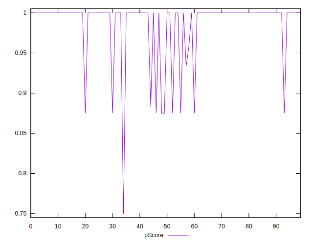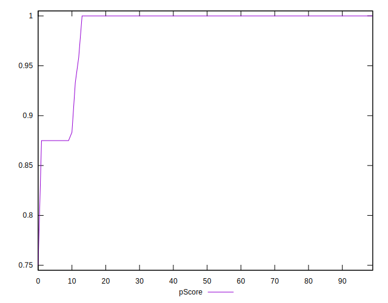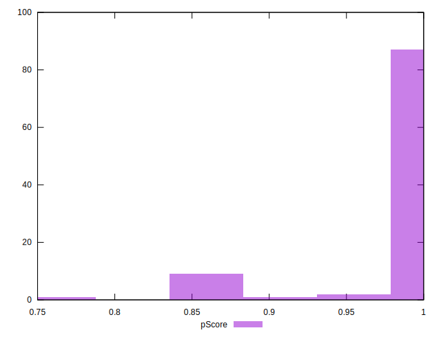
## Score Difference


```yaml
p90min: 0
p90max: 0
p90range: 0
p90mean: 0
p90median: 0
p90stdev: 0
p90skewness: .nan
p90eccentricity: .nan
p90discretization: 91
outlandishness: .nan
confidence: 0
p90confidence: 0

```


## P Score Difference


```yaml
p90min: -0.0016666666666665941
p90max: 0.0033333333333332993
p90range: 0.004999999999999893
p90mean: 0.00005494505494505499
p90median: 0
p90stdev: 0.0005212545593684075
p90skewness: 5.070835856219045
p90eccentricity: 0.9999999999999953
p90discretization: 30.333333333333332
outlandishness: 52.998400000000004
confidence: 0.000599633676186528
p90confidence: 0.0002141939783210226

```

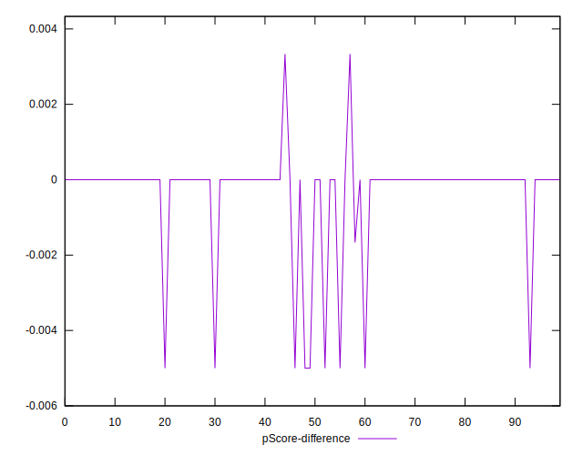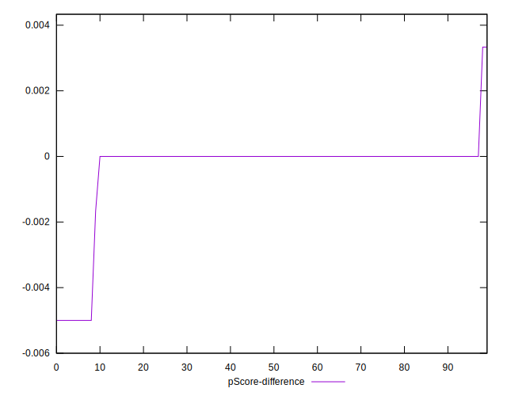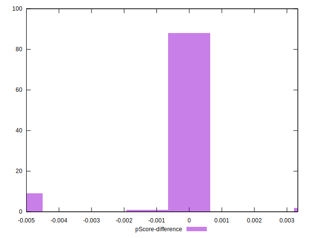