# //unminified-javascript/samples/pages+cached

[→ Parent](../..)


## Raw


```yaml
p90min: 0
p90max: 150
p90range: 150
p90mean: 21.208791208791208
p90median: 0
p90stdev: 49.454944859602186
p90skewness: 2.018683257248129
p90eccentricity: 1.0000000000000024
p90discretization: 11.375
outlandishness: 3.244104926306747
confidence: 29.27312343628138
p90confidence: 20.32203113956498

```

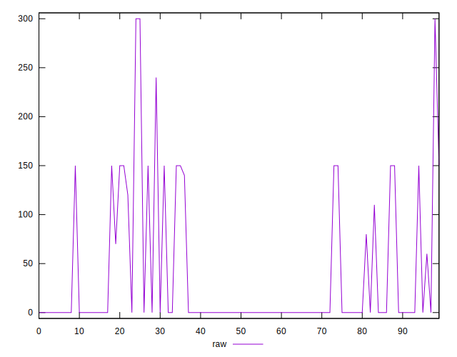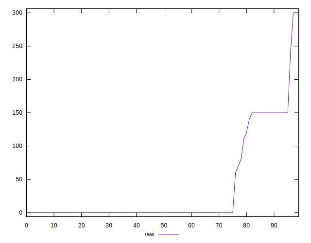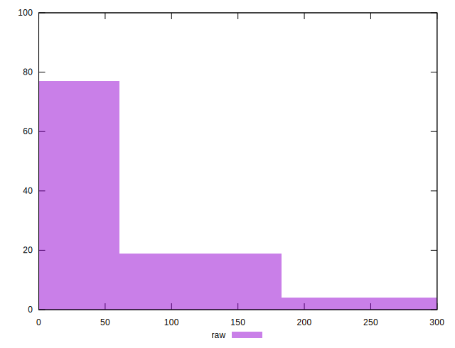
## Score


```yaml
p90min: 0.88
p90max: 1
p90range: 0.12
p90mean: 0.9827472527472525
p90median: 1
p90stdev: 0.0400567162212609
p90skewness: -1.9949861000252387
p90eccentricity: 0.9999999999999983
p90discretization: 13
outlandishness: 0.9718172047453144
confidence: 0.024012750539814443
p90confidence: 0.016460110039716813

```

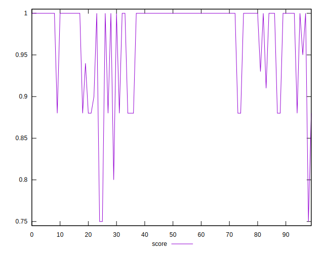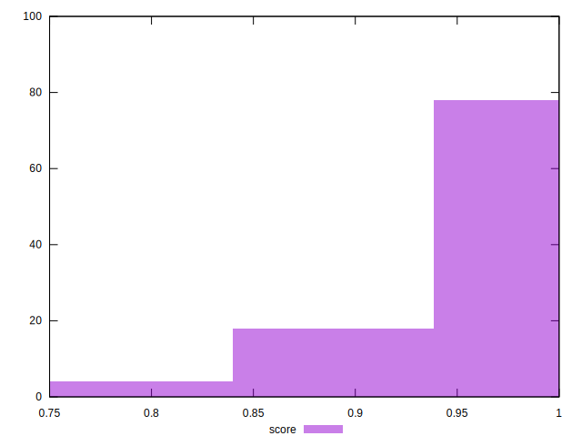
## Raw Estimate

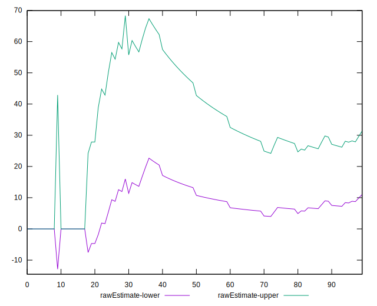
## Score Estimate

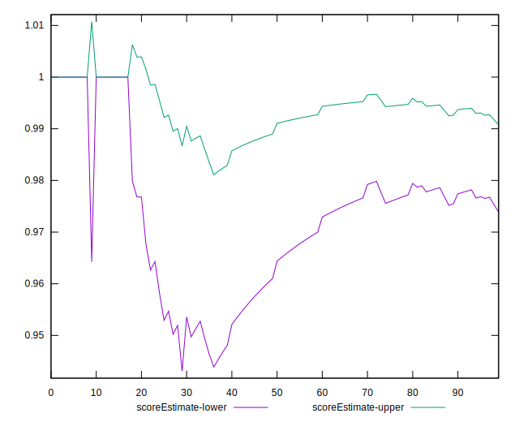
## P Score


```yaml
p90min: 0.875
p90max: 1
p90range: 0.125
p90mean: 0.9823260073260073
p90median: 1
p90stdev: 0.041212454049668515
p90skewness: -2.018683257248137
p90eccentricity: 1.0000000000000009
p90discretization: 11.375
outlandishness: 0.9713795755953397
confidence: 0.024394269530234602
p90confidence: 0.016935025949637472

```

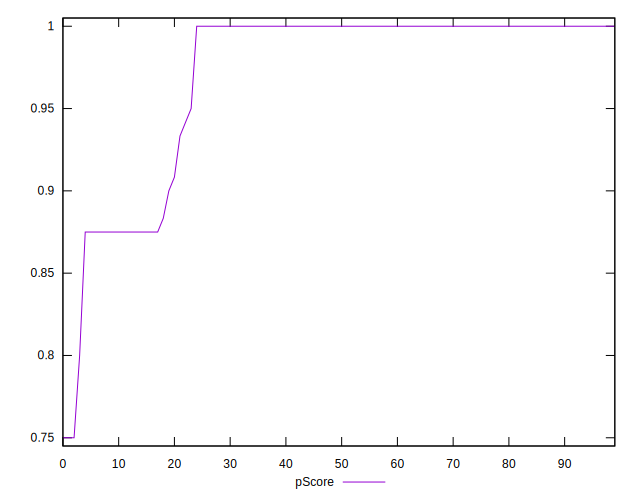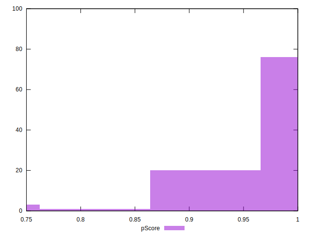
## Score Difference


```yaml
p90min: 0
p90max: 0
p90range: 0
p90mean: 0
p90median: 0
p90stdev: 0
p90skewness: .nan
p90eccentricity: .nan
p90discretization: 91
outlandishness: .inf
confidence: 6.092792000602806e-18
p90confidence: 0

```

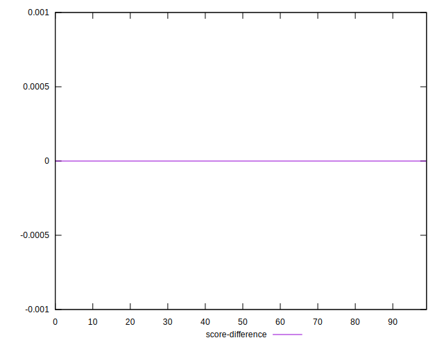
## P Score Difference


```yaml
p90min: -0.0050000000000000044
p90max: 0.0033333333333332993
p90range: 0.008333333333333304
p90mean: -0.00020146520146520247
p90median: 0
p90stdev: 0.0012799564256158365
p90skewness: -2.411029800899903
p90eccentricity: 0.9999999999999977
p90discretization: 18.2
outlandishness: 9.8824495867768
confidence: 0.0007203145410502418
p90confidence: 0.0005259598289411692

```

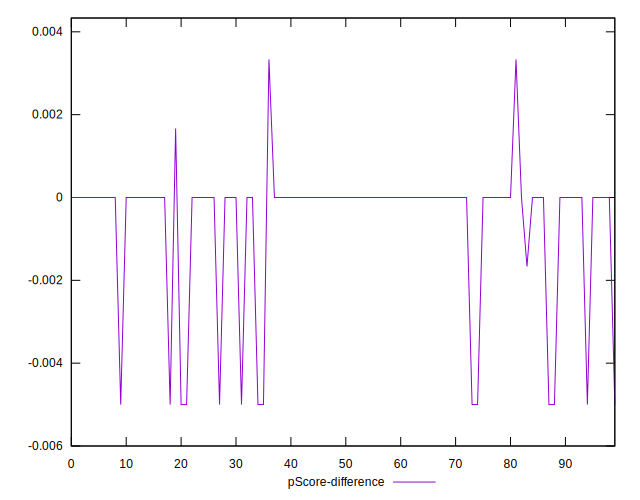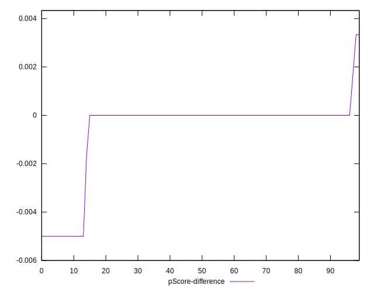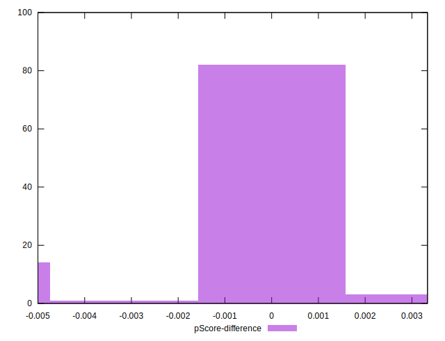