# //unminified-javascript/samples/pages

[→ Parent](../..)


## Raw


```yaml
p90min: 0
p90max: 150
p90range: 150
p90mean: 34.61538461538461
p90median: 0
p90stdev: 63.19875663521153
p90skewness: 1.2780193008453842
p90eccentricity: 0.9999999999999974
p90discretization: 45.5
outlandishness: 2.442621679012346
confidence: 34.85032016836708
p90confidence: 25.969639718912603

```

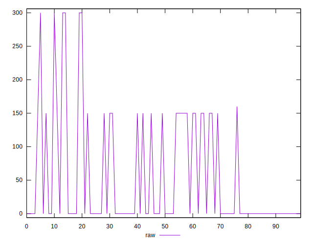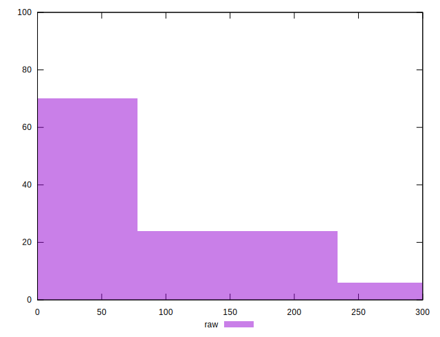
## Score


```yaml
p90min: 0.88
p90max: 1
p90range: 0.12
p90mean: 0.9723076923076927
p90median: 1
p90stdev: 0.050559005308169175
p90skewness: -1.2780193008454008
p90eccentricity: 1.0000000000000013
p90discretization: 45.5
outlandishness: 0.9669392580941556
confidence: 0.02854770805413942
p90confidence: 0.020775711775130157

```

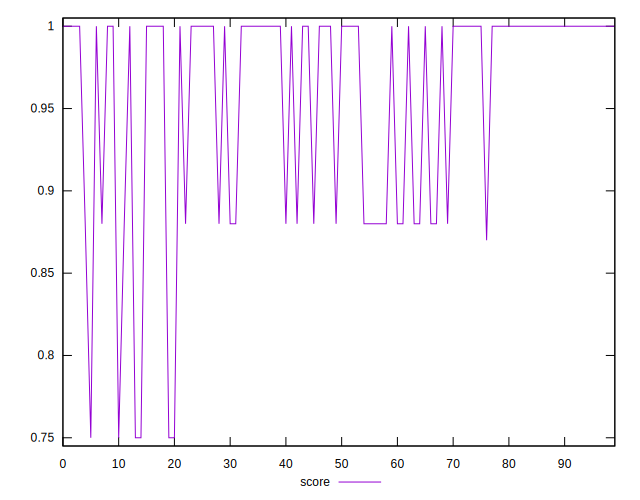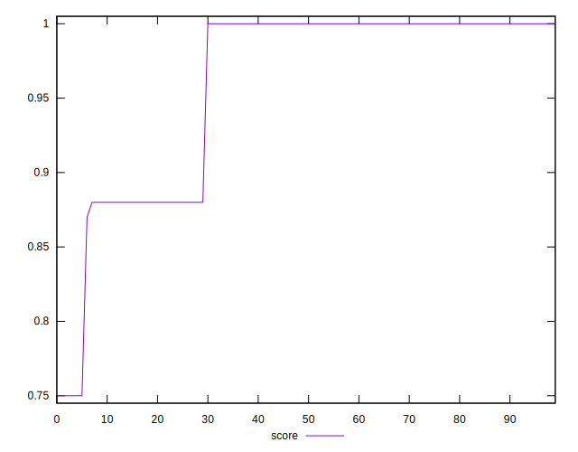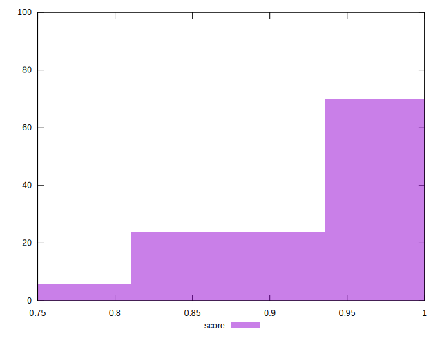
## Raw Estimate

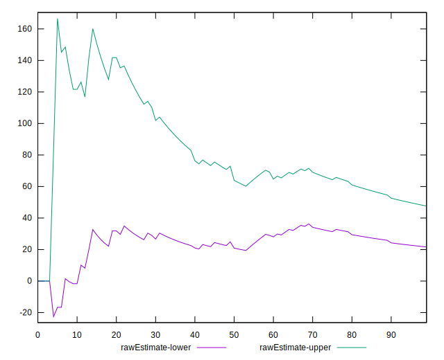
## Score Estimate

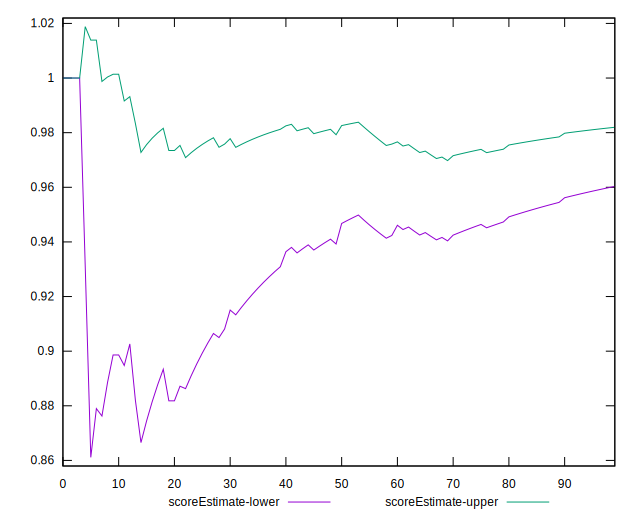
## P Score


```yaml
p90min: 0.875
p90max: 1
p90range: 0.125
p90mean: 0.9711538461538461
p90median: 1
p90stdev: 0.05266563052934292
p90skewness: -1.2780193008453855
p90eccentricity: 0.9999999999999978
p90discretization: 45.5
outlandishness: 0.9668405968478037
confidence: 0.029041933473639148
p90confidence: 0.02164136643242709

```

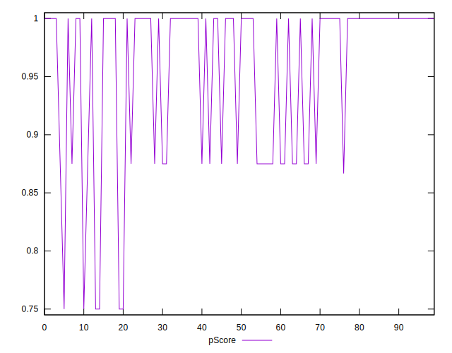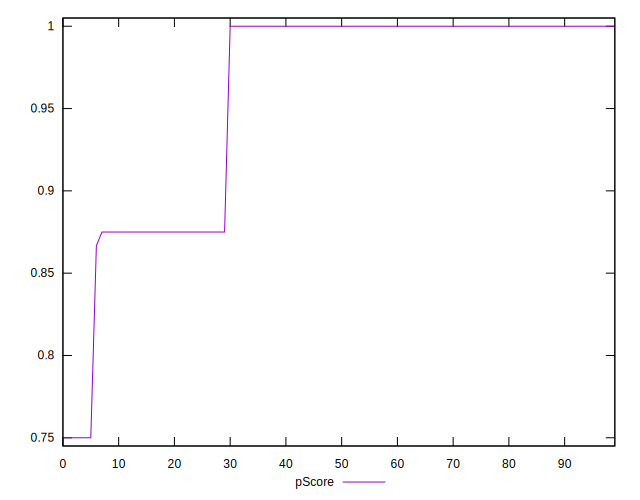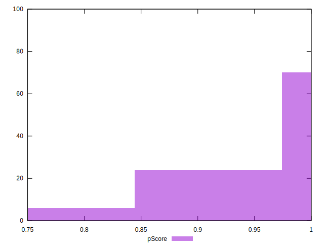
## Score Difference


```yaml
p90min: 0
p90max: 0
p90range: 0
p90mean: 0
p90median: 0
p90stdev: 0
p90skewness: .nan
p90eccentricity: .nan
p90discretization: 91
outlandishness: .nan
confidence: 0
p90confidence: 0

```


## P Score Difference


```yaml
p90min: -0.0050000000000000044
p90max: 0
p90range: 0.0050000000000000044
p90mean: -0.0008058608058608062
p90median: 0
p90stdev: 0.0018217690111074327
p90skewness: -1.8343629428152648
p90eccentricity: 0.9999999999999973
p90discretization: 30.333333333333332
outlandishness: 2.1562252582644637
confidence: 0.0008279156371510253
p90confidence: 0.0007486015135174404

```

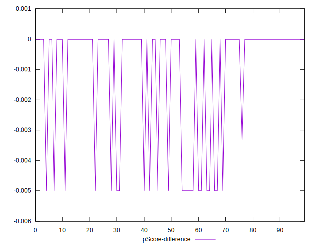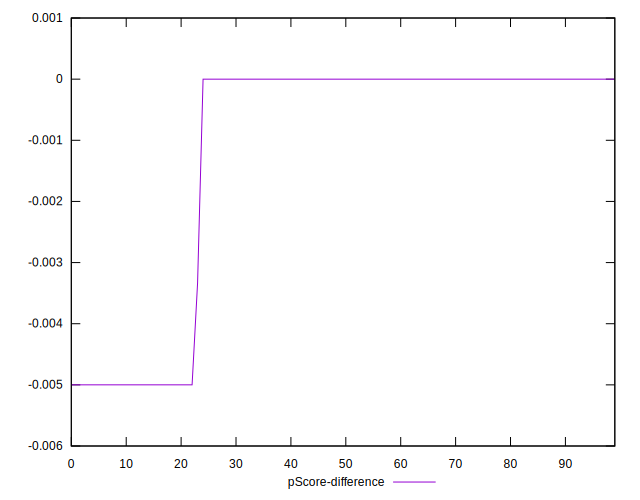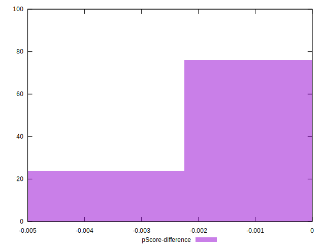