# //unused-css-rules/samples/pages+cached+noexternal+nomedia+nocss+nojs

[→ Parent](../..)


## Raw


```yaml
p90min: 0
p90max: 240
p90range: 240
p90mean: 104.06593406593407
p90median: 150
p90stdev: 71.78995647373769
p90skewness: -0.336682817899276
p90eccentricity: 0.9999999999999991
p90discretization: 5.352941176470588
outlandishness: 1.4129351388088212
confidence: 39.06835103670957
p90confidence: 29.49993645951963

```

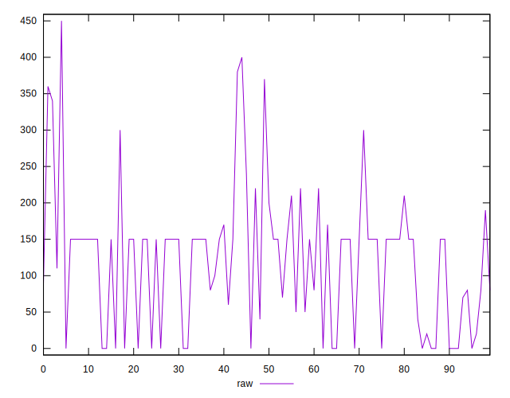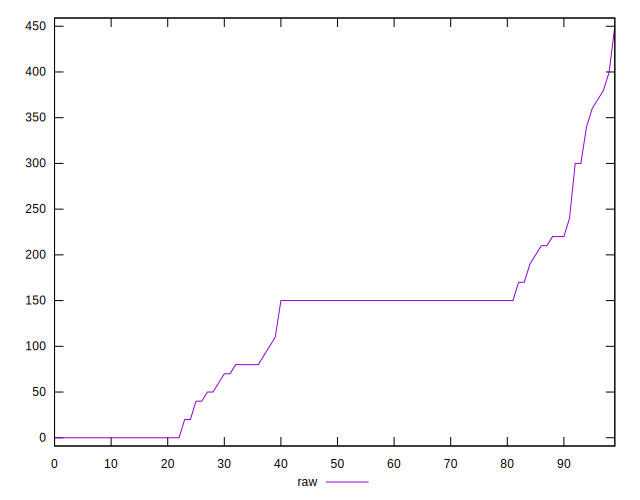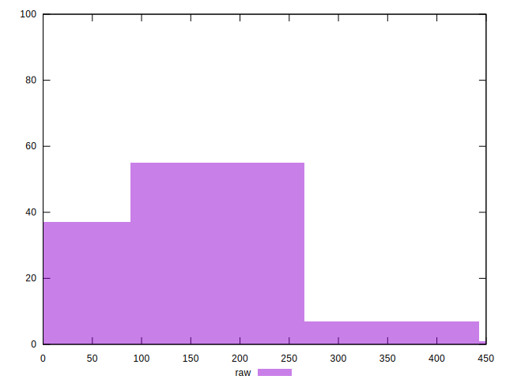
## Score


```yaml
p90min: 0.82
p90max: 1
p90range: 0.18000000000000005
p90mean: 0.9179120879120882
p90median: 0.88
p90stdev: 0.057388525167626936
p90skewness: 0.3310026860077382
p90eccentricity: 0.9999999999999996
p90discretization: 6.5
outlandishness: 0.9626351310956415
confidence: 0.030724934544548166
p90confidence: 0.02358209879358064

```

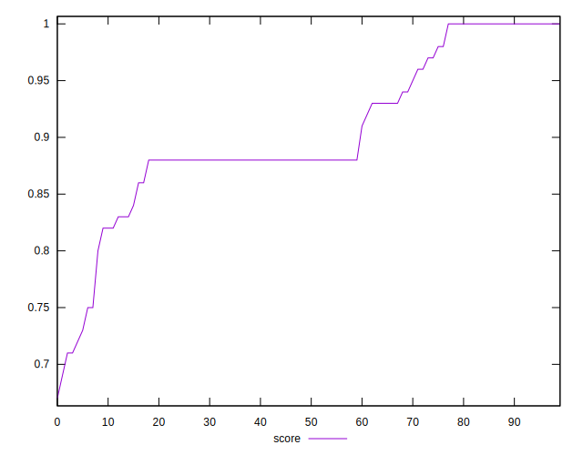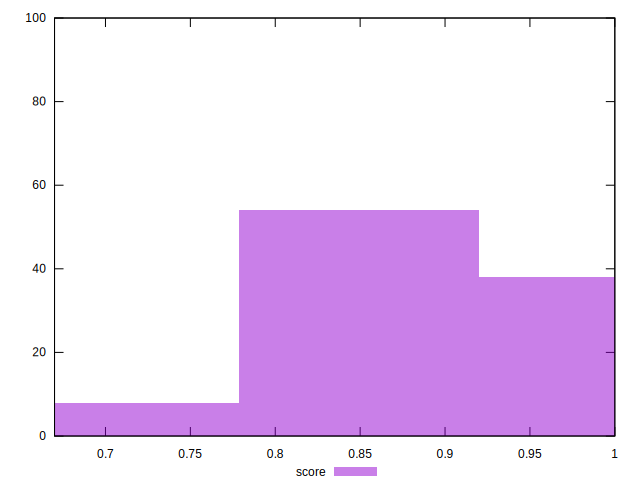
## Raw Estimate

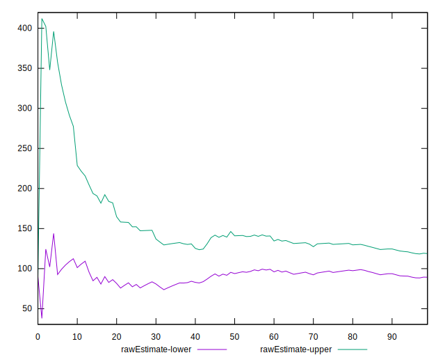
## Score Estimate

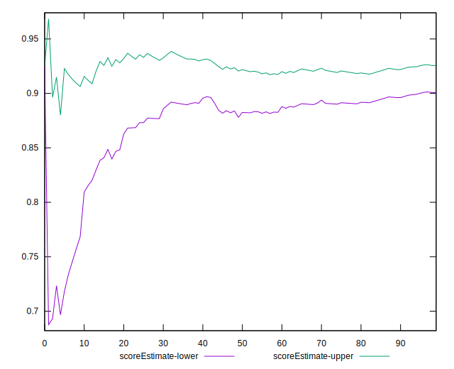
## P Score


```yaml
p90min: 0.8
p90max: 1
p90range: 0.19999999999999996
p90mean: 0.9132783882783888
p90median: 0.875
p90stdev: 0.05982496372811471
p90skewness: 0.3366828178992663
p90eccentricity: 1.0000000000000002
p90discretization: 5.352941176470588
outlandishness: 0.9674795853682553
confidence: 0.03111113718152847
p90confidence: 0.024583280382933115

```

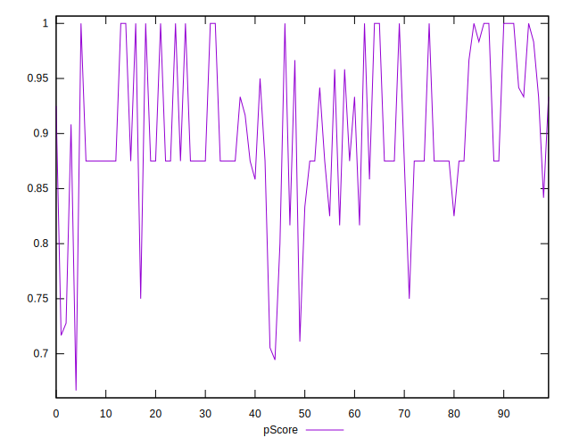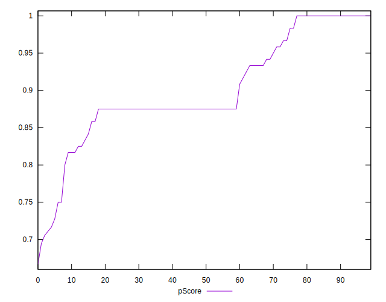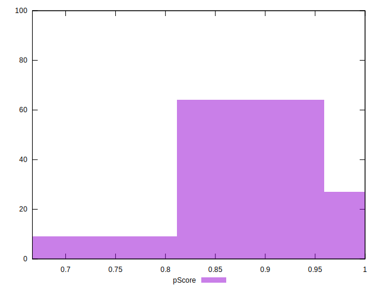
## Score Difference


```yaml
p90min: 0
p90max: 1.1102230246251565e-16
p90range: 1.1102230246251565e-16
p90mean: 1.2200253017858864e-18
p90median: 0
p90stdev: 1.1574176270033065e-17
p90skewness: 9.381423725166233
p90eccentricity: 1.0000000000000024
p90discretization: 45.5
outlandishness: 82.80999999999999
confidence: 1.3055982858434594e-17
p90confidence: 4.756061729361273e-18

```

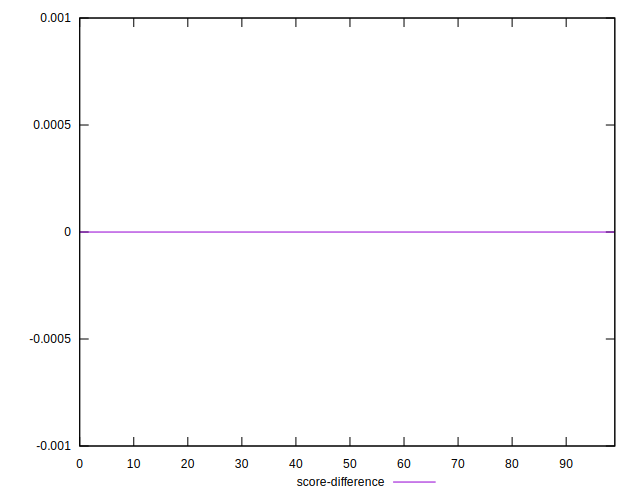
## P Score Difference


```yaml
p90min: -0.0050000000000000044
p90max: 0.0016666666666667052
p90range: 0.00666666666666671
p90mean: -0.0028632478632478592
p90median: -0.004444444444444362
p90stdev: 0.0023812497857523137
p90skewness: 0.4398513375828025
p90eccentricity: 1.0000000000000013
p90discretization: 9.1
outlandishness: 0.6421510581421266
confidence: 0.0011389610127207532
p90confidence: 0.000978503412237557

```

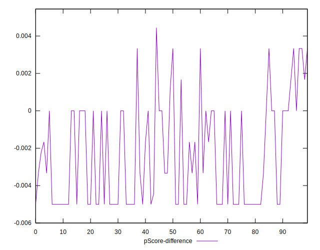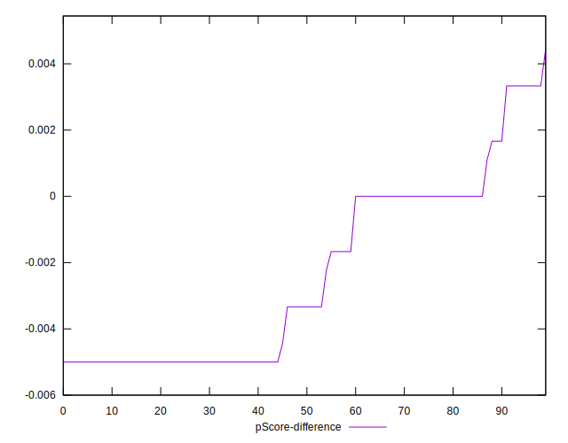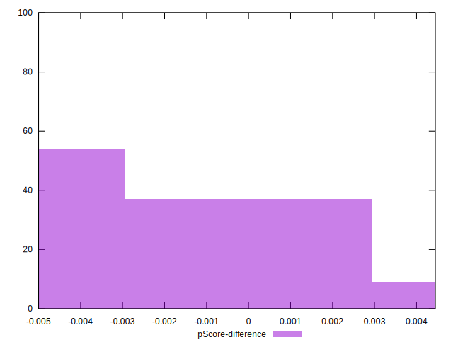