# //unused-css-rules/samples/pages+cached+noexternal+nomedia+nocss

[→ Parent](../..)


## Raw


```yaml
p90min: 0
p90max: 250
p90range: 250
p90mean: 116.7032967032967
p90median: 150
p90stdev: 69.69407159511756
p90skewness: -0.4235991297197945
p90eccentricity: 0.9999999999999996
p90discretization: 5.055555555555555
outlandishness: 1.2010880335400997
confidence: 33.31844232937584
p90confidence: 28.638695224913505

```

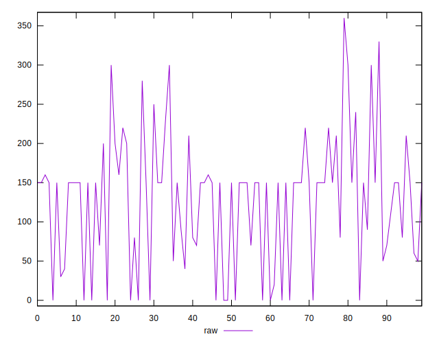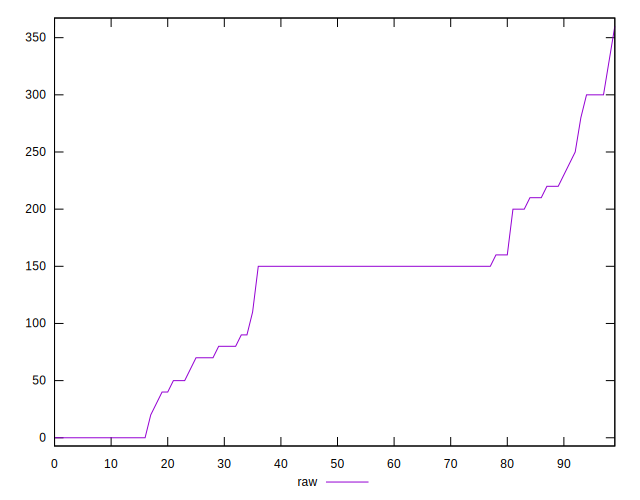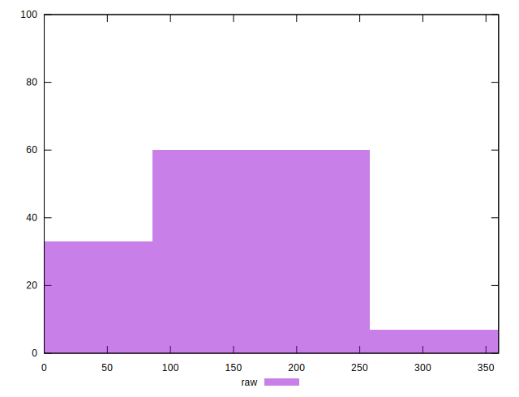
## Score


```yaml
p90min: 0.8
p90max: 1
p90range: 0.19999999999999996
p90mean: 0.9076923076923076
p90median: 0.88
p90stdev: 0.05631693913145578
p90skewness: 0.39745605190855243
p90eccentricity: 1
p90discretization: 6.5
outlandishness: 0.9746207303217461
confidence: 0.027236561075112853
p90confidence: 0.023141762546970535

```

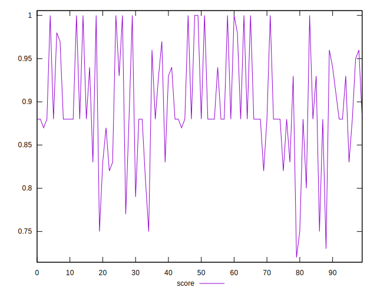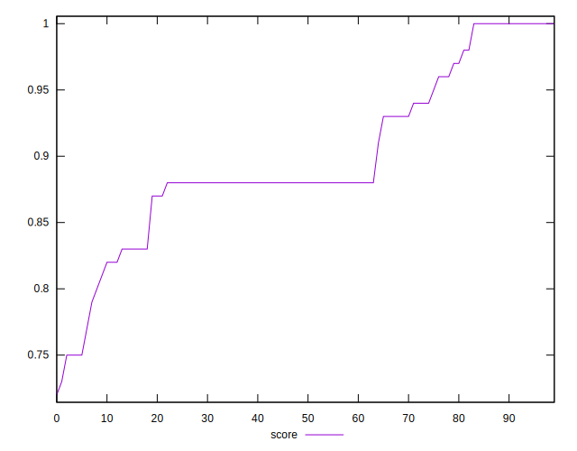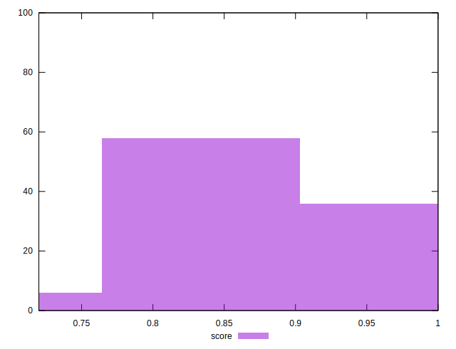
## Raw Estimate

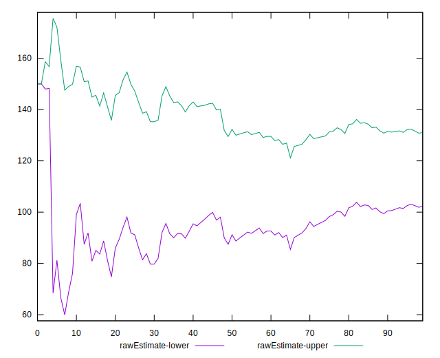
## Score Estimate

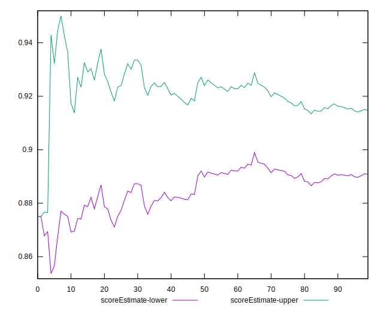
## P Score


```yaml
p90min: 0.7916666666666666
p90max: 1
p90range: 0.20833333333333337
p90mean: 0.9027472527472528
p90median: 0.875
p90stdev: 0.0580783929959313
p90skewness: 0.4235991297198156
p90eccentricity: 0.9999999999999997
p90discretization: 5.055555555555555
outlandishness: 0.9799835092437177
confidence: 0.02751762755326248
p90confidence: 0.0238655793540945

```

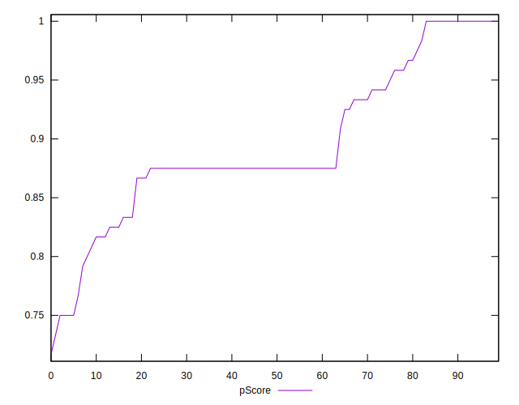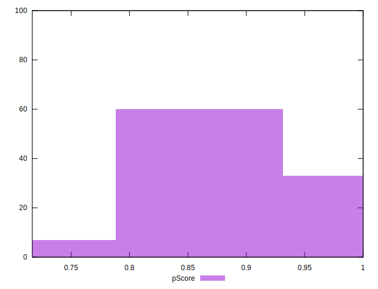
## Score Difference


```yaml
p90min: 0
p90max: 1.1102230246251565e-16
p90range: 1.1102230246251565e-16
p90mean: 6.1001265089294314e-18
p90median: 0
p90stdev: 2.529898312005902e-17
p90skewness: 3.906166859580323
p90eccentricity: 0.9999999999999974
p90discretization: 45.5
outlandishness: 6.4923040000000025
confidence: 1.5100855782713643e-17
p90confidence: 1.03958608026907e-17

```

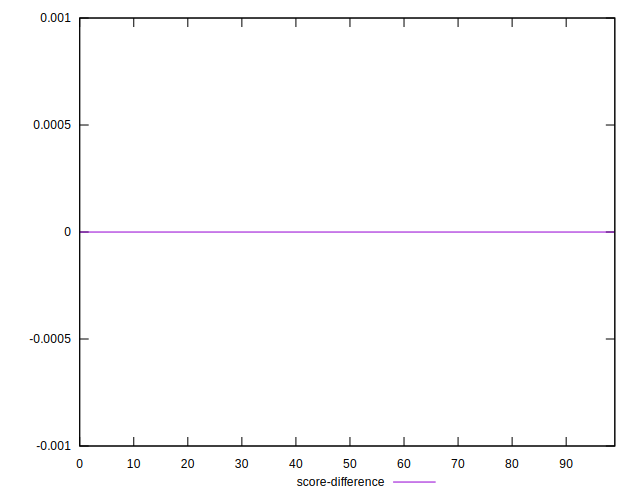
## P Score Difference


```yaml
p90min: -0.0050000000000000044
p90max: 0.0016666666666667052
p90range: 0.00666666666666671
p90mean: -0.003003663003663001
p90median: -0.0050000000000000044
p90stdev: 0.002385597047594349
p90skewness: 0.6170282649393884
p90eccentricity: 1.0000000000000013
p90discretization: 11.375
outlandishness: 0.6562975758477114
confidence: 0.0011406773362545967
p90confidence: 0.000980289789530596

```

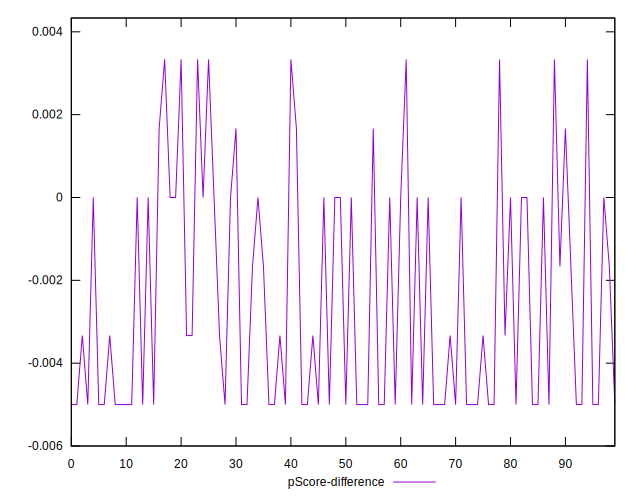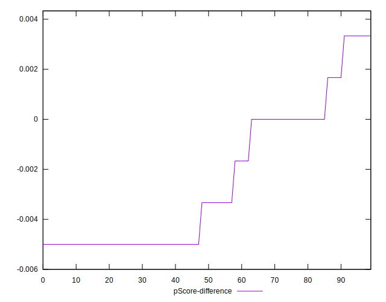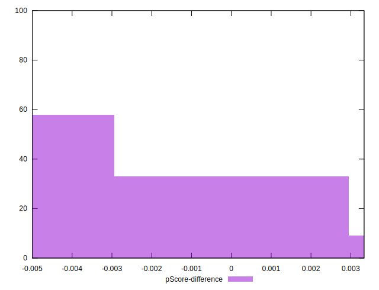