# //unused-css-rules/samples/pages+cached+noexternal+nomedia

[→ Parent](../..)


## Raw


```yaml
p90min: 0
p90max: 250
p90range: 250
p90mean: 112.63736263736264
p90median: 150
p90stdev: 68.88172958025514
p90skewness: -0.2561408138269683
p90eccentricity: 1
p90discretization: 7.583333333333333
outlandishness: 1.3443780336466387
confidence: 34.248686813951565
p90confidence: 28.30488755878676

```

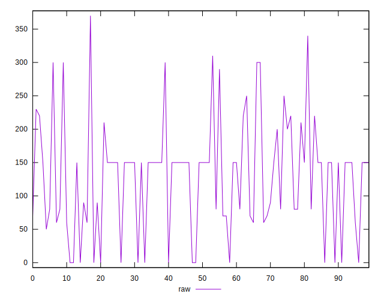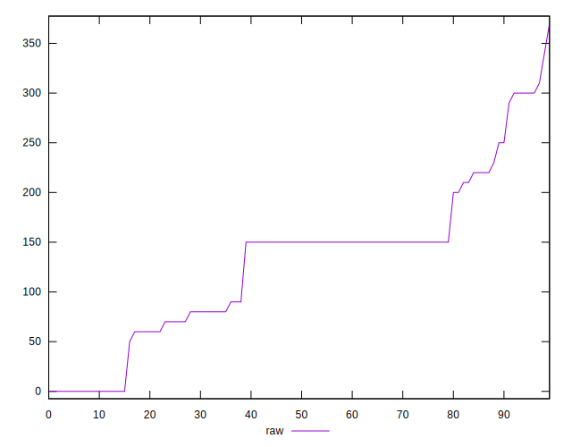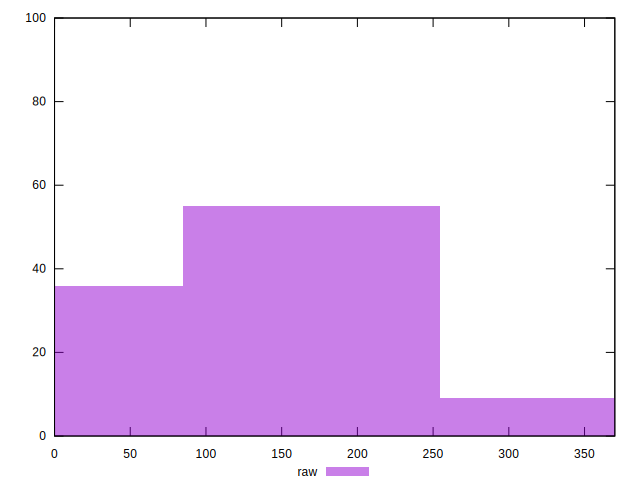
## Score


```yaml
p90min: 0.79
p90max: 1
p90range: 0.20999999999999996
p90mean: 0.9083516483516481
p90median: 0.88
p90stdev: 0.05587001665490359
p90skewness: 0.20630481776729834
p90eccentricity: 1
p90discretization: 9.1
outlandishness: 0.9675671083008832
confidence: 0.027962992381937335
p90confidence: 0.022958113115932877

```

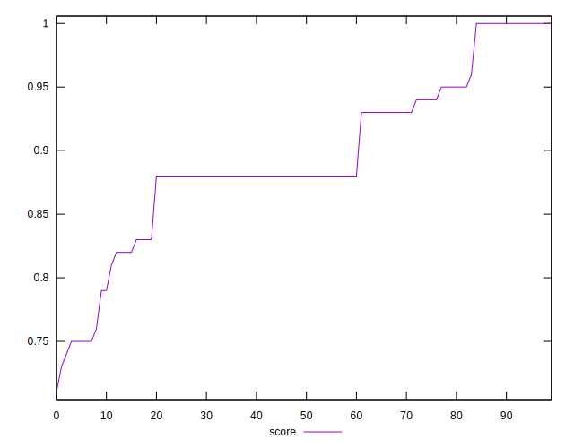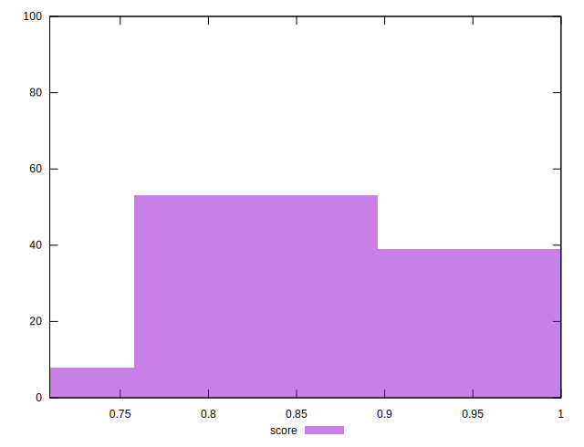
## Raw Estimate

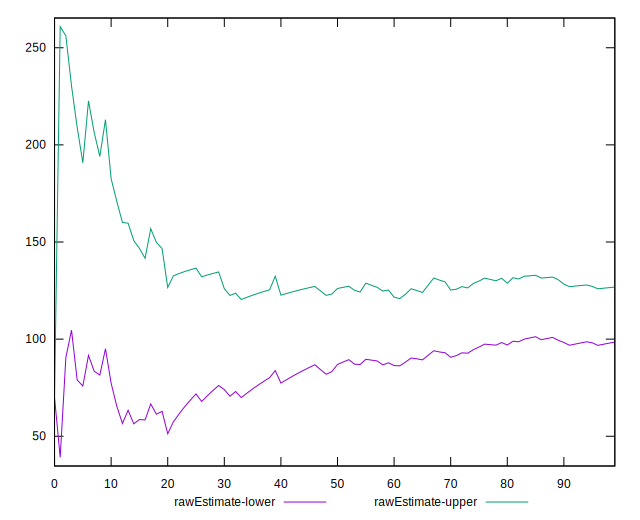
## Score Estimate

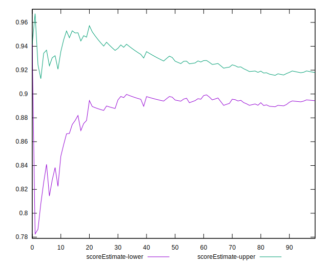
## P Score


```yaml
p90min: 0.7916666666666666
p90max: 1
p90range: 0.20833333333333337
p90mean: 0.9061355311355314
p90median: 0.875
p90stdev: 0.05740144131687932
p90skewness: 0.2561408138269675
p90eccentricity: 0.9999999999999992
p90discretization: 7.583333333333333
outlandishness: 0.9679576904888901
confidence: 0.02821654906902027
p90confidence: 0.023587406298988922

```

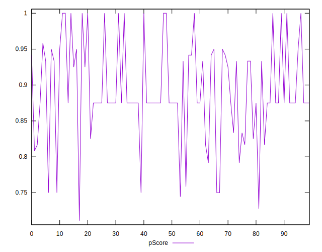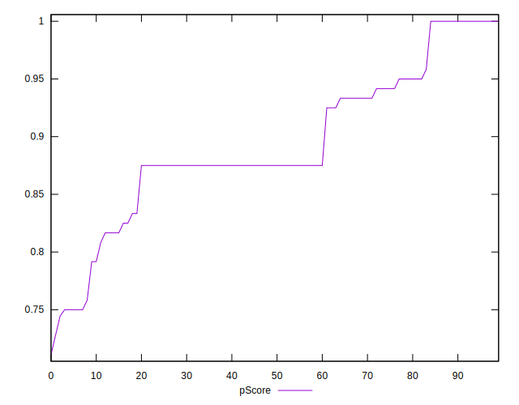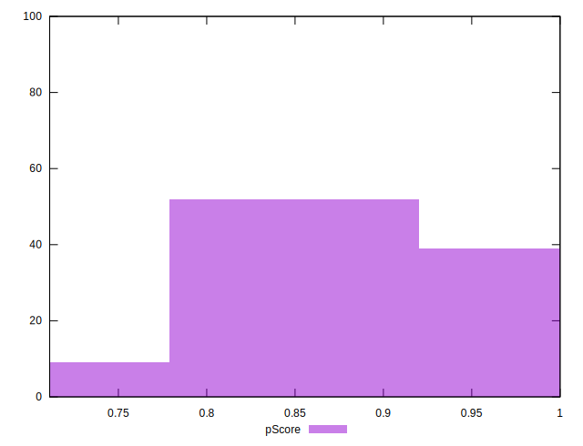
## Score Difference


```yaml
p90min: 0
p90max: 1.1102230246251565e-16
p90range: 1.1102230246251565e-16
p90mean: 1.2200253017858863e-17
p90median: 0
p90stdev: 3.47225288100993e-17
p90skewness: 2.4946857096883757
p90eccentricity: 0.9999999999999961
p90discretization: 45.5
outlandishness: 2.9894410000000002
confidence: 1.7072912966554697e-17
p90confidence: 1.4268185188083864e-17

```

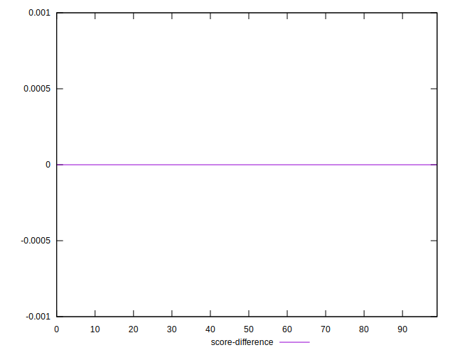
## P Score Difference


```yaml
p90min: -0.0050000000000000044
p90max: 0.0033333333333332993
p90range: 0.008333333333333304
p90mean: -0.00253968253968254
p90median: -0.0050000000000000044
p90stdev: 0.002700566546858653
p90skewness: 0.4084334300253531
p90eccentricity: 0.9999999999999997
p90discretization: 9.1
outlandishness: 0.6201562500000017
confidence: 0.0012140765944229368
p90confidence: 0.0011097170892724858

```

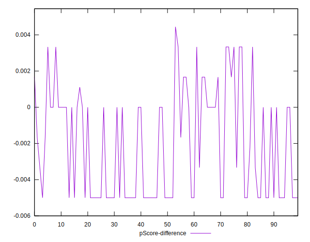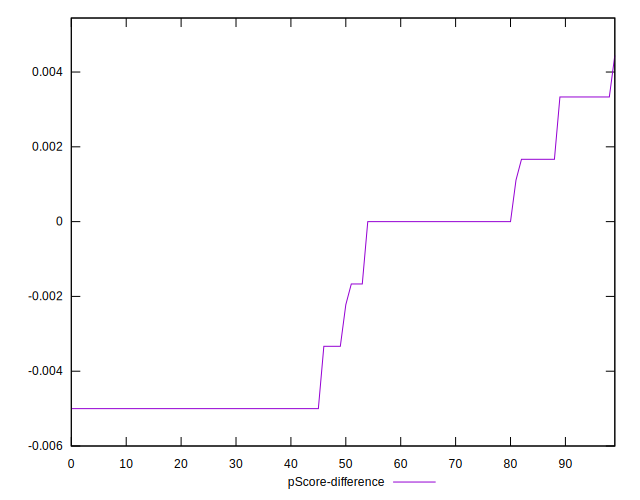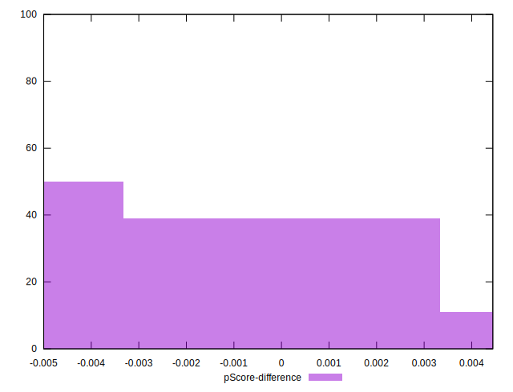