# //unused-css-rules/samples/pages+cached+noexternal

[→ Parent](../..)


## Raw


```yaml
p90min: 0
p90max: 240
p90range: 240
p90mean: 118.46153846153847
p90median: 150
p90stdev: 66.76057066439246
p90skewness: -0.7175719732986058
p90eccentricity: 0.9999999999999999
p90discretization: 7
outlandishness: 1.0693440082644625
confidence: 30.78765928105409
p90confidence: 27.433260714140573

```

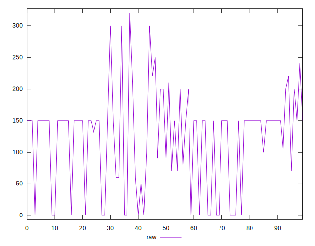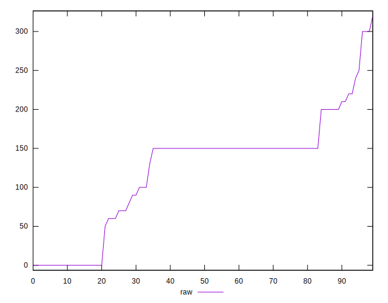
## Score


```yaml
p90min: 0.82
p90max: 1
p90range: 0.18000000000000005
p90mean: 0.9062637362637356
p90median: 0.88
p90stdev: 0.05426123931071643
p90skewness: 0.6651385114438757
p90eccentricity: 1.0000000000000018
p90discretization: 9.1
outlandishness: 0.9873206712924577
confidence: 0.02530327926663034
p90confidence: 0.02229703416057216

```

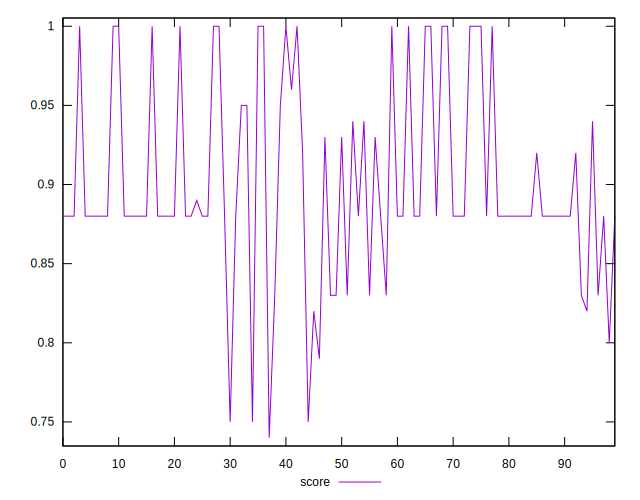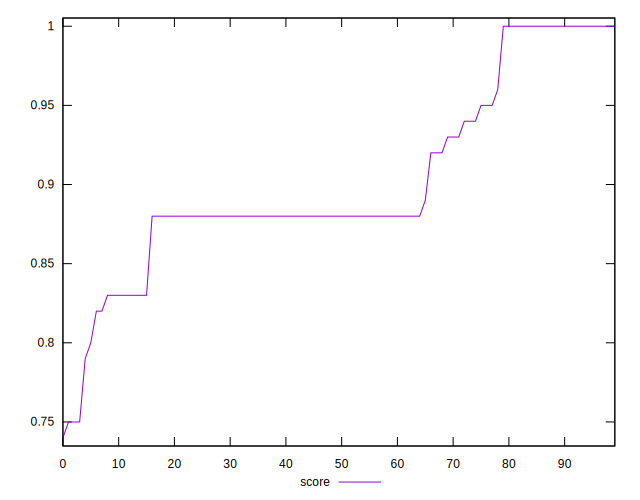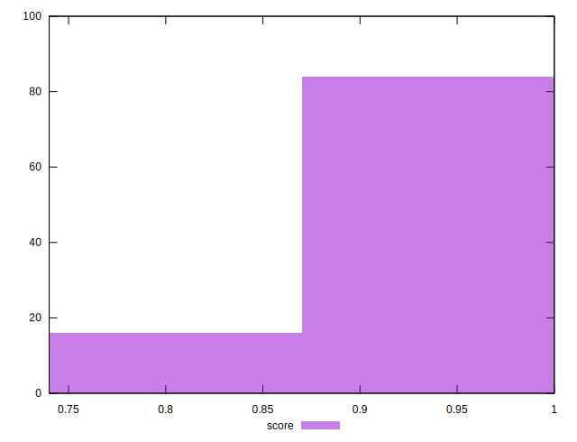
## Raw Estimate

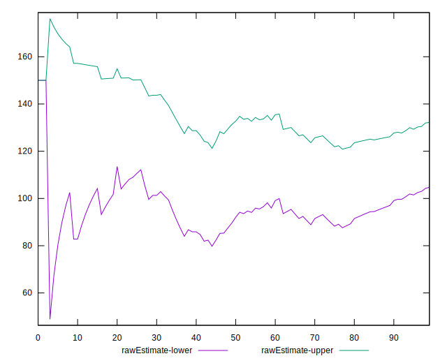
## Score Estimate


## P Score


```yaml
p90min: 0.8
p90max: 1
p90range: 0.19999999999999996
p90mean: 0.9012820512820513
p90median: 0.875
p90stdev: 0.05563380888699375
p90skewness: 0.7175719732985858
p90eccentricity: 0.9999999999999981
p90discretization: 7
outlandishness: 0.992668773068569
confidence: 0.025602479766196673
p90confidence: 0.022861050595117227

```

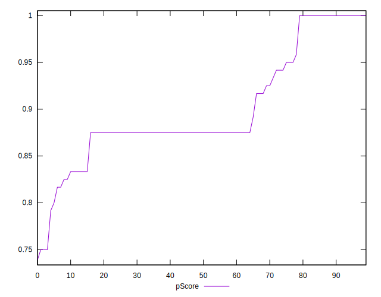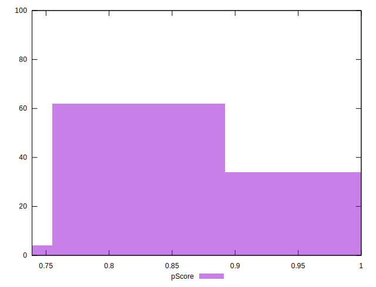
## Score Difference


```yaml
p90min: 0
p90max: 1.1102230246251565e-16
p90range: 1.1102230246251565e-16
p90mean: 8.540177112501205e-18
p90median: 0
p90stdev: 2.9584041328977917e-17
p90skewness: 3.1754264805429395
p90eccentricity: 1.0000000000000002
p90discretization: 45.5
outlandishness: 4.3264000000000005
confidence: 1.5954674592219342e-17
p90confidence: 1.2156677372271621e-17

```

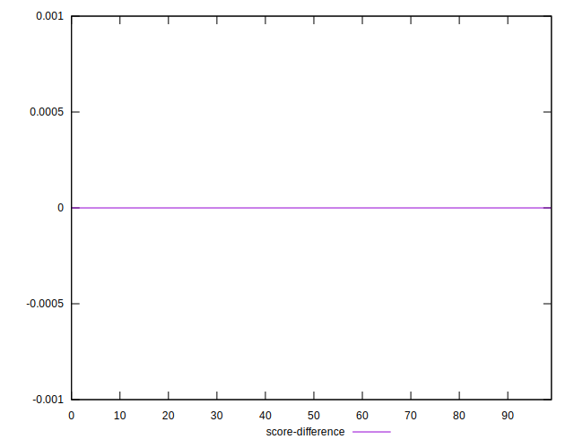
## P Score Difference


```yaml
p90min: -0.0050000000000000044
p90max: 0.0016666666666667052
p90range: 0.00666666666666671
p90mean: -0.003070818070818075
p90median: -0.0050000000000000044
p90stdev: 0.0024241871522658527
p90skewness: 0.5858224564284604
p90eccentricity: 1.000000000000001
p90discretization: 11.375
outlandishness: 0.6775940875621037
confidence: 0.0011342543869436806
p90confidence: 0.0009961472393981412

```

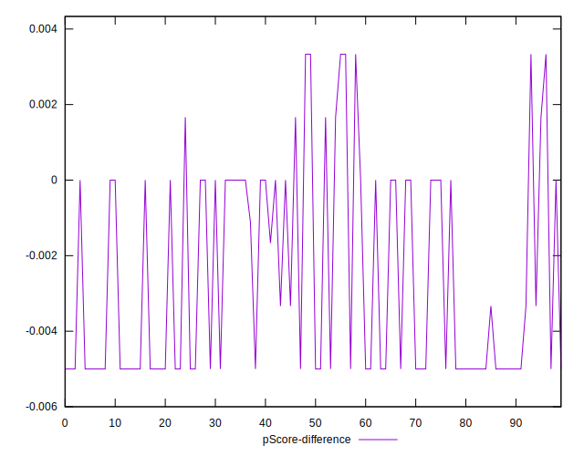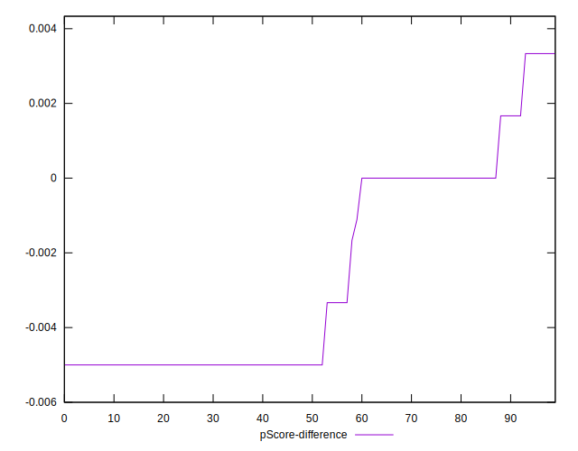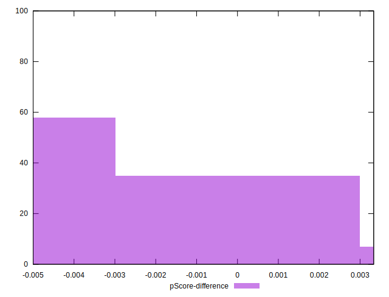