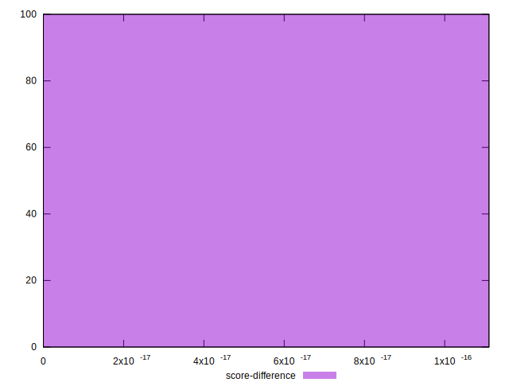

# //unused-css-rules/samples/pages+cached

[→ Parent](../..)


## Raw


```yaml
p90min: 0
p90max: 270
p90range: 270
p90mean: 122.74725274725274
p90median: 150
p90stdev: 72.24904933502754
p90skewness: -0.22284375201392218
p90eccentricity: 0.9999999999999992
p90discretization: 3.9565217391304346
outlandishness: 1.2457117839461596
confidence: 37.416323344414366
p90confidence: 29.688586946332833

```


## Score


```yaml
p90min: 0.78
p90max: 1
p90range: 0.21999999999999997
p90mean: 0.9000000000000006
p90median: 0.88
p90stdev: 0.05900270062733304
p90skewness: 0.17301467940950843
p90eccentricity: 0.9999999999999986
p90discretization: 4.7894736842105265
outlandishness: 0.9761439999999996
confidence: 0.029515157448125162
p90confidence: 0.024245395943137682

```


## Raw Estimate


## Score Estimate


## P Score


```yaml
p90min: 0.775
p90max: 1
p90range: 0.22499999999999998
p90mean: 0.8977106227106225
p90median: 0.875
p90stdev: 0.060207541112522946
p90skewness: 0.22284375201391526
p90eccentricity: 0.9999999999999999
p90discretization: 3.9565217391304346
outlandishness: 0.9763414151283719
confidence: 0.02983582396070461
p90confidence: 0.024740489121944043

```


## Score Difference


```yaml
p90min: 0
p90max: 1.1102230246251565e-16
p90range: 1.1102230246251565e-16
p90mean: 1.0980227716072976e-17
p90median: 0
p90stdev: 3.3143396957830586e-17
p90skewness: 2.687167134487934
p90eccentricity: 1.0000000000000002
p90discretization: 45.5
outlandishness: 3.3124000000000002
confidence: 1.6719816056870096e-17
p90confidence: 1.3619288161378298e-17

```


## P Score Difference


```yaml
p90min: -0.0050000000000000044
p90max: 0.0033333333333332993
p90range: 0.008333333333333304
p90mean: -0.002716727716727717
p90median: -0.0033333333333334103
p90stdev: 0.0025444769013431706
p90skewness: 0.5797371145933632
p90eccentricity: 0.9999999999999984
p90discretization: 8.272727272727273
outlandishness: 0.6393170362328007
confidence: 0.0011687352708928617
p90confidence: 0.0010455767157317919

```

