# //unused-css-rules/samples/pages

[→ Parent](../..)


## Raw


```yaml
p90min: 90
p90max: 600
p90range: 510
p90mean: 303.4065934065934
p90median: 300
p90stdev: 149.13832932954668
p90skewness: 0.5811523401810184
p90eccentricity: 1.0000000000000009
p90discretization: 8.272727272727273
outlandishness: 0.9881267257334628
confidence: 67.29665847995705
p90confidence: 61.28393796296564

```

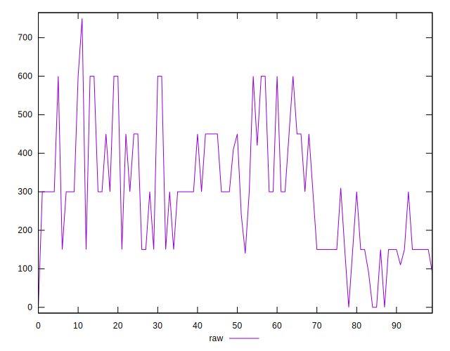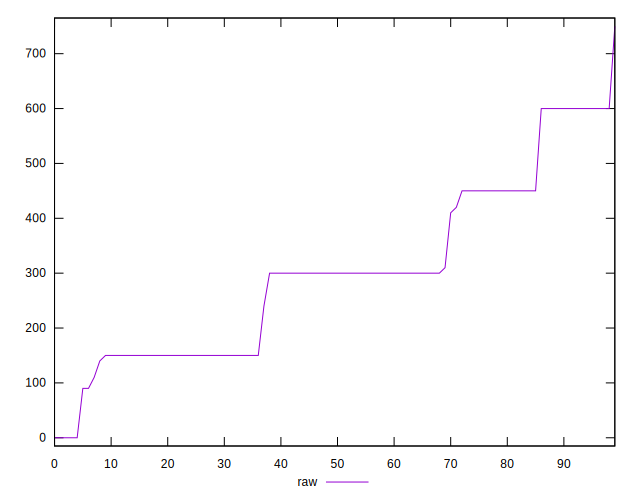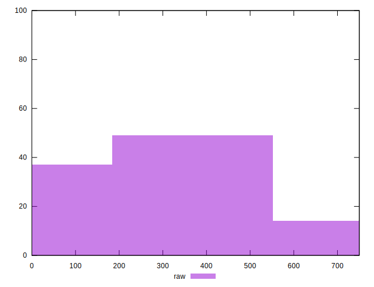
## Score


```yaml
p90min: 0.58
p90max: 0.93
p90range: 0.3500000000000001
p90mean: 0.7651648351648355
p90median: 0.75
p90stdev: 0.10213503921750773
p90skewness: -0.21416392011196894
p90eccentricity: 0.9999999999999988
p90discretization: 9.1
outlandishness: 1.009261615645974
confidence: 0.04633034820439441
p90confidence: 0.04196934104994532

```

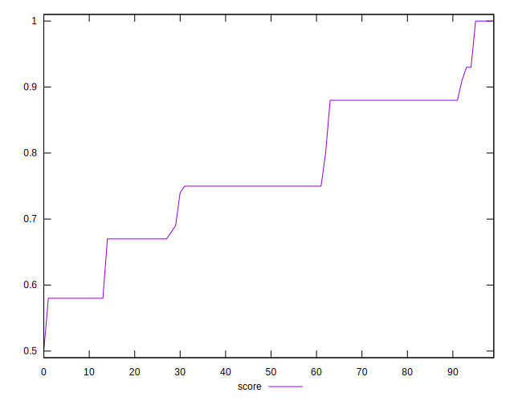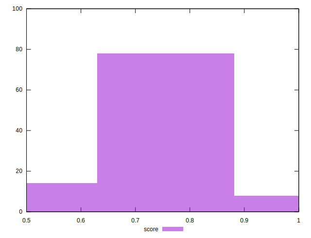
## Raw Estimate

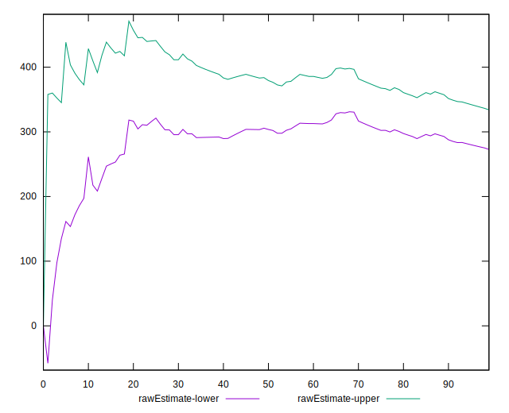
## Score Estimate

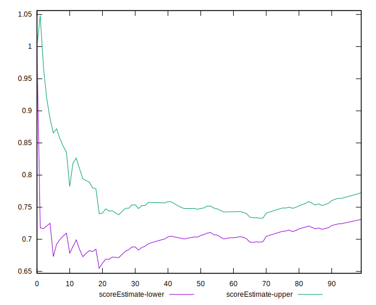
## P Score


```yaml
p90min: 0.5833333333333334
p90max: 0.925
p90range: 0.3416666666666667
p90mean: 0.7634615384615384
p90median: 0.75
p90stdev: 0.10004486433980375
p90skewness: -0.22010866085421202
p90eccentricity: 1.0000000000000007
p90discretization: 8.272727272727273
outlandishness: 1.0099490568432004
confidence: 0.04564459771391549
p90confidence: 0.04111044616951576

```

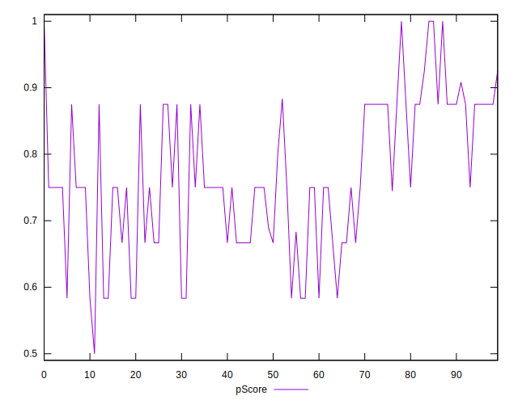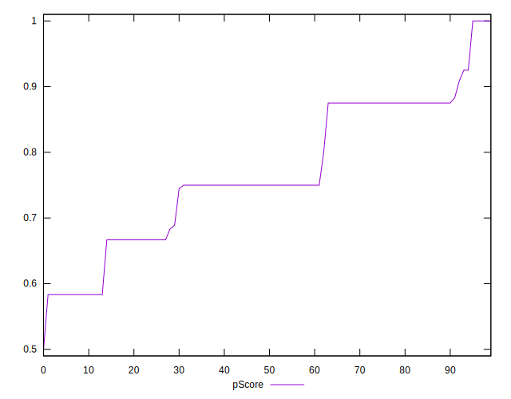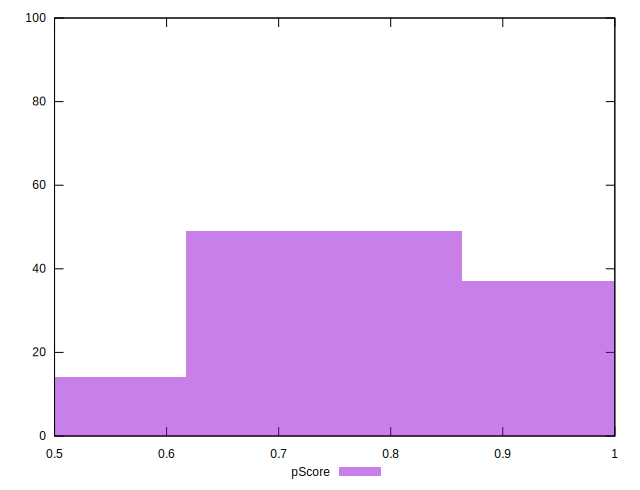
## Score Difference


```yaml
p90min: 0
p90max: 0
p90range: 0
p90mean: 0
p90median: 0
p90stdev: 0
p90skewness: .nan
p90eccentricity: .nan
p90discretization: 91
outlandishness: .inf
confidence: 4.330179641073933e-18
p90confidence: 0

```

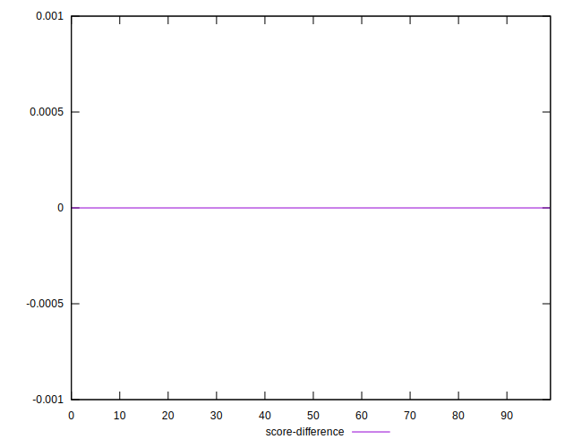
## P Score Difference


```yaml
p90min: -0.0050000000000000044
p90max: 0.0033333333333334103
p90range: 0.008333333333333415
p90mean: -0.001935286935286945
p90median: -0.0011111111111110628
p90stdev: 0.002665448741718168
p90skewness: 0.23092225825742016
p90eccentricity: 0.9999999999999996
p90discretization: 13
outlandishness: 0.5613649265093655
confidence: 0.0011666232853860467
p90confidence: 0.0010952864770931753

```

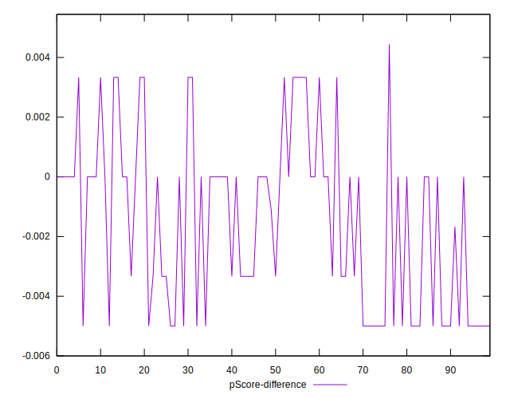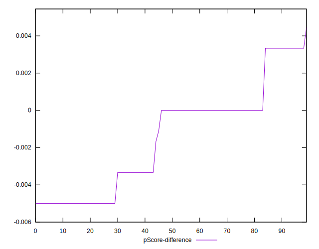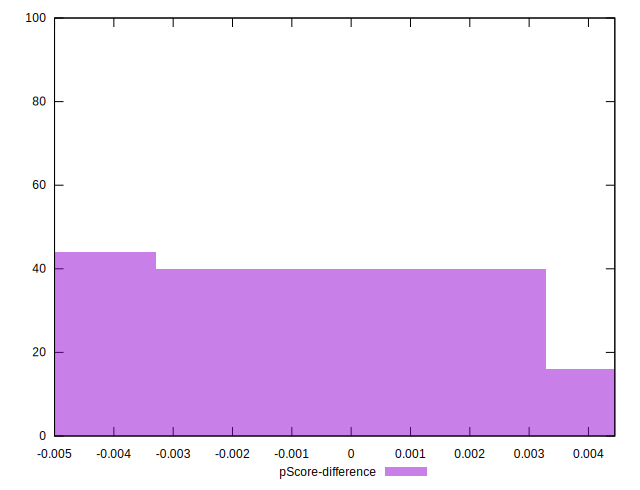