# //unused-javascript/samples/pages+cached+noexternal+nomedia+nocss+nojs

[→ Parent](../..)


## Raw


```yaml
p90min: 5500
p90max: 7640
p90range: 2140
p90mean: 6773.076923076923
p90median: 6890
p90stdev: 549.4046574241283
p90skewness: -0.6308873135158725
p90eccentricity: 0.9999999999999999
p90discretization: 1.2133333333333334
outlandishness: 0.9584576780964044
confidence: 371.14622202197097
p90confidence: 225.7614195727365

```

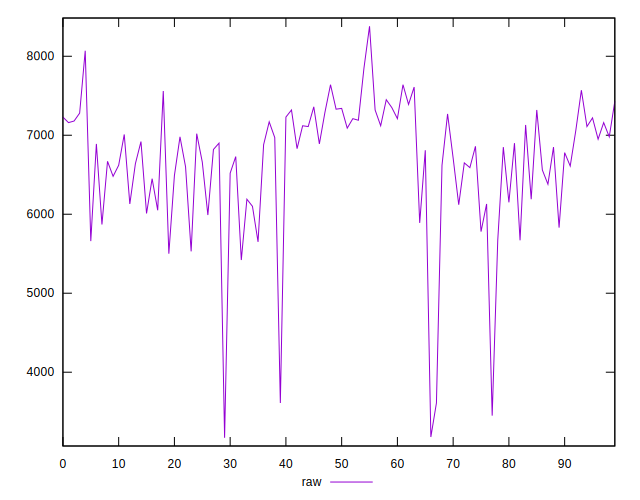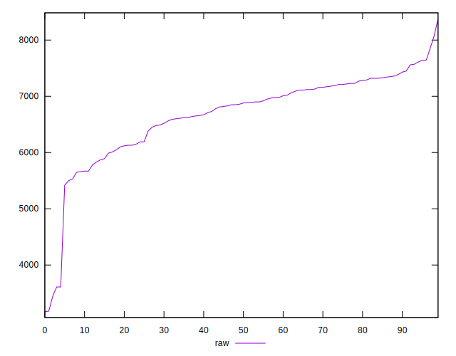
## Score


```yaml
p90min: 0
p90max: 0
p90range: 0
p90mean: 0
p90median: 0
p90stdev: 0
p90skewness: .nan
p90eccentricity: .nan
p90discretization: 91
outlandishness: .inf
confidence: 0.016040649874416574
p90confidence: 0

```

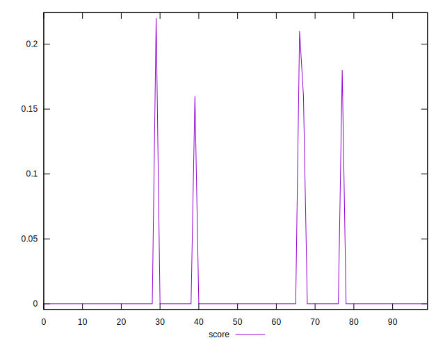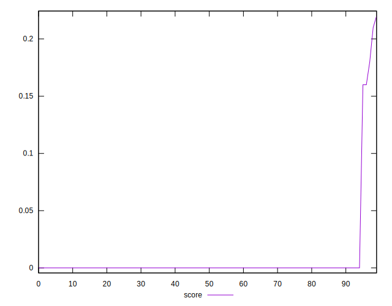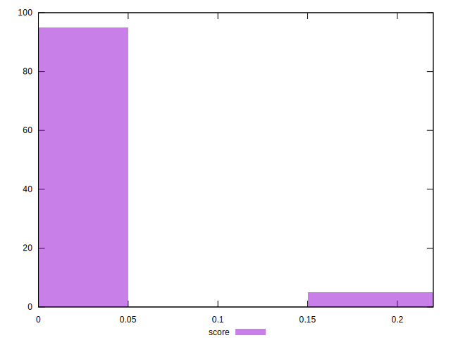
## Raw Estimate

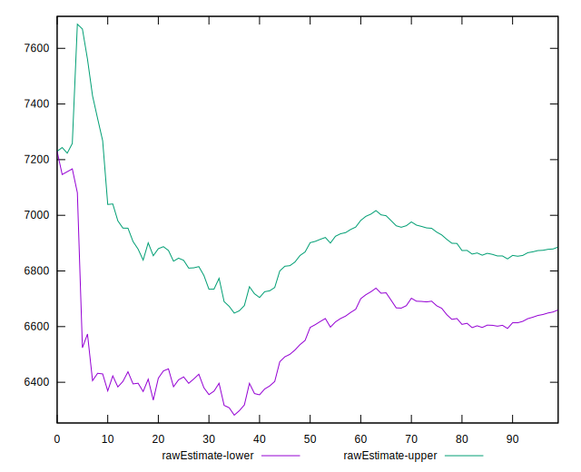
## Score Estimate


## P Score


```yaml
p90min: 0
p90max: 0
p90range: 0
p90mean: 0
p90median: 0
p90stdev: 0
p90skewness: .nan
p90eccentricity: .nan
p90discretization: 91
outlandishness: .inf
confidence: 0.016167997488495223
p90confidence: 0

```

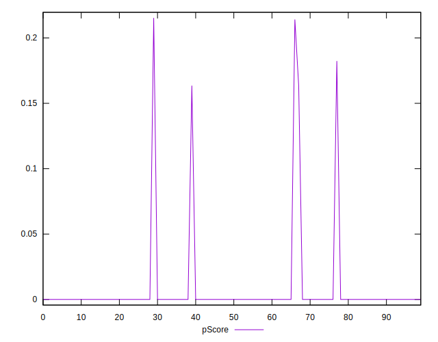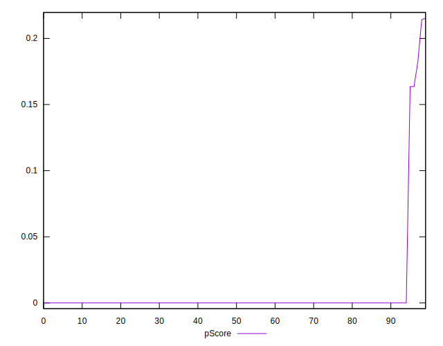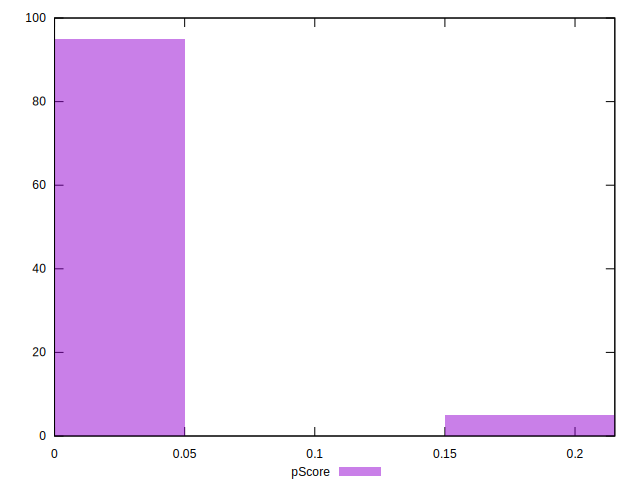
## Score Difference


```yaml
p90min: 0
p90max: 0
p90range: 0
p90mean: 0
p90median: 0
p90stdev: 0
p90skewness: .nan
p90eccentricity: .nan
p90discretization: 91
outlandishness: .nan
confidence: 0
p90confidence: 0

```


## P Score Difference


```yaml
p90min: 0
p90max: 0
p90range: 0
p90mean: 0
p90median: 0
p90stdev: 0
p90skewness: .nan
p90eccentricity: .nan
p90discretization: 91
outlandishness: .inf
confidence: 0.0003250743733082083
p90confidence: 0

```

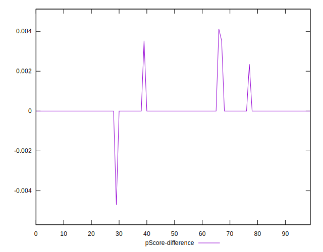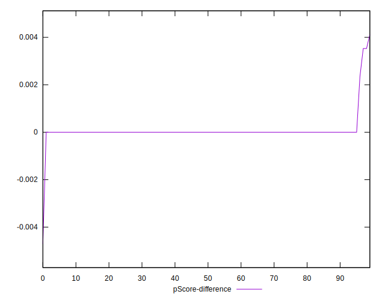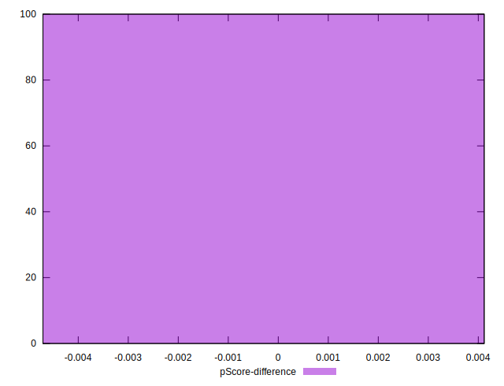