# //unused-javascript/samples/pages+cached+noexternal+nomedia

[→ Parent](../..)


## Raw


```yaml
p90min: 5580
p90max: 7770
p90range: 2190
p90mean: 6903.626373626374
p90median: 7160
p90stdev: 556.9846536120872
p90skewness: -0.8781627527522966
p90eccentricity: 1.0000000000000009
p90discretization: 1.378787878787879
outlandishness: 0.9554794098991023
confidence: 296.92794827342186
p90confidence: 228.87619240297136

```

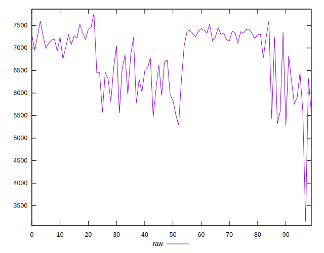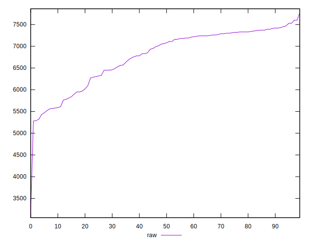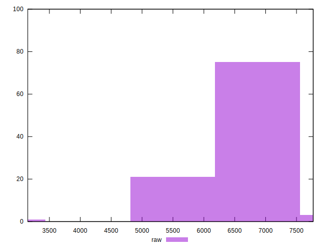
## Score


```yaml
p90min: 0
p90max: 0
p90range: 0
p90mean: 0
p90median: 0
p90stdev: 0
p90skewness: .nan
p90eccentricity: .nan
p90discretization: 91
outlandishness: .inf
confidence: 0.008580613983914655
p90confidence: 0

```

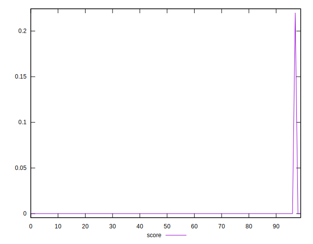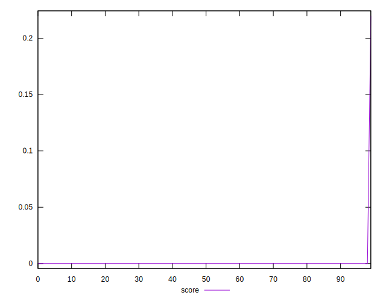
## Raw Estimate

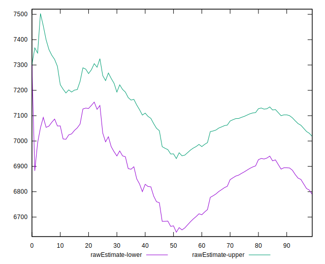
## Score Estimate


## P Score


```yaml
p90min: 0
p90max: 0
p90range: 0
p90mean: 0
p90median: 0
p90stdev: 0
p90skewness: .nan
p90eccentricity: .nan
p90discretization: 91
outlandishness: .inf
confidence: 0.00848884271135945
p90confidence: 0

```

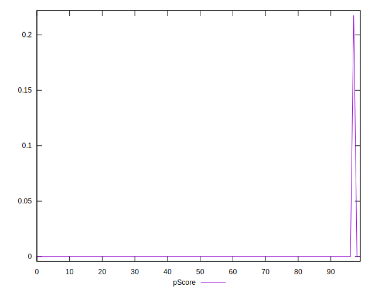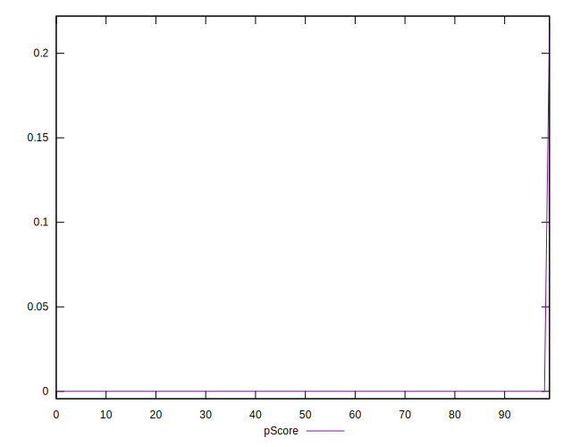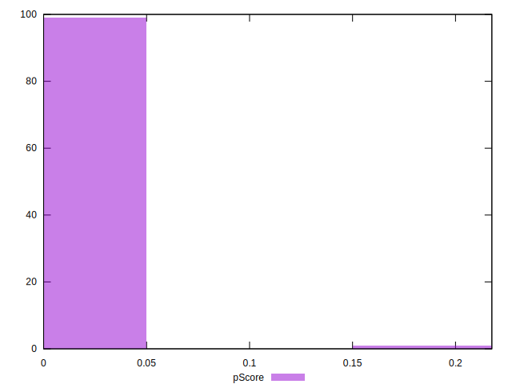
## Score Difference


```yaml
p90min: 0
p90max: 0
p90range: 0
p90mean: 0
p90median: 0
p90stdev: 0
p90skewness: .nan
p90eccentricity: .nan
p90discretization: 91
outlandishness: .nan
confidence: 0
p90confidence: 0

```


## P Score Difference


```yaml
p90min: 0
p90max: 0
p90range: 0
p90mean: 0
p90median: 0
p90stdev: 0
p90skewness: .nan
p90eccentricity: .nan
p90discretization: 91
outlandishness: .inf
confidence: 0.00009177127255523667
p90confidence: 0

```

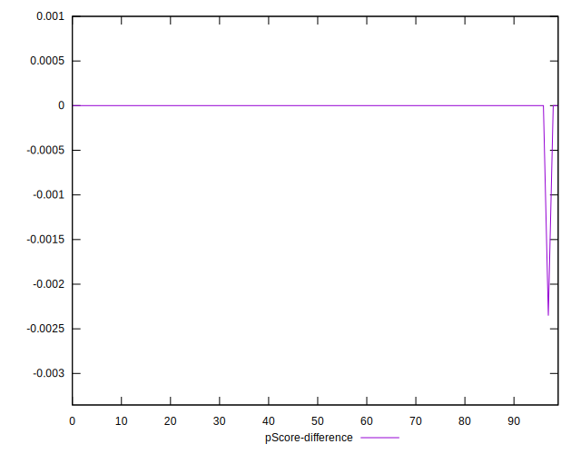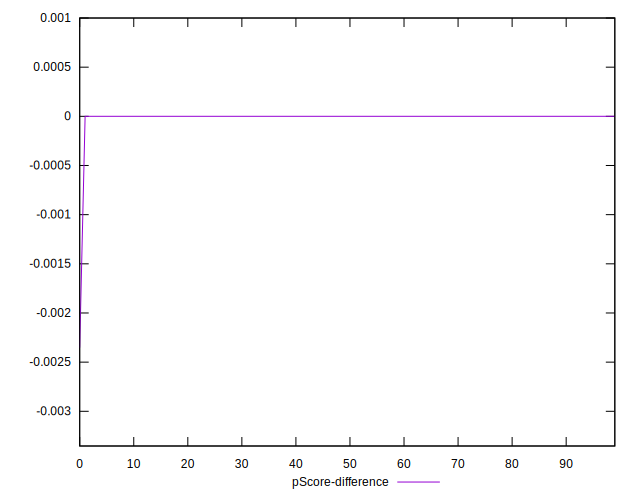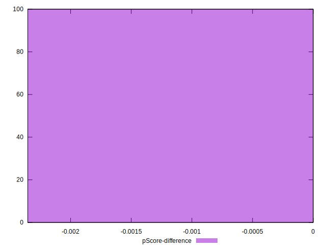