# //unused-javascript/samples/pages+cached+noexternal

[→ Parent](../..)


## Raw


```yaml
p90min: 5460
p90max: 7440
p90range: 1980
p90mean: 6612.307692307692
p90median: 6730
p90stdev: 583.7225686861659
p90skewness: -0.3328954282901086
p90eccentricity: 0.9999999999999997
p90discretization: 1.2133333333333334
outlandishness: 0.9539603425135134
confidence: 352.0392375746269
p90confidence: 239.86333927544365

```

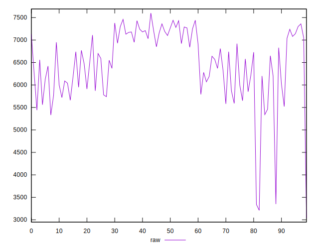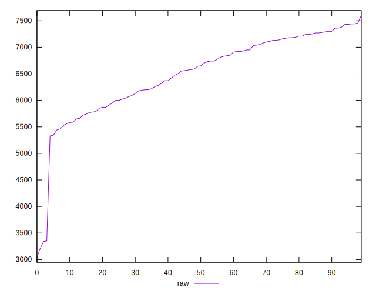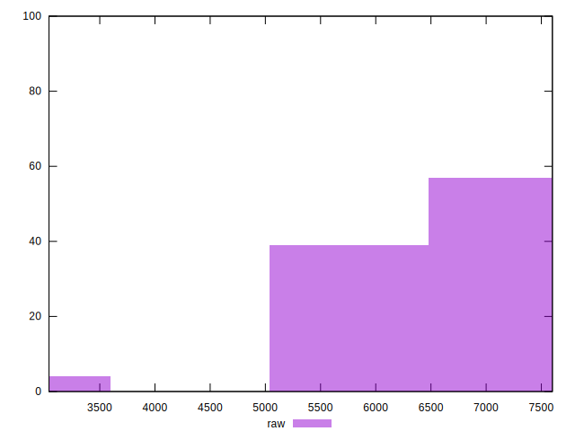
## Score


```yaml
p90min: 0
p90max: 0
p90range: 0
p90mean: 0
p90median: 0
p90stdev: 0
p90skewness: .nan
p90eccentricity: .nan
p90discretization: 91
outlandishness: .inf
confidence: 0.015981147794152804
p90confidence: 0

```

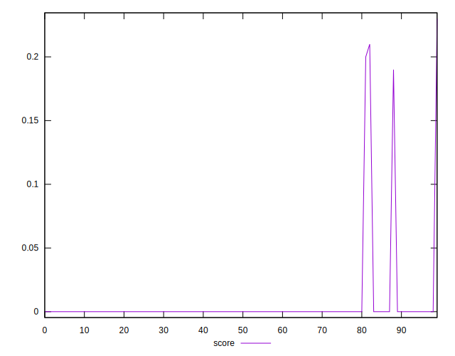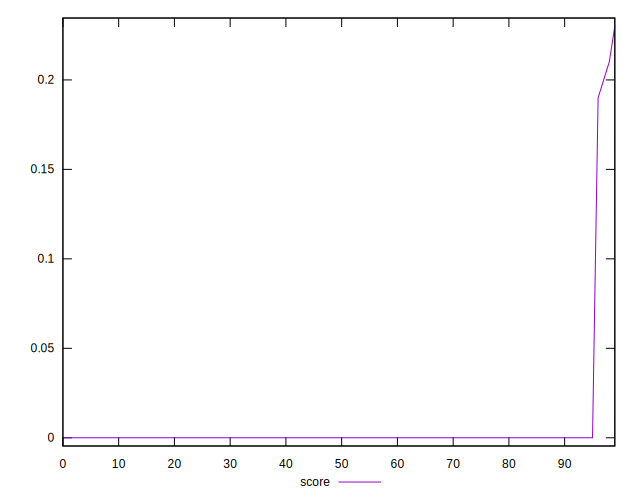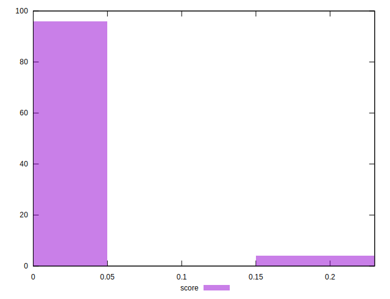
## Raw Estimate

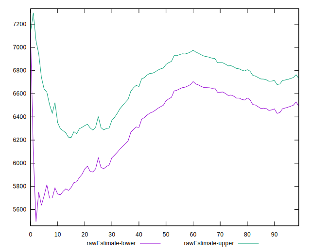
## Score Estimate


## P Score


```yaml
p90min: 0
p90max: 0
p90range: 0
p90mean: 0
p90median: 0
p90stdev: 0
p90skewness: .nan
p90eccentricity: .nan
p90discretization: 91
outlandishness: .inf
confidence: 0.01599220235765997
p90confidence: 0

```

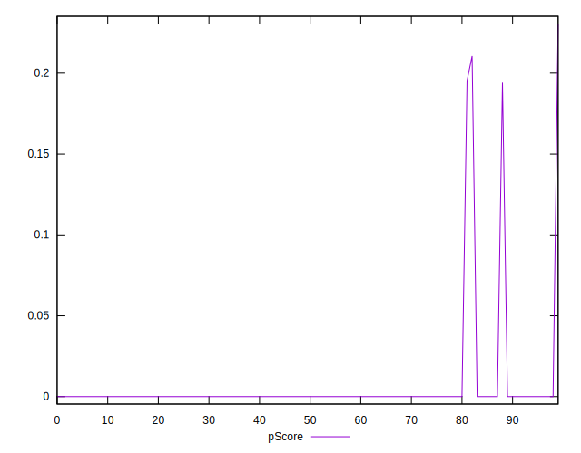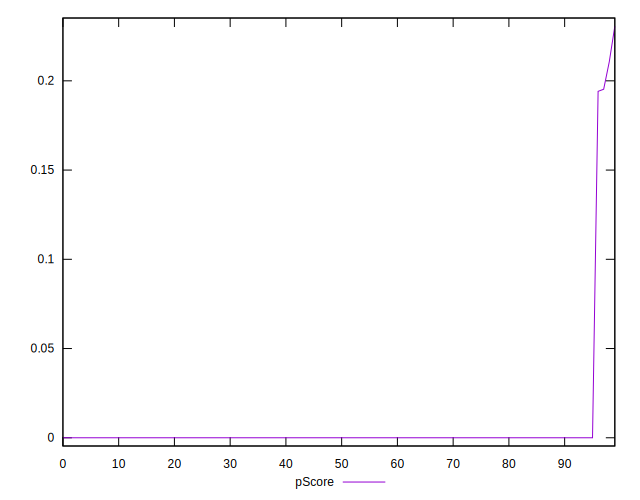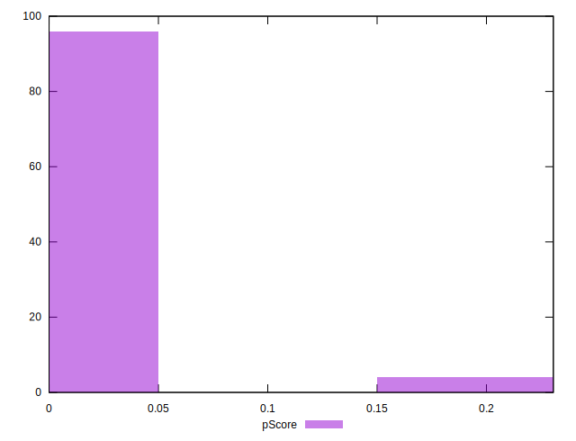
## Score Difference


```yaml
p90min: 0
p90max: 0
p90range: 0
p90mean: 0
p90median: 0
p90stdev: 0
p90skewness: .nan
p90eccentricity: .nan
p90discretization: 91
outlandishness: .nan
confidence: 0
p90confidence: 0

```


## P Score Difference


```yaml
p90min: 0
p90max: 0
p90range: 0
p90mean: 0
p90median: 0
p90stdev: 0
p90skewness: .nan
p90eccentricity: .nan
p90discretization: 91
outlandishness: .inf
confidence: 0.0002472630387902345
p90confidence: 0

```

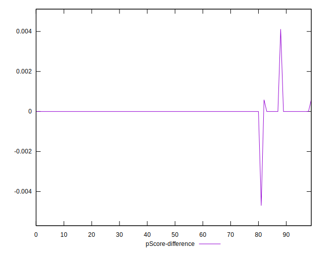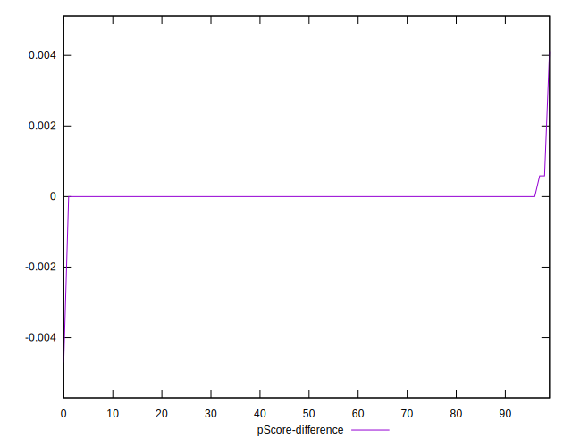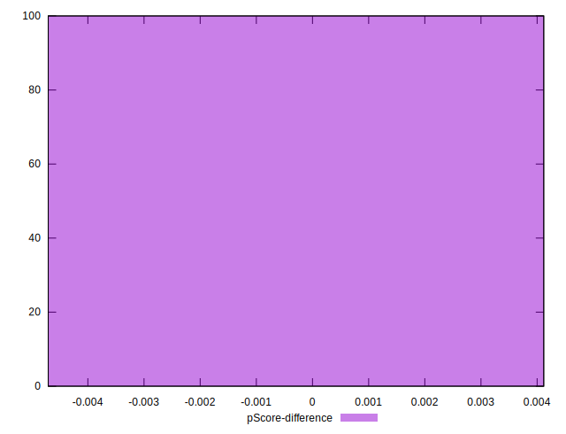