# //unused-javascript/samples/pages

[→ Parent](../..)


## Raw


```yaml
p90min: 450
p90max: 6490
p90range: 6040
p90mean: 2229.6703296703295
p90median: 1200
p90stdev: 1886.1644612371304
p90skewness: 1.3023606629213165
p90eccentricity: 1.0000000000000009
p90discretization: 2.676470588235294
outlandishness: 1.4139577551061606
confidence: 881.7028471297917
p90confidence: 775.0628986528832

```

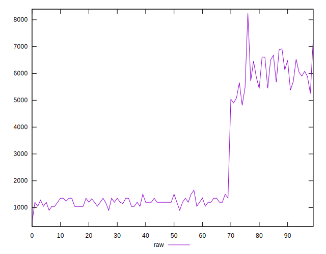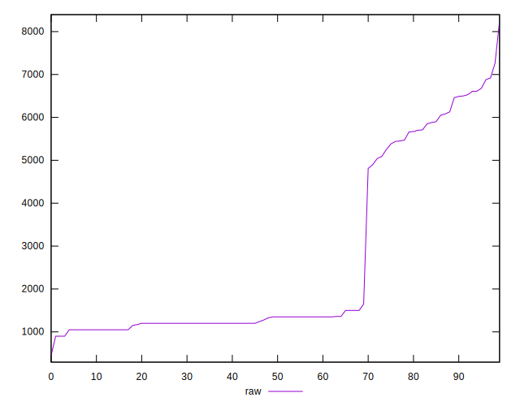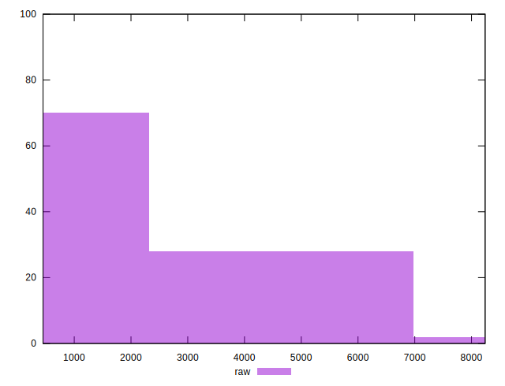
## Score


```yaml
p90min: 0
p90max: 0.48
p90range: 0.48
p90mean: 0.3376923076923075
p90median: 0.44
p90stdev: 0.19048276968068284
p90skewness: -1.1866702997158982
p90eccentricity: 0.9999999999999984
p90discretization: 9.1
outlandishness: 0.8646034422818482
confidence: 0.08098612925742488
p90confidence: 0.07827319973747437

```

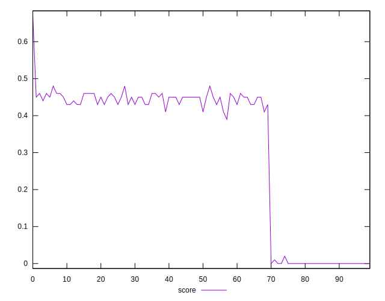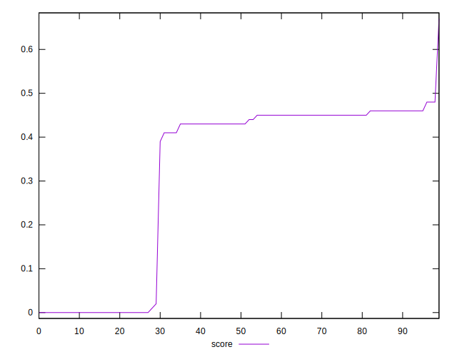
## Raw Estimate

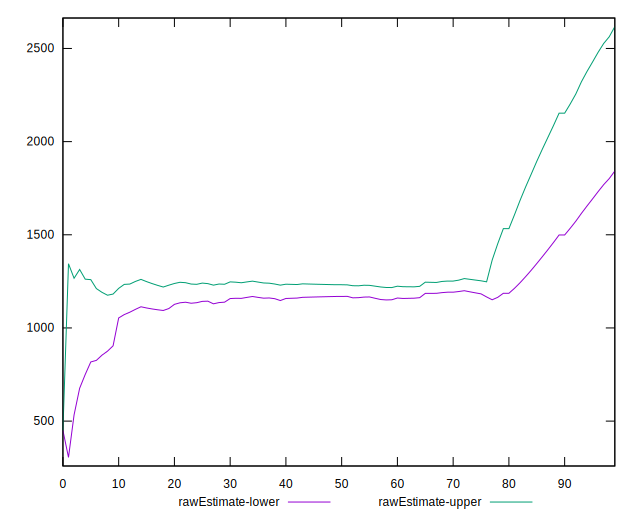
## Score Estimate

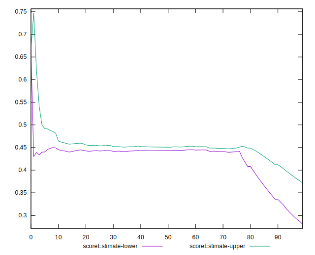
## P Score


```yaml
p90min: 0
p90max: 0.4823529411764706
p90range: 0.4823529411764706
p90mean: 0.3377504848093081
p90median: 0.4423529411764706
p90stdev: 0.19046311328945134
p90skewness: -1.1847727245118642
p90eccentricity: 0.9999999999999992
p90discretization: 6.066666666666666
outlandishness: 0.8644135612381684
confidence: 0.08095963326353983
p90confidence: 0.0782651225311235

```

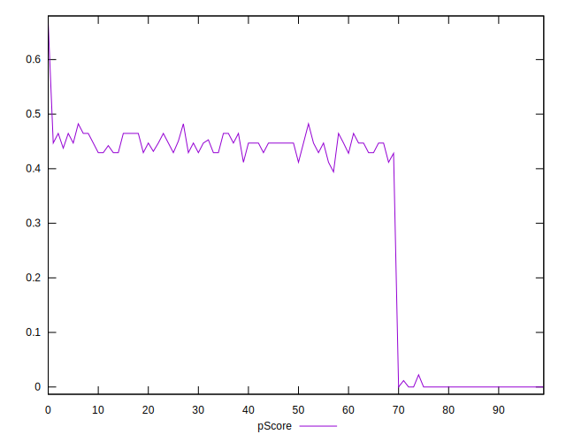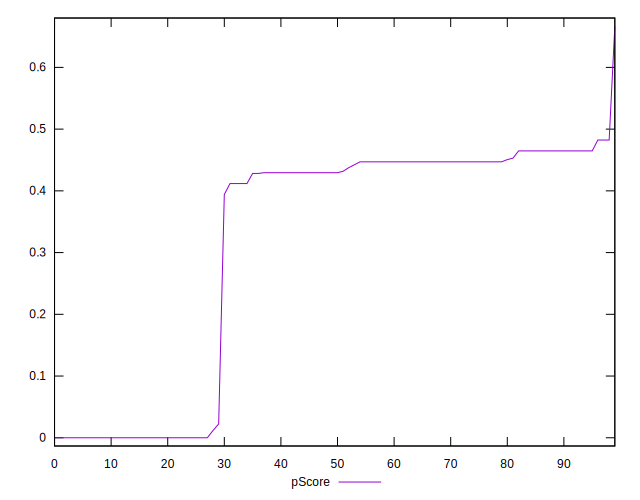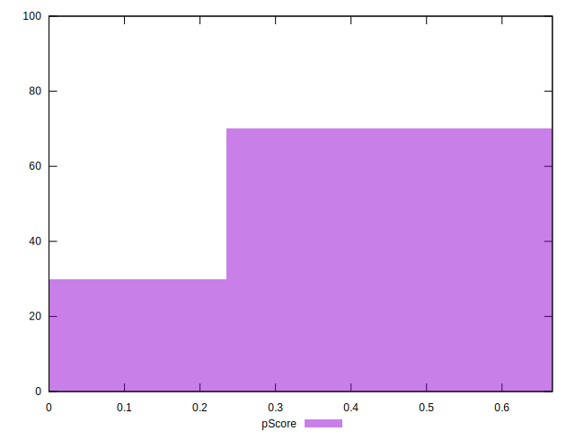
## Score Difference


```yaml
p90min: 0
p90max: 0
p90range: 0
p90mean: 0
p90median: 0
p90stdev: 0
p90skewness: .nan
p90eccentricity: .nan
p90discretization: 91
outlandishness: .inf
confidence: 4.264066145825136e-18
p90confidence: 0

```

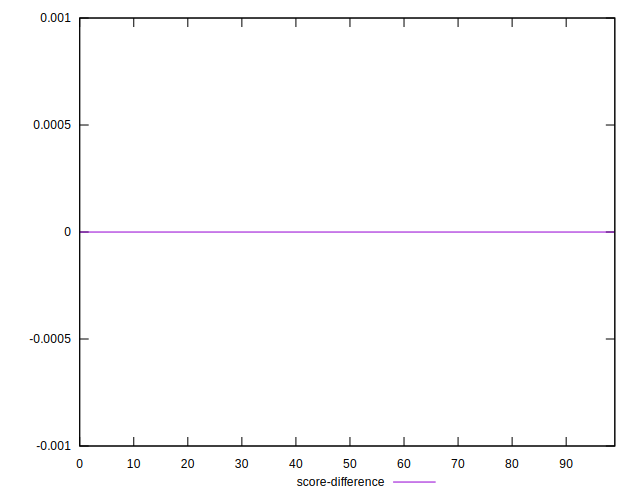
## P Score Difference


```yaml
p90min: -0.0033333333333334103
p90max: 0.004705882352941171
p90range: 0.008039215686274581
p90mean: -0.00044386985563455404
p90median: 0
p90stdev: 0.0021425816930175723
p90skewness: 0.6183447394278865
p90eccentricity: 0.9999999999999993
p90discretization: 6.5
outlandishness: 0.0019514091808854738
confidence: 0.0009877503667354314
p90confidence: 0.0008804298944862924

```

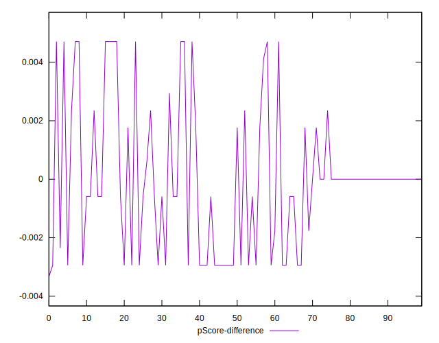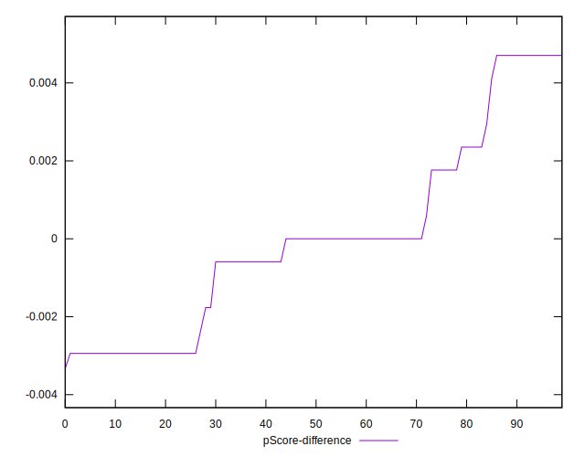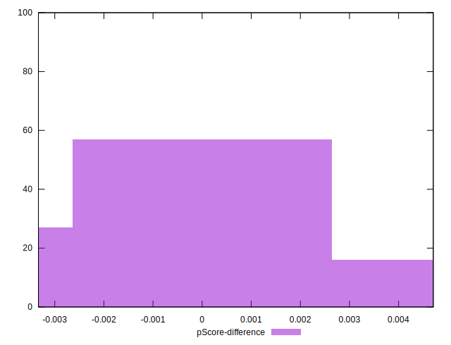