# //uses-http2/samples/pages+cached+noexternal

[→ Parent](../..)


## Raw


```yaml
p90min: 5400
p90max: 8100
p90range: 2700
p90mean: 6742.197802197802
p90median: 6610
p90stdev: 930.6594639272561
p90skewness: 0.1103170571121015
p90eccentricity: 0.9999999999999997
p90discretization: 1.7843137254901962
outlandishness: 0.9928644225490663
confidence: 391.526712817722
p90confidence: 382.42668473197955

```

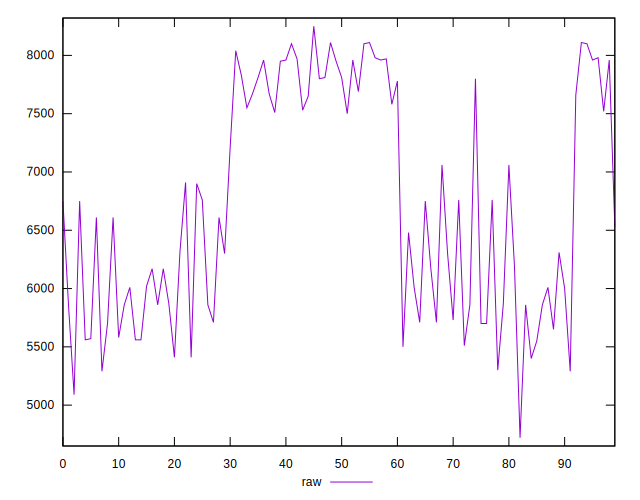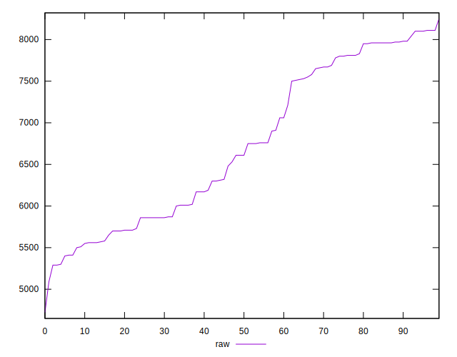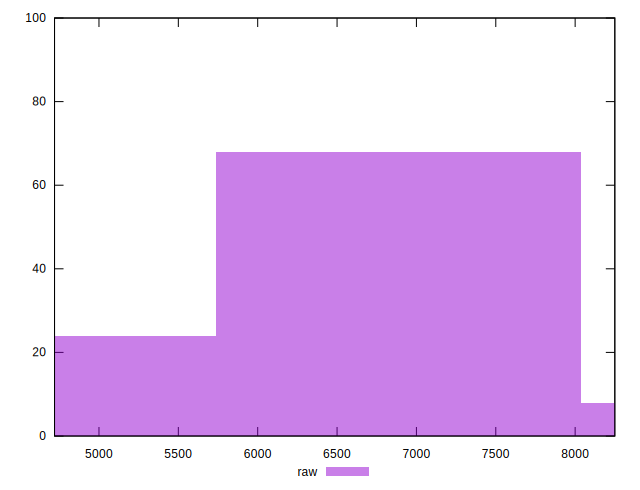
## Score


```yaml
p90min: 0
p90max: 0
p90range: 0
p90mean: 0
p90median: 0
p90stdev: 0
p90skewness: .nan
p90eccentricity: .nan
p90discretization: 91
outlandishness: .inf
confidence: 0.0011700837250792732
p90confidence: 0

```

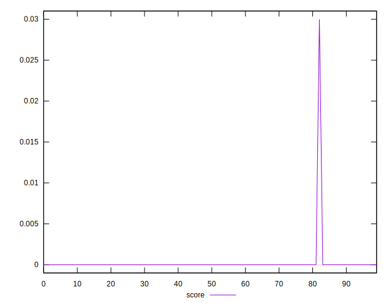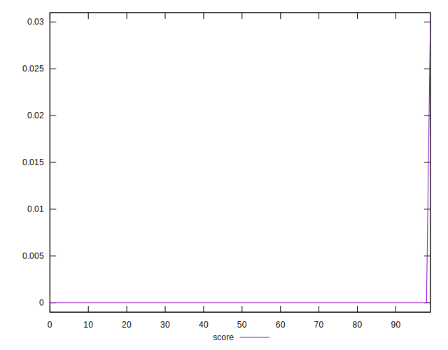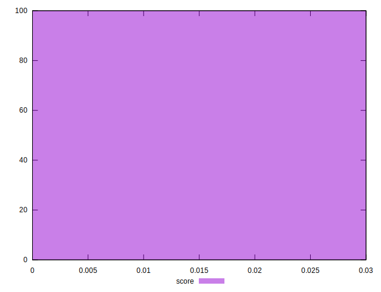
## Raw Estimate

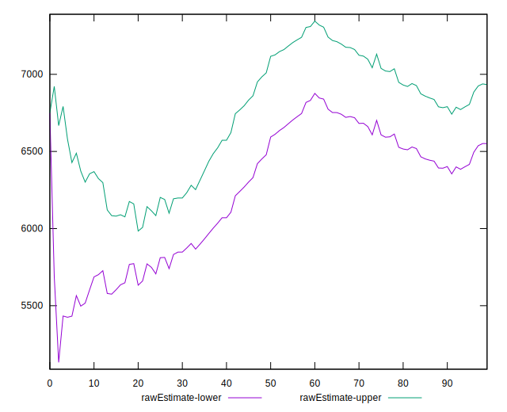
## Score Estimate


## P Score


```yaml
p90min: 0
p90max: 0
p90range: 0
p90mean: 0
p90median: 0
p90stdev: 0
p90skewness: .nan
p90eccentricity: .nan
p90discretization: 91
outlandishness: .inf
confidence: 0.0012847978157733164
p90confidence: 0

```

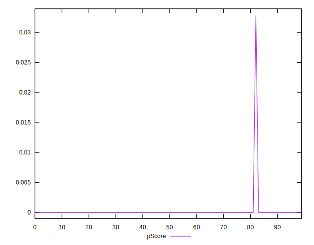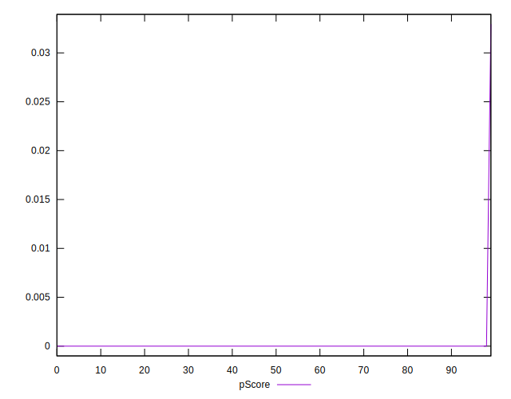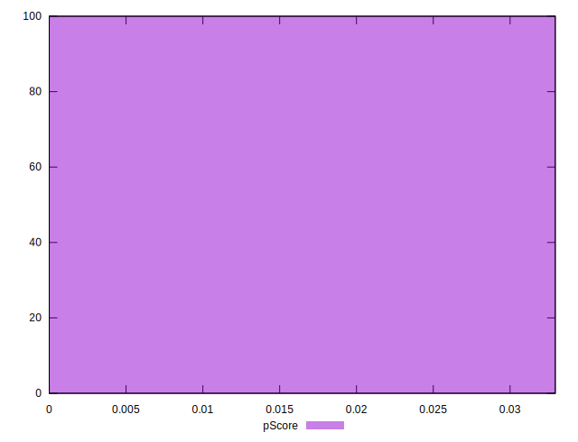
## Score Difference


```yaml
p90min: 0
p90max: 0
p90range: 0
p90mean: 0
p90median: 0
p90stdev: 0
p90skewness: .nan
p90eccentricity: .nan
p90discretization: 91
outlandishness: .nan
confidence: 0
p90confidence: 0

```


## P Score Difference


```yaml
p90min: 0
p90max: 0
p90range: 0
p90mean: 0
p90median: 0
p90stdev: 0
p90skewness: .nan
p90eccentricity: .nan
p90discretization: 91
outlandishness: .inf
confidence: 0.00011471409069404475
p90confidence: 0

```

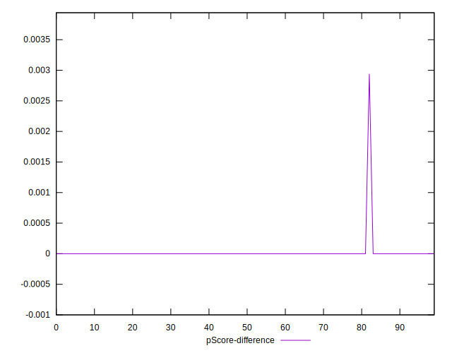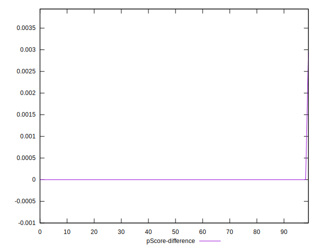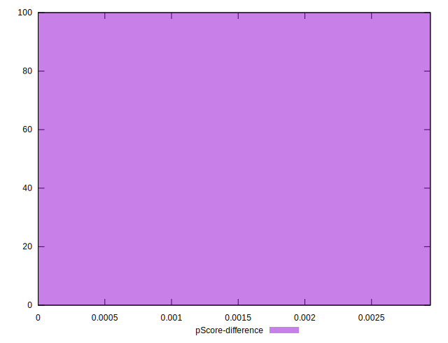