# //uses-http2/samples/pages

[→ Parent](../..)


## Raw


```yaml
p90min: 4850
p90max: 6460
p90range: 1610
p90mean: 5612.417582417583
p90median: 5600
p90stdev: 278.53360386507666
p90skewness: -0.2271482592003116
p90eccentricity: 0.9999999999999993
p90discretization: 1.9782608695652173
outlandishness: 1.0327932630054835
confidence: 189.2612142960843
p90confidence: 114.45505777492144

```

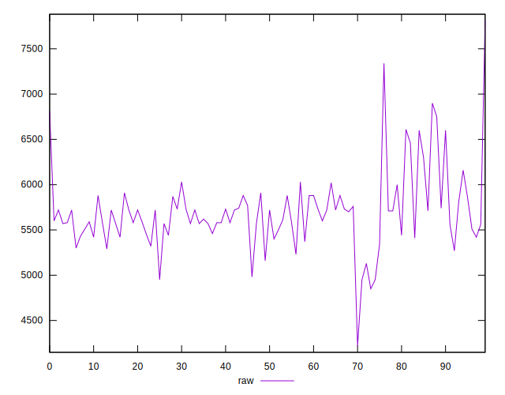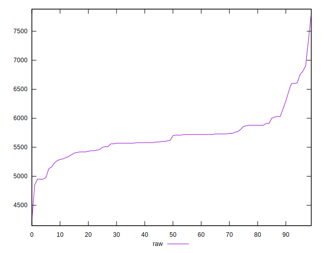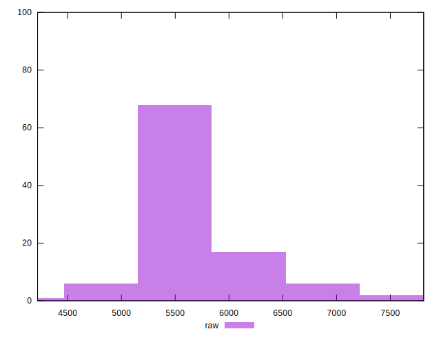
## Score


```yaml
p90min: 0
p90max: 0
p90range: 0
p90mean: 0
p90median: 0
p90stdev: 0
p90skewness: .nan
p90eccentricity: .nan
p90discretization: 91
outlandishness: .inf
confidence: 0.003636036946635851
p90confidence: 0

```

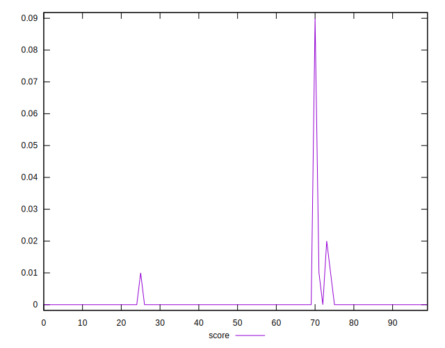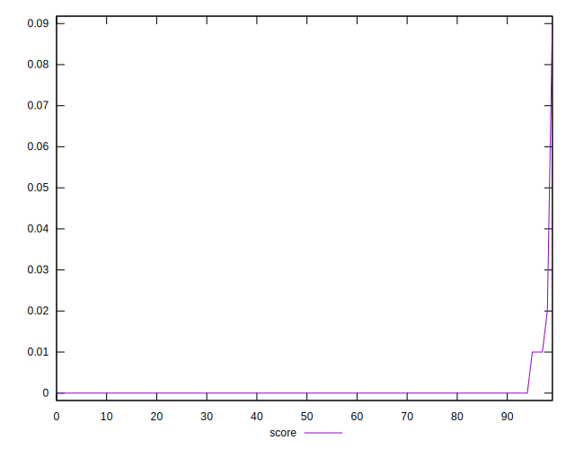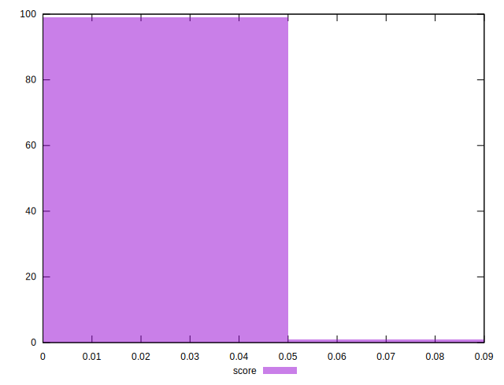
## Raw Estimate

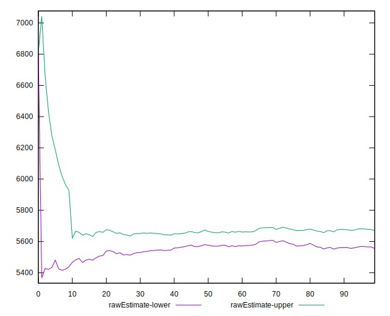
## Score Estimate


## P Score


```yaml
p90min: 0
p90max: 0.0023529411764705577
p90range: 0.0023529411764705577
p90mean: 0.000025856496444731404
p90median: 0
p90stdev: 0.00024529626323219173
p90skewness: 9.38142372516621
p90eccentricity: 0.9999999999999967
p90discretization: 45.5
outlandishness: 2505.00250000006
confidence: 0.0036508081243544757
p90confidence: 0.00010079716626871653

```

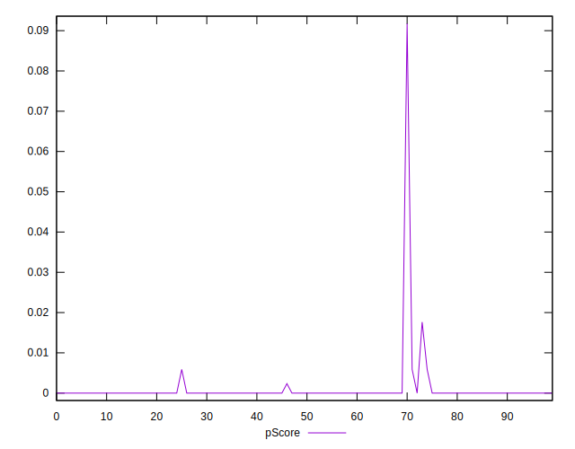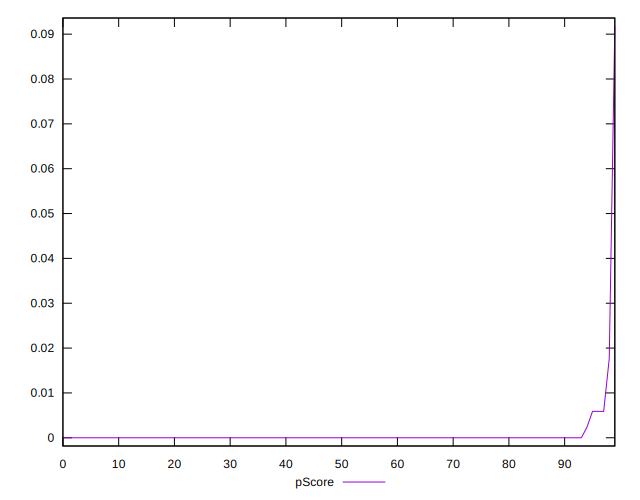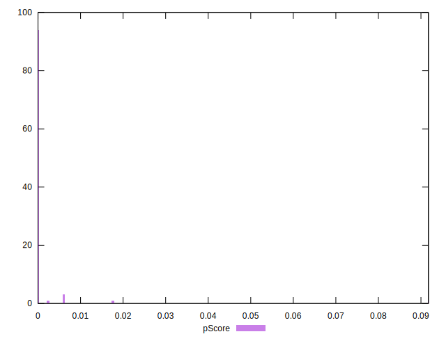
## Score Difference


```yaml
p90min: 0
p90max: 0
p90range: 0
p90mean: 0
p90median: 0
p90stdev: 0
p90skewness: .nan
p90eccentricity: .nan
p90discretization: 91
outlandishness: .nan
confidence: 0
p90confidence: 0

```


## P Score Difference


```yaml
p90min: 0
p90max: 0
p90range: 0
p90mean: 0
p90median: 0
p90stdev: 0
p90skewness: .nan
p90eccentricity: .nan
p90discretization: 91
outlandishness: .inf
confidence: 0.0003134246446106877
p90confidence: 0

```

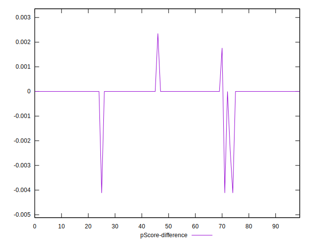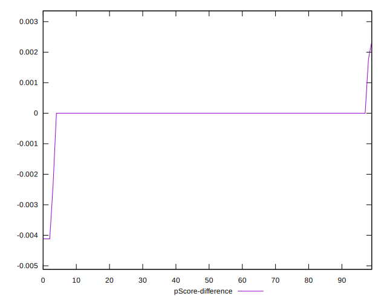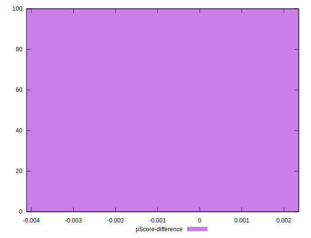