# //uses-long-cache-ttl/samples/pages+cached+noexternal+nomedia+nocss+nojs

[→ Parent](../..)


## Raw


```yaml
p90min: 519769.36169293144
p90max: 521760.05728320923
p90range: 1990.6955902777845
p90mean: 520879.05910774186
p90median: 521092.24967209814
p90stdev: 628.0514171229852
p90skewness: -0.45101889615929047
p90eccentricity: 0.9999999999999997
p90discretization: 1
outlandishness: 0.9995996164273322
confidence: 268.44392481131945
p90confidence: 258.07895433413796

```

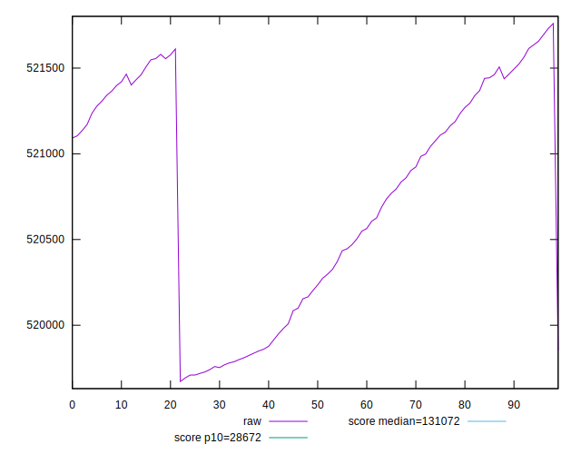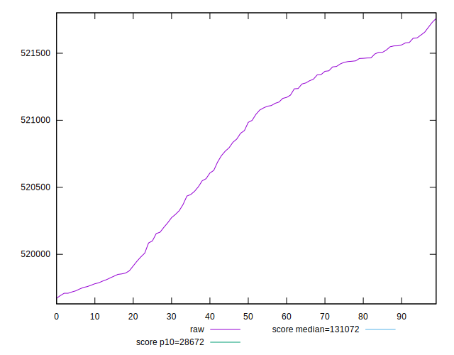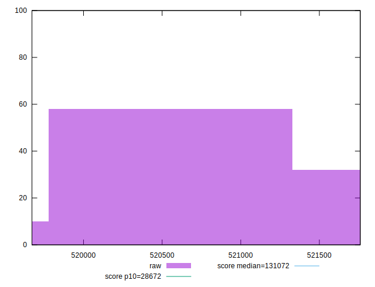
## Score


```yaml
p90min: 0.12
p90max: 0.12
p90range: 0
p90mean: 0.11999999999999986
p90median: 0.12
p90stdev: 1.3877787807814457e-16
p90skewness: 1
p90eccentricity: 1
p90discretization: 91
outlandishness: 0.9999999999999991
confidence: 8.326672684688674e-17
p90confidence: 5.551115123125783e-17

```


## Raw Estimate

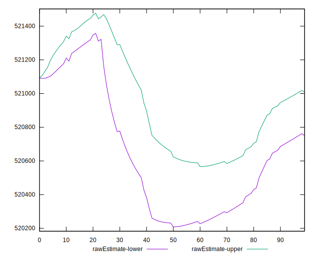
## Score Estimate

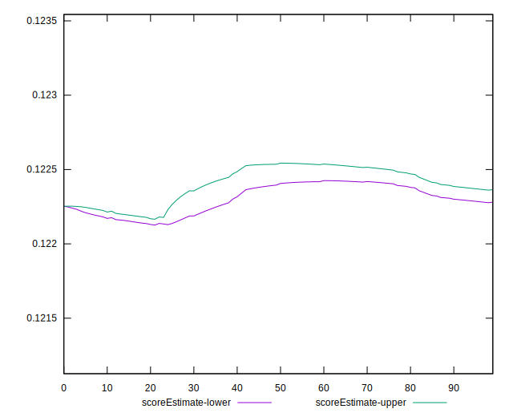
## P Score


```yaml
p90min: 0.12203398801426896
p90max: 0.1226876813346503
p90range: 0.0006536933203813433
p90mean: 0.12232292106259807
p90median: 0.12225272745404281
p90stdev: 0.00020625721694059358
p90skewness: 0.45306717158209237
p90eccentricity: 0.9999999999999999
p90discretization: 1
outlandishness: 1.000560616795994
confidence: 0.00008818030644058839
p90confidence: 0.0000847552372634508

```

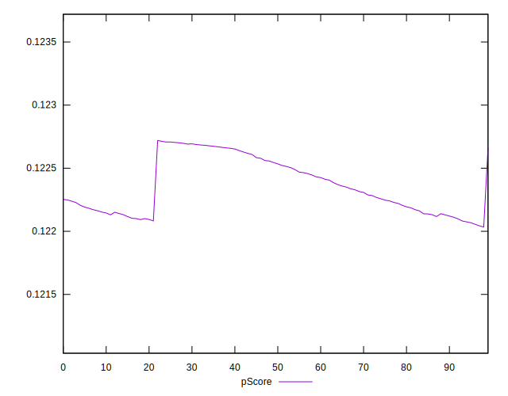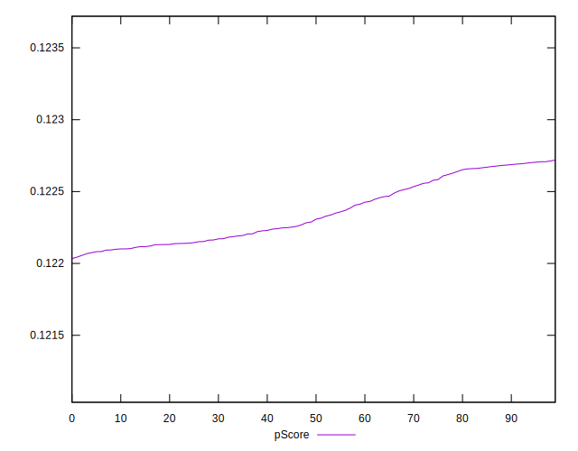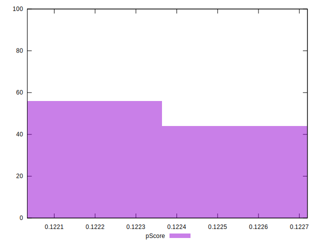
## Score Difference


```yaml
p90min: 0
p90max: 0
p90range: 0
p90mean: 0
p90median: 0
p90stdev: 0
p90skewness: .nan
p90eccentricity: .nan
p90discretization: 91
outlandishness: .nan
confidence: 0
p90confidence: 0

```


## P Score Difference


```yaml
p90min: 0.0020339880142689615
p90max: 0.002687681334650305
p90range: 0.0006536933203813433
p90mean: 0.00232292106259804
p90median: 0.0022527274540428133
p90stdev: 0.00020625721694059353
p90skewness: 0.45306717158315235
p90eccentricity: 1.0000000000000002
p90discretization: 1
outlandishness: 1.0297352565098987
confidence: 0.00008818030644059532
p90confidence: 0.00008475523726345687

```

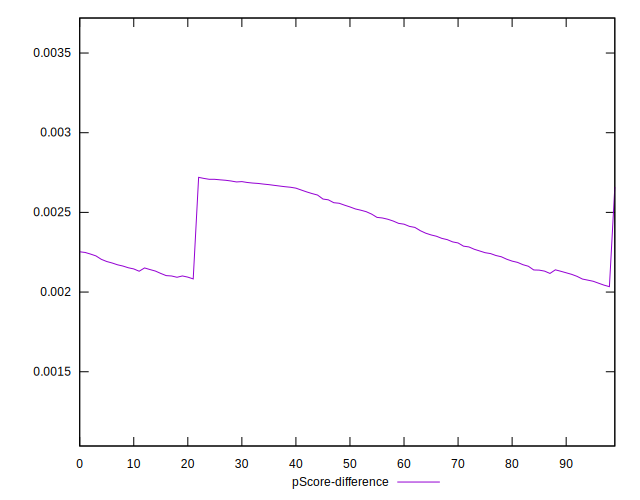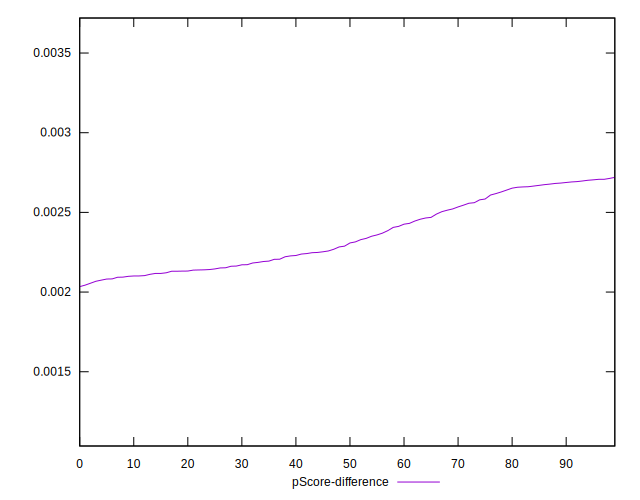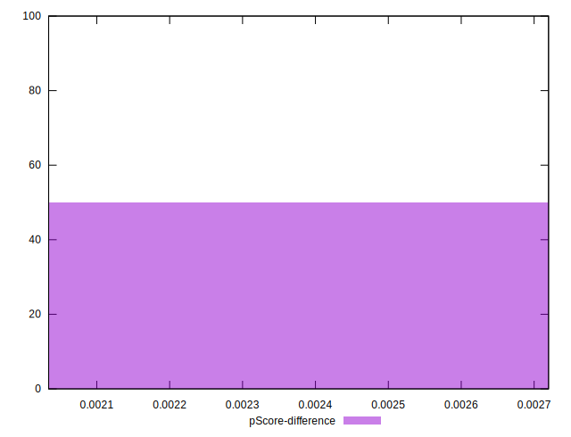