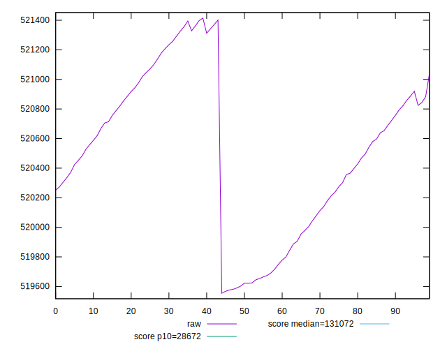
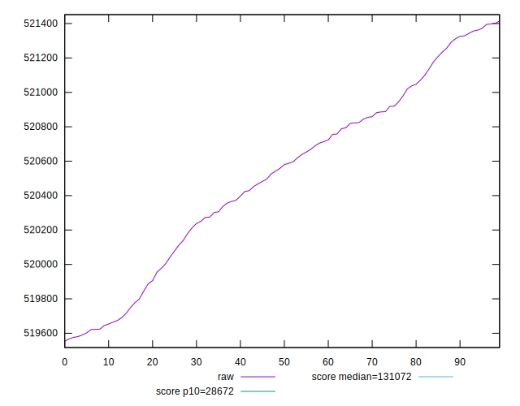
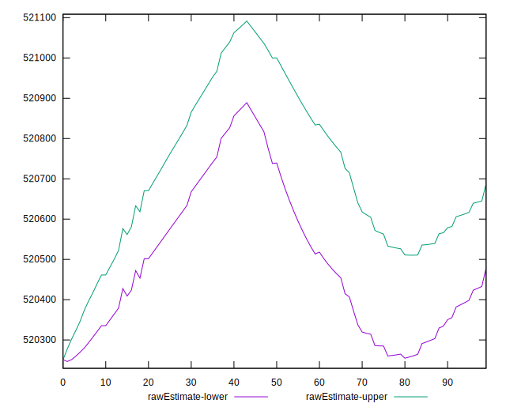
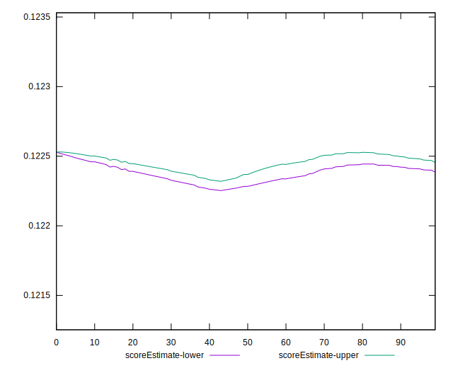
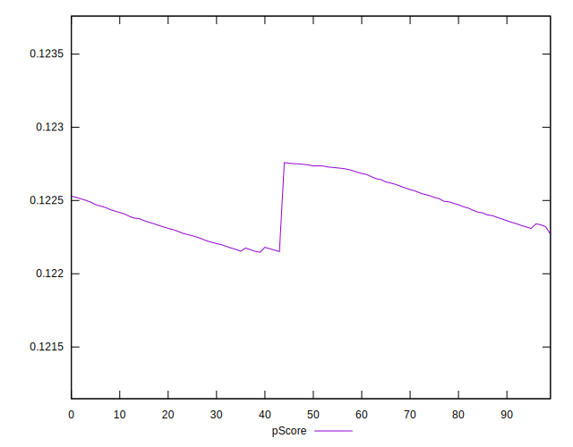
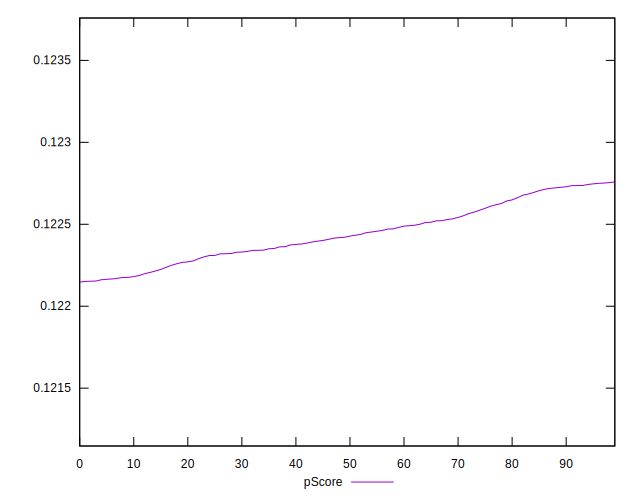
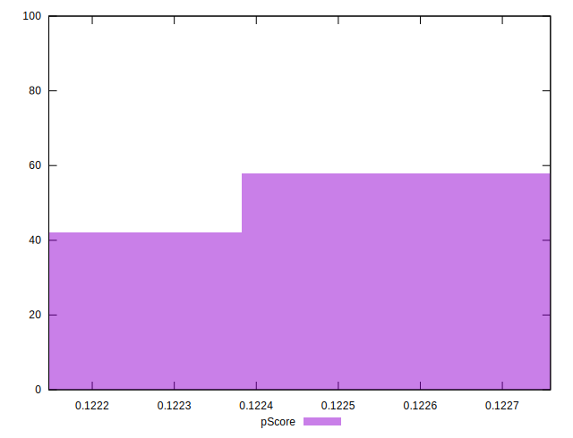
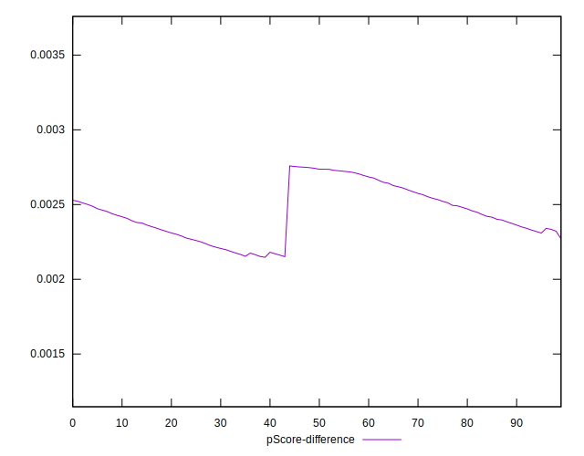
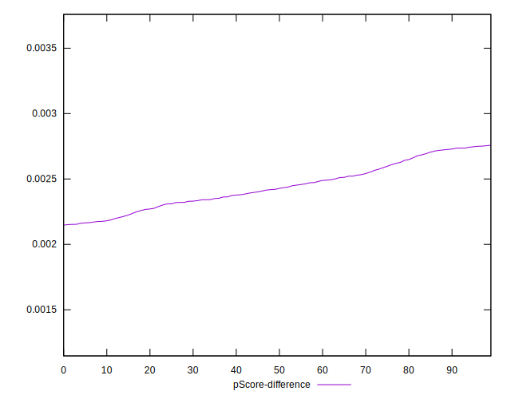
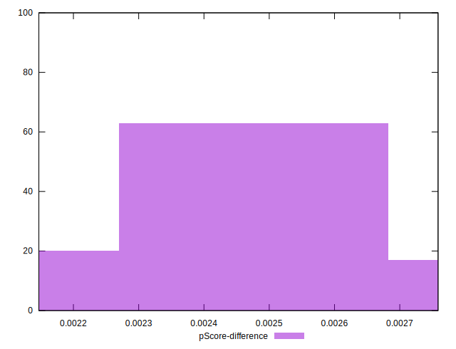

# //uses-long-cache-ttl/samples/pages+cached+noexternal+nomedia+nocss

[→ Parent](../..)


## Raw


```yaml
p90min: 519624.01871457946
p90max: 521401.5744977499
p90range: 1777.55578317045
p90mean: 520583.40097623103
p90median: 520619.870827902
p90stdev: 509.11107518302026
p90skewness: -0.19573765752468097
p90eccentricity: 1.0000000000000004
p90discretization: 1
outlandishness: 0.999726440986672
confidence: 220.63201514002867
p90confidence: 209.20397652324755

```


## Score


```yaml
p90min: 0.12
p90max: 0.12
p90range: 0
p90mean: 0.11999999999999986
p90median: 0.12
p90stdev: 1.3877787807814457e-16
p90skewness: 1
p90eccentricity: 1
p90discretization: 91
outlandishness: 0.9999999999999991
confidence: 8.326672684688674e-17
p90confidence: 5.551115123125783e-17

```


## Raw Estimate


## Score Estimate


## P Score


```yaml
p90min: 0.12215133951845553
p90max: 0.122735602501226
p90range: 0.0005842629827704782
p90mean: 0.12241993539498353
p90median: 0.12240779018751469
p90stdev: 0.00016732591276083828
p90skewness: 0.19879775490356139
p90eccentricity: 1.0000000000000002
p90discretization: 1
outlandishness: 1.0003829620567195
confidence: 0.00007253185289934905
p90confidence: 0.00006875758165811319

```


## Score Difference


```yaml
p90min: 0
p90max: 0
p90range: 0
p90mean: 0
p90median: 0
p90stdev: 0
p90skewness: .nan
p90eccentricity: .nan
p90discretization: 91
outlandishness: .nan
confidence: 0
p90confidence: 0

```


## P Score Difference


```yaml
p90min: 0.0021513395184555306
p90max: 0.002735602501226009
p90range: 0.0005842629827704782
p90mean: 0.002419935394983547
p90median: 0.002407790187514691
p90stdev: 0.0001673259127608383
p90skewness: 0.19879775490251156
p90eccentricity: 0.9999999999999996
p90discretization: 1
outlandishness: 1.0194652820734058
confidence: 0.00007253185289933777
p90confidence: 0.00006875758165811926

```

