# //uses-long-cache-ttl/samples/pages+cached+noexternal+nomedia

[→ Parent](../..)


## Raw


```yaml
p90min: 519379.4529268312
p90max: 521093.1340812384
p90range: 1713.6811544072116
p90mean: 520078.30336929904
p90median: 519993.52470297954
p90stdev: 516.0015072847327
p90skewness: 0.45572093497043864
p90eccentricity: 0.9999999999999997
p90discretization: 1
outlandishness: 1.0003959886306
confidence: 231.86804476368707
p90confidence: 212.03539360663854

```

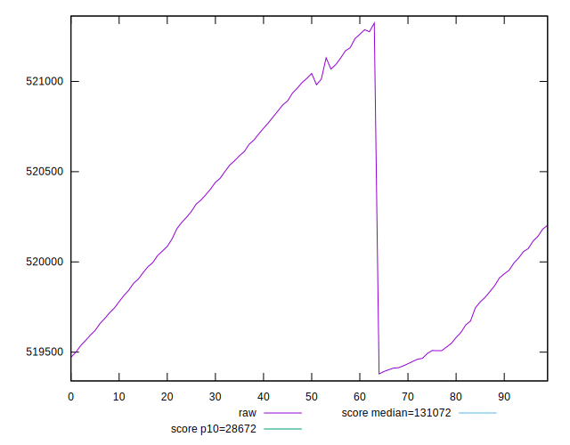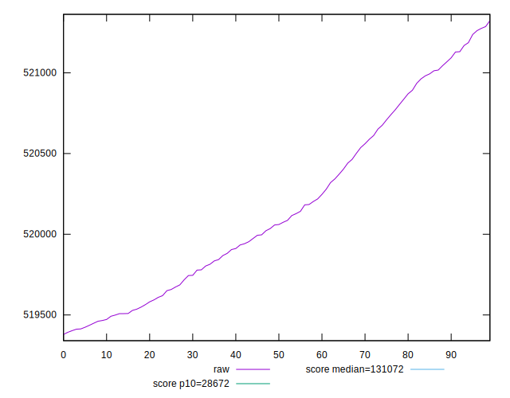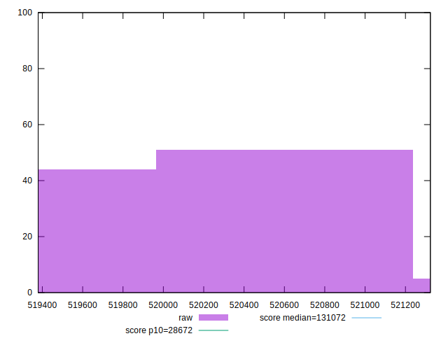
## Score


```yaml
p90min: 0.12
p90max: 0.12
p90range: 0
p90mean: 0.11999999999999986
p90median: 0.12
p90stdev: 1.3877787807814457e-16
p90skewness: 1
p90eccentricity: 1
p90discretization: 91
outlandishness: 0.9999999999999991
confidence: 8.326672684688674e-17
p90confidence: 5.551115123125783e-17

```


## Raw Estimate

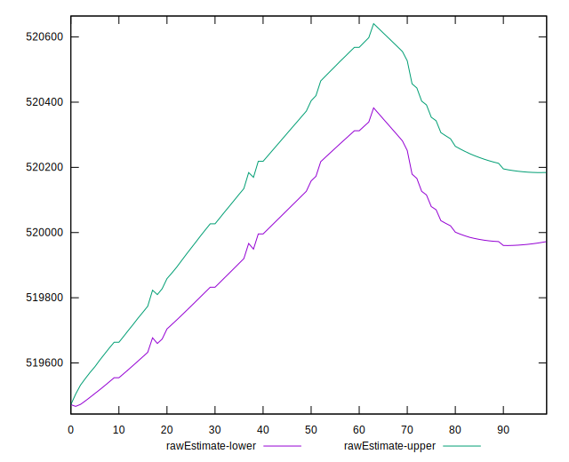
## Score Estimate

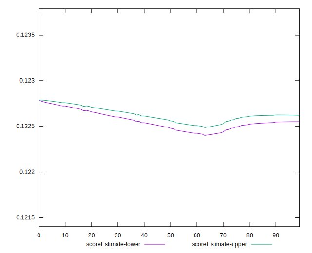
## P Score


```yaml
p90min: 0.12225243739972608
p90max: 0.12281629841904262
p90range: 0.0005638610193165472
p90mean: 0.12258607475695074
p90median: 0.12261382432629359
p90stdev: 0.0001698085880148588
p90skewness: -0.45342160506200857
p90eccentricity: 1.0000000000000002
p90discretization: 1
outlandishness: 0.9994479808572571
confidence: 0.00007627384767380785
p90confidence: 0.0000697777628344276

```

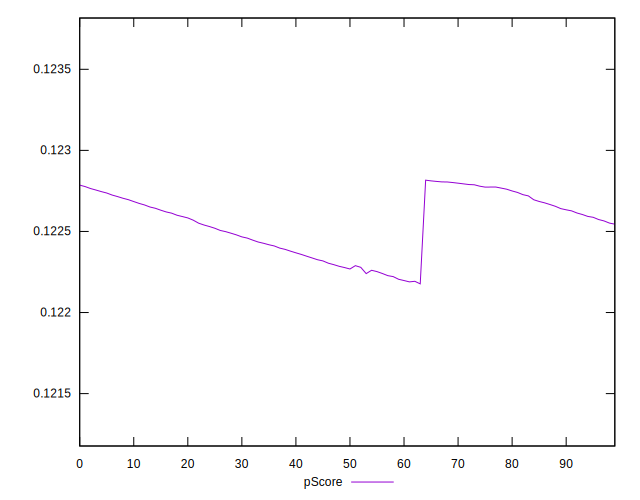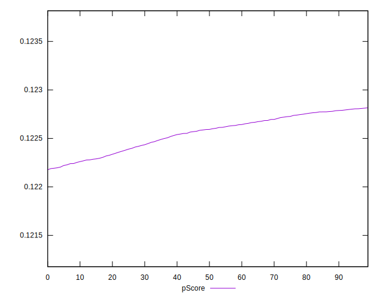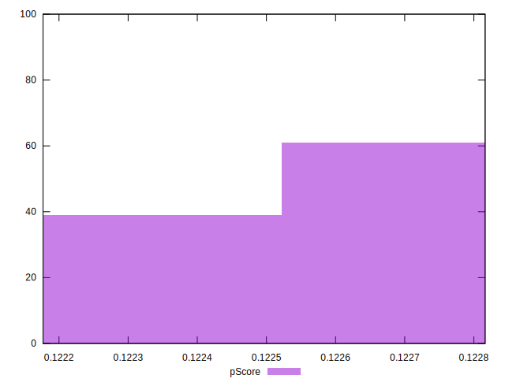
## Score Difference


```yaml
p90min: 0
p90max: 0
p90range: 0
p90mean: 0
p90median: 0
p90stdev: 0
p90skewness: .nan
p90eccentricity: .nan
p90discretization: 91
outlandishness: .nan
confidence: 0
p90confidence: 0

```


## P Score Difference


```yaml
p90min: 0.0022524373997260816
p90max: 0.002816298419042629
p90range: 0.0005638610193165472
p90mean: 0.002586074756950728
p90median: 0.00261382432629359
p90stdev: 0.00016980858801485886
p90skewness: -0.4534216050619393
p90eccentricity: 0.9999999999999992
p90discretization: 1
outlandishness: 0.9740005971378564
confidence: 0.00007627384767381479
p90confidence: 0.00006977776283443801

```

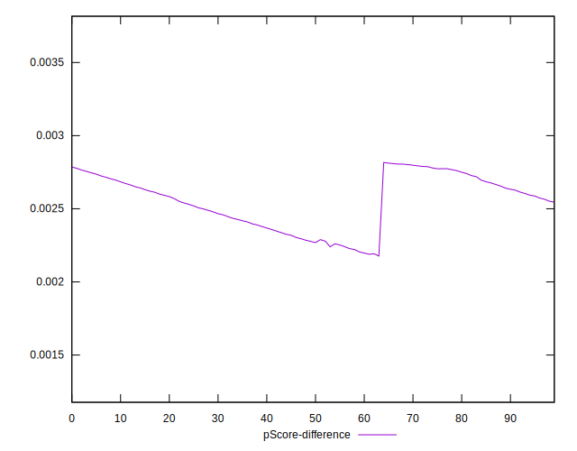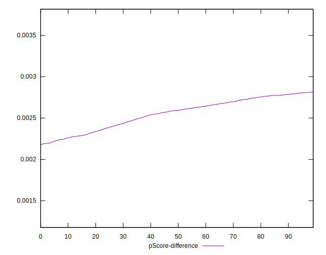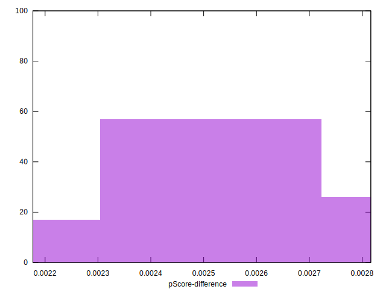