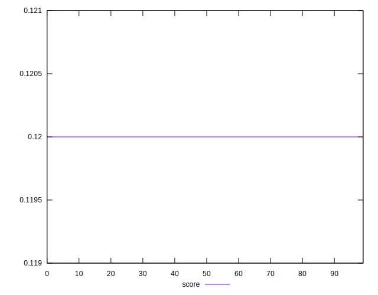

# //uses-long-cache-ttl/samples/pages+cached+noexternal

[→ Parent](../..)


## Raw


```yaml
p90min: 519080.27285567974
p90max: 520943.3293511794
p90range: 1863.0564954996808
p90mean: 519824.4083877403
p90median: 519676.91448836133
p90stdev: 591.7139058743247
p90skewness: 0.4352072884126301
p90eccentricity: 0.9999999999999999
p90discretization: 1
outlandishness: 1.0004188464799808
confidence: 259.6484431363642
p90confidence: 243.14714039268438

```


## Score


```yaml
p90min: 0.12
p90max: 0.12
p90range: 0
p90mean: 0.11999999999999986
p90median: 0.12
p90stdev: 1.3877787807814457e-16
p90skewness: 1
p90eccentricity: 1
p90discretization: 91
outlandishness: 0.9999999999999991
confidence: 8.326672684688674e-17
p90confidence: 5.551115123125783e-17

```


## Raw Estimate


## Score Estimate


## P Score


```yaml
p90min: 0.1223015818642259
p90max: 0.12291511695946761
p90range: 0.0006135350952417018
p90mean: 0.12266975837216541
p90median: 0.12271815911658723
p90stdev: 0.00019490448735238092
p90skewness: -0.433352174395159
p90eccentricity: 1
p90discretization: 1
outlandishness: 0.9994162522338101
confidence: 0.00008549572183944032
p90confidence: 0.00008009017242785466

```


## Score Difference


```yaml
p90min: 0
p90max: 0
p90range: 0
p90mean: 0
p90median: 0
p90stdev: 0
p90skewness: .nan
p90eccentricity: .nan
p90discretization: 91
outlandishness: .nan
confidence: 0
p90confidence: 0

```


## P Score Difference


```yaml
p90min: 0.00230158186422591
p90max: 0.002915116959467612
p90range: 0.0006135350952417018
p90mean: 0.0026697583721654343
p90median: 0.0027181591165872376
p90stdev: 0.0001949044873523809
p90skewness: -0.43335217439498525
p90eccentricity: 1
p90discretization: 1
outlandishness: 0.9733540147495365
confidence: 0.00008549572183943858
p90confidence: 0.00008009017242786333

```

