# //uses-long-cache-ttl/samples/pages+cached

[→ Parent](../..)


## Raw


```yaml
p90min: 518987.0421220128
p90max: 520967.3718758535
p90range: 1980.3297538406914
p90mean: 520056.73353945237
p90median: 520291.2895951273
p90stdev: 629.8202432467114
p90skewness: -0.3979855447129984
p90eccentricity: 1.0000000000000002
p90discretization: 1
outlandishness: 0.9996953953608687
confidence: 266.5566666511586
p90confidence: 258.8058005508501

```

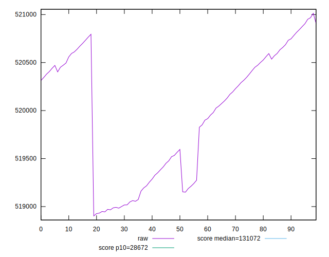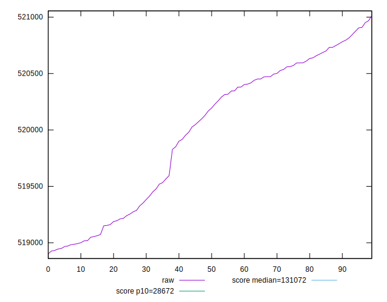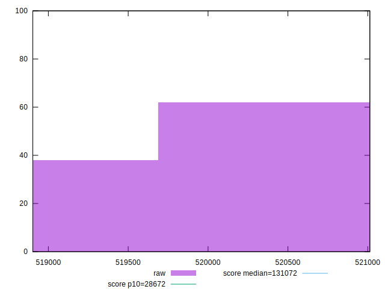
## Score


```yaml
p90min: 0.12
p90max: 0.12
p90range: 0
p90mean: 0.11999999999999986
p90median: 0.12
p90stdev: 1.3877787807814457e-16
p90skewness: 1
p90eccentricity: 1
p90discretization: 91
outlandishness: 0.9999999999999991
confidence: 8.326672684688674e-17
p90confidence: 5.551115123125783e-17

```

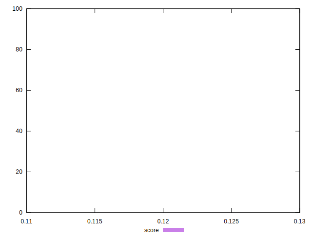
## Raw Estimate

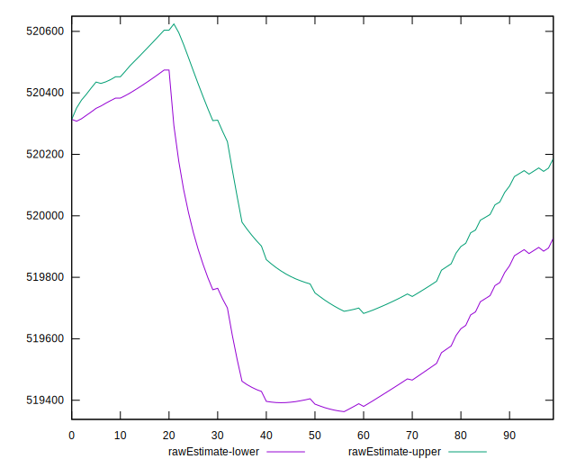
## Score Estimate

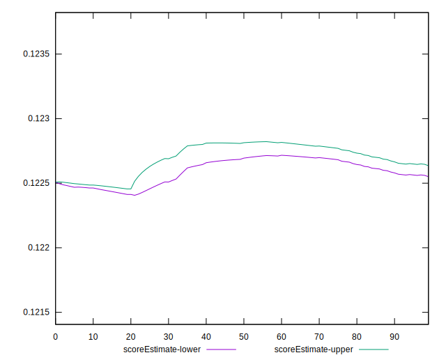
## P Score


```yaml
p90min: 0.12229369266373402
p90max: 0.122945933907539
p90range: 0.0006522412438049741
p90mean: 0.1225932584589331
p90median: 0.1225158144678925
p90stdev: 0.00020747356137343503
p90skewness: 0.39985822858148984
p90eccentricity: 0.9999999999999999
p90discretization: 1
outlandishness: 1.0004262754794329
confidence: 0.00008782215221242451
p90confidence: 0.00008525505764564456

```

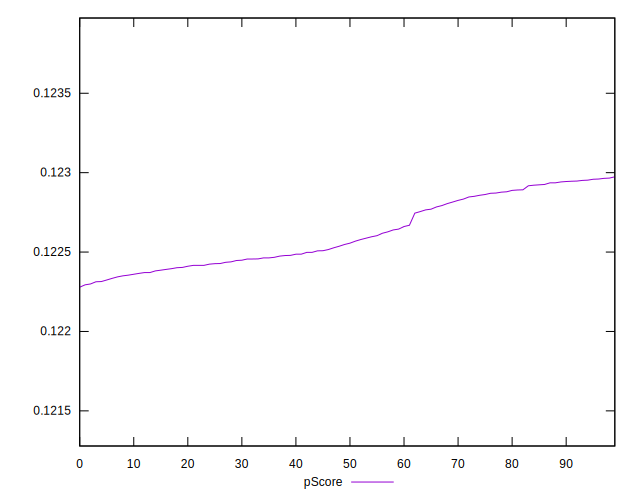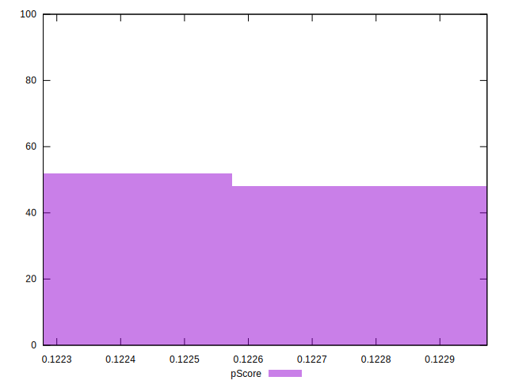
## Score Difference


```yaml
p90min: 0
p90max: 0
p90range: 0
p90mean: 0
p90median: 0
p90stdev: 0
p90skewness: .nan
p90eccentricity: .nan
p90discretization: 91
outlandishness: .nan
confidence: 0
p90confidence: 0

```


## P Score Difference


```yaml
p90min: 0.002293692663734026
p90max: 0.002945933907539
p90range: 0.0006522412438049741
p90mean: 0.002593258458933098
p90median: 0.0025158144678925076
p90stdev: 0.00020747356137343503
p90skewness: 0.39985822858133285
p90eccentricity: 0.9999999999999997
p90discretization: 1
outlandishness: 1.0202510281501675
confidence: 0.00008782215221243578
p90confidence: 0.00008525505764564109

```

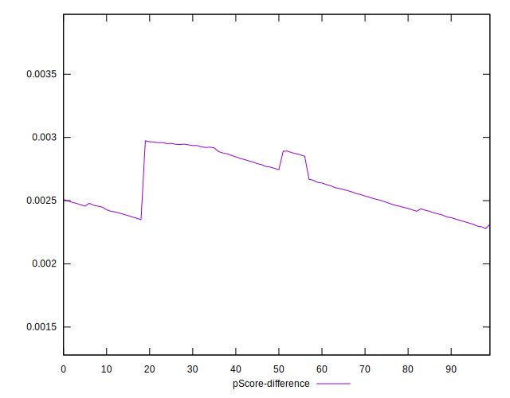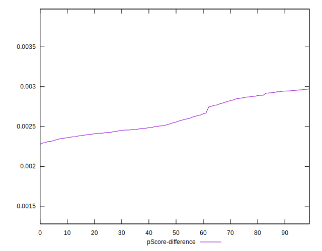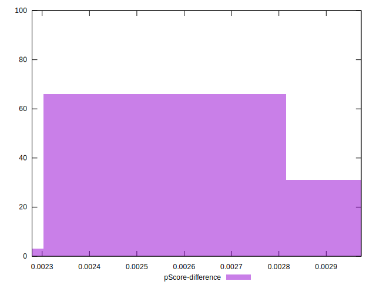