# //uses-long-cache-ttl/samples/pages

[→ Parent](../..)


## Raw


```yaml
p90min: 518813.1967161313
p90max: 520645.8412029795
p90range: 1832.6444868482067
p90mean: 519727.62098176783
p90median: 519876.730945298
p90stdev: 563.0064450115244
p90skewness: -0.26875651563854314
p90eccentricity: 1
p90discretization: 1
outlandishness: 1.0015709444617358
confidence: 1905.0127404296072
p90confidence: 231.35066755767912

```

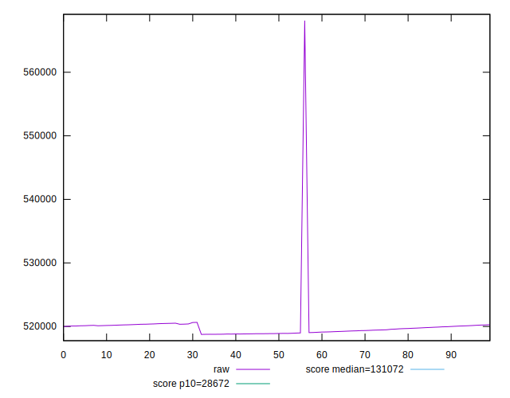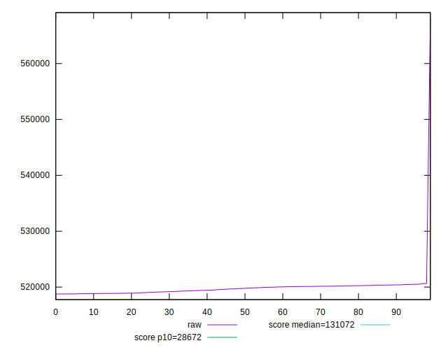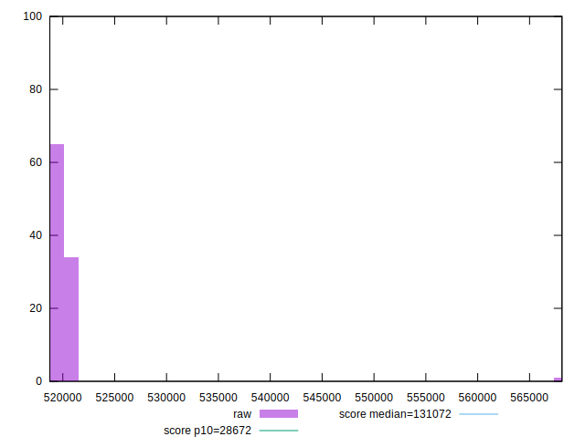
## Score


```yaml
p90min: 0.12
p90max: 0.12
p90range: 0
p90mean: 0.11999999999999986
p90median: 0.12
p90stdev: 1.3877787807814457e-16
p90skewness: 1
p90eccentricity: 1
p90discretization: 91
outlandishness: 0.998334027777777
confidence: 0.00039002790835976353
p90confidence: 5.551115123125783e-17

```

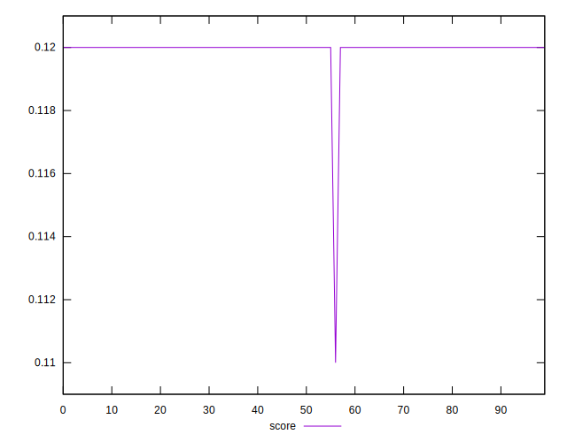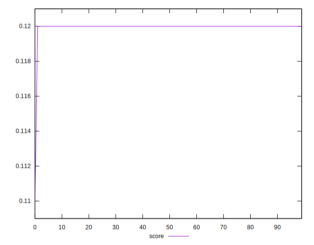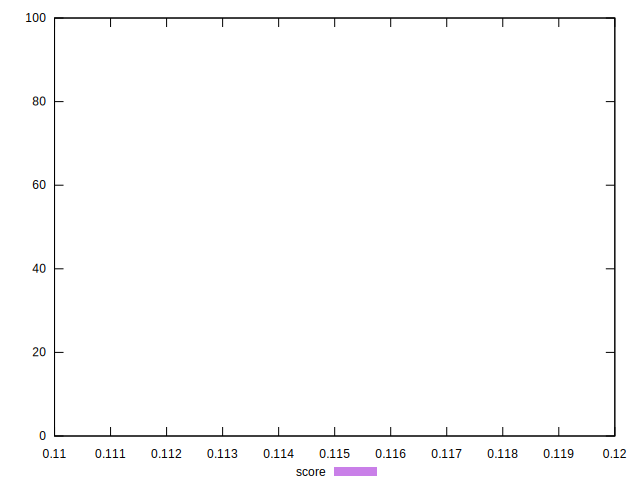
## Raw Estimate

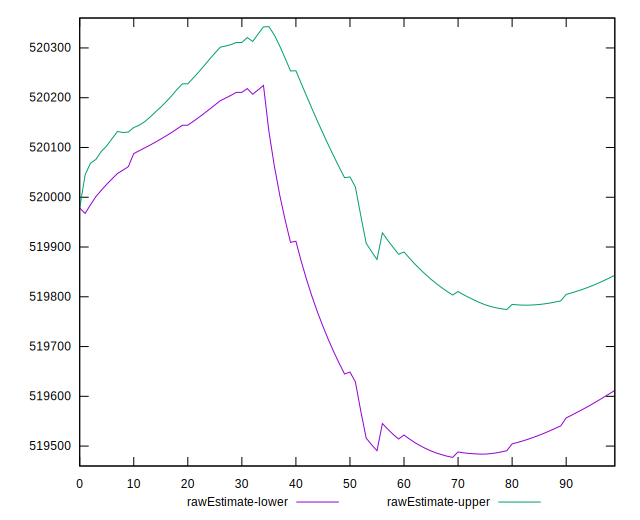
## Score Estimate

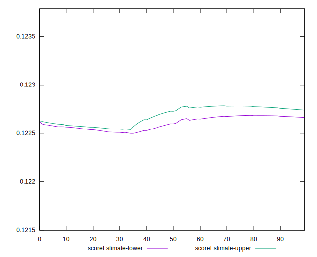
## P Score


```yaml
p90min: 0.12239925793151024
p90max: 0.12300342689037275
p90range: 0.0006041689588625054
p90mean: 0.12270164003811886
p90median: 0.12265229755216267
p90stdev: 0.00018566135572623254
p90skewness: 0.2706175091481594
p90eccentricity: 0.9999999999999997
p90discretization: 1
outlandishness: 0.9980302178598927
confidence: 0.0005754549535507136
p90confidence: 0.0000762919838085685

```

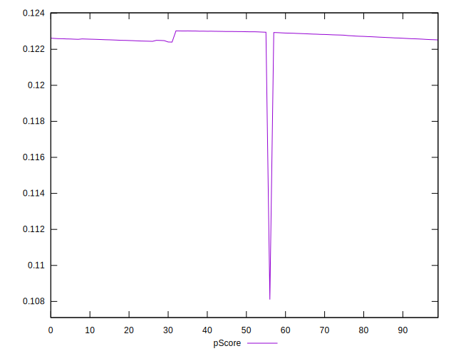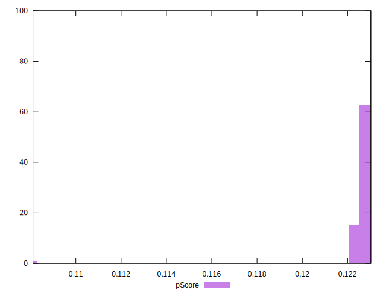
## Score Difference


```yaml
p90min: 0
p90max: 0
p90range: 0
p90mean: 0
p90median: 0
p90stdev: 0
p90skewness: .nan
p90eccentricity: .nan
p90discretization: 91
outlandishness: .nan
confidence: 0
p90confidence: 0

```


## P Score Difference


```yaml
p90min: 0.002399257931510246
p90max: 0.0030034268903727512
p90range: 0.0006041689588625054
p90mean: 0.002701640038118811
p90median: 0.0026522975521626746
p90stdev: 0.0001856613557262325
p90skewness: 0.2706175091487341
p90eccentricity: 0.9999999999999999
p90discretization: 1
outlandishness: 0.9845823865413387
confidence: 0.00019600931264659918
p90confidence: 0.00007629198380856676

```

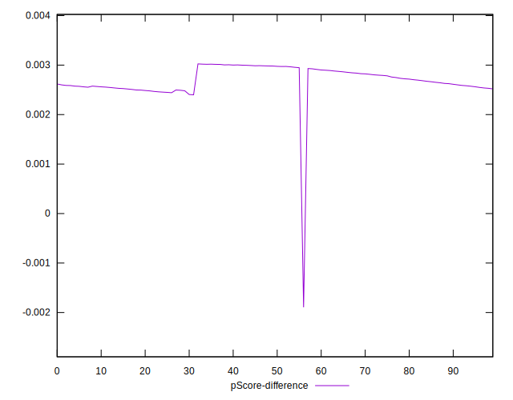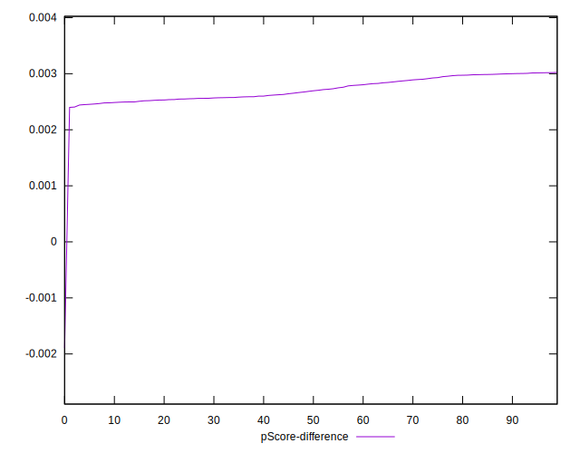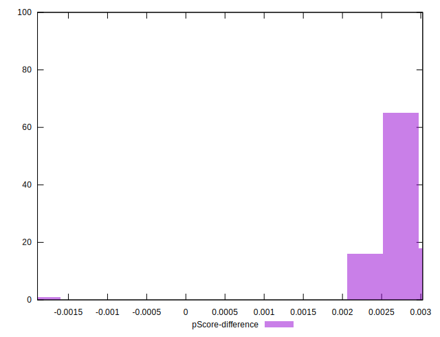