# //uses-optimized-images/samples/pages+cached+noexternal+nomedia+nocss+nojs

[→ Parent](../..)


## Raw


```yaml
p90min: 0
p90max: 230
p90range: 230
p90mean: 100.54945054945055
p90median: 150
p90stdev: 72.99499662761242
p90skewness: -0.5357588130234688
p90eccentricity: 0.9999999999999964
p90discretization: 9.1
outlandishness: 1.3842358277643403
confidence: 35.47504492003091
p90confidence: 29.995111686203046

```

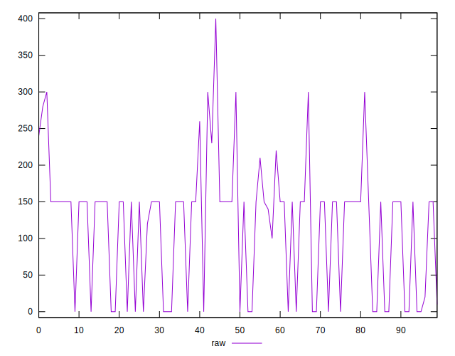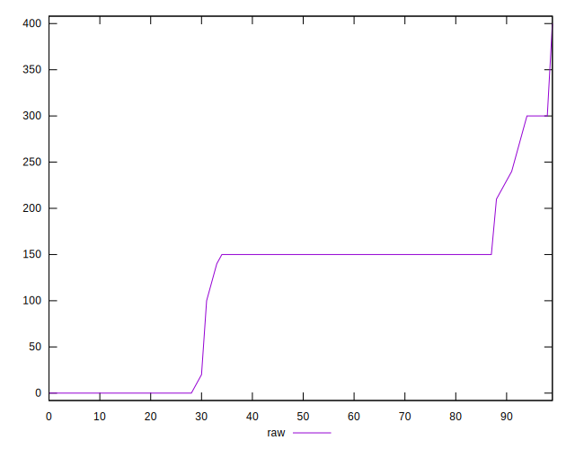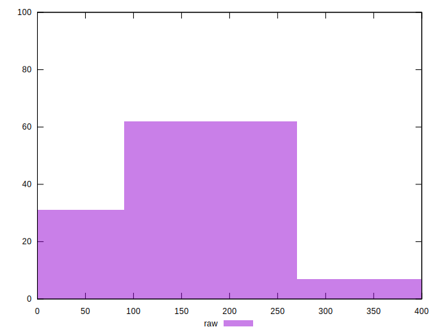
## Score


```yaml
p90min: 0.81
p90max: 1
p90range: 0.18999999999999995
p90mean: 0.9192307692307692
p90median: 0.88
p90stdev: 0.05861460586140119
p90skewness: 0.5206114049663992
p90eccentricity: 1.0000000000000002
p90discretization: 10.11111111111111
outlandishness: 0.9679925200189066
confidence: 0.028865791698443832
p90confidence: 0.024085920001130967

```

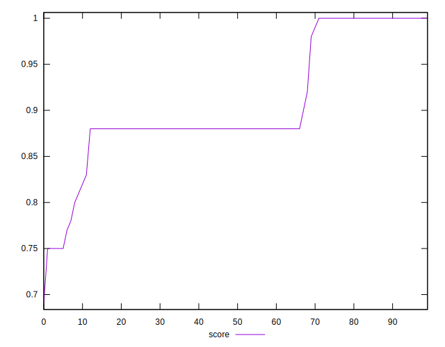
## Raw Estimate

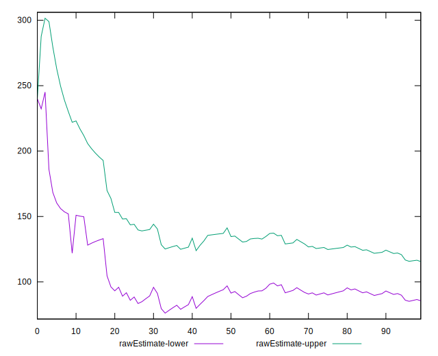
## Score Estimate

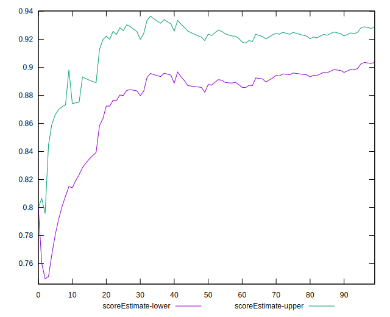
## P Score


```yaml
p90min: 0.8083333333333333
p90max: 1
p90range: 0.19166666666666665
p90mean: 0.9162087912087912
p90median: 0.875
p90stdev: 0.06082916385634362
p90skewness: 0.5357588130234724
p90eccentricity: 1.0000000000000004
p90discretization: 9.1
outlandishness: 0.9685674693222547
confidence: 0.029241713157774685
p90confidence: 0.024995926405169122

```

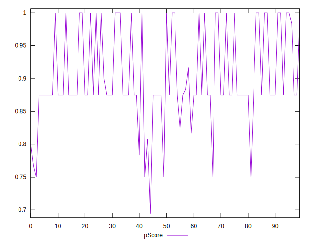
## Score Difference


```yaml
p90min: 0
p90max: 0
p90range: 0
p90mean: 0
p90median: 0
p90stdev: 0
p90skewness: .nan
p90eccentricity: .nan
p90discretization: 91
outlandishness: .inf
confidence: 7.423946114831072e-18
p90confidence: 0

```

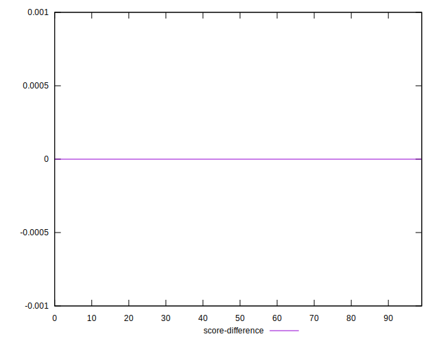
## P Score Difference


```yaml
p90min: -0.0050000000000000044
p90max: 0
p90range: 0.0050000000000000044
p90mean: -0.0031501831501831545
p90median: -0.0050000000000000044
p90stdev: 0.0023628503183692534
p90skewness: 0.546015293243419
p90eccentricity: 1
p90discretization: 18.2
outlandishness: 0.7376346407217118
confidence: 0.0010627070200240002
p90confidence: 0.0009709427011666723

```

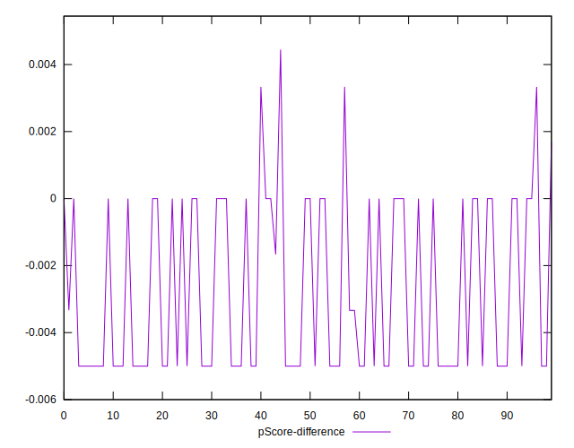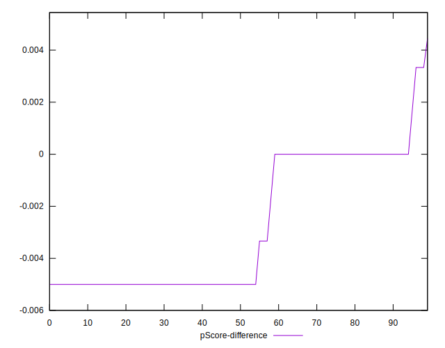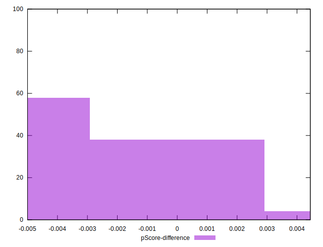