# //uses-optimized-images/samples/pages+cached+noexternal+nomedia+nocss

[→ Parent](../..)


## Raw


```yaml
p90min: 0
p90max: 180
p90range: 180
p90mean: 90.10989010989012
p90median: 150
p90stdev: 71.18300984923803
p90skewness: -0.3978078299221481
p90eccentricity: 0.9999999999999999
p90discretization: 7
outlandishness: 1.3500456170434263
confidence: 34.07161613956711
p90confidence: 29.250529888788407

```

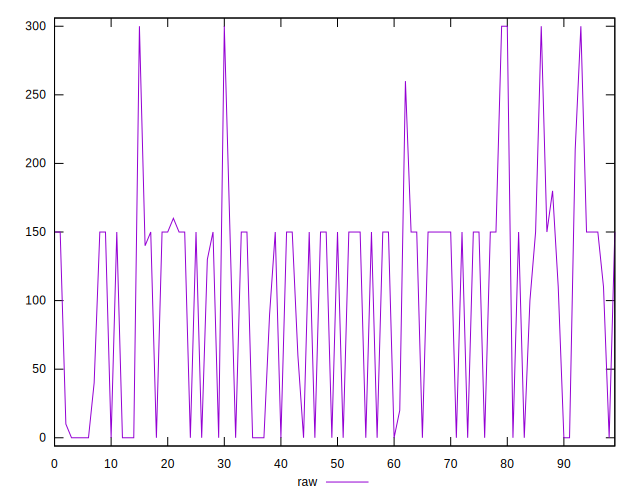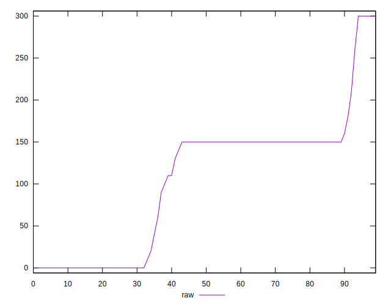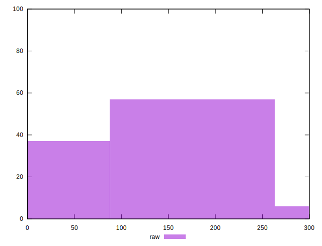
## Score


```yaml
p90min: 0.85
p90max: 1
p90range: 0.15000000000000002
p90mean: 0.9275824175824174
p90median: 0.88
p90stdev: 0.057116435142488216
p90skewness: 0.3971677130753698
p90eccentricity: 1.0000000000000009
p90discretization: 7.583333333333333
outlandishness: 0.9734799407515575
confidence: 0.027919575167991706
p90confidence: 0.023470291531853205

```

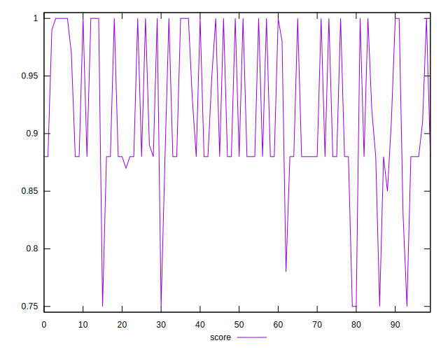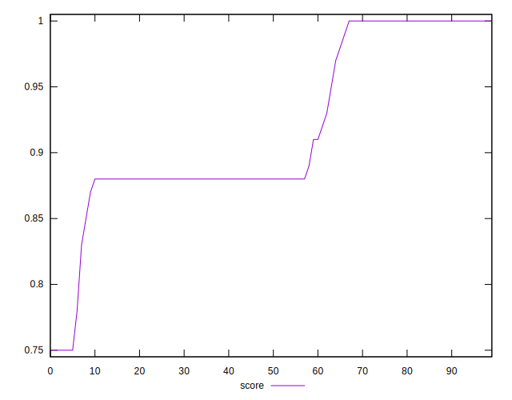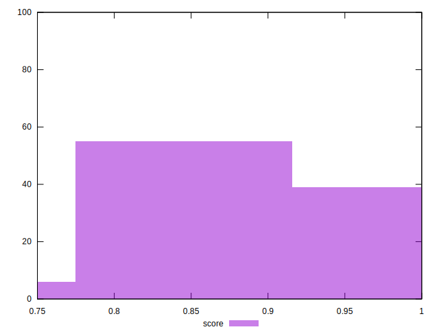
## Raw Estimate

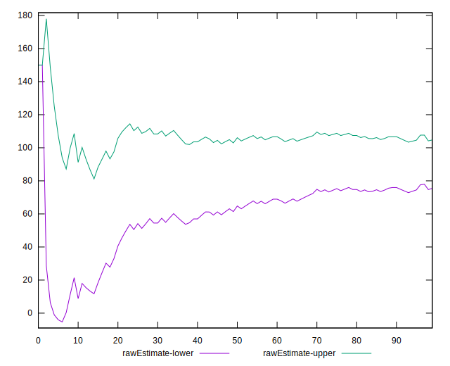
## Score Estimate

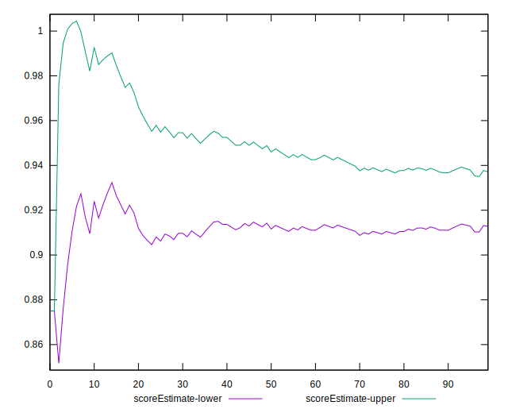
## P Score


```yaml
p90min: 0.85
p90max: 1
p90range: 0.15000000000000002
p90mean: 0.924908424908425
p90median: 0.875
p90stdev: 0.059319174874365
p90skewness: 0.39780782992215163
p90eccentricity: 1.0000000000000013
p90discretization: 7
outlandishness: 0.9738817162327225
confidence: 0.028393013449639293
p90confidence: 0.024375441573990297

```

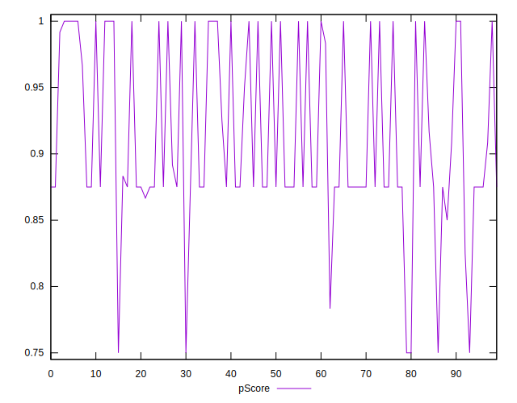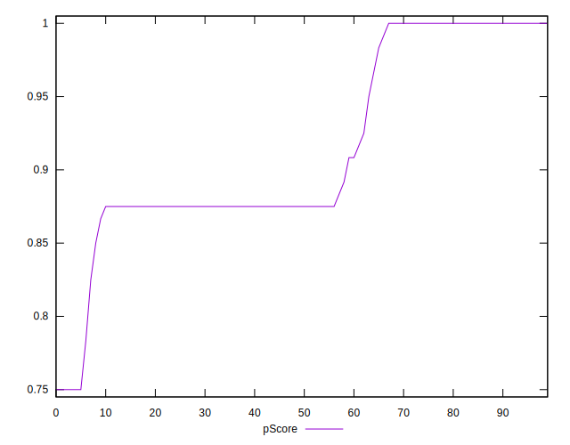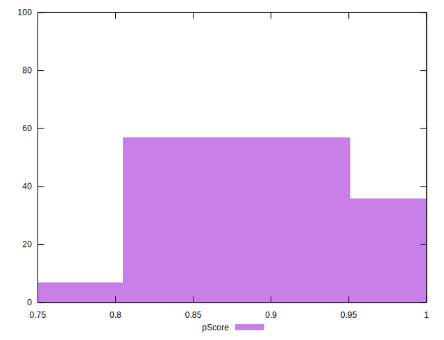
## Score Difference


```yaml
p90min: 0
p90max: 0
p90range: 0
p90mean: 0
p90median: 0
p90stdev: 0
p90skewness: .nan
p90eccentricity: .nan
p90discretization: 91
outlandishness: .inf
confidence: 6.092792000602807e-18
p90confidence: 0

```

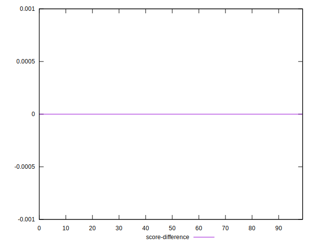
## P Score Difference


```yaml
p90min: -0.0050000000000000044
p90max: 0
p90range: 0.0050000000000000044
p90mean: -0.002619047619047622
p90median: -0.0033333333333334103
p90stdev: 0.002435277675984568
p90skewness: 0.09877568412815393
p90eccentricity: 0.9999999999999989
p90discretization: 18.2
outlandishness: 0.8750752066115712
confidence: 0.0010389863384524523
p90confidence: 0.0010007045585702819

```

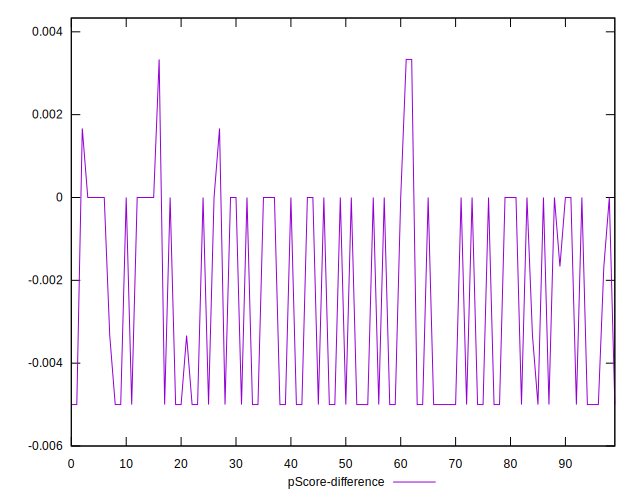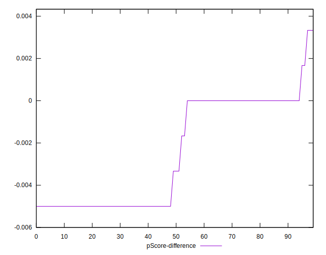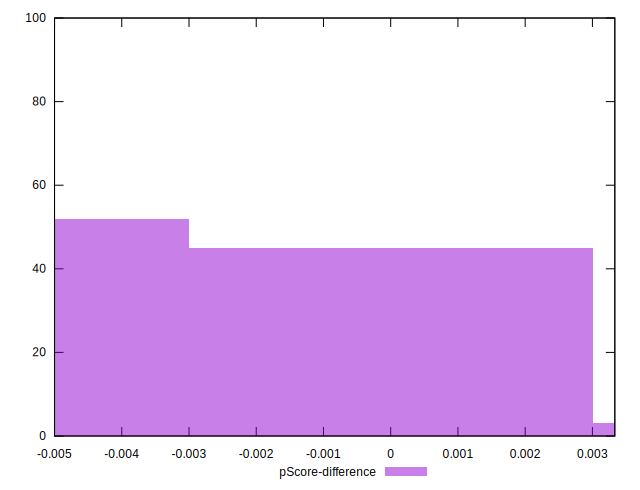