# //uses-optimized-images/samples/pages+cached+noexternal+nomedia

[→ Parent](../..)


## Raw


```yaml
p90min: 0
p90max: 220
p90range: 220
p90mean: 104.50549450549451
p90median: 150
p90stdev: 65.30172971580721
p90skewness: -0.7635373976453355
p90eccentricity: 1.0000000000000013
p90discretization: 5.6875
outlandishness: 1.2405883867886034
confidence: 32.421951483969224
p90confidence: 26.833793638219504

```

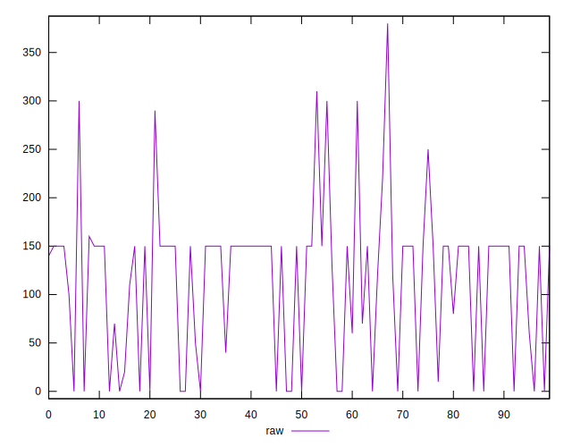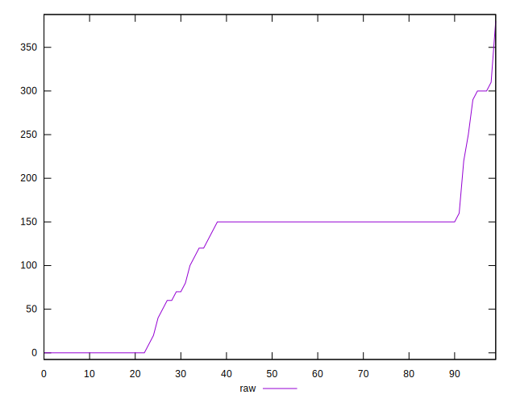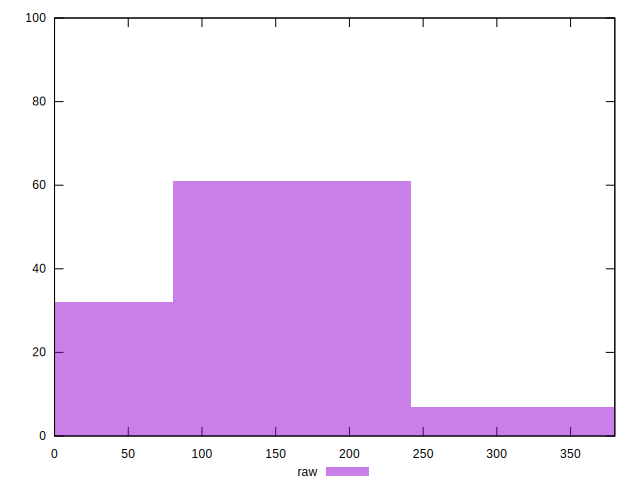
## Score


```yaml
p90min: 0.82
p90max: 1
p90range: 0.18000000000000005
p90mean: 0.9158241758241755
p90median: 0.88
p90stdev: 0.052289682004205716
p90skewness: 0.7739697244752989
p90eccentricity: 1
p90discretization: 6.066666666666666
outlandishness: 0.9784447599282048
confidence: 0.02626699829222412
p90confidence: 0.021486881624964482

```

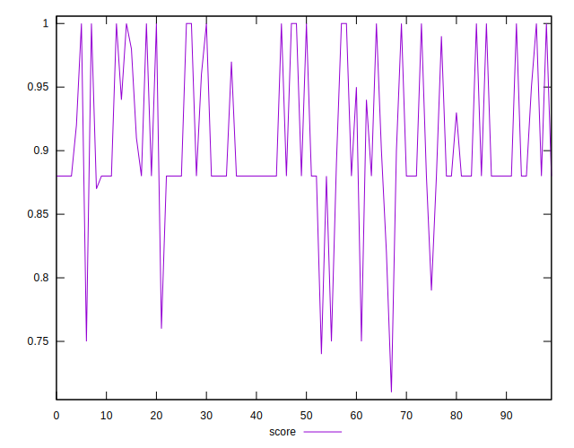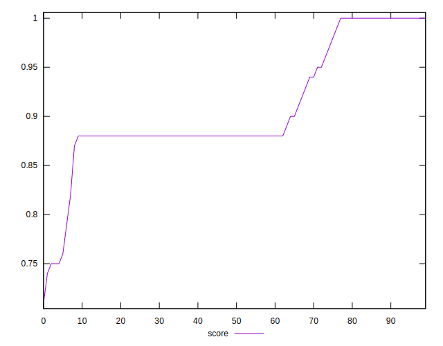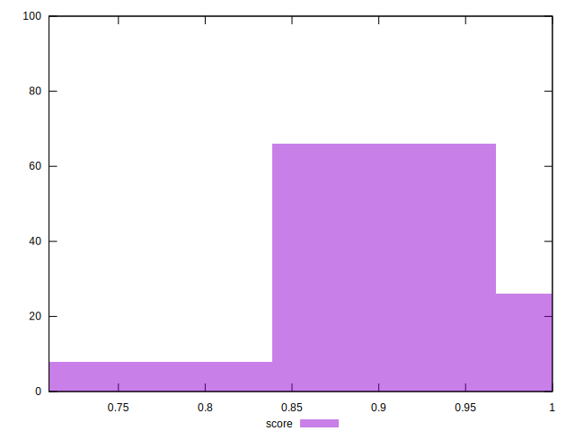
## Raw Estimate

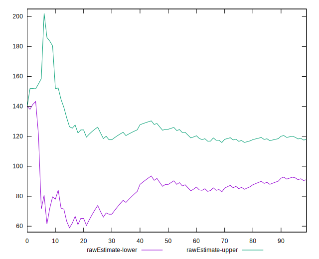
## Score Estimate

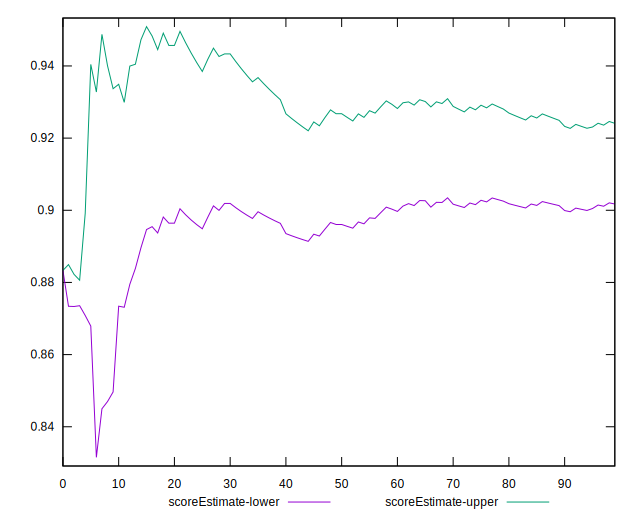
## P Score


```yaml
p90min: 0.8166666666666667
p90max: 1
p90range: 0.18333333333333335
p90mean: 0.9129120879120879
p90median: 0.875
p90stdev: 0.054418108096506074
p90skewness: 0.7635373976453335
p90eccentricity: 0.9999999999999989
p90discretization: 5.6875
outlandishness: 0.9789443974092784
confidence: 0.026727707881437857
p90confidence: 0.022361494698516227

```

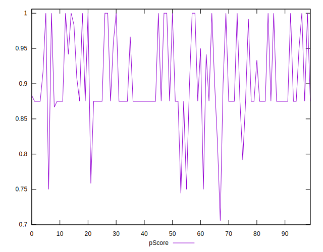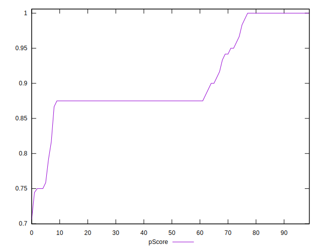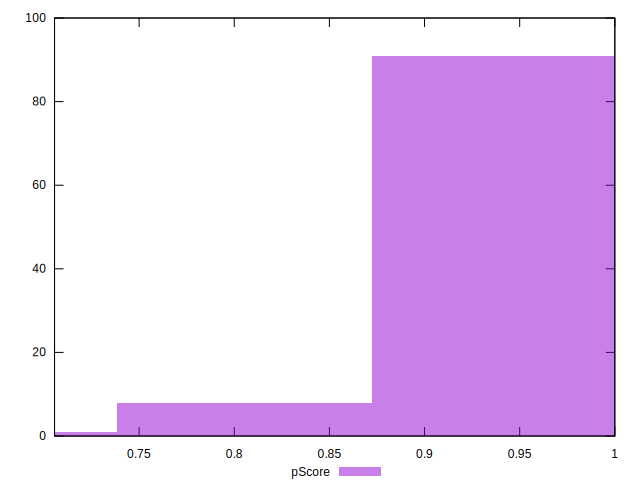
## Score Difference


```yaml
p90min: 0
p90max: 0
p90range: 0
p90mean: 0
p90median: 0
p90stdev: 0
p90skewness: .nan
p90eccentricity: .nan
p90discretization: 91
outlandishness: .inf
confidence: 9.484951648085953e-18
p90confidence: 0

```

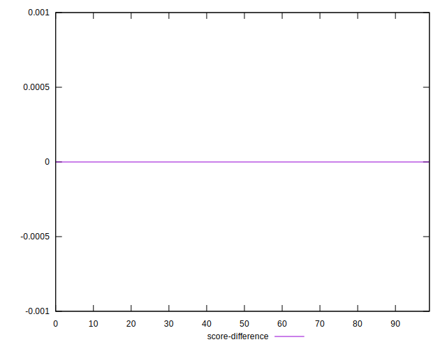
## P Score Difference


```yaml
p90min: -0.0050000000000000044
p90max: 0
p90range: 0.0050000000000000044
p90mean: -0.003162393162393164
p90median: -0.0050000000000000044
p90stdev: 0.0023144657073712878
p90skewness: 0.5564711018526068
p90eccentricity: 0.9999999999999997
p90discretization: 13
outlandishness: 0.7021987034331634
confidence: 0.0010822524102598007
p90confidence: 0.0009510604917300266

```

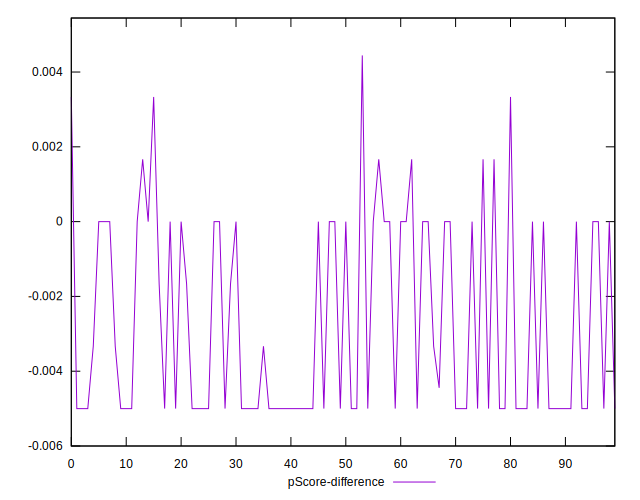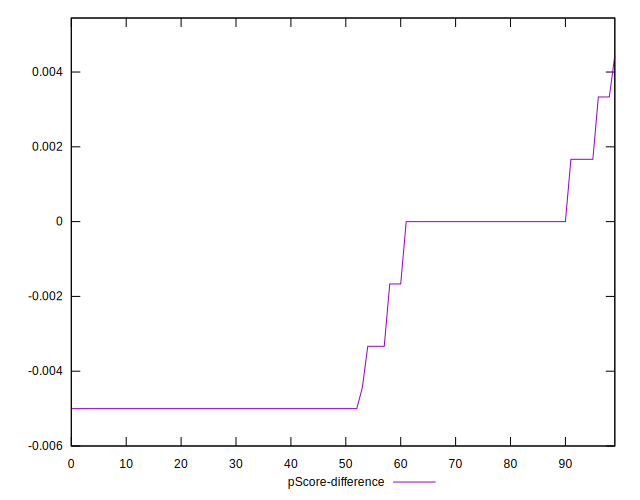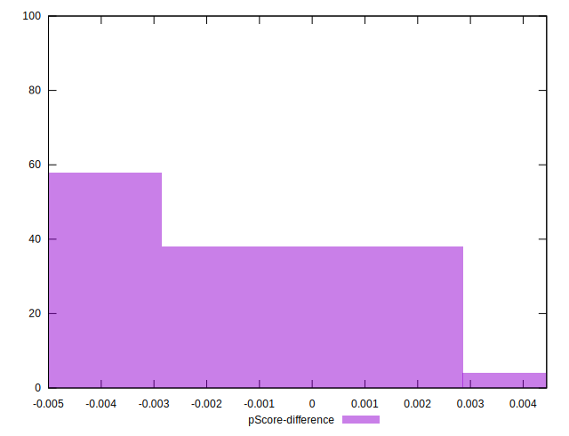