# //uses-optimized-images/samples/pages+cached+noexternal

[→ Parent](../..)


## Raw


```yaml
p90min: 0
p90max: 200
p90range: 200
p90mean: 115.82417582417582
p90median: 150
p90stdev: 59.70745409804531
p90skewness: -1.2520103183520783
p90eccentricity: 0.9999999999999993
p90discretization: 7.583333333333333
outlandishness: 1.1058497891829804
confidence: 30.907233805786262
p90confidence: 24.534993313394295

```

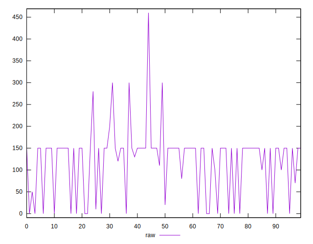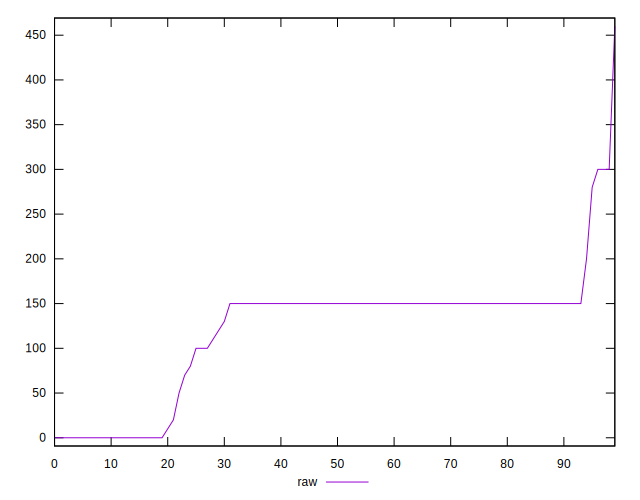
## Score


```yaml
p90min: 0.83
p90max: 1
p90range: 0.17000000000000004
p90mean: 0.9069230769230766
p90median: 0.88
p90stdev: 0.047779077394675455
p90skewness: 1.247309635459551
p90eccentricity: 1.0000000000000016
p90discretization: 7.583333333333333
outlandishness: 0.9893921495121362
confidence: 0.024594510264655645
p90confidence: 0.019633383504738866

```

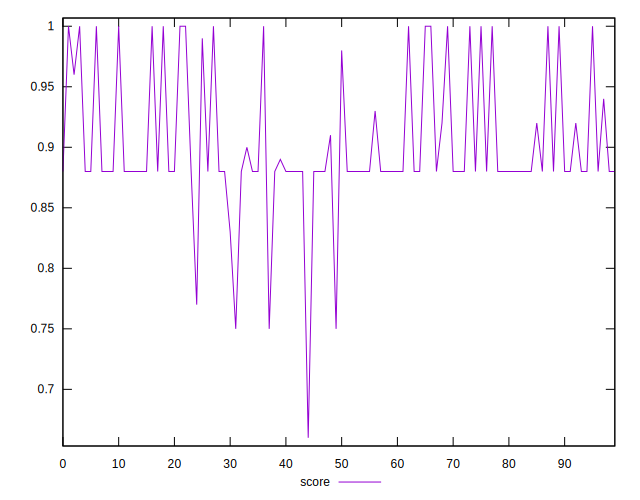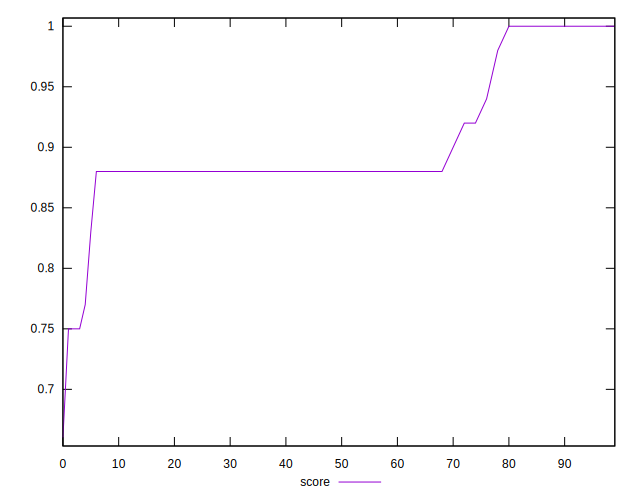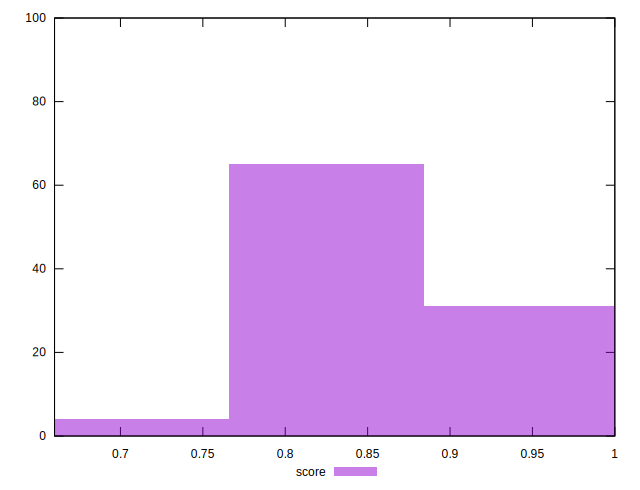
## Raw Estimate

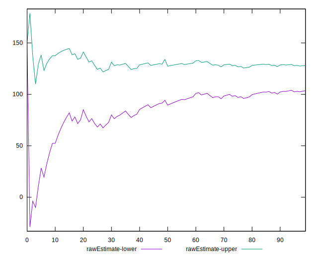
## Score Estimate


## P Score


```yaml
p90min: 0.8333333333333333
p90max: 1
p90range: 0.16666666666666674
p90mean: 0.9034798534798535
p90median: 0.875
p90stdev: 0.049756211748371026
p90skewness: 1.2520103183520892
p90eccentricity: 1.0000000000000018
p90discretization: 7.583333333333333
outlandishness: 0.9899853321765298
confidence: 0.025057605606230604
p90confidence: 0.020445827761161883

```

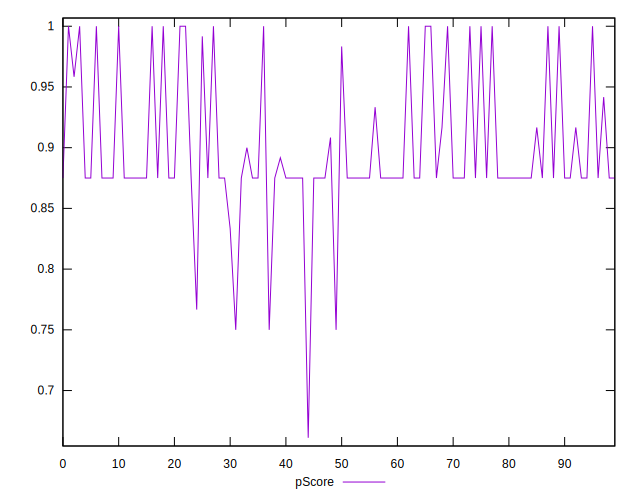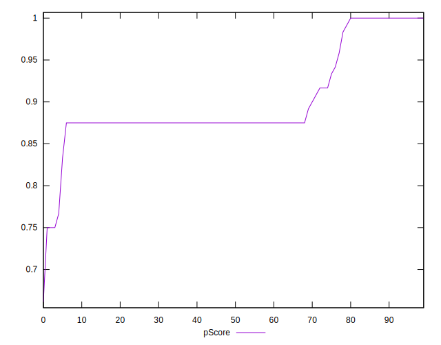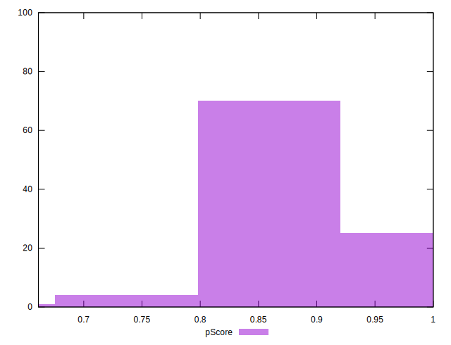
## Score Difference


```yaml
p90min: 0
p90max: 0
p90range: 0
p90mean: 0
p90median: 0
p90stdev: 0
p90skewness: .nan
p90eccentricity: .nan
p90discretization: 91
outlandishness: .inf
confidence: 6.092792000602806e-18
p90confidence: 0

```

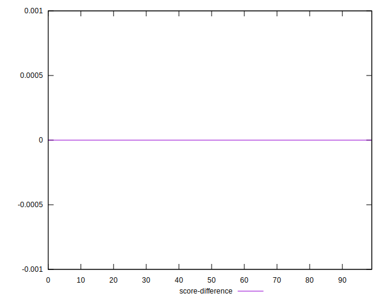
## P Score Difference


```yaml
p90min: -0.0050000000000000044
p90max: 0
p90range: 0.0050000000000000044
p90mean: -0.0036446886446886506
p90median: -0.0050000000000000044
p90stdev: 0.0021385479981568148
p90skewness: 1.038060887011709
p90eccentricity: 0.999999999999998
p90discretization: 18.2
outlandishness: 0.7496020987124352
confidence: 0.0010162734735329713
p90confidence: 0.0008787723681701574

```

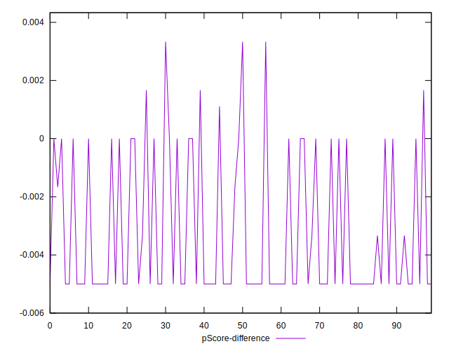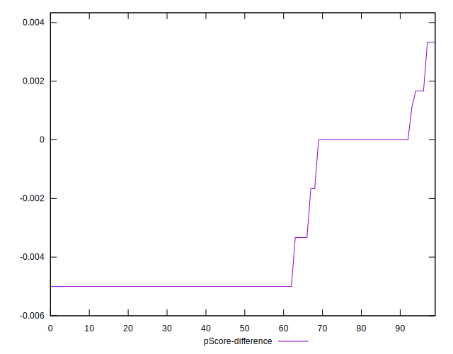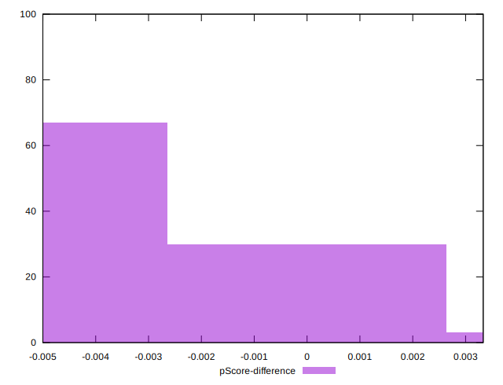