# //uses-optimized-images/samples/pages+cached

[→ Parent](../..)


## Raw


```yaml
p90min: 0
p90max: 270
p90range: 270
p90mean: 122.3076923076923
p90median: 150
p90stdev: 66.01826126117892
p90skewness: -0.9061276258714493
p90eccentricity: 1.000000000000001
p90discretization: 5.352941176470588
outlandishness: 1.2346144891420436
confidence: 32.177308408885295
p90confidence: 27.12823085615318

```

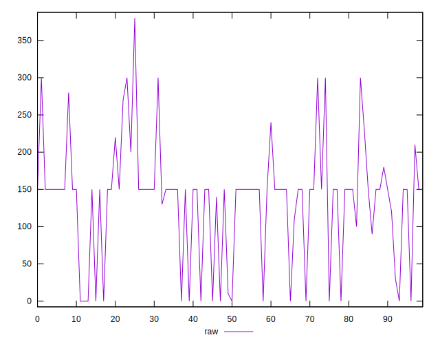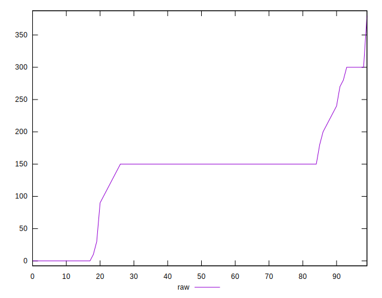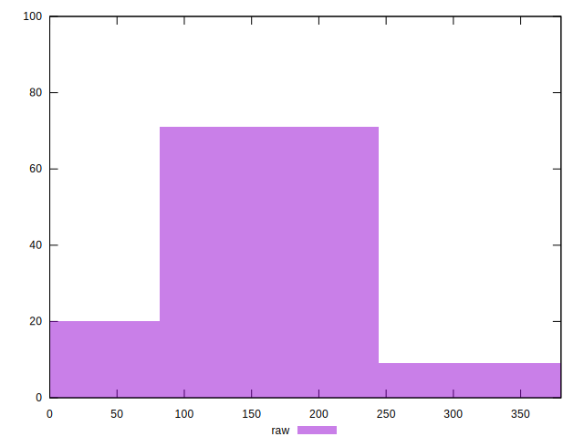
## Score


```yaml
p90min: 0.8
p90max: 1
p90range: 0.19999999999999996
p90mean: 0.903956043956044
p90median: 0.88
p90stdev: 0.05297478398441912
p90skewness: 0.9393171122448741
p90eccentricity: 0.9999999999999996
p90discretization: 6.5
outlandishness: 0.9697963699864908
confidence: 0.026283869729922138
p90confidence: 0.02176840380267997

```

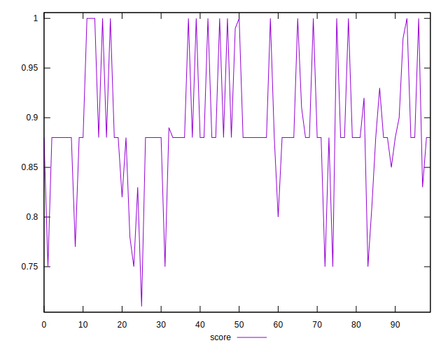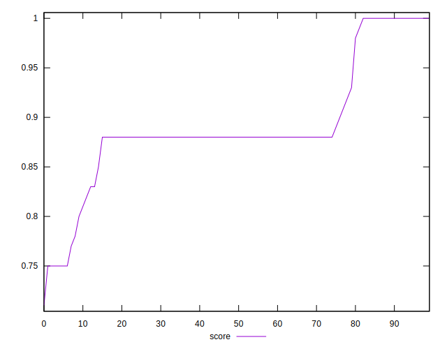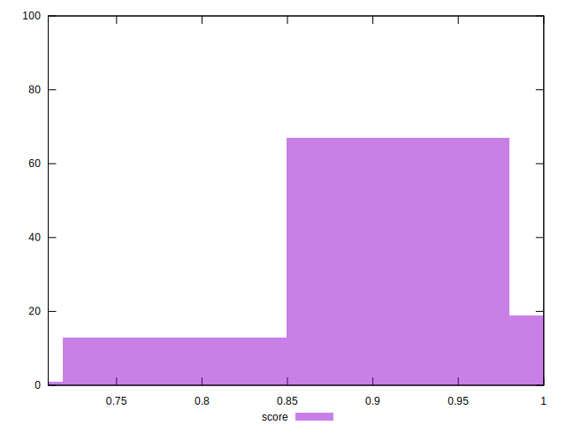
## Raw Estimate

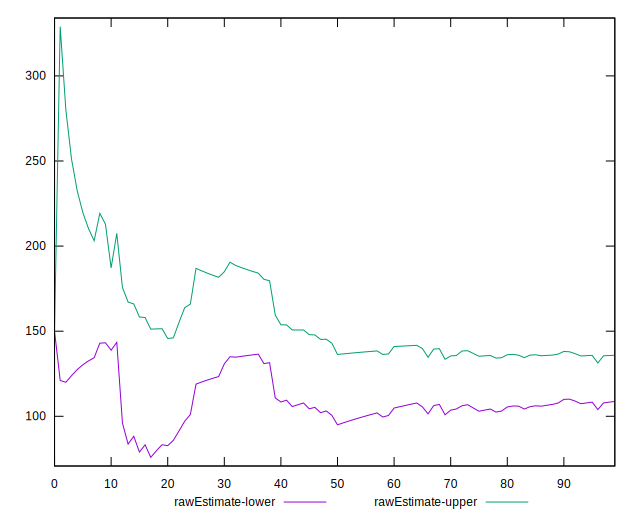
## Score Estimate

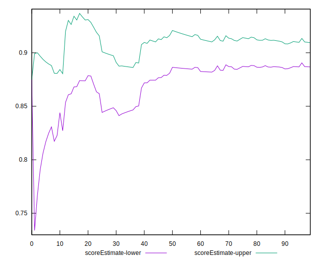
## P Score


```yaml
p90min: 0.775
p90max: 1
p90range: 0.22499999999999998
p90mean: 0.898076923076923
p90median: 0.875
p90stdev: 0.05501521771764908
p90skewness: 0.9061276258714545
p90eccentricity: 1.0000000000000024
p90discretization: 5.352941176470588
outlandishness: 0.9754229378718359
confidence: 0.026568264570361988
p90confidence: 0.02260685904679427

```

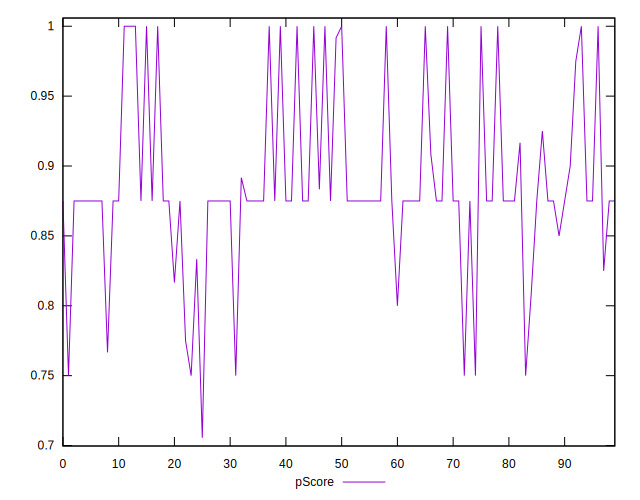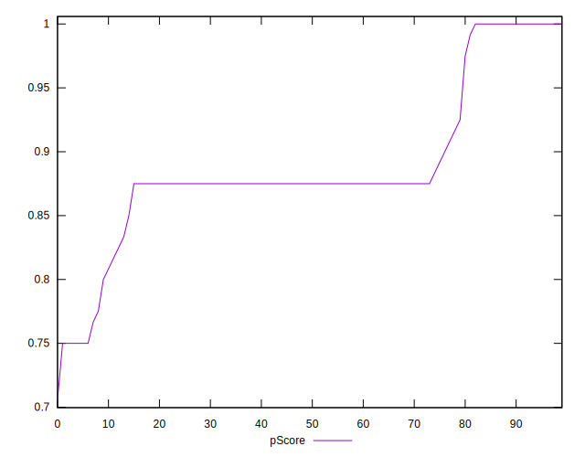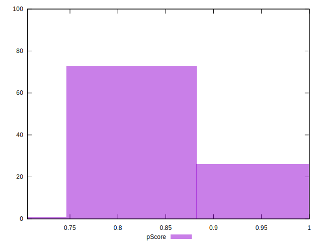
## Score Difference


```yaml
p90min: 0
p90max: 0
p90range: 0
p90mean: 0
p90median: 0
p90stdev: 0
p90skewness: .nan
p90eccentricity: .nan
p90discretization: 91
outlandishness: .inf
confidence: 7.42394611483107e-18
p90confidence: 0

```

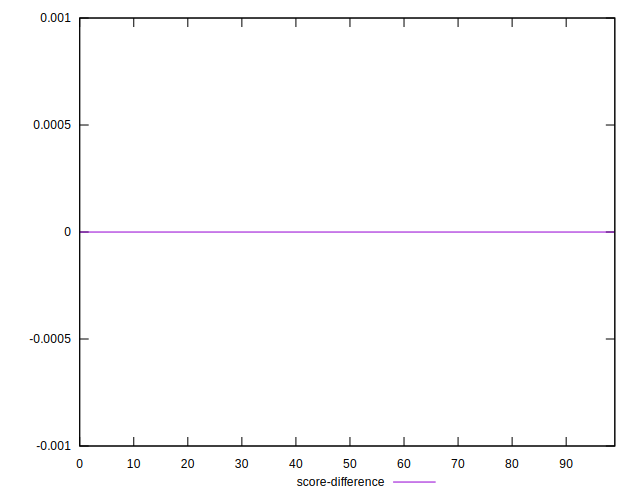
## P Score Difference


```yaml
p90min: -0.0050000000000000044
p90max: 0
p90range: 0.0050000000000000044
p90mean: -0.0036568986568986613
p90median: -0.0050000000000000044
p90stdev: 0.0021399069680593814
p90skewness: 1.0525947208675737
p90eccentricity: 0.9999999999999993
p90discretization: 15.166666666666666
outlandishness: 0.7790788322775024
confidence: 0.0009757115809217575
p90confidence: 0.0008793307962253515

```

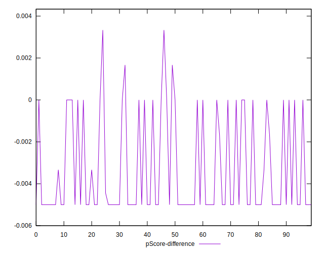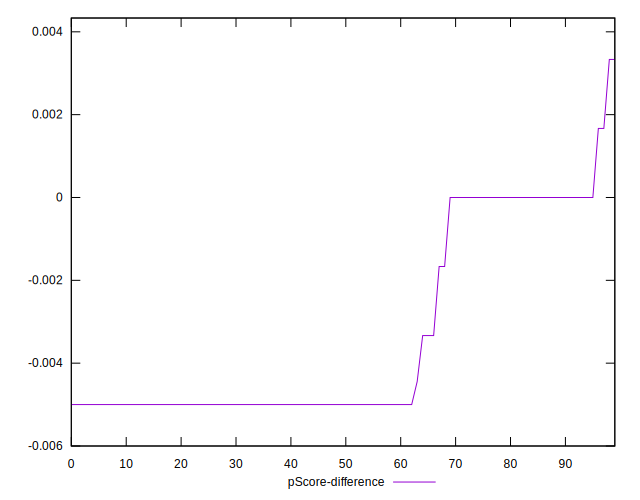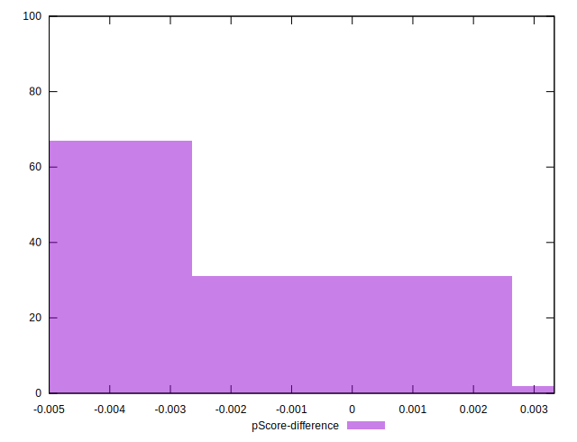