# //uses-optimized-images/samples/pages

[→ Parent](../..)


## Raw


```yaml
p90min: 150
p90max: 300
p90range: 150
p90mean: 265.38461538461536
p90median: 300
p90stdev: 63.198756635211595
p90skewness: -1.2780193008453786
p90eccentricity: 0.9999999999999961
p90discretization: 45.5
outlandishness: 0.8411814022264232
confidence: 36.37819874908547
p90confidence: 25.969639718912617

```

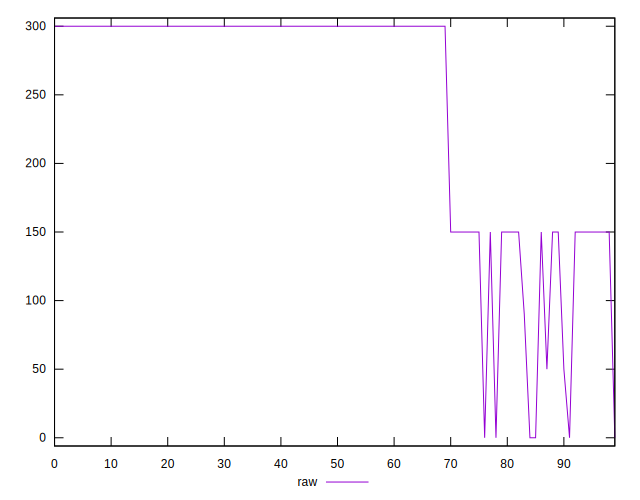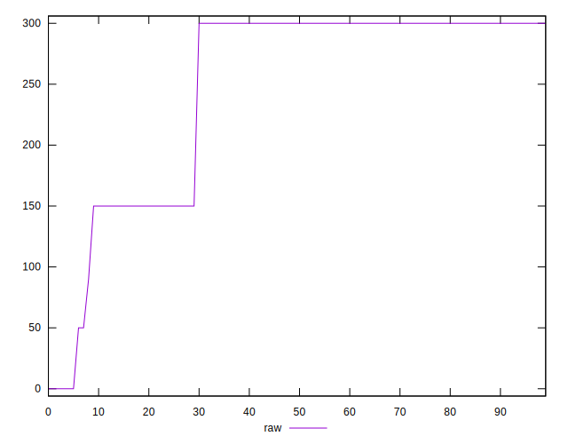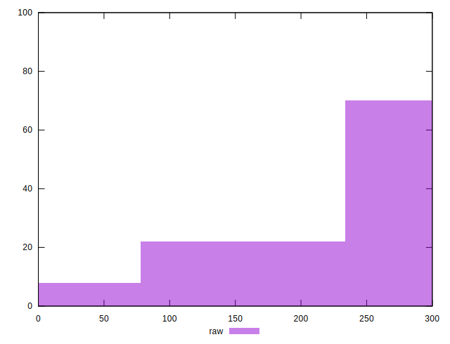
## Score


```yaml
p90min: 0.75
p90max: 0.88
p90range: 0.13
p90mean: 0.78
p90median: 0.75
p90stdev: 0.054772255750516696
p90skewness: 1.2780193008453804
p90eccentricity: 0.9999999999999962
p90discretization: 45.5
outlandishness: 1.0474735207100583
confidence: 0.030796042863844963
p90confidence: 0.022507021089724244

```

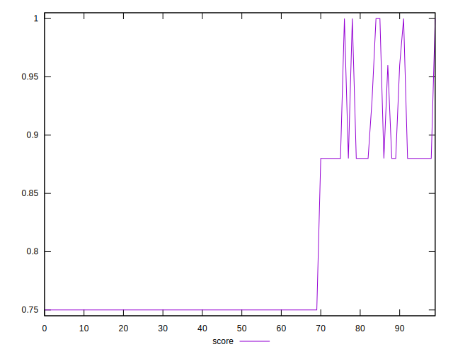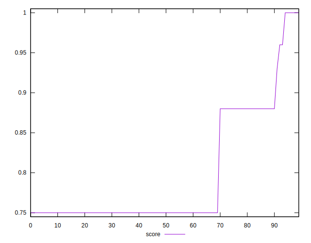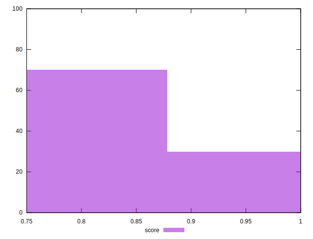
## Raw Estimate

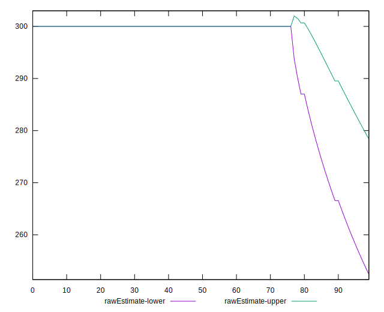
## Score Estimate

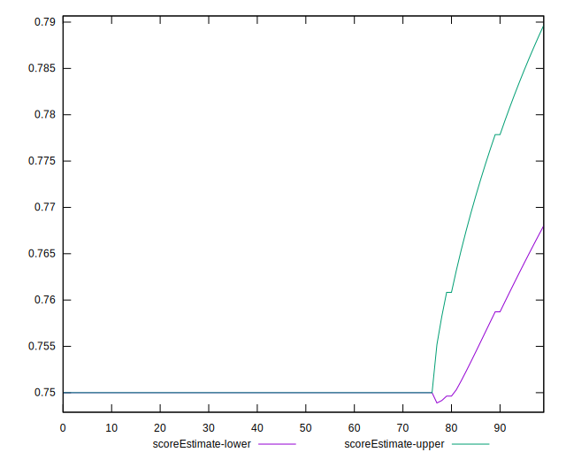
## P Score


```yaml
p90min: 0.75
p90max: 0.875
p90range: 0.125
p90mean: 0.7788461538461539
p90median: 0.75
p90stdev: 0.05266563052934295
p90skewness: 1.2780193008453835
p90eccentricity: 0.9999999999999984
p90discretization: 45.5
outlandishness: 1.047598581788006
confidence: 0.03031516562423775
p90confidence: 0.02164136643242709

```

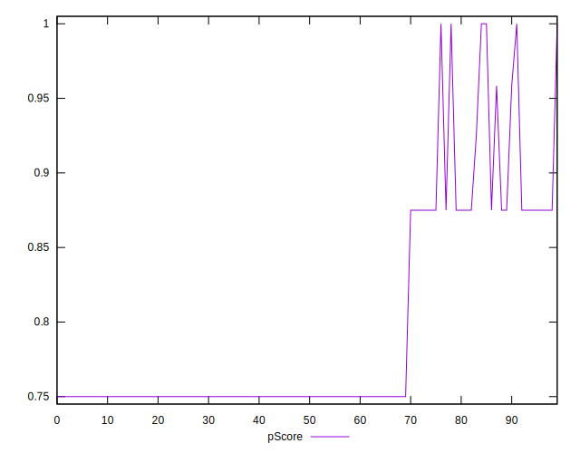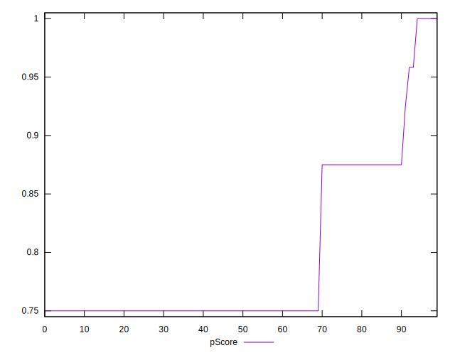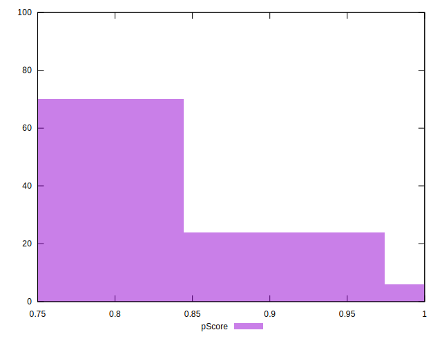
## Score Difference


```yaml
p90min: 0
p90max: 0
p90range: 0
p90mean: 0
p90median: 0
p90stdev: 0
p90skewness: .nan
p90eccentricity: .nan
p90discretization: 91
outlandishness: .nan
confidence: 0
p90confidence: 0

```


## P Score Difference


```yaml
p90min: -0.0050000000000000044
p90max: 0
p90range: 0.0050000000000000044
p90mean: -0.0007509157509157499
p90median: 0
p90stdev: 0.0017517431796656966
p90skewness: -1.9761633447770197
p90eccentricity: 0.9999999999999947
p90discretization: 30.333333333333332
outlandishness: 2.27789077929804
confidence: 0.0008101184469432245
p90confidence: 0.0007198264915014856

```

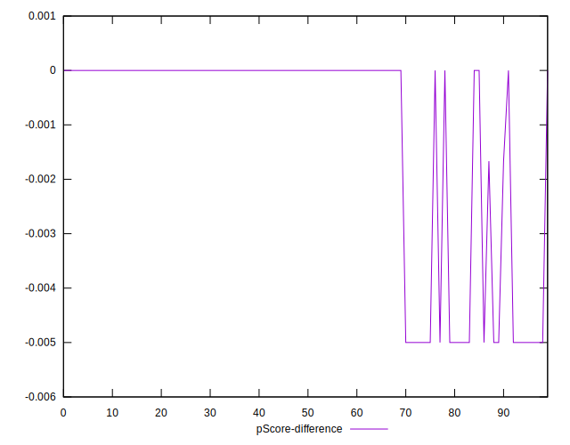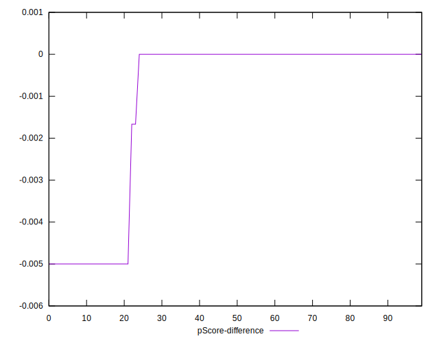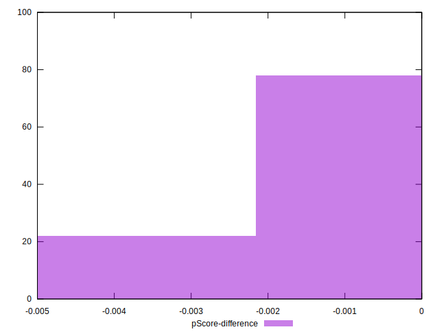