# //uses-rel-preconnect/samples/pages+cached+noexternal+nomedia+nocss+nojs

[→ Parent](../..)


## Raw


```yaml
p90min: 157.52899999916553
p90max: 308.312
p90range: 150.78300000083448
p90mean: 283.1496593406109
p90median: 301.04
p90stdev: 38.89711718200714
p90skewness: -1.9430874733324917
p90eccentricity: 1.0000000000000002
p90discretization: 1.0224719101123596
outlandishness: 0.841222362105671
confidence: 32.871694546844935
p90confidence: 15.98360748062953

```

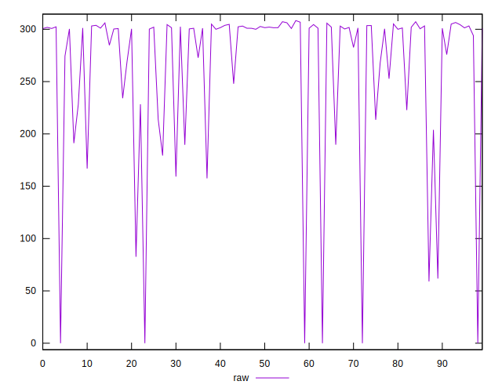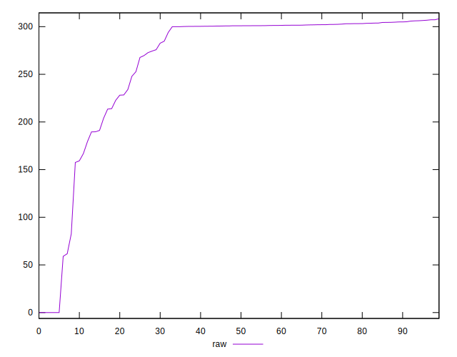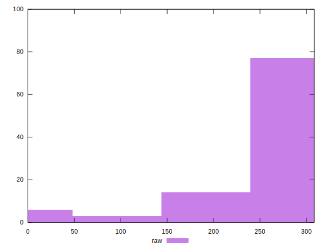
## Score


```yaml
p90min: 0.75
p90max: 0.87
p90range: 0.12
p90mean: 0.7653846153846154
p90median: 0.75
p90stdev: 0.03138935538435724
p90skewness: 2.0197477464614524
p90eccentricity: 1.000000000000001
p90discretization: 7
outlandishness: 1.05137714461756
confidence: 0.027087127725516913
p90confidence: 0.012898517213651761

```

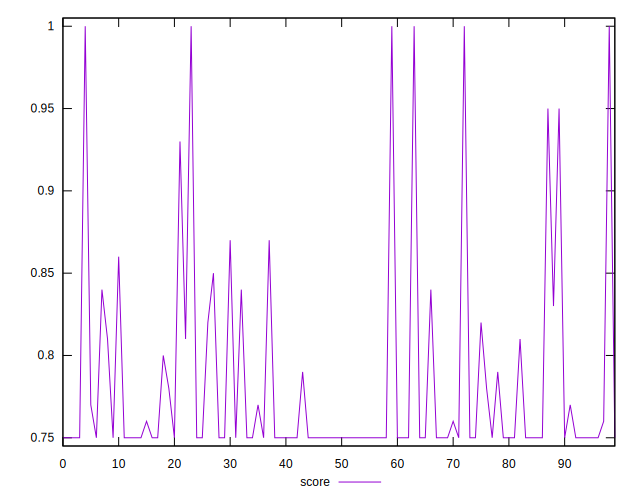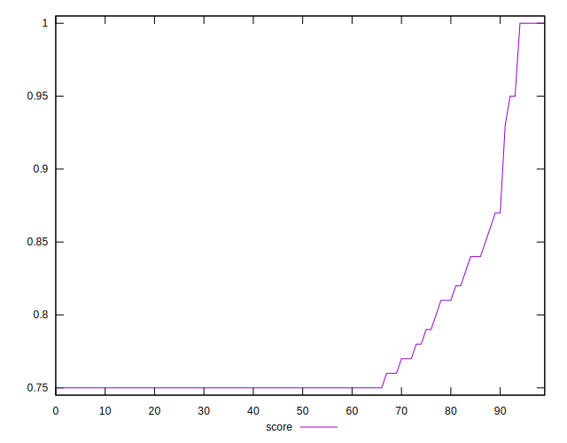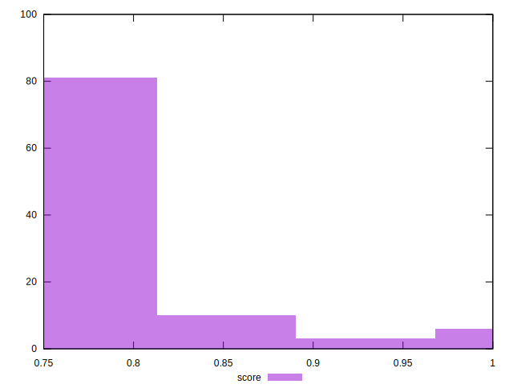
## Raw Estimate

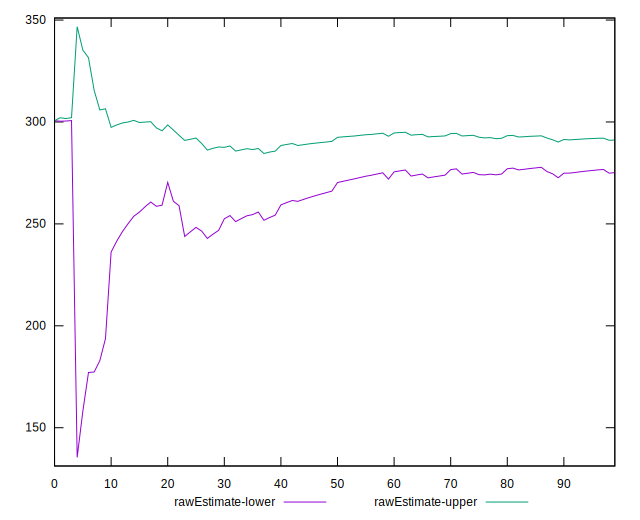
## Score Estimate

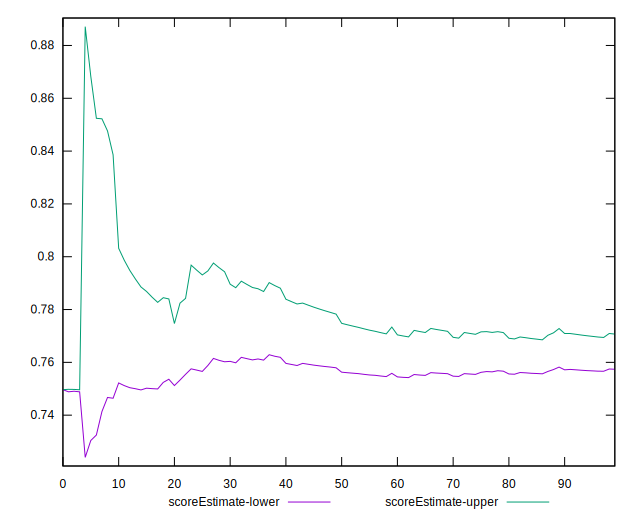
## P Score


```yaml
p90min: 0.7453822222222222
p90max: 0.8687258333340288
p90range: 0.12334361111180658
p90mean: 0.764549255189308
p90median: 0.7494222222222222
p90stdev: 0.032143115260382514
p90skewness: 1.9586808713552675
p90eccentricity: 0.9999999999999992
p90discretization: 1.0224719101123596
outlandishness: 1.0516501678015666
confidence: 0.0272976909831546
p90confidence: 0.01320825230113054

```

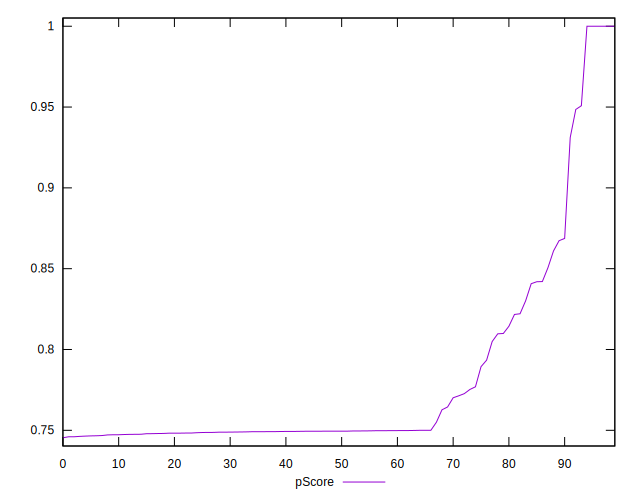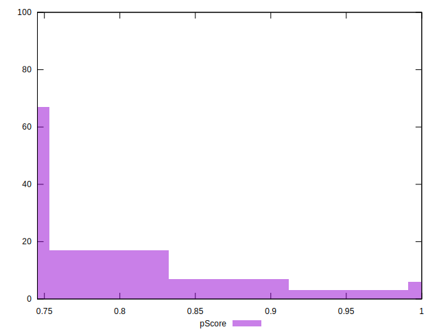
## Score Difference


```yaml
p90min: 0
p90max: 0
p90range: 0
p90mean: 0
p90median: 0
p90stdev: 0
p90skewness: .nan
p90eccentricity: .nan
p90discretization: 91
outlandishness: .inf
confidence: 9.48495164808596e-18
p90confidence: 0

```

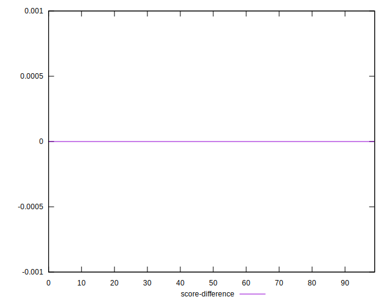
## P Score Difference


```yaml
p90min: -0.004017777777777787
p90max: 0.0021066666673869028
p90range: 0.0061244444451646896
p90mean: -0.0009197069596232643
p90median: -0.0006711111111111778
p90stdev: 0.0013334479170835772
p90skewness: -0.26323254281109015
p90eccentricity: 1.0000000000000007
p90discretization: 1.0963855421686748
outlandishness: 0.6734877092241162
confidence: 0.0007223286884235087
p90confidence: 0.0005479405582372032

```

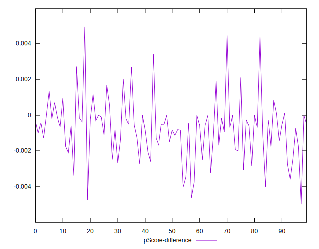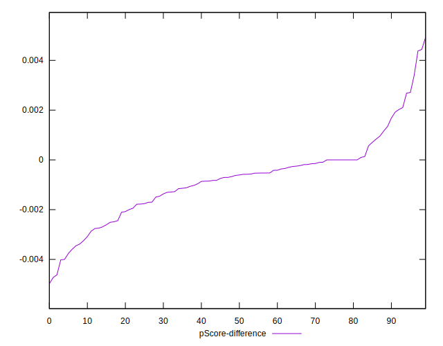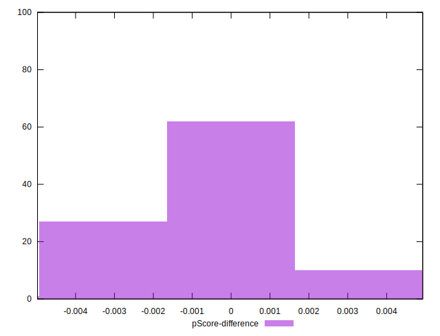