# //uses-rel-preconnect/samples/pages+cached+noexternal+nomedia+nocss

[→ Parent](../..)


## Raw


```yaml
p90min: 99.3969999961555
p90max: 309.12
p90range: 209.7230000038445
p90mean: 273.01683516467824
p90median: 301.016
p90stdev: 53.440583666255925
p90skewness: -1.7582234321218146
p90eccentricity: 1.0000000000000002
p90discretization: 1.0224719101123596
outlandishness: 0.8489388663341798
confidence: 33.72694022460803
p90confidence: 21.9598102568973

```

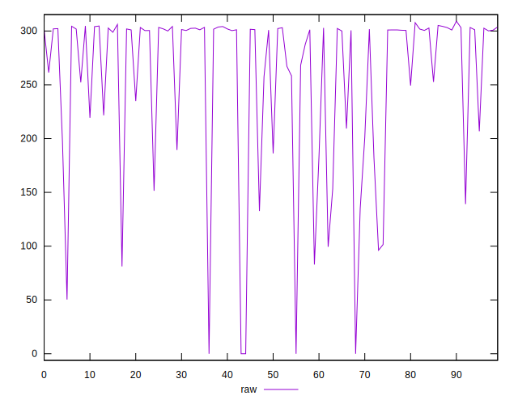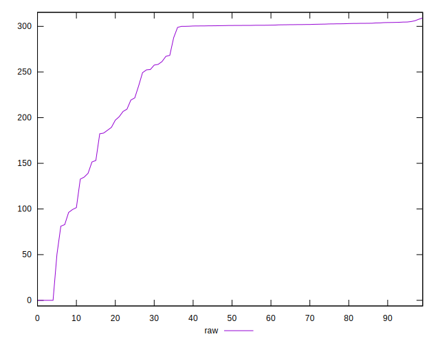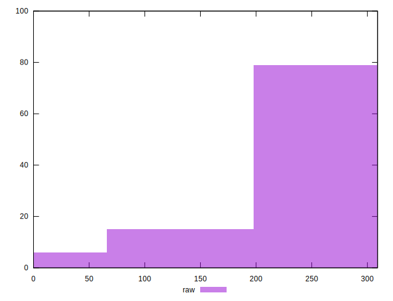
## Score


```yaml
p90min: 0.74
p90max: 0.92
p90range: 0.18000000000000005
p90mean: 0.7738461538461539
p90median: 0.75
p90stdev: 0.04409702665636734
p90skewness: 1.7905676529482772
p90eccentricity: 1.0000000000000013
p90discretization: 6.5
outlandishness: 1.0464110430854239
confidence: 0.027882345967133126
p90confidence: 0.018120354828359053

```

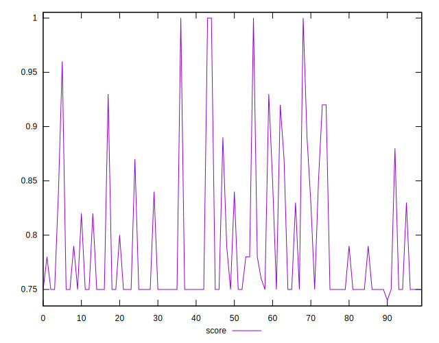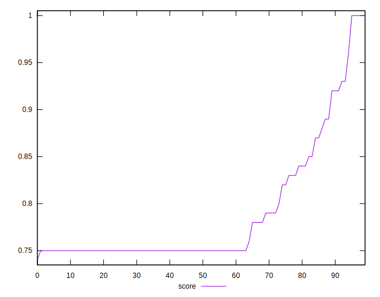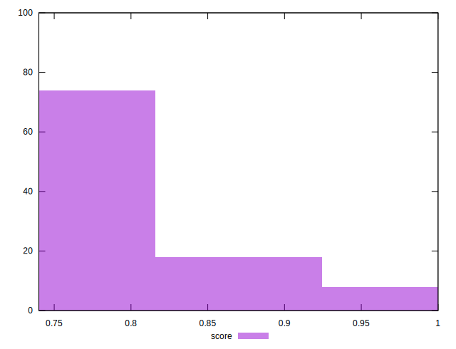
## Raw Estimate

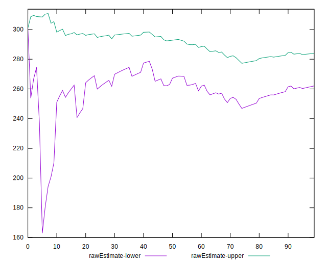
## Score Estimate

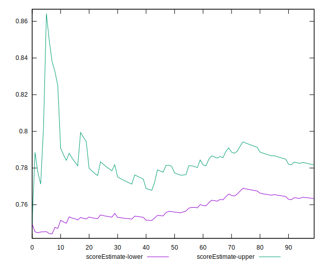
## P Score


```yaml
p90min: 0.7449333333333333
p90max: 0.9171691666698705
p90range: 0.17223583333653714
p90mean: 0.7729368559219867
p90median: 0.7494355555555555
p90stdev: 0.04427690915873799
p90skewness: 1.7682923027393518
p90eccentricity: 0.9999999999999993
p90discretization: 1.0224719101123596
outlandishness: 1.0467124535345427
confidence: 0.02800877958683201
p90confidence: 0.018194272165139358

```

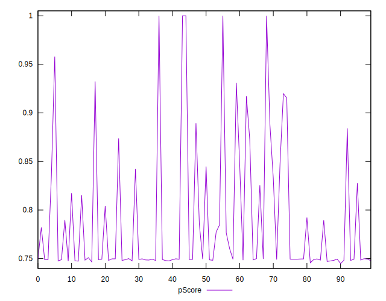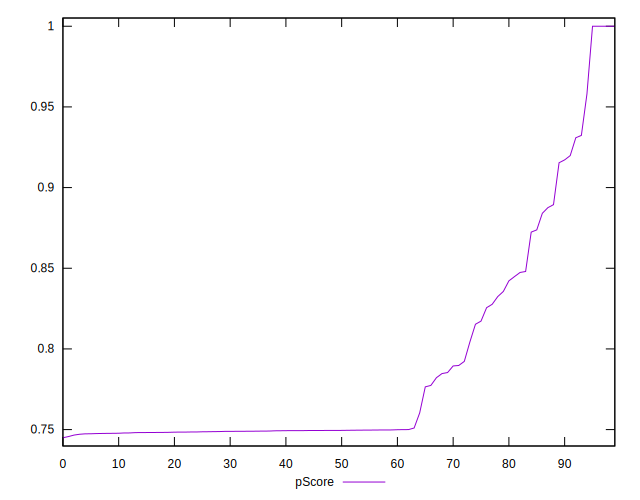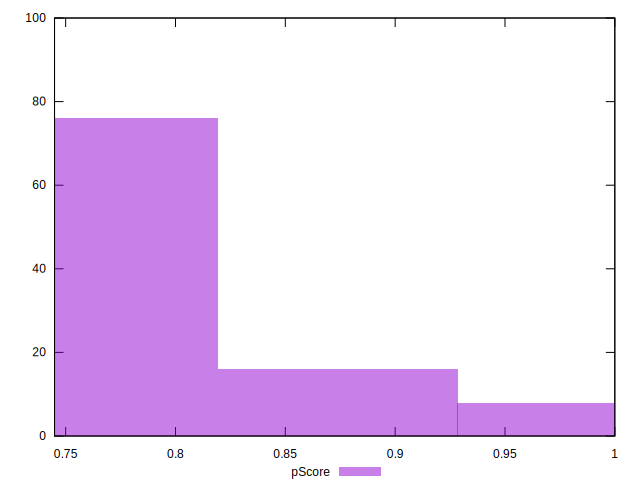
## Score Difference


```yaml
p90min: 0
p90max: 0
p90range: 0
p90mean: 0
p90median: 0
p90stdev: 0
p90skewness: .nan
p90eccentricity: .nan
p90discretization: 91
outlandishness: .inf
confidence: 9.484951648085952e-18
p90confidence: 0

```

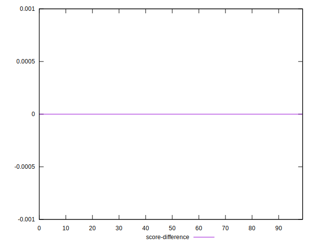
## P Score Difference


```yaml
p90min: -0.004436666667461342
p90max: 0.002440833334500625
p90range: 0.006877500001961967
p90mean: -0.0010365048838818028
p90median: -0.0009633333333333161
p90stdev: 0.0014088659426626264
p90skewness: 0.23795595588957455
p90eccentricity: 0.9999999999999999
p90discretization: 1.0833333333333333
outlandishness: 0.6202274393822811
confidence: 0.000780036433818167
p90confidence: 0.0005789313412347978

```

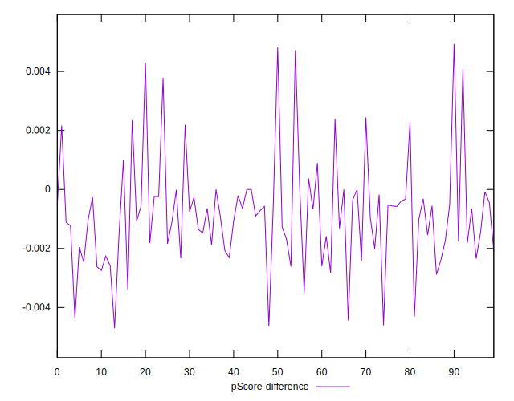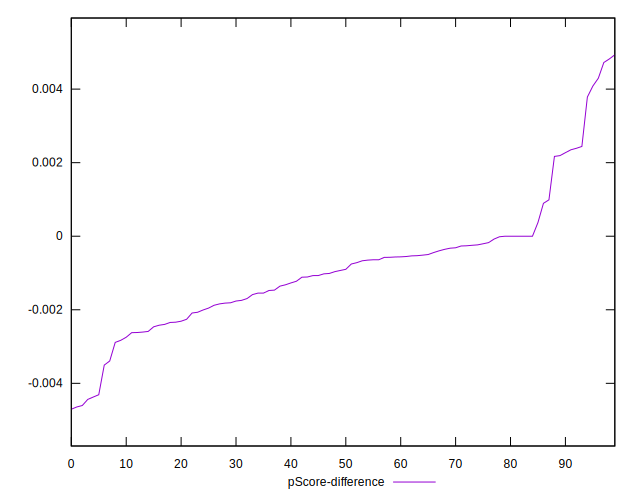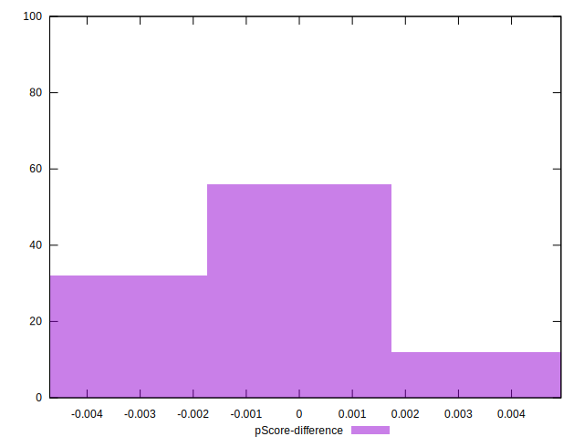