# //uses-rel-preconnect/samples/pages+cached+noexternal+nomedia

[→ Parent](../..)


## Raw


```yaml
p90min: 52.63100000098348
p90max: 305.336
p90range: 252.70499999901654
p90mean: 260.2400879120162
p90median: 300.364
p90stdev: 62.87127702617177
p90skewness: -1.482310894597221
p90eccentricity: 1.0000000000000002
p90discretization: 1.0459770114942528
outlandishness: 0.8316059289221484
confidence: 37.04561032175104
p90confidence: 25.83507176354692

```

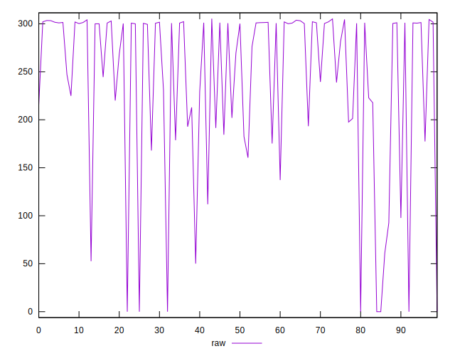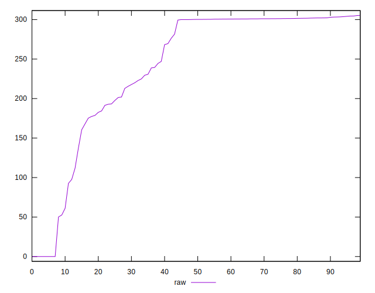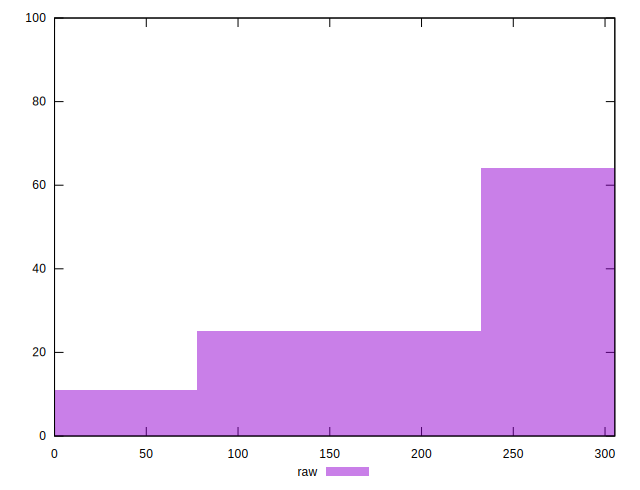
## Score


```yaml
p90min: 0.75
p90max: 0.96
p90range: 0.20999999999999996
p90mean: 0.7841758241758243
p90median: 0.75
p90stdev: 0.05222659703166145
p90skewness: 1.511177277671777
p90eccentricity: 0.9999999999999992
p90discretization: 5.352941176470588
outlandishness: 1.0491087313237746
confidence: 0.030755226255110513
p90confidence: 0.02146095874141629

```

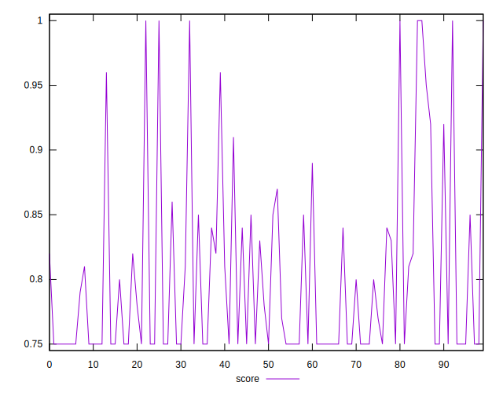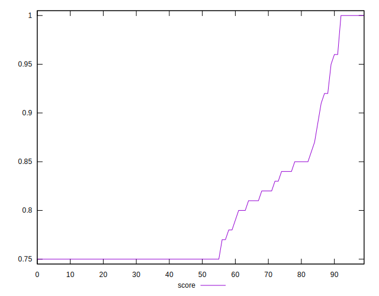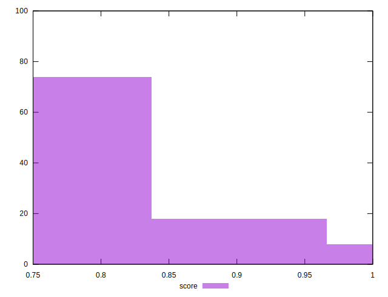
## Raw Estimate

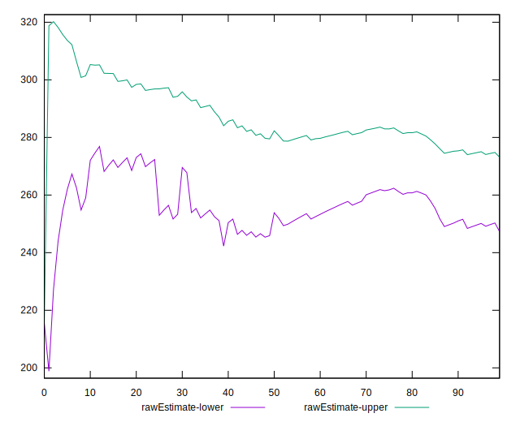
## Score Estimate

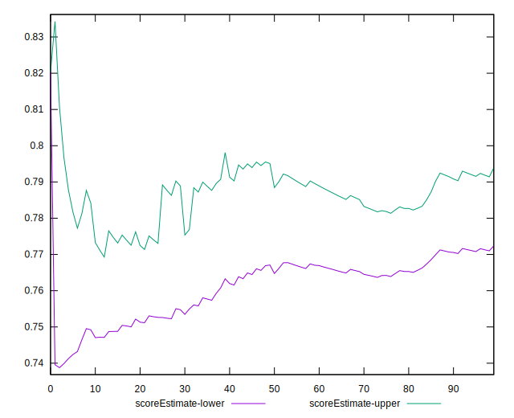
## P Score


```yaml
p90min: 0.7470355555555556
p90max: 0.9561408333325138
p90range: 0.2091052777769582
p90mean: 0.7833908943834436
p90median: 0.7497977777777778
p90stdev: 0.05221963903448009
p90skewness: 1.4889595922108338
p90eccentricity: 1.0000000000000002
p90discretization: 1.0459770114942528
outlandishness: 1.0492979817100514
confidence: 0.03080799296075165
p90confidence: 0.021458099560483168

```

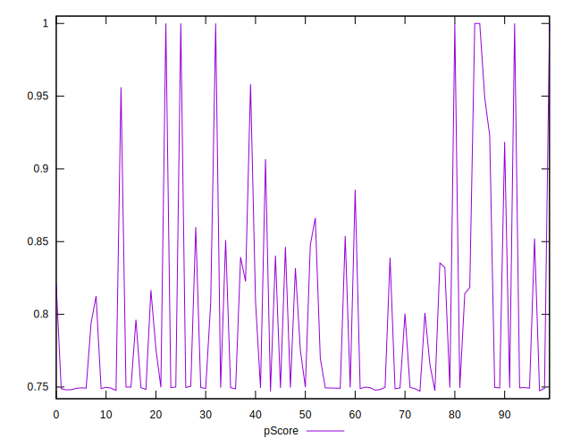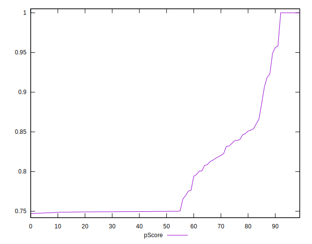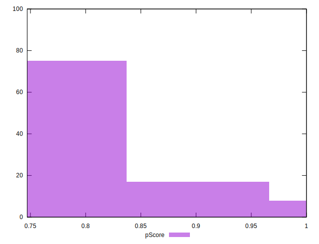
## Score Difference


```yaml
p90min: 0
p90max: 0
p90range: 0
p90mean: 0
p90median: 0
p90stdev: 0
p90skewness: .nan
p90eccentricity: .nan
p90discretization: 91
outlandishness: .inf
confidence: 1.1103983576888553e-17
p90confidence: 0

```

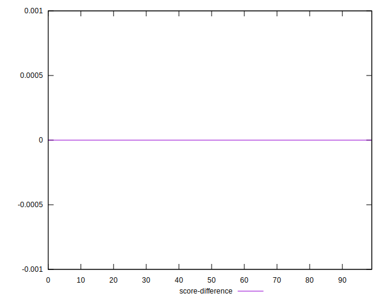
## P Score Difference


```yaml
p90min: -0.0038591666674862024
p90max: 0.0025608333355435775
p90range: 0.00642000000302978
p90mean: -0.0007978876678983997
p90median: -0.0006044444444444075
p90stdev: 0.0012691319968203393
p90skewness: -0.338414260057486
p90eccentricity: 1
p90discretization: 1.1518987341772151
outlandishness: 0.8407506002310319
confidence: 0.0006787566028623208
p90confidence: 0.0005215118535228445

```

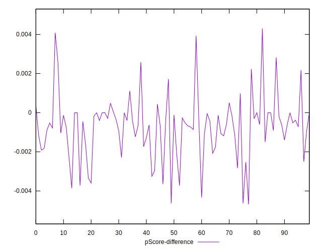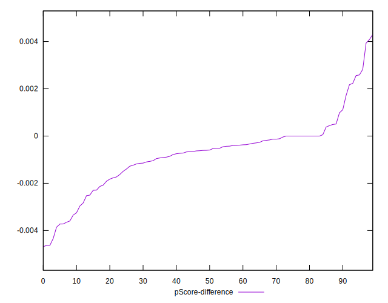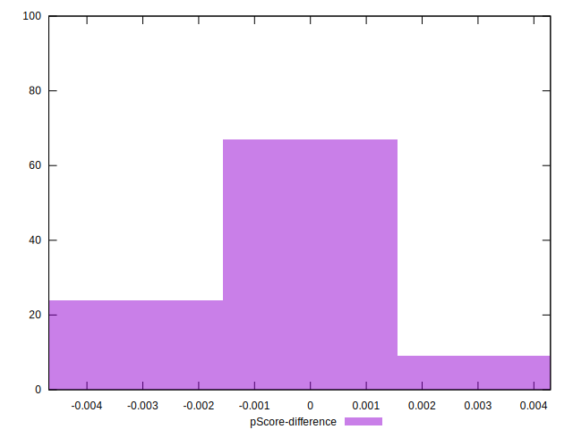