# //uses-rel-preconnect/samples/pages+cached+noexternal

[→ Parent](../..)


## Raw


```yaml
p90min: 92.35199999809265
p90max: 310.228
p90range: 217.87600000190736
p90mean: 253.15172527494397
p90median: 300.42
p90stdev: 70.63334279767565
p90skewness: -1.1520383179289702
p90eccentricity: 0.9999999999999997
p90discretization: 1.011111111111111
outlandishness: 0.8545629416944855
confidence: 35.85551592744508
p90confidence: 29.024660646188806

```

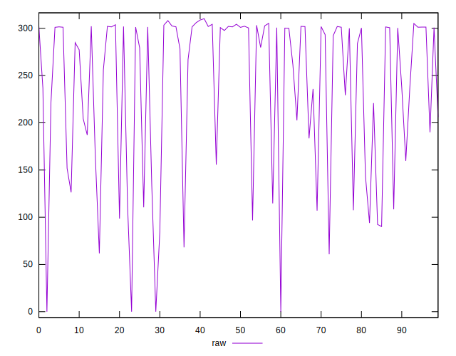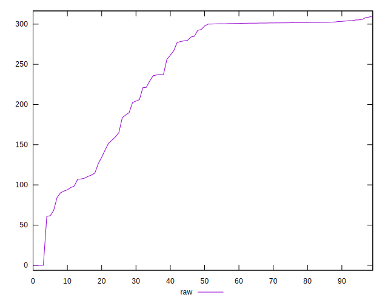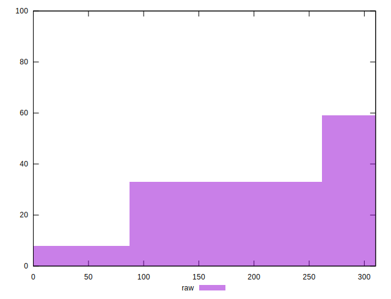
## Score


```yaml
p90min: 0.74
p90max: 0.92
p90range: 0.18000000000000005
p90mean: 0.79
p90median: 0.75
p90stdev: 0.05800719925005142
p90skewness: 1.164746526987224
p90eccentricity: 0.9999999999999996
p90discretization: 4.7894736842105265
outlandishness: 1.0403999999999995
confidence: 0.029538575530364763
p90confidence: 0.02383632441255501

```

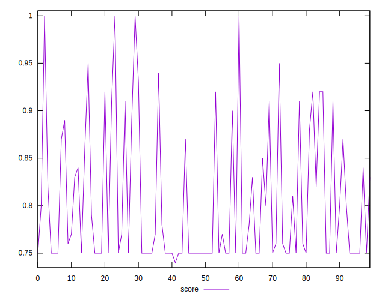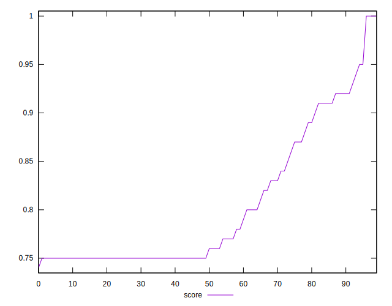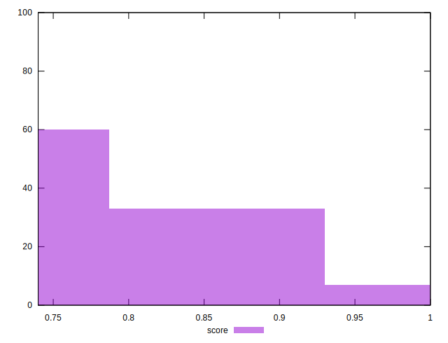
## Raw Estimate

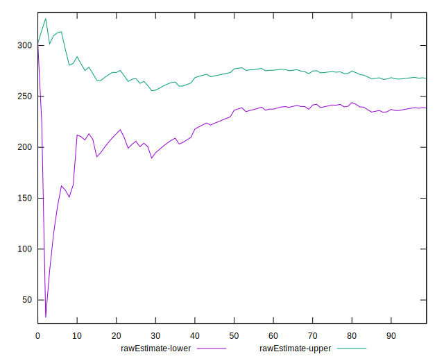
## Score Estimate

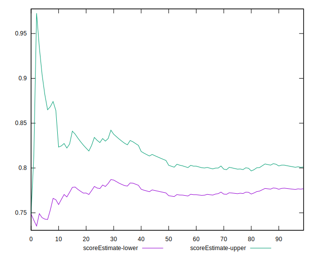
## P Score


```yaml
p90min: 0.7443177777777777
p90max: 0.9230400000015895
p90range: 0.17872222222381173
p90mean: 0.7893940934064125
p90median: 0.7497666666666667
p90stdev: 0.058606574671979154
p90skewness: 1.1583594446350407
p90eccentricity: 1
p90discretization: 1.011111111111111
outlandishness: 1.0407189214764956
confidence: 0.02978310136083362
p90confidence: 0.024082619823929674

```

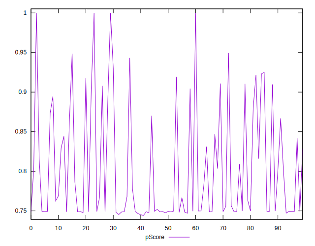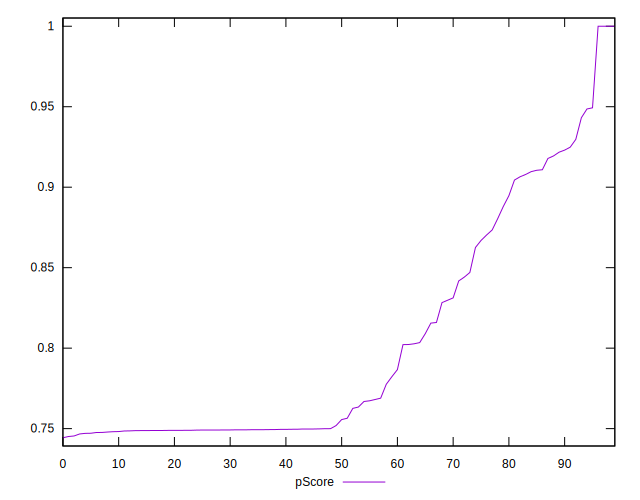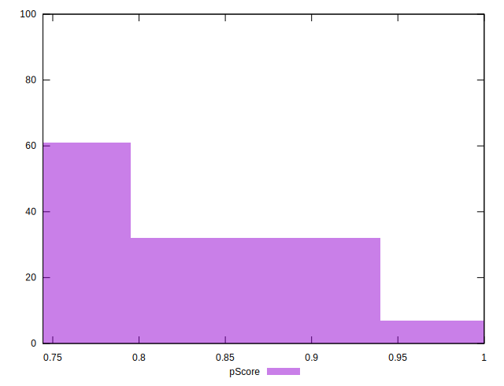
## Score Difference


```yaml
p90min: 0
p90max: 0
p90range: 0
p90mean: 0
p90median: 0
p90stdev: 0
p90skewness: .nan
p90eccentricity: .nan
p90discretization: 91
outlandishness: .inf
confidence: 1.1806664533324078e-17
p90confidence: 0

```

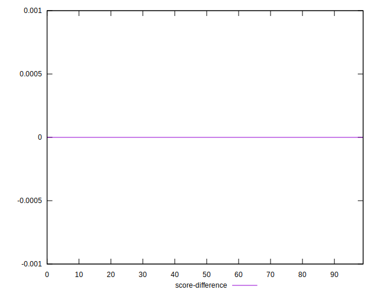
## P Score Difference


```yaml
p90min: -0.004383333334699313
p90max: 0.003436666664977883
p90range: 0.007819999999677196
p90mean: -0.0006756684983136057
p90median: -0.000818333333979071
p90stdev: 0.0017093450224161372
p90skewness: 0.4535810909864955
p90eccentricity: 0.9999999999999996
p90discretization: 1.0459770114942528
outlandishness: 0.5359012674299092
confidence: 0.0008416361248605063
p90confidence: 0.0007024042362683278

```

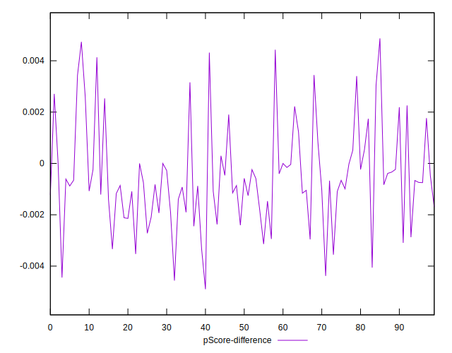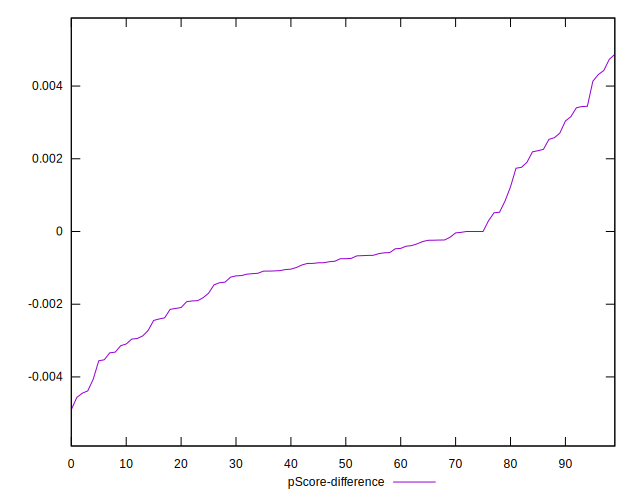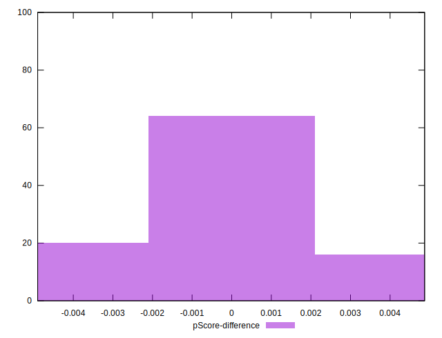