# //uses-rel-preconnect/samples/pages+cached

[→ Parent](../..)


## Raw


```yaml
p90min: 0
p90max: 311.074
p90range: 311.074
p90mean: 276.72217582405597
p90median: 300.738
p90stdev: 55.367623420585105
p90skewness: -2.5650935127537116
p90eccentricity: 1.0000000000000004
p90discretization: 1.0963855421686748
outlandishness: 0.8280999999999998
confidence: 37.31388041312681
p90confidence: 22.751669635283633

```

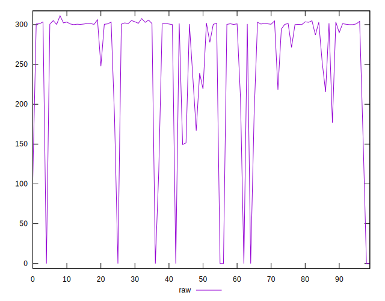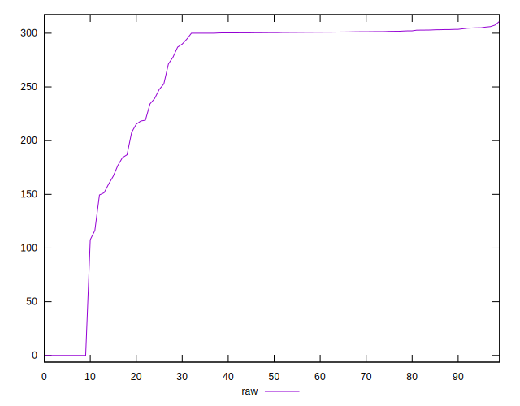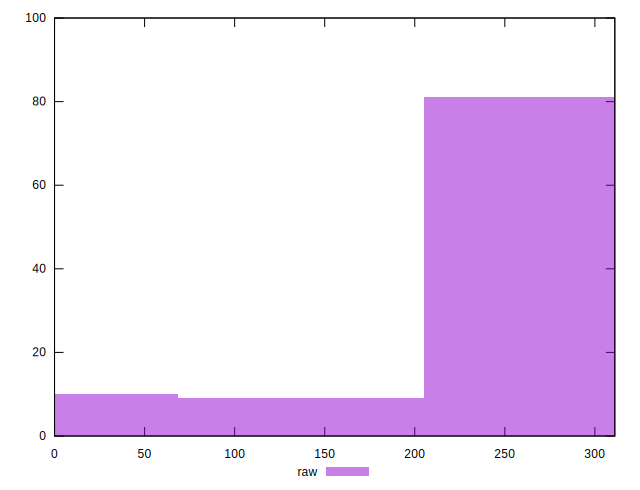
## Score


```yaml
p90min: 0.74
p90max: 1
p90range: 0.26
p90mean: 0.7703296703296703
p90median: 0.75
p90stdev: 0.045608234976739784
p90skewness: 2.5987835817817078
p90eccentricity: 1.0000000000000029
p90discretization: 5.6875
outlandishness: 1.054386206173777
confidence: 0.030897885787200874
p90confidence: 0.01874134071019884

```

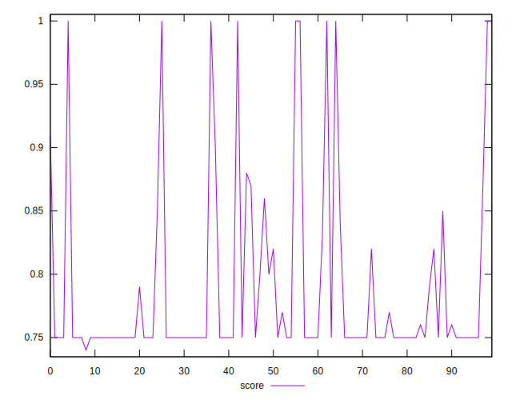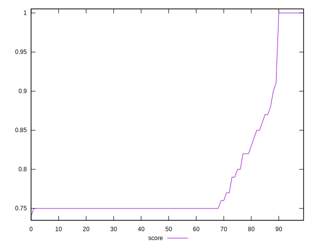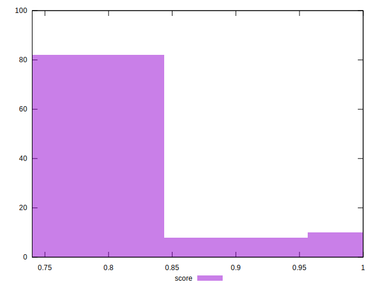
## Raw Estimate

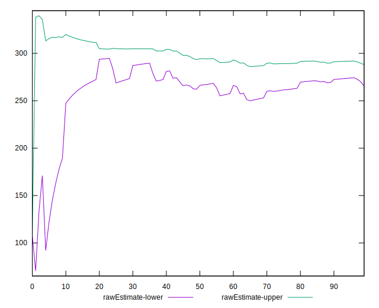
## Score Estimate

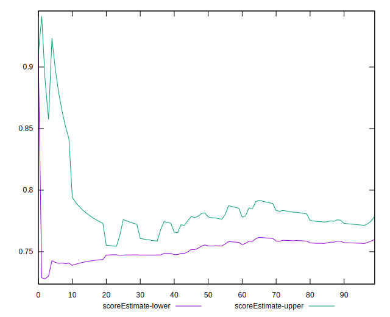
## P Score


```yaml
p90min: 0.7438477777777778
p90max: 1
p90range: 0.2561522222222222
p90mean: 0.7697876251527251
p90median: 0.74959
p90stdev: 0.045950149031091125
p90skewness: 2.5775330821045523
p90eccentricity: 0.9999999999999999
p90discretization: 1.0963855421686748
outlandishness: 1.054555163758899
confidence: 0.031019248354967832
p90confidence: 0.01888184006934912

```

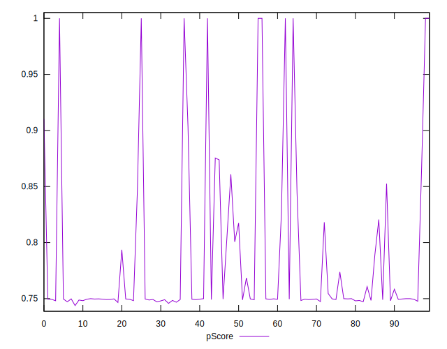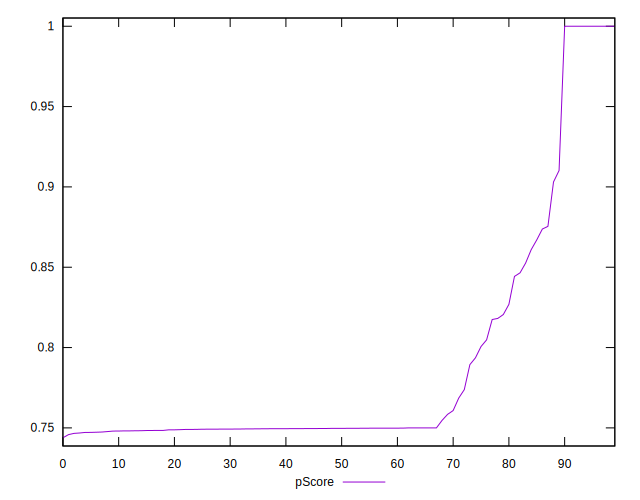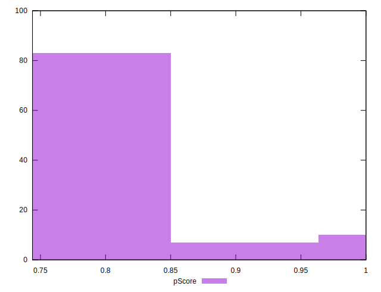
## Score Difference


```yaml
p90min: 0
p90max: 0
p90range: 0
p90mean: 0
p90median: 0
p90stdev: 0
p90skewness: .nan
p90eccentricity: .nan
p90discretization: 91
outlandishness: .inf
confidence: 8.528132291650266e-18
p90confidence: 0

```

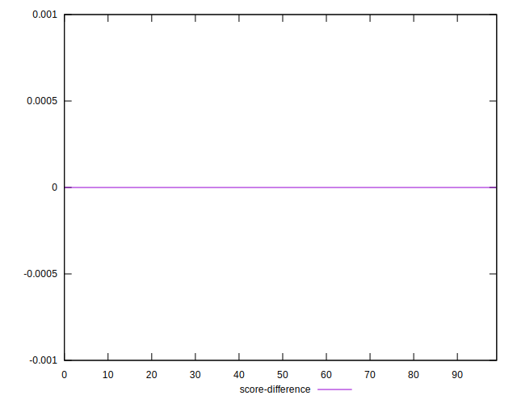
## P Score Difference


```yaml
p90min: -0.0034791666672875365
p90max: 0.003062499997516399
p90range: 0.006541666664803936
p90mean: -0.0007619658119434411
p90median: -0.0005044444444444185
p90stdev: 0.0011265669480937579
p90skewness: -0.08697061023352248
p90eccentricity: 0.9999999999999996
p90discretization: 1.2465753424657535
outlandishness: 0.41906634288888145
confidence: 0.0006809762283289959
p90confidence: 0.00046292900871612043

```

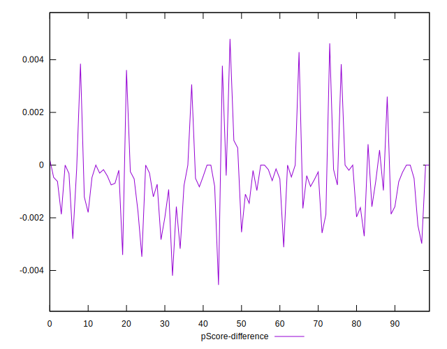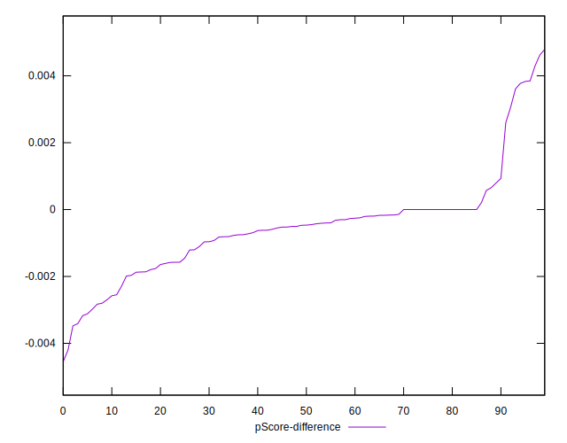