# //uses-rel-preconnect/samples/pages

[→ Parent](../..)


## Raw


```yaml
p90min: 74.54399999976158
p90max: 320.262
p90range: 245.71800000023842
p90mean: 288.38932967028217
p90median: 302.094
p90stdev: 47.44944196722865
p90skewness: -3.2395874373603237
p90eccentricity: 0.9999999999999999
p90discretization: 1.0224719101123596
outlandishness: 0.8316651403015125
confidence: 36.34271965971385
p90confidence: 19.49792968024667

```

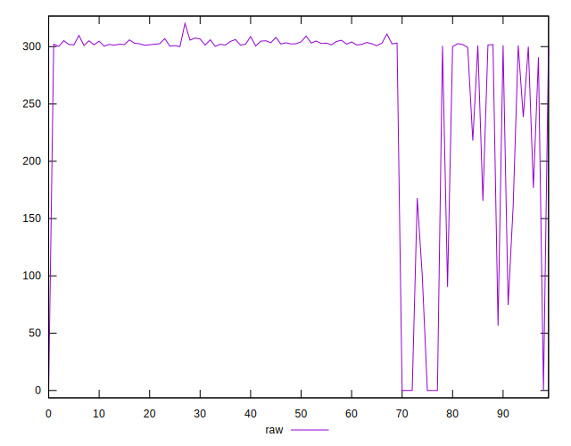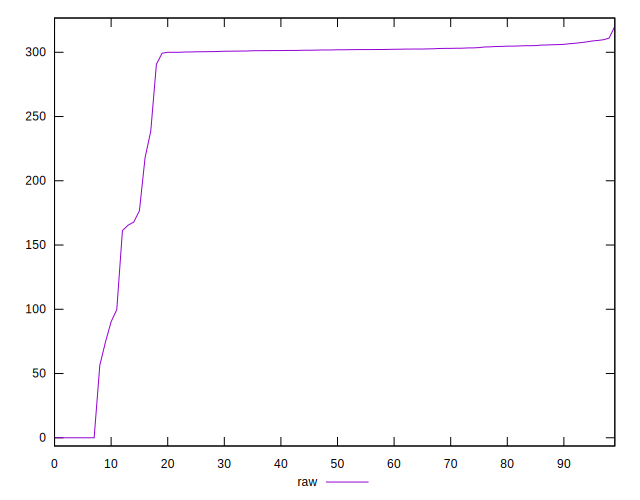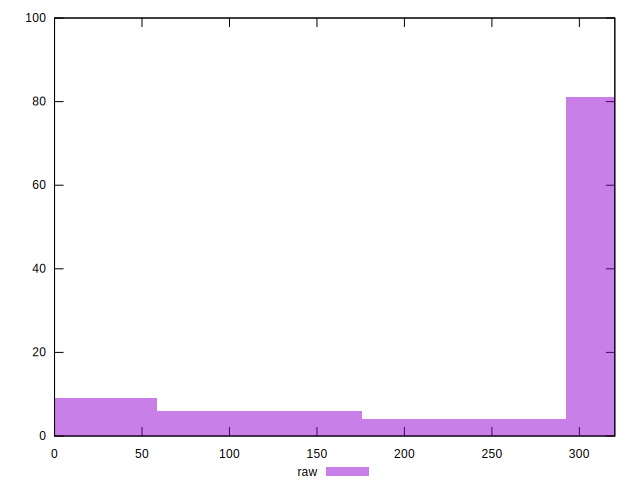
## Score


```yaml
p90min: 0.74
p90max: 0.94
p90range: 0.19999999999999996
p90mean: 0.7616483516483517
p90median: 0.75
p90stdev: 0.038949494946964355
p90skewness: 3.267925787665971
p90eccentricity: 0.9999999999999961
p90discretization: 9.1
outlandishness: 1.0557732984745383
confidence: 0.029959227574683167
p90confidence: 0.016005130557310787

```

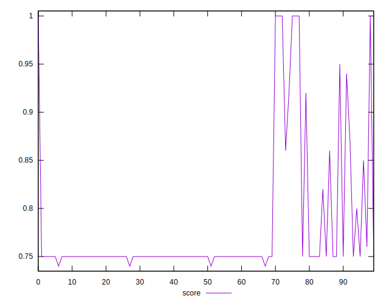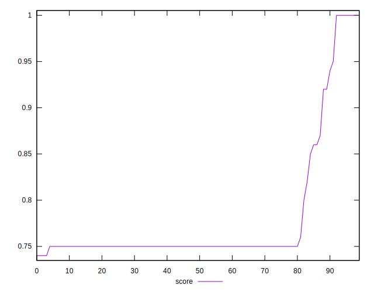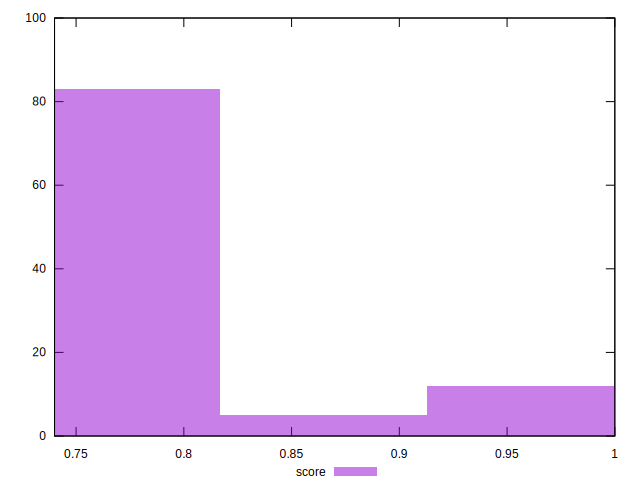
## Raw Estimate

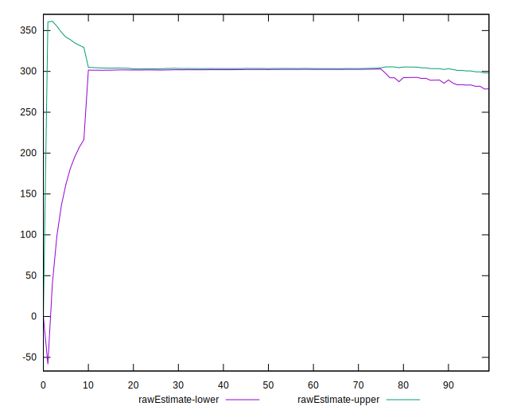
## Score Estimate

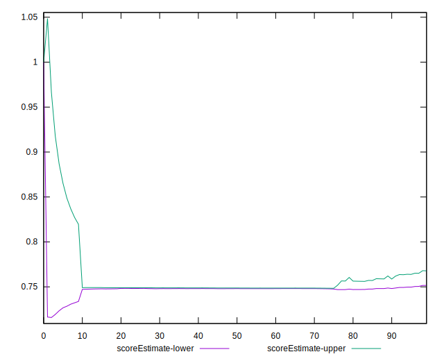
## P Score


```yaml
p90min: 0.7387433333333333
p90max: 0.9378800000001987
p90range: 0.19913666666686536
p90mean: 0.7604728540903934
p90median: 0.7488366666666667
p90stdev: 0.03925024918710075
p90skewness: 3.2594184663858723
p90eccentricity: 1
p90discretization: 1.0224719101123596
outlandishness: 1.0562269867099192
confidence: 0.030154638361297836
p90confidence: 0.016128716521277786

```

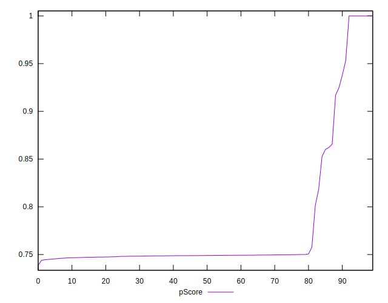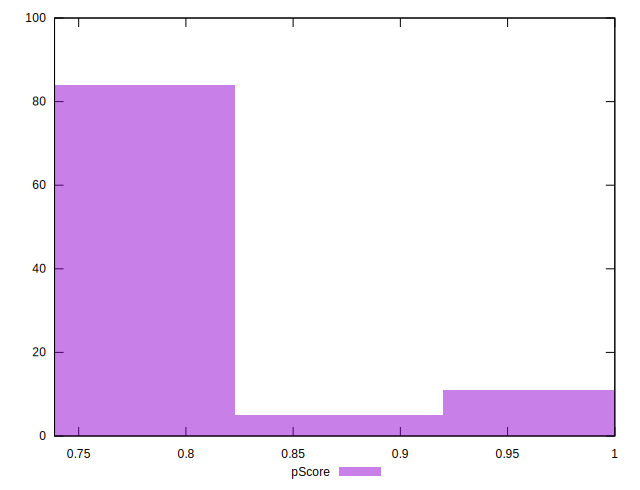
## Score Difference


```yaml
p90min: 0
p90max: 0
p90range: 0
p90mean: 0
p90median: 0
p90stdev: 0
p90skewness: .nan
p90eccentricity: .nan
p90discretization: 91
outlandishness: .inf
confidence: 7.423946114831082e-18
p90confidence: 0

```

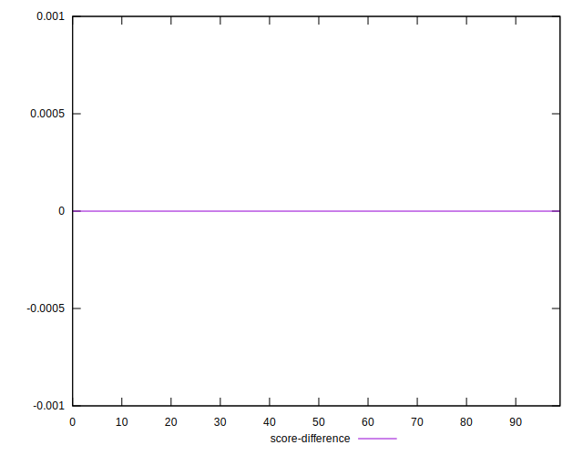
## P Score Difference


```yaml
p90min: -0.004176666666666606
p90max: 0.002116666665921585
p90range: 0.006293333332588191
p90mean: -0.0012539255189083192
p90median: -0.0011533333333333395
p90stdev: 0.0011611640535262378
p90skewness: -0.2746602534398794
p90eccentricity: 1
p90discretization: 1.123456790123457
outlandishness: 0.6878452093365666
confidence: 0.0007007154324833614
p90confidence: 0.00047714565491669076

```

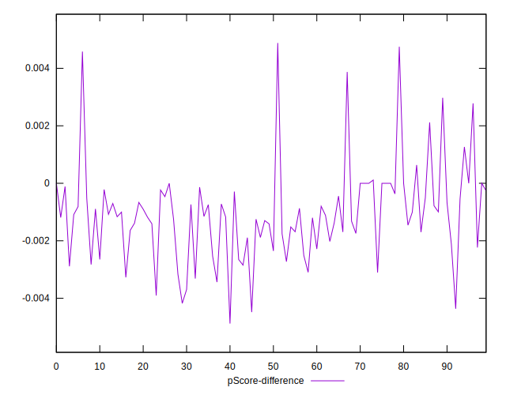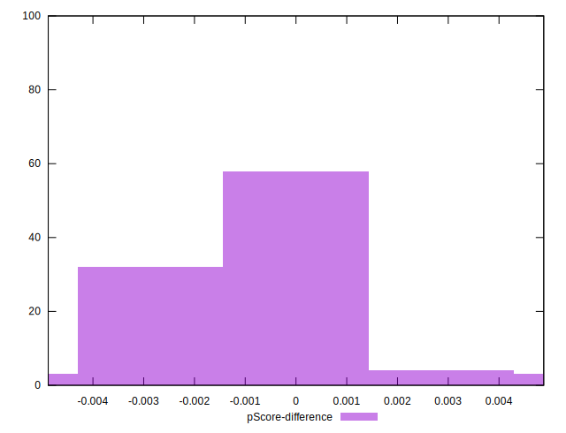