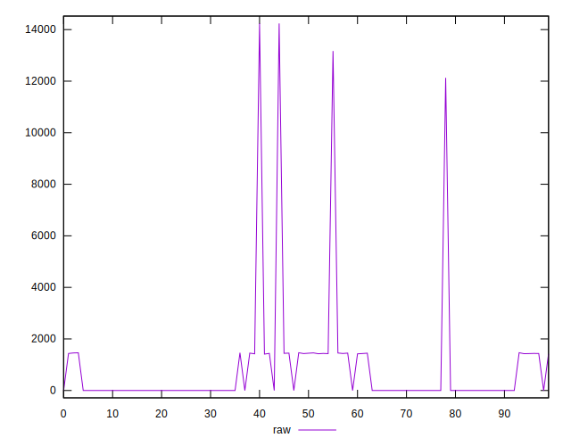
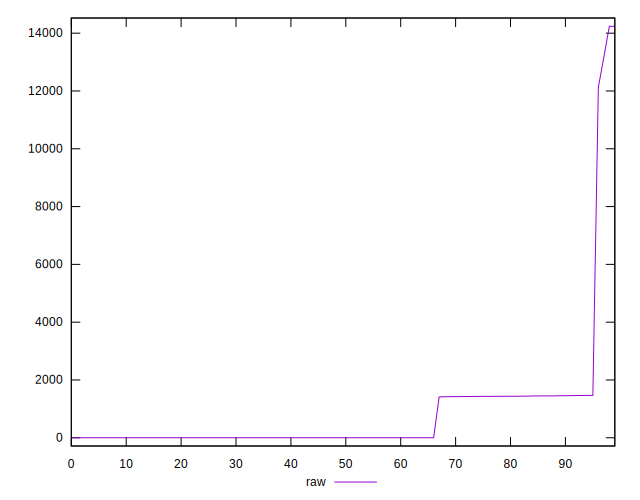
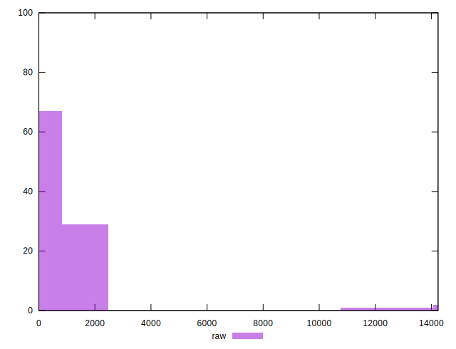
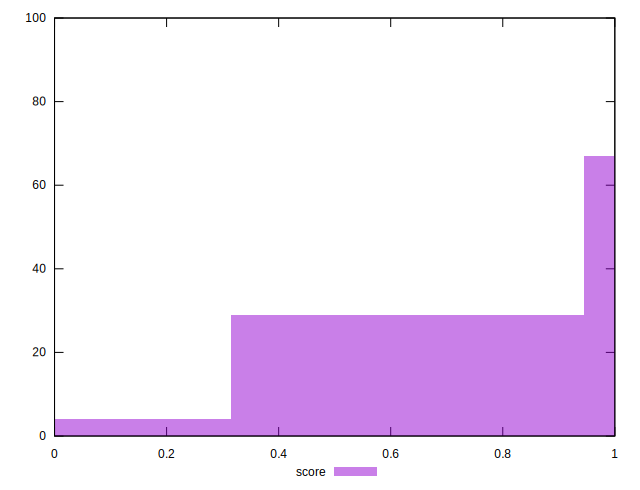
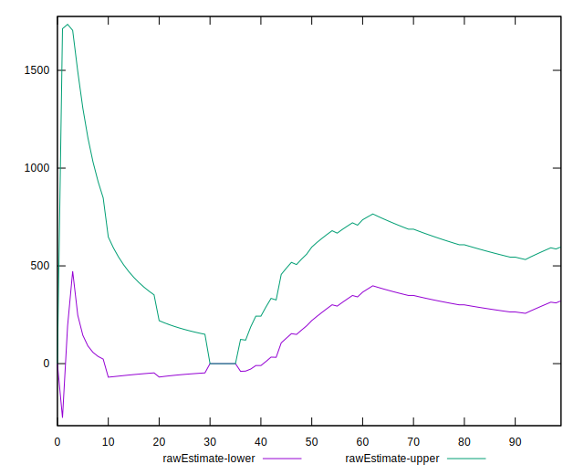
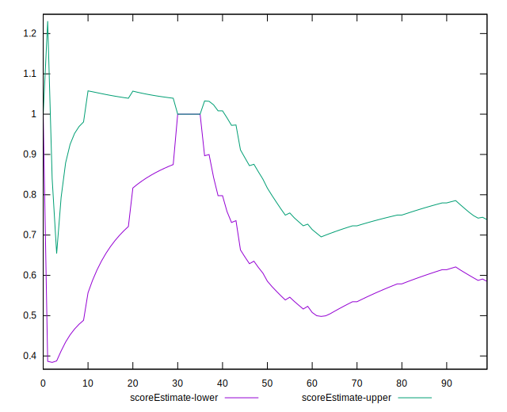
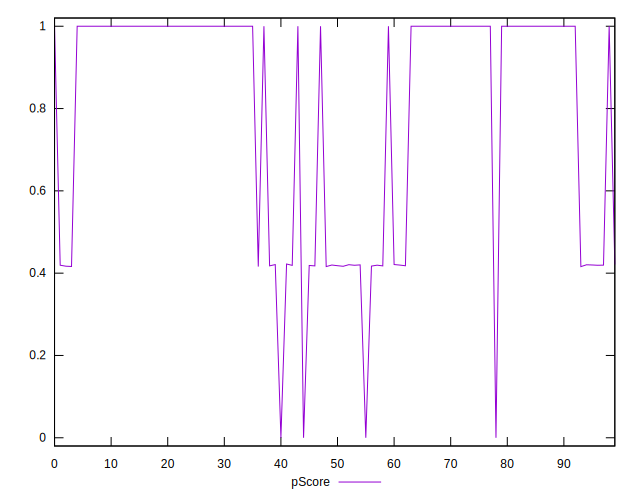
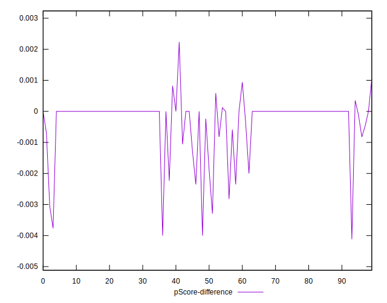
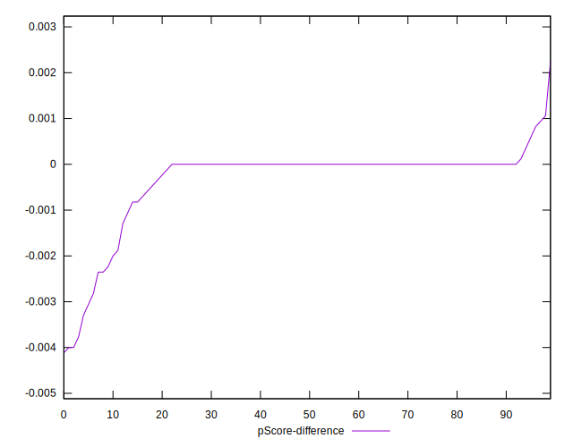
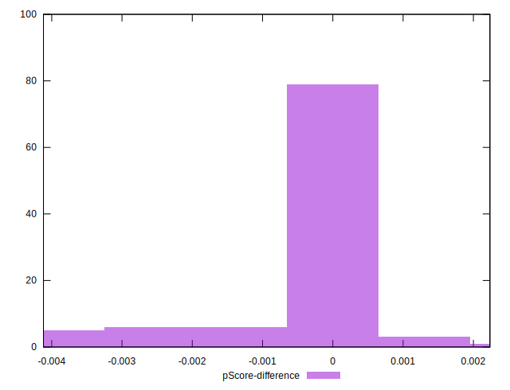

# //uses-rel-preload/samples/pages+cached+noexternal+nomedia+nocss+nojs

[→ Parent](../..)


## Raw


```yaml
p90min: 0
p90max: 1465
p90range: 1465
p90mean: 459.0989010989011
p90median: 0
p90stdev: 671.3282725755199
p90skewness: 0.7787221408625539
p90eccentricity: 1.0000000000000018
p90discretization: 3.3703703703703702
outlandishness: 4.331967973468959
confidence: 1033.34538670513
p90confidence: 275.8622843252691

```


## Score


```yaml
p90min: 0.42
p90max: 1
p90range: 0.5800000000000001
p90mean: 0.8470329670329675
p90median: 1
p90stdev: 0.2555816228646763
p90skewness: -1.0723225363157132
p90eccentricity: 1.0000000000000007
p90discretization: 45.5
outlandishness: 0.873836874951021
confidence: 0.12031609569607138
p90confidence: 0.1050236273299181

```


## Raw Estimate


## Score Estimate


## P Score


```yaml
p90min: 0.41694117647058826
p90max: 1
p90range: 0.5830588235294117
p90mean: 0.8468455074337424
p90median: 1
p90stdev: 0.2558957459063826
p90skewness: -1.0723467503380006
p90eccentricity: 1
p90discretization: 3.9565217391304346
outlandishness: 0.8734238244013461
confidence: 0.12048876599453706
p90confidence: 0.10515270680323119

```


## Score Difference


```yaml
p90min: 0
p90max: 0
p90range: 0
p90mean: 0
p90median: 0
p90stdev: 0
p90skewness: .nan
p90eccentricity: .nan
p90discretization: 91
outlandishness: .nan
confidence: 0
p90confidence: 0

```


## P Score Difference


```yaml
p90min: -0.0023529411764705577
p90max: 0.0010588235294117787
p90range: 0.0034117647058823364
p90mean: -0.00012152553329023577
p90median: 0
p90stdev: 0.0005274186570207222
p90skewness: -2.384430742803078
p90eccentricity: 0.9999999999999969
p90discretization: 4.55
outlandishness: 8.890547578089953
confidence: 0.0004210380462349708
p90confidence: 0.00021672692997617624

```

