# //uses-rel-preload/samples/pages+cached+noexternal+nomedia+nocss

[→ Parent](../..)


## Raw


```yaml
p90min: 0
p90max: 1458
p90range: 1458
p90mean: 662.945054945055
p90median: 0
p90stdev: 716.1169614494175
p90skewness: 0.1547596974912651
p90eccentricity: 0.9999999999999986
p90discretization: 3.1379310344827585
outlandishness: 3.840699456044503
confidence: 1169.3340661079244
p90confidence: 294.2668570647513

```

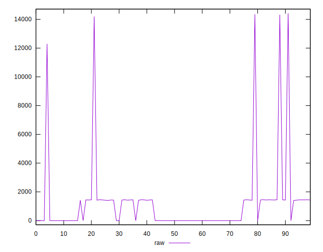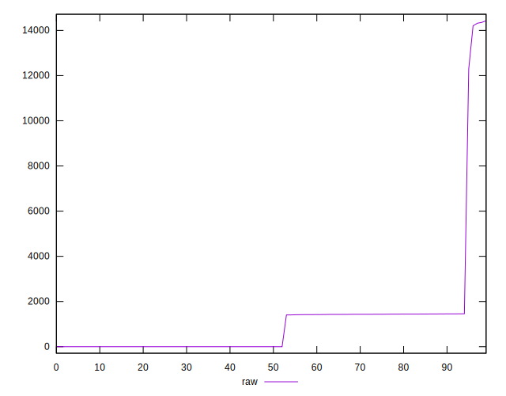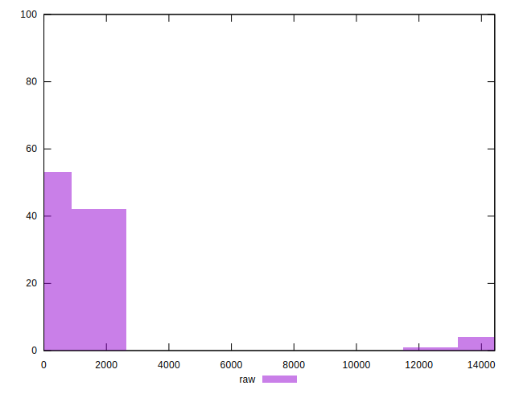
## Score


```yaml
p90min: 0.42
p90max: 1
p90range: 0.5800000000000001
p90mean: 0.732307692307693
p90median: 1
p90stdev: 0.28914073885204306
p90skewness: -0.15430334996209694
p90eccentricity: 1
p90discretization: 45.5
outlandishness: 0.9304953110656028
confidence: 0.1270728195561326
p90confidence: 0.11881374279860668

```

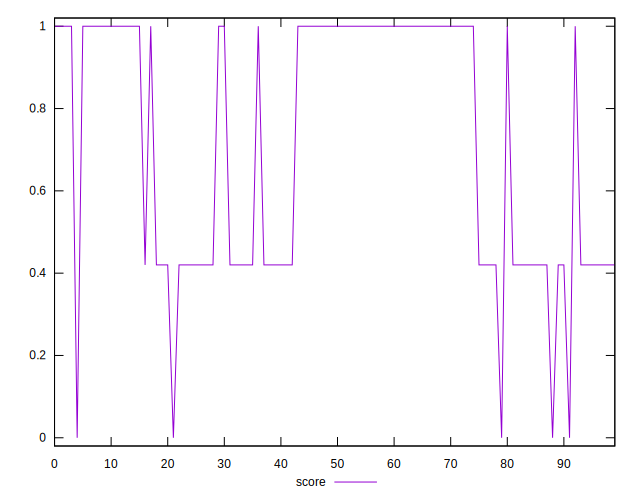
## Raw Estimate

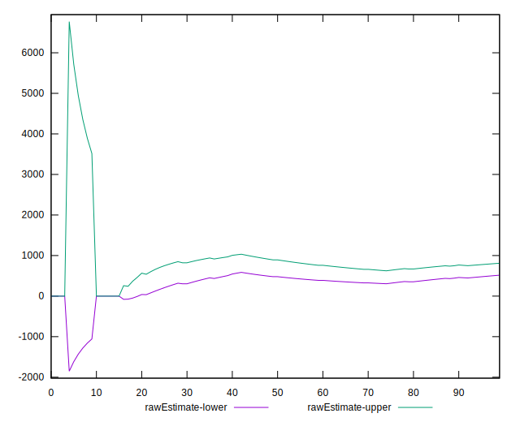
## Score Estimate

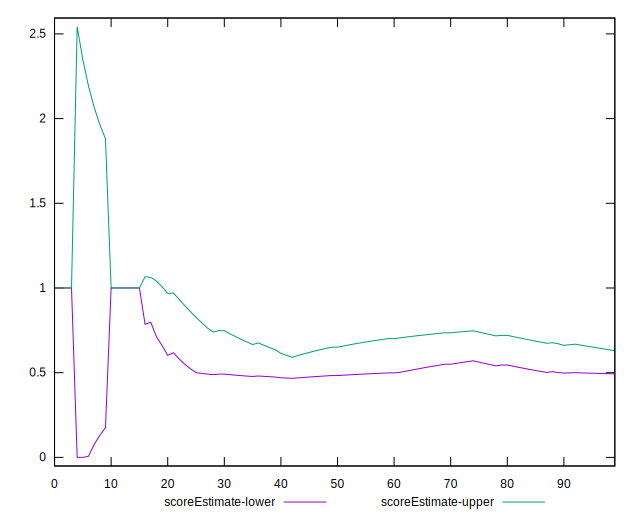
## P Score


```yaml
p90min: 0.41670588235294115
p90max: 1
p90range: 0.5832941176470589
p90mean: 0.7319612152553331
p90median: 1
p90stdev: 0.28951684128144817
p90skewness: -0.15434207227173033
p90eccentricity: 1.0000000000000004
p90discretization: 3.1379310344827585
outlandishness: 0.9305451932785688
confidence: 0.1271826414668753
p90confidence: 0.11896829084842708

```

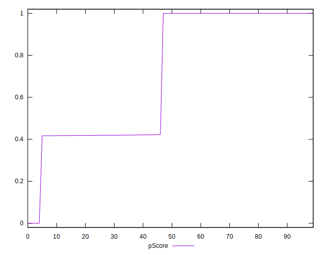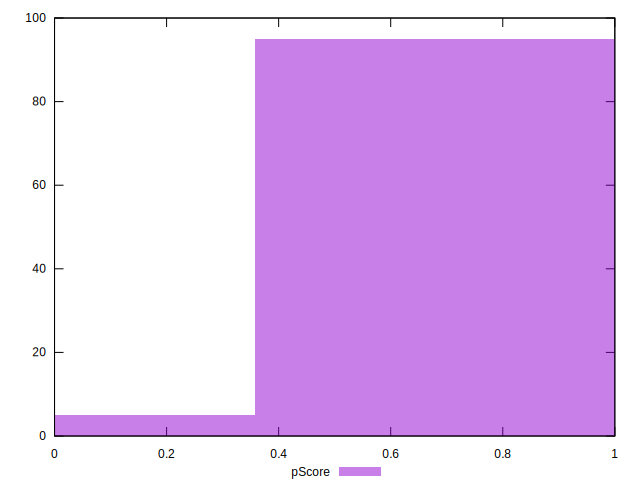
## Score Difference


```yaml
p90min: 0
p90max: 0
p90range: 0
p90mean: 0
p90median: 0
p90stdev: 0
p90skewness: .nan
p90eccentricity: .nan
p90discretization: 91
outlandishness: .nan
confidence: 0
p90confidence: 0

```


## P Score Difference


```yaml
p90min: -0.0023529411764705577
p90max: 0.0015294117647058902
p90range: 0.003882352941176448
p90mean: -0.00023787976729152768
p90median: 0
p90stdev: 0.0007239611226125398
p90skewness: -1.0719405151467614
p90eccentricity: 1.0000000000000007
p90discretization: 4.333333333333333
outlandishness: 1.7567773629489785
confidence: 0.0004147887604080197
p90confidence: 0.0002974901805943455

```

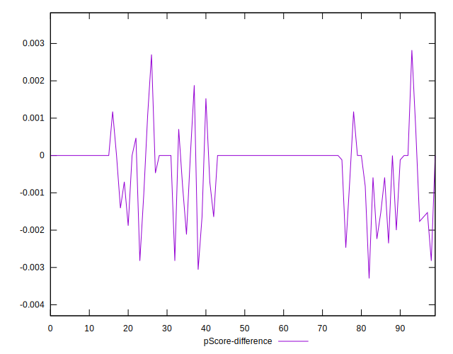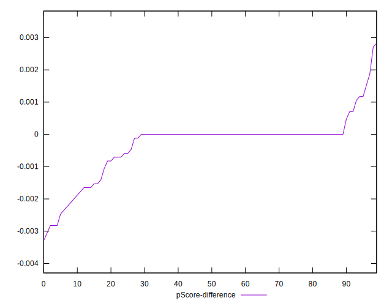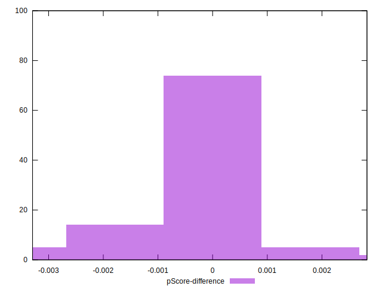