# //uses-rel-preload/samples/pages+cached+noexternal+nomedia

[→ Parent](../..)


## Raw


```yaml
p90min: 0
p90max: 1451
p90range: 1451
p90mean: 644.5824175824176
p90median: 0
p90stdev: 711.8767806998974
p90skewness: 0.19923777683493035
p90eccentricity: 0.9999999999999989
p90discretization: 2.935483870967742
outlandishness: 5.604623782039364
confidence: 1310.1394517650565
p90confidence: 292.52448154550336

```

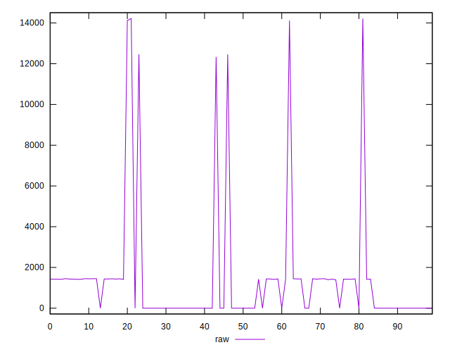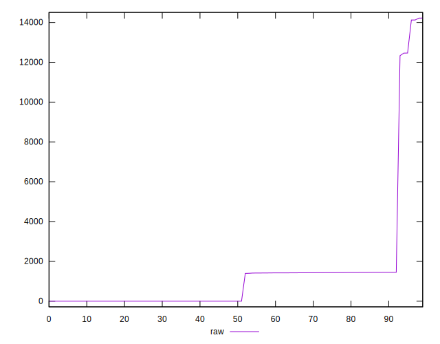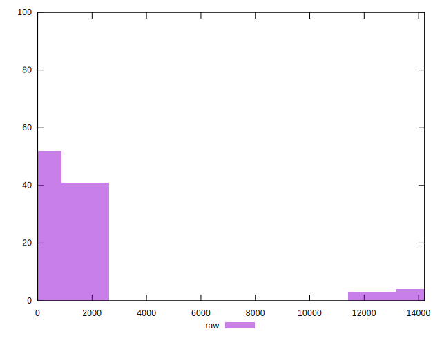
## Score


```yaml
p90min: 0.42
p90max: 1
p90range: 0.5800000000000001
p90mean: 0.7386813186813191
p90median: 1
p90stdev: 0.2885782076988845
p90skewness: -0.19877674693473305
p90eccentricity: 1.0000000000000002
p90discretization: 45.5
outlandishness: 0.8781100714205978
confidence: 0.13187698030149675
p90confidence: 0.11858258743802708

```

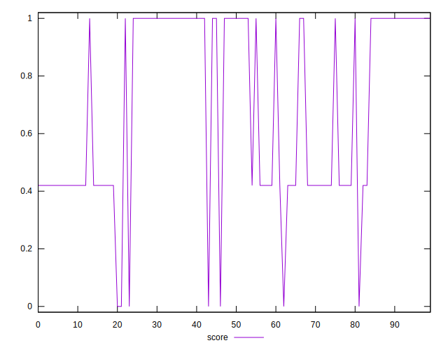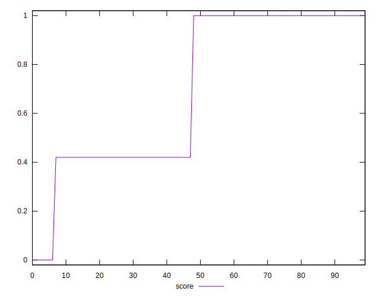
## Raw Estimate

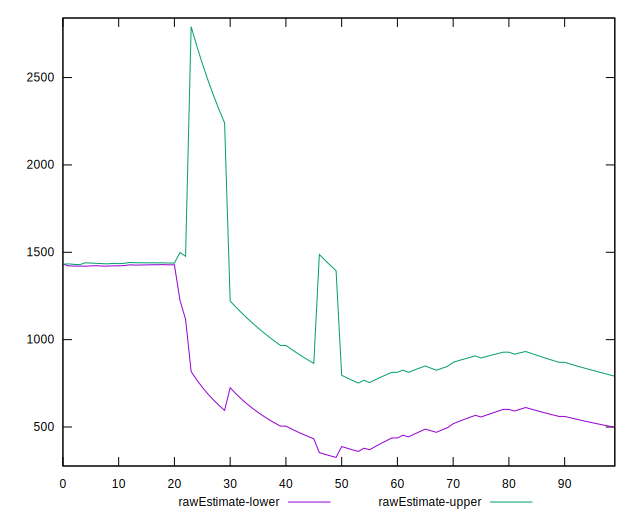
## Score Estimate

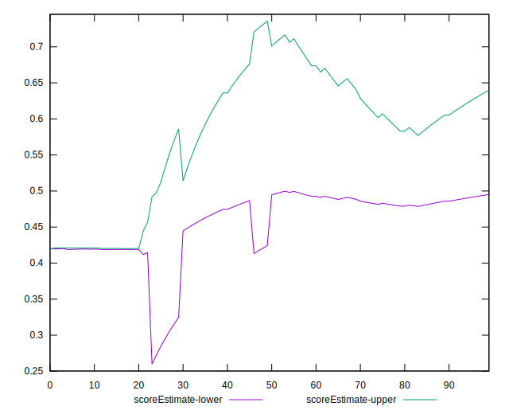
## P Score


```yaml
p90min: 0.41752941176470587
p90max: 1
p90range: 0.5824705882352941
p90mean: 0.7386464124111184
p90median: 1
p90stdev: 0.2886186184371862
p90skewness: -0.19881564161092238
p90eccentricity: 0.9999999999999996
p90discretization: 2.935483870967742
outlandishness: 0.8781124693947882
confidence: 0.13188762532194898
p90confidence: 0.11859919302285715

```

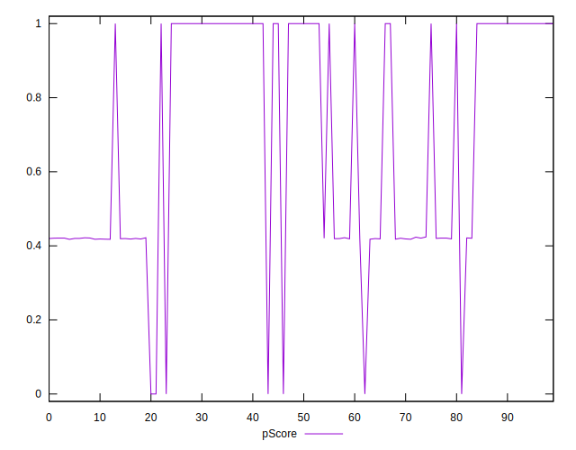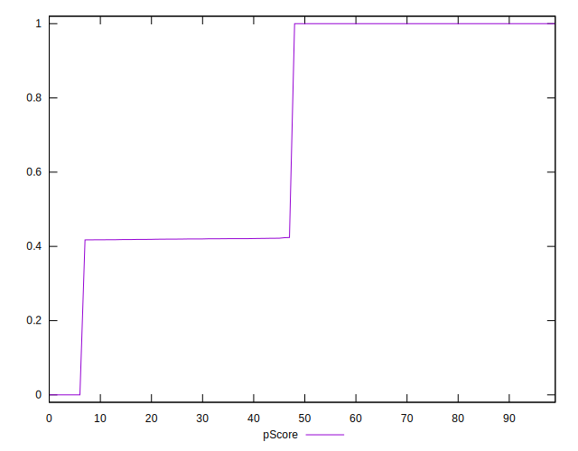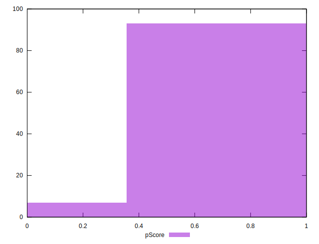
## Score Difference


```yaml
p90min: 0
p90max: 0
p90range: 0
p90mean: 0
p90median: 0
p90stdev: 0
p90skewness: .nan
p90eccentricity: .nan
p90discretization: 91
outlandishness: .nan
confidence: 0
p90confidence: 0

```


## P Score Difference


```yaml
p90min: -0.0020000000000000018
p90max: 0.0018823529411765016
p90range: 0.0038823529411765034
p90mean: 0.000009049773755663006
p90median: 0
p90stdev: 0.000632041944957004
p90skewness: -0.13218354969737664
p90eccentricity: 1.0000000000000009
p90discretization: 3.9565217391304346
outlandishness: 12.32009999997552
confidence: 0.00038808622696204367
p90confidence: 0.00025971874245116227

```

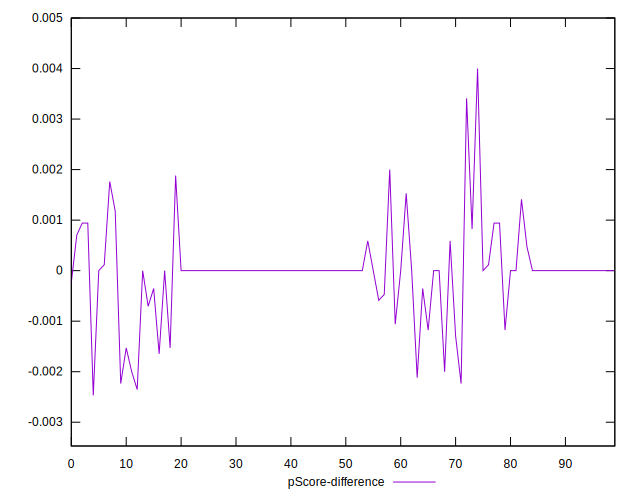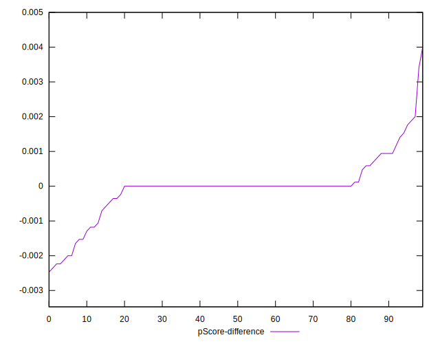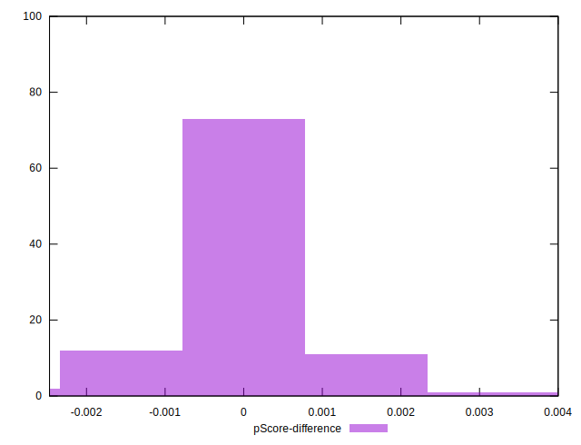