# //uses-rel-preload/samples/pages+cached+noexternal

[→ Parent](../..)


## Raw


```yaml
p90min: 0
p90max: 1453
p90range: 1453
p90mean: 457.42857142857144
p90median: 0
p90stdev: 668.8765740191419
p90skewness: 0.7786303882577105
p90eccentricity: 1.0000000000000033
p90discretization: 4.55
outlandishness: 3.2693315445121156
confidence: 924.0304582075153
p90confidence: 274.8548320968016

```

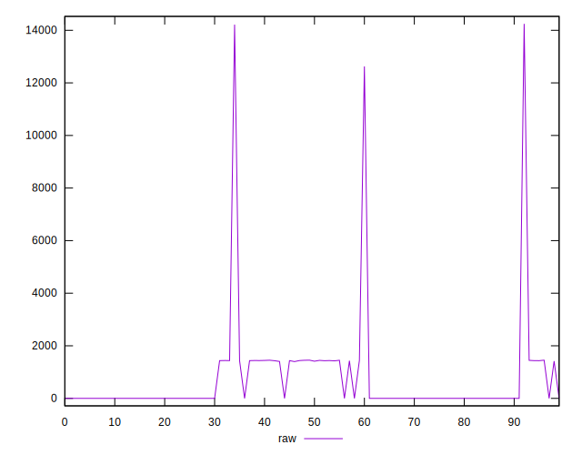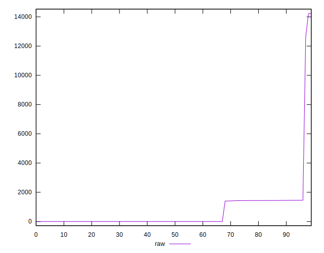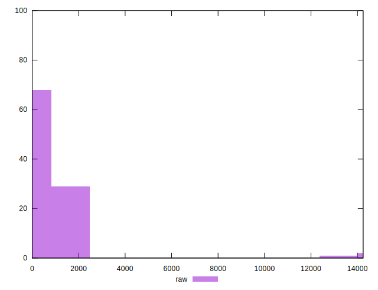
## Score


```yaml
p90min: 0.42
p90max: 1
p90range: 0.5800000000000001
p90mean: 0.8534065934065939
p90median: 1
p90stdev: 0.25206060574297606
p90skewness: -1.1378739092043921
p90eccentricity: 0.9999999999999967
p90discretization: 45.5
outlandishness: 0.8827142061425994
confidence: 0.116463929614111
p90confidence: 0.1035767706041999

```

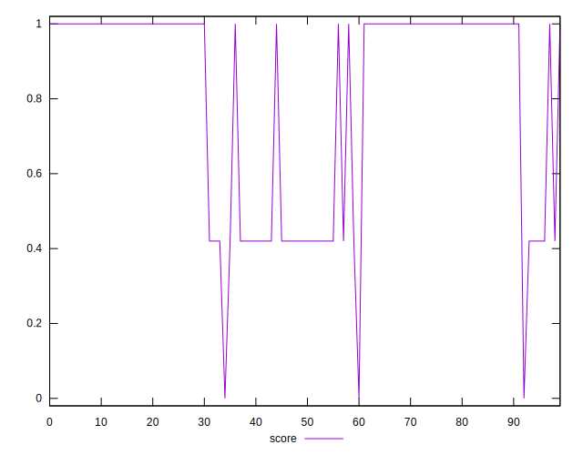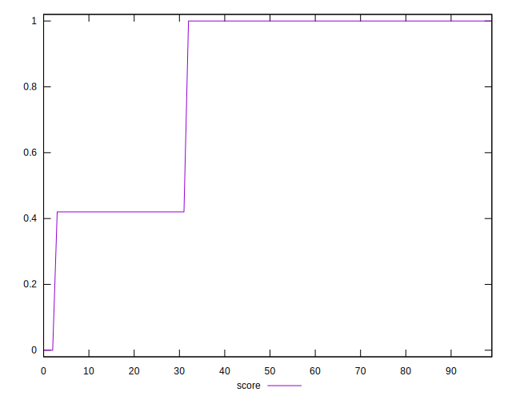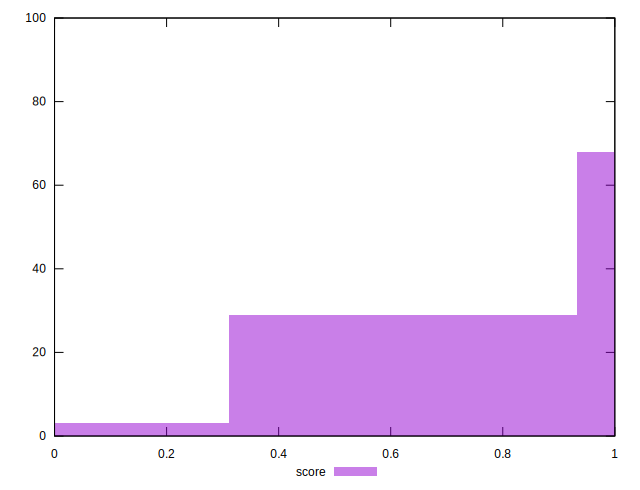
## Raw Estimate

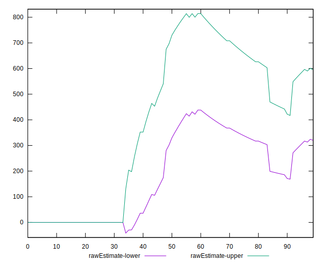
## Score Estimate


## P Score


```yaml
p90min: 0.41823529411764704
p90max: 1
p90range: 0.581764705882353
p90mean: 0.853360051712993
p90median: 1
p90stdev: 0.25214159648677115
p90skewness: -1.1379002495126467
p90eccentricity: 0.9999999999999992
p90discretization: 6.066666666666666
outlandishness: 0.8824063954209218
confidence: 0.11655683937284467
p90confidence: 0.10361005132915246

```

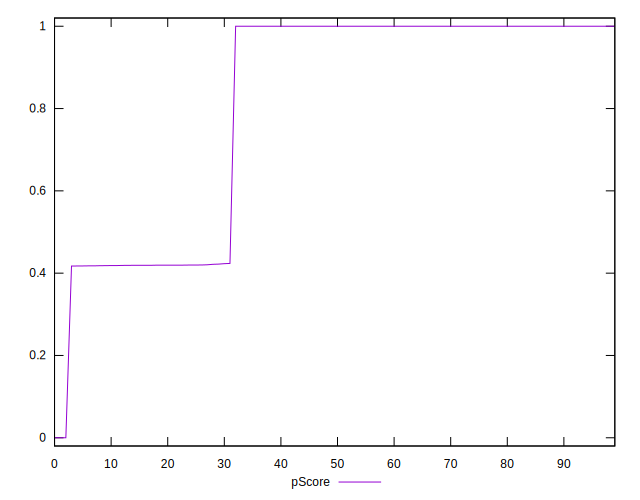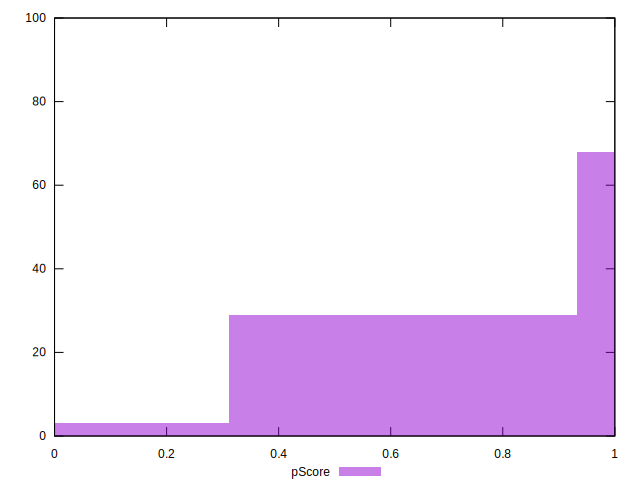
## Score Difference


```yaml
p90min: 0
p90max: 0
p90range: 0
p90mean: 0
p90median: 0
p90stdev: 0
p90skewness: .nan
p90eccentricity: .nan
p90discretization: 91
outlandishness: .nan
confidence: 0
p90confidence: 0

```


## P Score Difference


```yaml
p90min: -0.0018823529411764461
p90max: 0.0003529411764706114
p90range: 0.0022352941176470575
p90mean: -0.0001797026502908805
p90median: 0
p90stdev: 0.00042769646493902525
p90skewness: -2.398192473236068
p90eccentricity: 1.0000000000000013
p90discretization: 7.583333333333333
outlandishness: 1.0430434035505414
confidence: 0.000340223231710855
p90confidence: 0.00017574907632487546

```

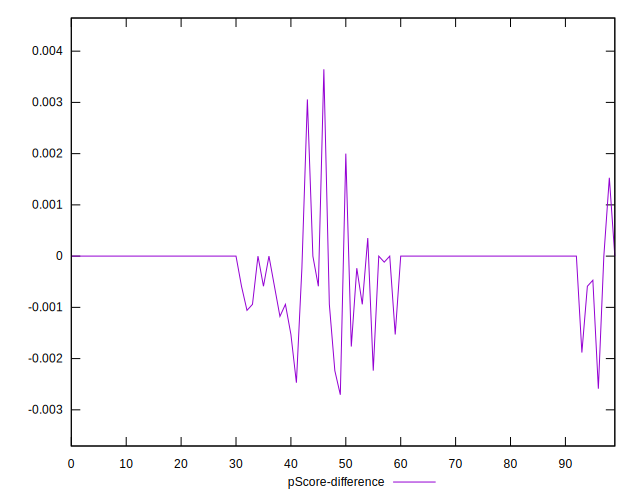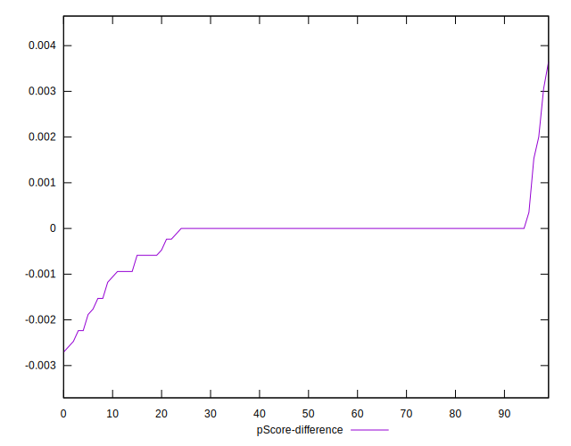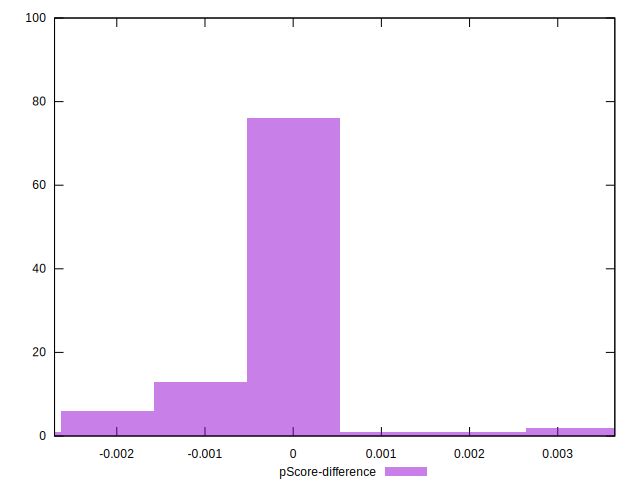